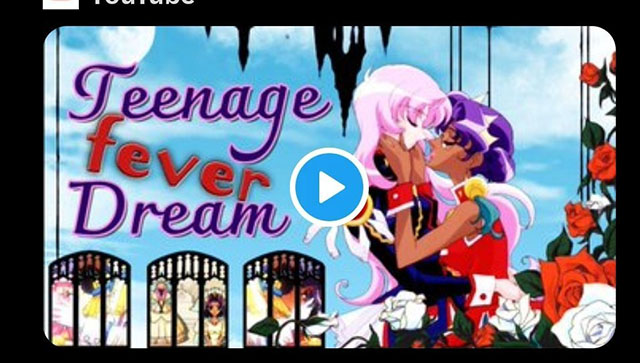
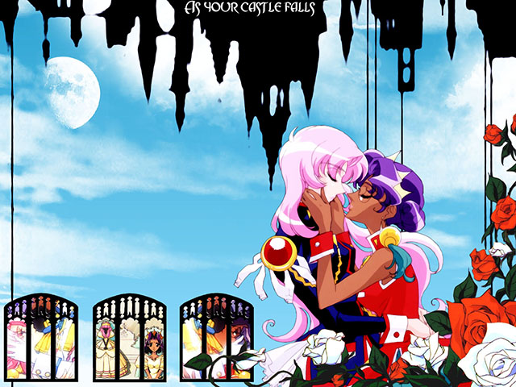

---
# cspell:words  Utena Tenjou  Anthy Himemiya  Akio Ohtori  Touga Kiryuu  Nanami  Wakaba Shinohara  Shiori Takatsuki  Juri Arisugawa  Souji
# cspell:words  Ikuhara Kunihiko  Saito Chiho  Hasegawa Shinya  Enokido Yōji  Oguro Yūichirō  Shōjo Kakumei  Sato Junichi  Toei Evangelion Takarazuka Jun'ichi Nakahara Shūji Terayama Seazer Toole
date: 2023-10-07
title: The Real Revolution of Utena
status: Finished
aka: !!seq
  - "The Sapphic Beauty of Warrior Women (Working Title)"
  - "The Magic Realism of Revolutionary Girl Utena (Short)"
  - "Religion and Anime! (Short)"
topics: !!seq
  - Revolutionary Girl Utena
  - Postmodernism
links: !!seq
  - "https://archive.org/details/james-somerton-youtube-2023-12-03/20231007+-Uoqmxlcusg+The+Magic+Realism+of+Revolutionary+Girl+Utena.webm"
  - "https://www.youtube.com/watch?v=7b-6jvAbLyM"
description: "a video essay on postmodernism, symbolism, and gender roles; where if James had plagiarized more, he'd probably have better takes."
notes: 
  - short-advert
  - unreleased
  - custom-start

contributors:
  downloaded: "Cap'n Lee, the maintainer of the [\"public records\" archive](https://archive.org/details/james-somerton-public-records)"
  formatting: Tustin2121
  factcheck: 
    - "[deus-and-the-machina.tumblr.com](https://www.tumblr.com/deus-and-the-machina/735920677682626560/i-watched-the-james-somerton-video-on-utena-so-you) (Direct [link to doc](https://docs.google.com/document/d/1I0zksTwwQJSg7vBvI63rmWg9t1Sckc-T9W03IFYFY_A/edit))"
  citation:
    # - "[/u/Nightfall1409](https://www.reddit.com/r/hbomberguy/comments/18a50c1/comment/kce4olm)"
    # - "[Vin](https://youtu.be/hY2tHl0M0DA?si=9zOkeLHxCI17rhVg) (via [Discord](https://discord.com/channels/224921177532006400/1181019607604133938/1181509885557493851))"

cite:
  clips: !!map
    utena: { short: "Revolutionary Girl Utena (Noriko, 1997)", full: "Noriko K., Shinichi I. (Producers). (1997). <em>Revolutionary Girl Utena</em> [Television broadcast]. J.C.Staff." }
    lotr: { short: "LotR (Jackson, 2002)", full: "Jackson, P. (Director). (2002). <em>Lord of the Rings</em> [Film]. New Line Cinema, WingNut Films." }
  yikes: !!map
  misinformation: !!map
    # deus_tumblr: "deus-and-the-machina. (Dec 5, 2023). <em>I Watched the James Somerton Video on Utena So You Don't Have Too</em> [Blog post]. https://www.tumblr.com/deus-and-the-machina/735920677682626560/i-watched-the-james-somerton-video-on-utena-so-you"
  plagiarized: !!map
    thumbnail: { color: 2, short: "Wallpaper (eeee, 2005)", full: "eeee (Artist). (Mar 5, 2005). <em>Shoujo Kakumei Utena Wallpaper: falling castles</em> Retrieved December 13th, 2023, from", url: "http://gallery.minitokyo.net/view/93510" }
    wiki_utena_article: { color: 1, short: "Revolutionary Girl Utena (Wikipedia, n.d.)", full: "Wikipedia. (n.d.). <em>Revolutionary Girl Utena.</em> Retrieved December 12th, 2023, from", url: "https://en.wikipedia.org/w/index.php?title=Revolutionary_Girl_Utena&oldid=1177893479" }
---

<compare>
<credits header="Video Thumbnail:">

<!--  -->

</credits>
<from >

<!--  -->

[@re-mortal on tumblr](https://www.tumblr.com/re-mortal/735857211803303936/i-thought-the-thumbnail-of-the-utena-video) points out that the video's thumbnail was [uncredited, stolen fan artwork](http://gallery.minitokyo.net/view/93510).

</from>
</compare>



<compare>
<james >

\[On Screen]: "Health Warning: Flashing lights in some scenes. Because anime."

This is what happened, more or less. The magical girl trope of anime hit a fever pitch in the 1990s with the international phenomenon of Sailor Moon, which typified the style. Both in homage and parody, these tropes have been recreated by artists ever since and have also become an entire genre in their own right.

Whether it's newer magical girls like *Puella Magi Madoka Magica*, the westernized magical girls like the cast of *Shira and the Princesses of Power*, or the genderbent magical boys of *Cute High Earth Defense Club*, the trope has been a staple of animation for decades. 

</james>
<from></from>
</compare>

<compare>
<james >

But none, to my knowledge, have been more discussed and dissected than the 1997 series *Revolutionary Girl Utena*, <mark>created by Be-Papas, a production group formed by director Ikuhara Kunihiko, Saito Chiho, Hasegawa Shinya, Enokido Yōji and Oguro Yūichirō.</mark>

</james>
<from >

***Revolutionary Girl Utena*** (Japanese: 少女革命ウテナ, Hepburn: Shōjo Kakumei Utena) is a Japanese anime television series <mark>created by Be-Papas, a production group formed by director Kunihiko Ikuhara and composed of himself, Chiho Saito, Shinya Hasegawa, Yōji Enokido and Yūichirō Oguro.</mark>

</from>
</compare>

<compare>
<james >

So let's dive into into the mesmerizing world of Ikuhara's creative journey.

You see, back in the 90's Ikuhara graced Toei Animation with his presence during the production of the beloved <mark>*Sailor Moon* series. He co-directed the second season, *Sailor Moon R* alongside Sato Junichi and took the helm as the *sole* director for both the animated film *Sailor Moon R: The Movie* and the third season *Sailor Moon S*.</mark>

But Ikuhara grew restless in the confines of adapting existing works, longing for some creative control. Thus after <mark>the conclusion of *Sailor Moon S* in 1995</mark>, he set forth on a quest to birth an original series. <mark>In this endeavor he assembled the illustrious Be-Papas, a consortium of creative talents from anime and manga.</mark>

You see Be-Papas had quite the history together. <mark>Hasegawa and Enokido had previously joined forces with Ikuhara on Sailor Moon where Enokido penned many episodes featuring the iconic Sailor Uranus and Sailor Neptune.</mark> Be-Papas had also lent their talents to the esoteric *Neon Genesis Evangelion*. As for Saito, <mark>she was a seasoned manga artist who had not yet ventured into the realm of anime.</mark>

</james>
<from >
<h2 style="margin:0;"> Development</h2>
<h3 style="margin:0;">Context</h3>

Kunihiko Ikuhara was a director at Toei Animation on the television anime series Sailor Moon in the 1990s, co-directing its second season <mark>*Sailor Moon R* with Junichi Sato and serving as sole director of both the animated film *Sailor Moon R: The Movie* and the series' third season *Sailor Moon S*.</mark>[19] Frustrated by the lack of creative control in producing a series adapted from an existing work, Ikuhara departed Toei following <mark>the conclusion of *Sailor Moon S* in 1995</mark> to create an original series.[20] <mark>To this end, Ikuhara assembled Be-Papas, a group of creative professionals from the anime and manga industry.</mark> Its membership consisted of Ikuhara, manga artist Chiho Saito, animator and character designer Shinya Hasegawa, scriptwriter Yōji Enokido, and planner Yūichirō Oguro.[21]

Several of the members of Be-Papas had previously worked together: <mark>Hasegawa and Enokido had previously worked with Ikuhara on Sailor Moon, where Enokido wrote many of the episodes featuring Sailor Uranus and Sailor Neptune;</mark>[7] Hasegawa and Enokido had also both worked on the anime series Neon Genesis Evangelion.[10] <mark>Saito was an established manga artist who had not previously worked with the members of Be-Papas, or in anime;</mark> Ikuhara decided to base the visuals of the series on her artwork and recruited her to Be-Papas after seeing an illustration from her manga series Magnolia Waltz on the cover of a magazine.[10][22]

</from>
</compare>

<compare>
<james >

Now initially <mark>Ikuhara envisioned Utena as a mainstream shōjo</mark> <mark>series, hoping to ride the coattails of Sailor Moon's commercial success</mark>. In fact, <mark>they began with a concept titled "Revolutionary Girl Utena Kiss", featuring a group of valiant female warriors known as the Neo Elegansar!</mark>

\[meme cutaway]: "Eleganza Extravaganza!"

<mark>Battling the enigmatic "end of the world"</mark>. But as the creativity flowed, they settled on a different path: <mark>a romantic action show starring a pretty girl who wears boys clothes</mark>. The school setting was a cornerstone of anime. But <mark>other elements like the duels and the mysterious Rose Bride were yet to enter the plot</mark>.

</james>
<from >
<h3 style="margin:0;">Planning</h3>

Initially, <mark>Ikuhara envisioned Utena as a mainstream shōjo</mark> (girls' anime and manga) <mark>series aimed at capitalizing on the commercial success of Sailor Moon</mark>; Saito characterized the earliest discussions on Utena as focused on creating a series "that people will like and [will] be profitable".[22] The earliest concepts for Utena deviated significantly from what became the final series: <mark>an initial pitch to project financers was titled Revolutionary Girl Utena Kiss, and focused on a group of female warriors called the "Neo Elegansar"</mark> <mark>who battled "the end of the world"</mark>.[23][d] Per Oguro, a basic series concept of "<mark>a romantic action show starring a pretty girl who wears boys' clothes</mark>" that had a "Takarazuka style" was eventually settled on.[3] A school setting was also determined in this early concept phase, though <mark>other concepts such as the duels and the "Rose Bride" would not be formulated until later in development</mark>.[3]

</from>
</compare>

<compare>
<james >

As Be-Papas commenced their <mark>six-month planning phase after Saito's arrival</mark>, they delved into the nitty-gritty of the story, world building, and the intricate process of <mark>translating Saito's visual style into anime</mark>. In parallel Saito embarked on creating a manga adaptation of Utena while still contributing her expertise to the anime's development. 

Now a fascinating tidbit here is that while <mark>Utena inevitably carries echoes of *Princess Knight* and *The Rose of Versailles* -- two Shōjo manga series known for their crossdressing, sword-fighting heroines --</mark> Ikuhara was persistently apprehensive about <mark>being seen merely as a parody of these iconic works.</mark> Saito on the other hand was brought in to be <mark>Be-Papas primarily because the team wanted a female perspective to avoid unintentionally parodying Shōjo manga</mark>.

(Shōjo manga is manga that's aimed at young girls, by the way.) 

</james>
<from >

Although the concept for Utena originated from Ikuhara, the series as a whole was developed collectively by Be-Papas.[21] The group entered a <mark>six-month planning period after Saito joined Be-Papas</mark>,[22] which focused on fleshing out the story and setting, as well as <mark>determining how Saito's visual style could best be imported into anime</mark>.[3] Saito also began to contemporaneously write and illustrate a manga adaptation of Utena while contributing to the development of the anime series.[21]

Utena draws inspiration from several sources – *Animage* described the series as "influenced by [Ikuhara's] idiosyncrasies"[21] – including the Takarazuka Revue,[9] the artwork of Jun'ichi Nakahara,[25] Hermann Hesse's novel Demian,[8] and the experimental theater of Shūji Terayama.[25] Saito cited the manga series *Kaze to Ki no Uta*[26] and the 1973 film adaptation of *The Three Musketeers*[7] as among the influences that informed her contributions to Utena. Ikuhara has stated that although he "wouldn't be able to avoid it being said" that <mark>Utena was influenced by *Princess Knight* and *The Rose of Versailles* – two shōjo manga series famous for their cross-dressing, sword-fighting heroines –</mark> throughout the development of Utena, he was possessed of an "immense fear" that the series would <mark>be seen merely as a parody of those works.</mark>[9] Saito stated that she was hired to join the otherwise all-male <mark>Be-Papas in part because they were concerned that without a female perspective they would create a parody of shōjo manga</mark>, which was not their intention.[26]

</from>
</compare>

<compare>
<james >

Fast forward to 1996m with Saito's manga adaptation of Utena, underway negotiations for the broadcast of the Utena anime were finally sealed, and production began in earnest. Be-Papas took the reigns of production, with the esteemed JC Staff handling animation duties.

But here's where the story takes a twist: <mark>Ikuhara's vision for Utena underwent a profound transformation once the series commenced production</mark>. No longer content with aiming for mass market success, he decided to infuse the series with a unique *non-commercial* identity.

This shift saw the <mark>incorporation of avantgarde elements such as theatrical inspired layouts, shadow plays that offer commentary on each episode's events, and the experimental choral compositions of J. A. Seazer</mark>.

</james>
<from >
<h3 style="margin:0;">Production</h3>

Shortly after Saito's manga adaptation of Utena began serialization in 1996, negotiations for the broadcast of the Utena television anime were settled, and production began.[3] Be-Papas served as the primary production staff for Utena, with animation production completed by the animation studio J.C.Staff.[21]

<mark>Ikuhara's ambitions for Utena shifted dramatically after the series commenced production</mark>. Believing that the series required "a unique individuality"[3] if it was to find an audience, he abandoned his previous goal of a mass-market hit in favor of more non-commercial aspirations.[8][27] To this end, he began to <mark>incorporate a variety of avant-garde elements into the series, such as theatrical-inspired layouts, a recurring shadow play segment that allegorically comments on the events of each episode, and the experimental choral music of composer J. A. Seazer</mark>.[3]

</from>
</compare>

<compare>
<james >

As production advanced, tensions simmered within Be-Papas. <mark>The series veered away from its original commercial trajectory</mark> creating what <mark>Oguro described as a "tug-of-war" between Saito and Ikuhara</mark>. <mark>Saito ardently championed the initial romantic concept</mark> for Utena, over <mark>Ikuhara's increasingly esoteric vision</mark>.

They even reached <mark>a point where they didn't speak to each other for 3 months straight</mark>. Saito's concern, you see, was not ideological but pragmatic: she believed the <mark>mainstream shōjo audience</mark> might not embrace <mark>anything other than a traditional male-female romance</mark>. 

Ikuhara, however, kept the full extent of his intended same-sex romance between Utena and Anthy under wraps throughout most of the production. <mark>Ultimately Saito supported</mark> the way the series handled the <mark>relationship between the characters</mark>. Nothing succeeds like success.

</james>
<from >

Enokido characterized the production of Utena as marked by "an agreeable sense of tension" between the members of Be-Papas.[7] <mark>As the direction of the series shifted away from its original commercial focus</mark>, production became what <mark>Oguro described as a "tug-of-war" between Saito and Ikuhara</mark>, as <mark>Saito advocated for the original romantic concept</mark> for the series over <mark>Ikuhara's new, more esoteric vision</mark>.[3] Ikuhara and Saito particularly quarreled over whether the series should depict the relationship between Utena and Anthy as a romance, and at <mark>one point during production did not speak to each other for a period of three months</mark>.[28] Saito was initially opposed, not out of an ideological opposition to depicting a same-sex romance, but because she believed the <mark>mainstream shōjo audience</mark> the series was ostensibly attempting to court would respond poorly to <mark>anything other than a male-female romance</mark>.[29] Ikuhara would conceal the extent to which he intended to present Utena and Anthy's relationship as a romance from Saito throughout production;[22] <mark>Saito ultimately expressed support</mark> for how the series presented the <mark>relationship between the characters</mark>.[28]

</from>
</compare>

<compare>
<james >

Since then, *Revolutionary Girl Utena* has garnered a chorus of <mark>praise, both at home in Japan and across the international stage.</mark> For all that *Sailor Moon* takes the lion's share of public discussion, Utena's influence can be felt in the development of anime to this very day.

In 1997, the series won the coveted <mark>Animation Kobe award for the "Best Television" category</mark>. And as the years rolled on, <mark>in 2017, NHK</mark> (the network behind Utena) <mark>conducted a national poll to determine the one hundred greatest anime in commemoration of the 100th anniversary of the medium, in which Utena placed 19th.</mark>

Utena has graced multiple "best of" lists with his presence, <mark>*Anime Insider* hailed it as one of the top 10 best anime ever</mark>. <mark>Writer Mike Toole, in his review, declared the series to be "the most important anime of the 90s".</mark>

</james>
<from >
<h2 style="margin:0;">Reception and influence</h2>

*Revolutionary Girl Utena* has been the subject of <mark>both domestic and international praise</mark>, and has received many accolades. In 1997, the series won the <mark>Animation Kobe award in the "Best Television" category</mark>.[110] <mark>In 2017</mark>, Japanese broadcaster <mark>NHK</mark> <mark>conducted a national poll to determine the one hundred greatest anime in commemoration of the hundredth anniversary of the medium, in which Utena placed 30th.</mark>[111] Utena was listed as <mark>one of the ten "best anime ever" by *Anime Insider*</mark>[56] and ranked fourth on Paste's list of the best anime of all time.[112] *Anime News Network*'s ranking of the 100 greatest anime films of all time placed *Adolescence of Utena* in eighth; <mark>in his review, writer Mike Toole called the television series "the most important anime of the 1990s"</mark>.[113]

</from>
</compare>

<compare>
<james >

However, with all this hype about it, what is *Revolutionary Girl Utena* actually about? Get comfortable, because that's not an easy question to answer... And things get weird.

</james>
<from></from>
</compare>

## 1. Anime, the Anime

<compare>
<james >

<mark>*Revolutionary Girl Utena* is divided into three sagas: the "Student Council Saga", the "Black Rose Saga",</mark> and the climactic "Akio Ohtori Saga" (or the <mark>"Apocalypse Arc"</mark>, depending upon the release).

</james>
<from >

<mark>*Revolutionary Girl Utena* is divided into three story arcs: the "Student Council Saga"</mark> (episodes 1–12), <mark>the "Black Rose Saga"</mark> (episodes 13–24), and <mark>the "Apocalypse Saga"</mark> (episodes 25–39).[4][5]

</from>
</compare>

<compare>
<james >

Utena Tenjou is a middle school student (and it's very *very* important to remember that she's a middle school student throughout the series and the movie). To say that she struggles to keep up good grades is unfair to her, because she doesn't really seem to care about that stuff... or anything that is in sports or her friends. She is, as we would describe, a tomboy and a subject of simultaneous jealousy, fascination, and desire from almost everyone in the school.

</james>
<from></from>
</compare>

<compare>
<james >

As a child, utena lost both of her parents in an undescribed accident. She managed to pull herself together due to a (quote-unquote) *"chance"* encounter with an individual she described as a prince. He gave her a rose-engraved signet ring, with the promise that it would help them meet again in the future. 

Though she admits her memory on this is a bit foggy. She doesn't even quite remember what her prince looked like. Probably not what this *Prince* was intending. Utena didn't fall madly in love with him, per se, though she has lived out her youth in anticipation of one day meeting him. Instead, she decides that she will one day also become a prince like him, to save the imperiled princesses of the world, just as the Rose Prince had once saved her.

</james>
<from></from>
</compare>

<compare>
<james >

As an audience, you really don't have any idea how important this is until like the last *five* episodes, maybe even the last *two?* Until then, it simply seems to be a backstory that drives Utena to enroll in the prestigious and exclusive Ohtori Academy. There she is the source of wonder for the girls, a source of envy for all the boys, and a source of confusion for all the teachers. She acts and dresses like a boy and is noted for her fierce sense of justice and dignified nobility.

Spying a shy and reclusive Anthy Himemiya being slapped by her boyfriend, she intervenes on what she believes is Anthy's behalf.

\[meme cutaway]: Homer (slaps Moe with glove): "I challenge you to a duel!"

</james>
<from></from>
</compare>

<compare>
<james >

Anthy is a piece in a very complicated game of chess that focuses around this school's enigmatic student council. This befits a beloved anime trope of the high school student council holding a position of political power that can rival a small government. Anthy has a secret double life as the "Rose Bride", and the student council is so interested in her because the Rose Bride is the key to unlocking a power that can revolutionize the world. The one who is engaged to the Rose Bride can access this power and bring about revolution,presumably to suit their own whims.

The Rose Bride becomes engaged to whomever can best her current betrothed in a duel. Utena wins a duel with the student council vice president to stop him from hitting Anthy, so Utena becomes Anthy's new groom-to-be. (Just works like that!)

And this makes sense compared to everything that follows it. (Don't worry it gets weirder.) 

</james>
<from></from>
</compare>

<compare>
<james >

The key to these duels are the signet rings, which at present only members of the student council wear. The student council is... *not pleased* that they've lost their ability to shape the world of the future, and seek to get Anthy back from Utena. With the help, or perhaps at the whim, of a mysterious benefactor codenamed "end of the world". 

(The Japanese version is more clearly translated to "apocalypse", I'm told, but was not used in English because of the apparent close ties to religious overtones.)

</james>
<from></from>
</compare>

<compare>
<clip >

\[Added by James on screen]: "Meanwhile, this was fine."

Student council president Touga Kiryuu: "Nanami, you like girls more than boys?"

His sister Nanami: "Yes!"

Touga: "Listen, Nanami, God created men and women for a reason. That reason being that they join in the best sort of way. No matter how good something may
feel, going against God's plan is--"

Nanami: "What are you implying, Big Brother?! You *know* you're the only one that I love!"

[Yellow balloon floats by with a sound effect]

</clip>
</compare>

<compare>
<james >

Utena, through her close connection and apparent engagement to Anthy, works at coaching Anthy to think for herself. An unfortunate drawback of the Rose Bride is that the Rose Bride can only ever *do or feel* the way that she is instructed to *by* her betrothed. Even as her bridegroom, Utena tirelessly coaches Anthy to advocate for her own needs and her own feelings, and to do what she wants rather than what her magical-husband-person-to-be tells her.

(I'm sure tops of all genders can identify with both the irony and endless struggle of trying to coax their bottoms into being less subservient.)

</james>
<from></from>
</compare>

<compare>
<james >

In the first arc, we see the various reasons that the members of the student council would want to use the Power of Revolution. Her winning streak against all of them is brought to an end when the student council president Touga tricks Utena into believing that he is the Rose Prince from her childhood. Though after utena finds her courage again, she defeats him handedly.

The first arc is privy to a number of... oddities. Outside of the premise of dueling in the upside down floating Castle in the Sky where Eternity lies with the power to bring Revolution to the world, Touga's younger sister Nanami seems to have a bit of a... complex. Like a very strong fixation that by far exceeds... protective. (But don't worry it does get weirder.)

\[Cutaway clip from Utena]

</james>
<from></from>
</compare>

<compare>
<james >

The first Arc does a lot of the heavy lifting in terms of establishing the rules of the world, and the themes running through the whole series. Subsequent plot arcs just get deeper and more unsettling. Truth be told, the second Arc doesn't really do much to elaborate on the plot, though it is important for establishing some guiding mechanics of this world as well as introducing some key players for the ongoing series.

Through a plot devised to kill the Rose Bride and replace her, we see a recurrence of the same weapons the student council used to challenge Utena. We had seen the Sword of Dios, a powerful weapon and the key to the power of Revolution, being removed from Anthy's chest in her capacity as the Rose Bride. And this seems to be her primary role *as* the Rose Bride. Just as Anthy's body hosts the Sword of Dios initially, each student council member hosts their own blade.

</james>
<from></from>
</compare>

<compare>
<james >

In the third Arc, however, Anthy no longer is host to the Sword of Dios. Instead she draws a blade from utena's body. (That's important. Keep that in mind. We get to it later.)

The other primary element of the second Arc is introducing Anthy's brother Akio. And, hey, if you thought *Nanami and Touga's stuff* was a little weird...! We got a couple episodes in the second Arc with Akio and Anthy and like... *yeah,* they're, uh... yeah.

</james>
<from></from>
</compare>

<compare>
<clip >

Akio: "Anthy... come here..."

\[Anthy slowly turns to the camera]

</clip>
</compare>

<compare>
<james >

I really don't want another content strike from YouTube (I already have one), so as graphic as this is, I am simply going to to *euphemize,* and refer to it as "domestic abuse".

Akio is the principal villain of the series and was both "end of the world", as well as the Rose Prince who gave Utena her ring. Which, drawing a parallel to utena's duel with Touga, Akio's primary objective seems to be to feminize Utena and *groom* her. Because Utena is under the impression that she's basically promised herself to the prince from her childhood, she is magnetically drawn to him. 

This naturally causes Anthy to... *fester* due to being so gaslit her whole life that she feels her only sense of value is to be of service to men, something that Utena is interrupting. And, the once-best-friends develop a *toxic* rivalry.

</james>
<from></from>
</compare>

<compare>
<clip >

Utena: "I put a lot of poison in your tea."

Anthy: "You don't say!"

</clip>
<comment>

This scene is used to demonstrate their "toxic rivalry", but [@deus-and-the-machina on tumblr](https://www.tumblr.com/deus-and-the-machina/735920677682626560/i-watched-the-james-somerton-video-on-utena-so-you) points out that this scene is specifically the scene where they make up.

</comment>
</compare>

<compare>
<james >

As one does, the girls appear to resolve their differences when Utena rescues Anthy from an 'unaliving' attempt, and acknowledges that **this is kind of completely fucked up!** 

After a final stab at gaslighting Utena into believing that it's her time to shed her juvenile boyish fantasies and be a proper lady to be valuable to him (and presumably by extension society at large) Utena challenges Akio to a duel for Anthy's fate. 

Akio basically says that the dueling rules are different now: A) because he'll straight up *murder her* if she loses, and B) because the dueling Arena may or may not have existed and may have been a hologram this whole time, but *don't worry,* we've yet to hit the summit of Weird Mountain.

Guarding Anthy from her brother Utena is stabbed in the back by... Anthy. Who upon the command of her brother has accepted that it's simply her role in life to suffer. According to a man who has been domestically busing his own sister for who knows how long, Akio claims that she has *chosen* this... and that she's happy like this.

</james>
<from></from>
</compare>

<compare>
<clip >

Akio: "And now she actually enjoys living in this pathetic tortured role. She can no longer be happy... except like this.

\[Shot of Anthy, where James superimposed "The face of 'enjoyment' \*Sarcasm\*]

</clip>
</compare>

<compare>
<james >

Looking at real world parallels, a given individual can endure *much less* debilitating physical and psychological trauma and be ruled as "unfit by the state to make their own decisions". 

There are a number of other hints and instances in the plot that strongly indicate that Anthy's willpower is so eroded that she has no sense of self-preservation whatsoever, and is emotionally stunted to the point where she *needs* people to make decisions for her because she does not know *how* to think for *herself.* ...something that Utena has been trying to get her to realize about herself this whole time.

</james>
<from></from>
</compare>

<compare>
<james >

With Anthy being stabbed by the swords of hatred (probably men's hatred, it's symbolic or not; we'll talk about it), Akio takes the sword from Utena and tries to open the door that guards the power to revolutionize the world and finally-- *oops! It broke!*

Not that it really matters; what can you possibly get for the man who has everything? Whiskey stones? 

It's not like any of this really mattered. It's ***fine...!*** 

</james>
<from></from>
</compare>

<compare>
<james >

Utena meanwhile desperately claws at the rose thorns that guard the Power of Revolution, in a
sheer refusal to give up on Anthy (for which I'm sure there's a heterosexual explanation, somehow). And in a final attempt to free Anthy from the coffin of her psyche, the floor gives out and Utena is left wounded, defeated, and at the mercy of all the swords that Akio forced upon Anthy so that they would not attack him.

Flash Forward a few weeks and Utena is not in school, and all of the students have begun to forget her, save for Anthy and Akio. The latter is disappointed that Utena never managed to use the power to revolutionize the world and begins a new scheme to try it all again. Anthy however declares that she'll have no part of this. And next to a bewildered brother announces that she's leaving Ohtori Academy to find Utena.

</james>
<from></from>
</compare>

<compare>
<james >

The manga and the movie have some *vast* differences but maintain the overall themes. This is primarily going to cover the anime but will include some elements of the movie in order to elaborate on themes. Because on top of what I just narrated, there's a whole mythology and some magic realism and... Nanami in general, that is going on at the same time. And specifically in the realm of magic realism, the Sword of Dios, Dios himself, the upside down Castle, Anthy's magic and backstory as a witch, and uh... a whole lot more. 

</james>
<from></from>
</compare>

<compare>
<james >

I am going to drop some bombs because *my* reading of *Revolutionary Girl Utena* seems to be
*vastly* different than the bulk of the discourse I have found, not to mention the actual Wikipedia page!

And sure, you could take it literally. You could assume that Dios was the former incarnation of Akio, who was transformed / imprisoned by Anthy who is a witch, a damsel-in-distress, and also simultaneously the vestige of all men's hatred who desperately want Prince Dios to deflower their daughter. And that's not outside the realm of *normal* for anime...

</james>
<from></from>
</compare>

<compare>
<james >

Or we can observe *Revolutionary Girl Utena* as a deeply allegorical and symbolic story about the struggles of coming of age amidst widespread institutional corruption, in a high school, and which describes a passive culture of inaction in regard to brazen instances of domestic exploitation. In which there is not only a question about the caporaelity of the events transpiring, but also which events can be taken for granted, and which events are meant to signify abstract sociological institutions which may be otherwise difficult to articulate in fiction.

Which is, quite frankly, a lot more effort but unfortunately we have postmodernism. So... I guess we have to try.

</james>
<from></from>
</compare>

## 2. Three, if by post

<compare>
<james >

Postmodernism is a literary, artistic, and philosophical school of thought... something-something Wikipedia uses big words.

</james>
<from></from>
</compare>

<compare>
<james >

What *you* need to know is that postmodernism is a response to the modernism movement, which hit its peak in the 1920s. It's complicated. There was a lot of overlap especially when looking at areas of study which began to shift away from the modernist movement. Architecture was the first area to significantly adapt a style that would be referred to as "postmodern". 

In contrast to the modernists, postmodernism is rooted heavily in relativism, and implores a rejection of stable and concrete, let alone universal, truths. Due to the focus around ephemerality, identity, and especially the ways that identity may be concealed or altered in a world which is chronically changing, *Revolutionary Girl Utena* conforms miraculously to this school of thought.

And quite frankly it seems to be... a shining Exemplar of presenting these tenants in a way that is clear, though compelling enough, to be more than just a textbook case. This is considered one of the most significant and influential animes of the '90s for a very good reason.

</james>
<from></from>
</compare>

<compare>
<james >

Now, it's easy to see how this anime fits into a postmodern framework from the theme alone: you've got a bunch of teenagers who are not only struggling with ways to project their true selves into the world, but also struggling to reconcile what that true self even is.

There is an ongoing discussion about gender, developing sexuality, coming of age, direct and indirect challenges to established values, a question of truth versus illusion, a distrust of therapy (that feels at home with Scientology), and ultimately a threat of losing oneself in a sea of modernity. (That's lowercase "modernity", by the way.)

</james>
<from></from>
</compare>

<compare>
<james >

Prominent in postmodern writing are unreliable narrators, imagery of mirrors, masks, being trapped in liminal spaces, a use of glitter to describe seemingly important things of little value, and a strong prominence of feminist ideals and themes. Given that postmodernism (not to be confused with post-modernity, which is a different thing, kind of) seems to hold a particular focus on the appearance versus reality of something, and also challenging the belief of objective truth.

Second wave feminism felt very at home when post-modern thought made its way into literature. By the 1960s, the two could often be spoken of in the same breath. They both drew roots from the rise of existentialist thought that endured the second world war, spurred by an intellectual school of thought that placed importance on the self, and developing a sense of self-worth based on action rather than birthright or
strictly through labor. 

(Also unfortunate is that existentialism was a primary influence for Ayn Rand and her school of objectivism.)

</james>
<from></from>
</compare>

<compare>
<james >

Still an ongoing trend within stories with a female lead was that in order to frame The narrative towards emotional validation, the narrative needed to contain the typical post-modern elements of social destabilization. Which leads us back to Utena, where the very plot is about revolution, and whether or not a tomboyish young girl has the ability or the *right* to be responsible for it. 

But you're here for the hot takes, right? What does this have to do with *that?*

Throughout Utena there is both an element of magic realism juxtaposed against the reality of high school drama. in spite of the fact that these are high school students, they fight grand
fencing duels in a stadium in the sky where an inverted castle floats above. The student council has this anxious anticipation about their ability to self-actualize, and anxieties about growing up, while at the same time carrying the kind of weight and authority one would expect from feudal politics. It's like Game of Thrones with miniskirts.

</james>
<from></from>
</compare>

<compare>
<james >

In my reading of Utena, there is very little that we can verifiably say is *not symbolic* or directly allegorical of something. This anime incorporates nearly every significant icon of postmodern language. It would be wrong to *assume* that this is not deeply allegorical.

What are we just going to take the Dios stuff seriously? When it serves the plot much more significantly to say that the background mythology is meant to characterize the way these characters interact? My reading of this media is that there... isn't a whole lot we can take at face value. And much much more that we can assume is fantastical illusion meant to convey deeper meaning about what the author has to say about power, abuse, control, schooling, and adolescence in general. 

</james>
<from></from>
</compare>

<compare>
<james >

Especially because the final two episodes strongly imply, even misleadingly, that everything fantastical about this story -- from the duels, the castle, the power of Dios -- was an illusion projected by holograms. Though in the same breath where Akio explains that people see a castle because they're too naive to see the power of the chairman's residence, they see the more literal power of a castle.

Akio doesn't seem to question himself at all and whether or not the chairman's office is an illusion *he* is choosing to see. In a discourse on power, it's very heavily implied that the
chairman's authority is representative of a broader definition of higher authority. Evidence of his own self-deception is that he too buys into the fantasy of the power of Dios, which seems to reside exclusively in this room of illusions. And therefore where he failed to breach the door to that power with a sword he drew from Utena's chest, Utena accomplishes this all on her own.

So if we are dealing with a plot that is *primarily* an illusion... then how are we supposed to interpret what was going on at all? And more importantly what does it all mean?

</james>
<from></from>
</compare>

## 3. Isn't it symbolic? Don't you think?

<compare>
<james >

The weird thing about an analysis like this is that you.. kind of have to gauge what this anime is actually about before you begin to look for supporting instances. Something tricky about Utena is that some things are allegorically coded and other things are meant to be taken a face value. It's not always clear which is meant to be which. 

A basic premise is that Utena Tenjou is a middle school student who is struggling to navigate adolescence. If we assume that *this is real,* as the more universal experience that a young lady can expect in her life, then all elements outside the realm of normal can be seen as symbolic reflections of struggles that middle school students will go through.

</james>
<from></from>
</compare>

<compare>
<james >

Especially because all discourse around the duels and the Rose Bride and the floating Castle in the Sky are not accessible to most of the student body. Only the student council and a handful of students know about these things the rest of the students are just... students.

This creates a broad yet clearly defined separation between the fantastical events events and the literal ones. And this is also primarily why I prefer the anime to the movie. The separation between reality and illusion is a little bit more defined. Whereas in the movie *Adolescence of Utena* students participated in these duels as the audience. It makes the symbolism of everything around Anthy a little bit more literal. (Except when you get to the
whole "cars" thing.)

</james>
<from></from>
</compare>

<compare>
<james >

That said the movie was much less about the question of identity and more about escaping the oppressive elements of conformity in school. The movie itself I view as more of a companion piece to the anime, beefing up secondary thematic messaging that was present in the anime, and clarifying some character motivations. For instance, Touga's romantic feelings for Utena were genuine and that Shiori really is just that... that bad.

Though Utena's revamped design was a great improvement, I felt (Granted the whole movie is just gorgeous), painting the school as an M.C. Escher-esque prison of militant conformity... It's also just a lot gayer.

</james>
<from></from>
</compare>

<compare>
<james >

There's a reason why I chose to focus on the anime specifically. Both the film and the manga are worth their own analysis each. The only major overlapping symbol is that cars represent adulthood and passage into adulthood. A problem with postmodern analysis is that symbolic language and what is presented as "real events" can often be overlapping.

An element of realism is important in most stories, as most audiences need these real events to identify within their own lives in order to empathize with the characters. There is a degree of uncertainty when gauging analysis and the temptation to assume that everything is symbolic. Which I feel gives a lot of undo complexity to work that is otherwise meant to just be straightforward.

</james>
<from></from>
</compare>

<compare>
<james >

To bring up an example nobody's going to expect (and I mean nobody): look at the music video for "Wrecking Ball" by Miley Cyrus. I do like Miley, but... this one was a bit of a miss. She responded to criticism of the video describing it as "weird" and "unnecessary" by claiming that the whole "lickin; the hammer" thing was symbolic of a failed relationship... or something.

A problem with the video is that it is under the assumption that the audience is going to read these visuals as *symbolic* without the music video itself doing anything to suggest that these things are symbolic. The lyrics also don't do a whole lot to play off of the "housebreaking" imagery of a wrecking ball, besides that one line. The end result is a weird sexual trist with inanimate construction site objects, which seems to be playing off of nothing but the song. But that's a creator assuming that their audience will read symbolism into their work without prompt.

It can work in the other direction too. Taking *Lord of the Rings* as an example (and this is entirely hypothetical), it would be like saying that Aragorn kicking the orc helmet and crying out in anguish is symbolic of his rejection of Regal responsibilities resulting in the
suffering of those around him. ...No.

He's kicking a helmet because he's frustrated that he's misplaced his Hobbits and screaming because Viggo Mortensen accidentally *broke his foot* kicking that helmet. 

</james>
<from></from>
</compare>

<compare>
<clip >

\[Aragorn kicking an orc helmet and screaming.]

</clip>
</compare>

<compare>
<james >

Now, if the plot made a specific point of Aragorn repeatedly kicking or pushing objects away from him with due consequences, then yes we could say that this action carries symbolic weight. But only if it's repeated. And only if, through repetition, the audience can see evolution in Aragorn's internal conflict.

And unfortunately there aren't any solid rules about when we should observe an action or element as symbolic and when we should dismiss it as taken for granted. Because if you want to establish a rule, then some author at some point in history has made a masterpiece textbook example of a symbolic device that breaks that rule. 

The primary reason that AI will never be able to replace artists is because the collection of values that are used to present literary devices can shift from one artist to the next. it's a matter of merit to have the kind of creative judgment to discern how an audience will interpret literary devices. And in the language of each individual author, there is a variable ability to present meaning in variable ways, using variable methods.

</james>
<from></from>
</compare>

<compare>
<james >

TL;DR: if there's a rule, then it would not be art. The quality of an artist is gauged by their ability not only to make their own rules, but to efficiently project that set of rules to their audience. We live in a world where *Watchmen*, *Carrie*, *Slaughterhouse 5*, and *The Color Purple* are all considered post-modern masterpieces. Yet their syntactic mechanics, narrative structure, and even their very underlying philosophies are foundationally different.

Though in Utena, there seems to be one side character who is able to appropriately frame the realism from the symbolism. Though she's in less than about half of the total episodes. Utena's best friend Wakaba is the most important character for discerning what is meant to be symbolic. Wakaba is a regular girl whose--

\[Meme cutaway]: "incredibly gay"

--and not at all involved in the component of dueling that takes place in the school. Wakaba sees conflict between the dualists but not the duels themselves. She's the cipher character with whom the audience can appreciate what the average student would see. I would argue that whatever Wakaba sees is what the audience can take for granted is the reality of what's transpiring. Everything else, including very personal moments (such as Anthy's attempted un-aliving) and even including things that happen in the real world (such as school teacher sexual exploiting his female students) can be read as symbolic representations of something more abstract.

</james>
<from></from>
</compare>

<compare>
<james >

And even if we do read those aforementioned issues as real, that doesn't also mean that they can't carry additional symbolic value to a larger abstract concept. They're just very well-developed concepts. And because of Wakaba we can approach them with uncertainty rather than confusion.

This is the principle of my thoughts on *Attack on Titan*, where I felt that things that fans *and* detractors argued were symbolic were just too messy and inconsistent and contradictory to be set in stone allegories. Okay, this is a world where people can get bone marrow injections and turn into giant monsters who, depending on the circumstances, may or may not have sentient reasoning based on an ambiguous rule of genetic heritage. But also magic too. At this point of anything-goes world-building, *Attack on Titan* goes out of its way to establish that weird shit happens in this world and can be accepted as fact, rather than allegory.

</james>
<from></from>
</compare>

<compare>
<james >

Whereas *Revolutionary Girl Utena* *does not do that*. Which is something you could accept about Utena, except for Wakaba, who, yes, participates in one duel, but she was brainwashed and has no recollection of it. Wakaba is the element of normal in this cast. Things that happen in her awareness are *certain*. Wakaba is like us, the audience. We don't pull weaponry out of random people or have uncommon hair colors. 

I'm sorry, almost none of us are main characters in an anime.

And therefore what happens outside of Wakaba's awareness is subject to discourse on truth or illusion. Because of Wakaba, we can read some of the more... *weird* things in this plot as symbolic, and not just absurd. 

Not that Utena doesn't have some absurd things. But even something seemingly benign and uselessly cute, like Chu Chu, serves to help characterize Anthy as a sympathetic character who is earnest in her sensitivity rather than at being a front to help her brother groom girls at the school. "Cares about animals" is the tried and true method in anime of signifying that the audience ought to empathize with a given character.

</james>
<from></from>
</compare>

<compare>
<clip >

Anthy (putting a mongoose in a dresser drawer): "Okay, Mr Mongoose, we're studying, so I'll have to see you later. Did you like eating that mean old snake?"

\[Student in the foreground faints.]

</clip>
</compare>

<compare>
<james >

But there's a lot more to dig into than simple symbology.

</james>
<from></from>
</compare>

## 4. God Complex

<compare>
<james >

Probably the most prominent symbol in the entire show is the Sword of Dios. Aside from being the key that gives access to the power of Revolution, it is made symbolic by *how* it is acquired. It being removed from Anthy's chest can be read as symbolic, rather than your average magical girl transformation stock footage. It's very easy in any work of fiction to observe weapons as symbols of power. This is almost universal. What's a little more creative is when a creator questions what a weapon is. 

So given that a small yet significant collection of the student body run around spontaneously pulling swords out of their chesticles, this isn't something that we can really dismiss. The power to revolutionize the world is hidden behind a gate for which the Sword of Dios is the key to access. 

In order to get this power, dualists (usually men) need to extract this power from the body of a woman. However they do not possess this power on their own. They need a woman as an accessory to their ambitions. Even if the ambition is to protect the woman.

</james>
<from></from>
</compare>

<compare>
<james >

Granted it... *probably* should not get lost on us that "dios" means "god" in Latin and a number of other romance languages. Even in the Japanese language versions, he's called "Dios" and I'm not going to get too deep into *that*, especially with the language of Apocalypse and Revolution. That's a whole master's degree dissertation right there.

However, the figure of Dios as a character is important to the plot, and in my opinion, a rather contentious one. A surface level reading of Dios is that he is either a god, a reflection of a god, a prince who died ages ago, or a collection of household insects given material form by Anthy (depending on the version of your story).

Now, yes, if you want to you can look at him like that. And that who he *was* is now a spectre that resides in the sword and/or castle. He is the figure who gave Utena her signet ring and inspired her to become a prince. And he is not Akio (though can be read as, and is occasionally, a *reflection* of Akio). 

</james>
<from></from>
</compare>

<compare>
<james >

For all that Dios is approached with the language of the Christian God, Akio's name is derived from a Japanese character used in the name for Venus, the Morning Star, which is associated with Lucifer. Lucifer (which is, dare I say, a misappropriated name for Satan); "Lucifer" instead originally referred to a Persian God Of The Morning Light, and Satan actually means "the accuser", not "the devil". He was God's prosecutor, not his enemy.

*Frenemies!* But anyway... Religion and Anime! Fun!

So, yes the literal reading is there. But! That's boring, when there's so much symbolism afoot.

</james>
<from></from>
</compare>

<compare>
<james >

Dios is simply more useful as a tool to explain the motivations of characters that *do* exist, than as a character himself. When a character is a character, but is *not* a character, but represents an internal character foil that portends to their identity... that may be a figurative mask. But a mask nevertheless. So Dios doesn't exist, not strictly. He exists as a concept given a name. The concept is nobility, chivalry, and power. 

The subject of nobility is also noteworthy in Utena. The Prince of Roses as a concept seems to hold a different meaning to each character. To Utena, the prince is the archetype of the nobility she wants to represent. One may even say a transition icon, if you want to adopt that reading of Utena. However additional instances of castles, princesses, damsels, and evil
witches also enrich this symbolic language. 

The castle may be an illusion, kind of. Akio says it is, but then hinges his entire plan on breaking open an illusion door, so... I don't know.

</james>
<from></from>
</compare>

## 5. Your Heart, In a Dream

<compare>
<james >

The castle itself represents a curious element of the story's politics on gender. The final leg of the third arc heavily deals with Akio attempting to convince Utena to put down the sword and be a proper lady, which Utena feels compelled to do. Nearly everyone who sees the upside down castle wants to go there to make all their dreams come true, whatever those dreams may be. It makes it easy for someone like Akio to manipulate others under the promise that he can make those dreams a reality.

What's noteworthy is that the castle is tantalizing, but it's also inaccessible. It is, in fact, only accessible through engagement to the Rose Bride. The reality of this Castle is challenged by two things: first, yes, that Akio claims that it's an illusion (an illusion within an illusion, one could say very Inception-y). But also that it is upside down.

</james>
<from></from>
</compare>

<compare>
<james >

We know from the study of symbols that when a given symbol is inverted it holds an opposing meaning. Take a castle: what does it represent? Monarchy, regality, nobility, safety, and fantasy. A castle as a symbol, if inverted, still carries those values, but instead becomes an ironic subversion of those values. It's the difference between saying a castle wall is meant to keep the bride safe, or maybe that it's meant to keep her imprisoned. An inverted castle says the latter.

It's also significant that as Utena faces Akio in this climactic confrontation, she begins to understand the ways that her childhood fantasies of princes and princesses have been used to manipulate her into being just a girl. Her realization is marked by the upside down castle's collapse. 

</james>
<from></from>
</compare>

<compare>
<james >

The symbolic language of this castle is a bit different in *Adolescence of Utena*. While it seems to be a grand magnificent castle, it's actually a giant tank underneath, whose shifting wheels and treads form a labyrinth that one is not meant to escape. And in the movie, as in the anime, Akio is directly related to this castle, and the princely figure of Dios.

This becomes more significant through the third arc. To Akio, Dios uniquely represents who he believes he is and who he feels other people ought to see him as. An illusion he himself buys into so strongly that others also believe it.

Dio's story is told several different ways, by several different characters, and no story is entirely consistent. The common trend in his fable however is that he has a sister. He seeks a damsel in distress and that he is tricked by a witch and imprisoned. All of these figures are Anthy at the same time. Dios' imprisonment and/or death as a result of the witch's actions, even though her motivations range from malicious to oblivious, seems to be what every version of this story frames as the root cause for all the world's problems.

</james>
<from></from>
</compare>

<compare>
<clip >

Storyteller: "The world still hadn't fallen completely into darkness then. The reason for this was because there was a Rose Prince."

</clip>
</compare>

<compare>
<james >

Not only is Akio a victim for having his "Godhood" removed, but the whole of the world is worse off for it. And that through his intention to use the power of Revolution, he will re-empower himself to his rightful status as someone who... has the ability to do anything he wants without consequences. Which is going to make the world a better place. Because returning his power to him is poetic justice, returning to him something that he lost.

And all of this has been to say that the role of Dios is for Akio to betray his internal motivations to the audience. 

</james>
<from></from>
</compare>

<compare>
<clip >

Akio: "It is her punishment for taking the prince away from the girls of the world."

</clip>
</compare>

<compare>
<james >

So, through a postmodern lens, we can use this to characterize Akio to offer context
for his actions. In his mind, he is Dios, and his version of Dios offered himself to the world and the world's princesses, and the world was better for it. Within the shadow play, there is language to suggest that he had the ability to fight monsters to protect people. 

In akio's elaboration later on in the same episode, it's subtly implied that Dios gets power from deflowering the princesses of the world. And by the witch taking away his unbridled ability to get his dick wet, he lost his ability to maintain peace and order in the world. His exploitation of Anthy, in that light, is a means by which he can recover the power he perceives she stole from him. In the most *postmodern way possible!*

</james>
<from></from>
</compare>

<compare>
<james >

This is what I mean when I said that this might not even be literal exploitation, because this kind of demonstration can be extrapolated to indicate *any* kind of power and balance in this relationship. This can signify any kind of control or abuse, but the *instance* of exploitation here is used because assault has deep roots as indicating that akio feels *gender* is the source of his imbalance. 

However, there is also an invitation to observe this conflict of princes, damsels, and witches as itself representative of a greater cultural hole. The plot outlines that exploitation of *all kinds* is damaging, not just the sexual instances outlined here. And how in the situation of a life's worth of gaslighting, someone can actively believe that their only role in life is to be a victim. 

People generally feel good when they are reassured of their self existing in the world. When you have been told that your self is to be a victim, over time, your brain can cross those wires. Suddenly victimhood feels good, because you get that positive reassurance dopamine hit. Anthy's conformity to the Rose Bride is based around the fact that she feels good being subservient, because this is the only thing in her life that has ever brought her any kind of positive reward. It takes the entire series for Utena to shake her out of this mindset and she begins to see herself as her own person. 

</james>
<from></from>
</compare>

<compare>
<james >

And the really cool thing is that we're now at a point of analysis where we can get to the exciting stuff. Because the language of plurality? It can apply to these characters themselves.

So that we're not just talking about Akio, Anthy, and Utena, but the ways that Akio *is* a stand in for every man; and that Anthy represents every victim; and that Utena represents a *kind* of a woman.

So we arrive at a game state where men seek the power of Revolution to facilitate their control over women (which they already have mostly) in order to return to times when things were... "better".

Lacking the freedom to commit sexual exploitation, to Akio (and therefore men like him), impedes their ability to properly manage the world and keep everything *safe*. This power that was once exclusively theirs, they perceive, was stolen from them by the women who they are already exploiting. 

</james>
<from></from>
</compare>

<compare>
<james >

Utena's role is to signify a new kind of woman. This woman cannot be defeated by the traditional means and therefore the method of dealing with *them* is to remove their power by *feminizing* them. And ultimately groom them to accept their own exploitation.

And that's just what you get from the "end of the world" stuff, which is probably one of the weirder parts of Utena (until you get to the "turning into cars" thing, but I digress).

There's a lot more that Utena has to say about, power, truth versus illusion, schooling, adolescence... in conjunction with other symbols and themes like the upside down castle and the power of Revolution.

</james>
<from></from>
</compare>

## 6. The Guillotine

<compare>
<james >

This is about the ***Revolutionary** Girl Utena*, after all. Which is strange because for all that the language of revolution is dangled over her head, she seems to reject it. Power structure itself is something all versions of Utena seems to discuss and seem to
come to a singular conclusion: that the objective of those in power is to facilitate their control by crafting the next generation into drones. And this is clearest in the movie.

The power brokers don't need to get their hands dirty when they can just organize an increasingly complicated schedule of duels to sic the students onto each other. Another reading of Akio, outside of Dios and the revolution, is that his surname is Ohtori. Which is different from his sister's, Himemiya. Ohtori being the same name as the academy. 

Again, rather than a singular individual, he could represent a broader scope of authority figures in schooling institutions. This could range from statutory malice to mere unprofessionalism. I mean, there is a *lot more* to Utena than Akio. I'm sorry if my focus is here, at the expense of spending basically *no time* talking about Nanami.

</james>
<from></from>
</compare>

<compare>
<clip >

Nanami: "Oh! This can't be! I was so close to becoming the idol of the school! I can't seem to think clearly any*moooooooore.* Am I having deluuuuuuuusions? Do I need my appendix remoooooooooved? Bring me a blanket someone and suuuuuuuuu--"

\[slap!] "Shut up!"

</clip>
</compare>

<compare>
<james >

(Girl needs help!) I'm sure that whole... *ordeal* is symbolic for something...

Anyway, the ability of a single element of the show to function in a myriad of ways with multiple applications speaks to the creator's credit. Even if, and this is often the case with authors, many of these meanings were unintended. An authorial ability to deconstruct the world into a collection of symbols that have this kind of universality showcases a savvy and insightful creative team.

However, there is something thus far omitted. This is a show called the ***Revolutionary** Girl Utena*. What is this Revolution? And how is Utena the one to be revolutionary if she spends most of the anime trying to prevent others from using Revolution? The use of revolution in the show is only... *slightly* different from how we would use it. It's not something like the... "retirement" of the French aristocracy, a nation becoming independent from a parent state, or even say Bernie Sanders attempting to impose a tax structure in America that's similar to what existed in the 1960s.

</james>
<from></from>
</compare>

<compare>
<james >

Revolution itself in *Utena* seems to be an object. One would use revolution the same way you would use a toaster. And those who know that the power of Revolution resides at Ohtori Academy seem to be *desperate* to use it. But even though they talk about Revolution as if it were a power, or a tool, the language of postmodernism opens up a number of possibilities for what use revolution serves to the characters to the plot and to the audience.

When the characters talk about the power to Revolution the world, it means we (little media analysts that we are) don't have to look at it as a Kamehameha blast. We can approach it as a vaguely established and largely undefined quality of being able to bring about a significant change to the world. Which helps establish the deeper motivations of what each character wants to use revolution to do.

</james>
<from></from>
</compare>

<compare>
<james >

Of course tied into this theme of revolution are miracles and eternity. and since i can't read or understand Japanese, I may be losing something in the translation, because miracles are often associated with Christian imagery. Instead I think the plot is... much more in line with Alan Moore's sense of miracles. A miracle is a thing that shouldn't be possible but is. In *Utena*, miracles seem to be things that afford a false sense of hope. The cynical believe this thing is impossible, even if it is actually true. 

This is the primary driving element of Juri, who is in love with her ex-bestie and considers it an impossibility that this little psycho would ever reciprocate those feelings. The hope that she *might* or that she *could* is the source of Juri's toxicity. Which leads to Juri's deeper motivation: she wants to eliminate miracles from the world. She wants to use revolution to purge herself of hope. 

Which is a recurring pattern with all dualists. Their intended uses for the power of Revolution are self-directed. Yes, Souji desperately wants the long-term and stable affection of a subservient woman, namely Anthy. But even if these intentions aren't specifically malicious, a character like Miki wants to use eternity to preserve and *protect* Anthy, though only for him to use as a muse. To this he needs to *first* take control of her. Whereas Utena's motivations are to liberate Anthy.

</james>
<from></from>
</compare>

<compare>
<james >

Utena stands out because not only does she have no use for revolution, she seems to reject it, and even imply that she doesn't really believe in any of it. Her exclusive motivation is to protect Anthy from the predatorial intentions of the other dualists. Treating the duels as symbolic depicts these conflicts as indicative of the ways young people clash as they develop identity. 

Though the student council postures itself as a political body, they do amount to a collection of young people who are very nervous about their future, and questioning what role they are going to have in the world. Having the power to revolutionize the world means that they can have a hand on the wheel (deliberate driving metaphor). 

From the student council's introductory monologue, it may seem like something a villain would say to announce themselves.

\[Meme cutaway:] Jesse: "Prepare for trouble!" James: "Make it double!"

However, the more we begin to empathize with the student council the more we begin to see this monologue as a desperate bid to take take control of their anxieties. 

</james>
<from></from>
</compare>

<compare>
<clip >

Student council monologue: "If it cannot break out of its shell, the chick will die without ever being born. We are the chick. The world is our egg. If we don't crack the world's shell, we will die without truly being born."

</clip>
</compare>

<compare>
<james >

Utena echoes a particular anxiety of growing up in Japan in the 1990s, when the nation was in one of the worst Financial depressions in its history. To many, it did feel like the end of the world. And discourse around Revolution was not far off. (We'll get more into that in an upcoming *Evangelion* video, I promise.)

And if Japanese Youth of the 90s got it anything like Millennials of the late 2000s got it, then it would have seemed like the entire weight of the world was imparted on *their* shoulders to fix things, all the while the powers at be insisting that fixing things was the responsibility of the nation's youth, simultaneously *scolded* them for talking about upsetting The Establishment Values that led to these hardships in the first place.

Especially towards the end of the second arc, discourse around growing up takes a a central role as a driving theme. (😏) And then suddenly we get the third season and everyone is in cars and their shirts are flying off and... Is Akio fucking Touga?! Not that Akio doesn't have these chaotic Bi vibes but... what does a casual approach to sexuality have to do with cars?

</james>
<from></from>
</compare>

## 7. Shut Up and Derive

<compare>
<james >

Right, so, as indicated in an episode where Nanami's younger boyfriend desperately wants to be a grown-up so that he can interact with women the way that he sees older boy doing, there is a single line questioning when someone becomes an adult. The gang tosses around a few things that signify the kind of adulthood that they have in their mind. And one of them is driving a car.

And then the third arc becomes all about driving cars. Where we see Akio basically grooming the student body into helping him indoctrinate Utena. These scenes can be read as an older man ushering high school students into adulthood (at times before they're ready) but also certainly on his terms and not theirs. 

Akio's depiction of adulthood is suave, mysterious, and sexy. Even though his promises seem to ring "adulthood", there's an unspoken reminder that they are in *his* car. Even during the duel where each respective pretender bride is driving around trying to vehicular manslaughter Utena, they are in *his* car. They are not in their *own* cars. 

It's not until Souji begins to question why Touga is letting himself be manipulated into being Akio's wingman that we see them in their own vehicle. With Touga driving Souji. A scene we can read as these two young men breaking away from the patterns of manipulation and oppression that have been established by the adults in their lives.

And that isn't to say that either of these young men don't have *a lot* to make up for. But they have a better shot at doing the right thing while cutting their own path, rather than being under the tutelage of someone like Akio. This is doubled down on in the movie, where the student council members including Souji appear at the end to help Anthy escape.

</james>
<from></from>
</compare>

<compare>
<james >

So, what is revolution? In probably the most postmodern turn of events, that's never made clear. What exactly is this power that everyone wanted to use, abuse, and exploit Anthy and/or women in general to get a hold of? What made all of *this* worth it? Especially because the power is found in a castle in the sky that is described as an illusion generated by a holographic machine, but described by a character who is *routinely* outlined as being unreliable.

Akio, as aformentioned, was unable to access the power of Revolution. And not because he didn't have the power of Dios, which took from Utena after he had her stabbed in the back. He breaks the sword of Dios and Revolution remains exclusively out of reach. This tracks thematically because... what honestly was Akio going to give himself with Revolution that he didn't already have? His entire plot to bewitch Utena was just to try and convince her to relinquish Revolution to him. But dodges the question whenever anyone asks him what he wants to do. Power for power's sake.

He was already doing a bang up job at finding a horde of people to ship his sister off to as the Rose Bride, but somehow his greatest desire and deepest anxiety stemmed from losing control of his sister. especially to another man. And I can't imagine the prospect of losing his *sister* to *a woman* is nothing short of emasculating. 

</james>
<from></from>
</compare>

<compare>
<james >

Is this a good place to mention that corrective rape is the most common form of sexual assault imposed on lesbians, asexuals, and transmen? And it means exactly what it sounds like.

</james>
<from></from>
</compare>

<compare>
<james >

And while he may express disappointment Utena for not being able to bring Revolution
to the world, he's met with a nasty surprise that the key to his martyrdom is suddenly making decisions for herself. And worse yet, using that new power to leave him. So we the audience can easily interpret that as a victory in spite of Utena's apparent defeat. That, yes, she somehow *did* manage to use the power of Revolution, and she used it in an impossible selfless way. She liberated her best friend from a toxic power dynamic she had with her family. 

And for those who *know*, getting someone to abandon a toxic family environment, even if it is emotionally and psychologically damaging, is next to impossible. Many people who try to separate a friend from a toxic family end up having to abandon their friendship to protect their own mental health. Through a not-so-allegorical reading, we can say Utena did the same. That ultimately in spite of her bravado and nobility, she had to throw in the towel.

Anime can show teenagers saving the world from interdimensional vampires (all it once), presenting a story where a teenager can engage with deeply toxic authority figures without
deep-seated emotional scars is always going to be more unrealistic. Anthy's final decision to leave the school and find Utena speaks to her acknowledgement that she has been a participant in this. And that she wants to make things right.

</james>
<from></from>
</compare>

<compare>
<james >

This also echoes the final act of *Adolescence of Utena*, where she becomes the *literal vehicle* of anthy's escape, rather than the figurative vehicle in the anime. However, this is a postmodern reading, which means this isn't Utena, Anthy. and Akio, but a new wave of unconventional women, the suffering and victimhood of all women, and the patriarchal values that oppress women. Utena prophesies women and their struggle to free themselves from victimhood, and how this uphill battle will have casualties. 

Because in this context we can appropriately examine one of the more *elusive* concepts: eternity. Which is spoken of frequently but has even less elaboration than Revolution does. Both Eternity and Revolution are said to exist in the upside down castle. You'd think that eternity and the power of revolution would be contradictory things, and you'd be correct. 

</james>
<from></from>
</compare>

<compare>
<james >

Utena's hidden driving force through the entire plot is to reconnect with the prince who gave her the signet ring. It's implied that the Prince, Akio, showed her something eternal which she now seeks to attain. And Akio uses this to groom Utena into believing the eternal thing she seeks is a romance with her prince. But Akio was never the prince Utena was trying to find. It was her all along. The signet ring may have brought her closer to this Prince, however *she* was the prince she was looking for. 

Though as more information is revealed to Utena, she remembers that no it was not a rose-scented embrace the prince showed her... He showed her the witch, frozen in time, bearing hateful swords in her body for all of eternity. And this is both punishment and justice. This is how the world must be. The witch, Anthy, must bear this hatred. 

</james>
<from></from>
</compare>

<compare>
<james >

Utena sees this as injustice, and her vow to become a prince is not in honor of the prince who rescued her. Her bravado is not due to a pep talk from a handsome man. Her drive to become a prince, her will, her determination, her very driving motivation that she herself does not remember, is to free Anthy from the swords of men who somehow believe that *all* women are responsible for the suffering of the world, and that a woman's only contribution in this world is to endure suffering. For the benefit of a man.

Utena's princely quest is not just to rescue Anthy, but to rescue all the damsels in distress, to rescue all women from suffering, by empowering them to rescue themselves.

</james>
<from></from>
</compare>

<compare>
<credits class="closing" >

Patreon names roll over the ending credits song for Utena's final episode of the English Dub.

</credits>
</compare>
