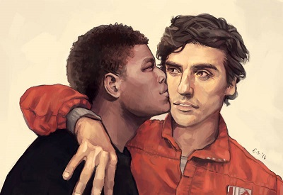
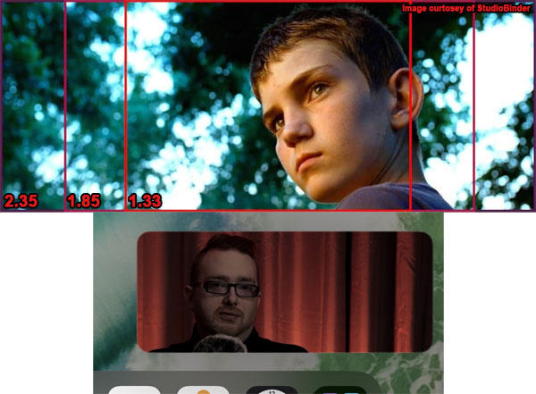

---
redirect_from:
  - "/videos/p_mlm6fuhhq"
  - "/videos/CODEBREAKER" # original name
  - "/videos/codebreaker"
  - "/CODEBREAKERS"       # short link

# cSpell:words: Yorgos Lanthimos Zalta Spinks Jani Academus Plys-Garzotto Kuleshov Sergey Rosen Maran Mulvey Doane Slavoj Žižek Lacanian Tsivian André Bazin Selnick Feige Cahiers cinéma Brokeback
# cSpell:words: Germaine Dulac, Louis Delluc, Jean Epstein, Sergei Eisenstein, Lev Kuleshov, Dziga Vertov, Paul Rotha and film theorists like Rudolf Arnheim, Béla Balázs and Siegfried Kracauer Hattori Hanzō Korra Bolin Veric Edda Eddas Boiotia Halperin Laeurtius Greenberg Erotikos
# cSpell:words: favourite analysed appetising indexical spectatorship Thanos gaybaiting scène noncontinuity stylised straightwashing civilisation characterised rulebook Codebreakers LGBTQ honourable expositionally pansexuality

date: 2020-12-04
title: "CODEBREAKERS: Queer film theory (and why it matters)"
runtime: 44:43
status: Complete
aka: !!seq
  - "Queering Cinema (by any means necessary)"
  - "Codebreakers: a rant by James Somerton (Thumbnail)"
topics: !!seq
  - Poetic / Prose Edda
  - Achilles and Patroclus
  - The Song of Achilles / Troy
  - The Imitation Game / Rent
  - The Favorite
links: !!seq
  - "https://web.archive.org/web/20201204124414/https://www.youtube.com/watch?v=P_mLM6fUhHQ&gl=US&hl=en"
description: "a video essay on film theory, heteronormativity, erasure, and historian memes taken too seriously, all presented in the CinemaScope aspect ratio because we're being pretentious today."
notes:
  - hbomb
  - visual
  - w-james-nick

history:
  2020-11-24: Teased on Patreon.
  2020-12-04: First published.
  2022-12-22: Video removed for unknown reason.
  # 2023-12-07: Privated post-callout.

contributors:
  downloaded: "[tobi-cat](https://github.com/tobi-cat) from [YouTube Archive video](https://www.youtube.com/watch?v=i_ElaGEfcxg)"
  formatting: $cite$tustin2121
  citation-plus: 
    - $ref$lvence$https://docs.google.com/document/d/e/2PACX-1vR3mq0zwqGEIXnqZ8A8lMb7OrYlaQxrOdZ1FK-7TtxqqL-Lsq4KRiedV3lW9ahtrTKbUCHWxtdoWBeu/pub
    - $cite$penguinstorage
  citation:
    - $ref$sobbing$https://discord.com/channels/1180822793420554241/1180822793420554244/1207300957063618650
  factcheck:
    - "[HardyRoach](https://discord.com/channels/224921177532006400/1181019607604133938/1209464594834395157) from the HBomberGuy Discord"

recs:
  - { title: "New Queer Cinema: The Director's Cut", author: "B. Ruby Rich", url: "https://www.jstor.org/stable/j.ctv11hpp0s", desc: "The author that James third-hand plagiarized about in this video." }

cite:
  clips: !!map
    the_favorite: { short: "The Favorite (2018)", full: "Lanthimos, Y. (Director). (2018). <em>The Favorite</em> [Film]. Scarlet Films, Element Pictures, Arcana, Film4 Productions, Waypoint Entertainment." }
  yikes: !!map
    gay-erasure: '"What is the real tangible impact of gay erasure?" James asks, while erasing the name of the man who originally asked this question in a queer culture magazine that has since dropped off the face of the earth.'
    women_prosecuted: "Why would James would claim women weren't prosecuted for being gay because lawmakers were squeamish? Did he want it to seem like gay men suffered more? Or is he projecting?"
  misinformation: !!map
    prose_edda: "James makes up several things about the Prose Edda."
    poetic_edda: "He also makes up things about the Poetic Edda."
    trans_mummy: "James jumps to conclusions about a mummy with 'drawn-on breasts'."
    viking_boy_things: "James also knows very little about Vikings and how they were rather hygienic and well kept.."
    lincoln: "James exaggerates the claims about Lincoln and his bodyguard."
    women_prosecuted: "James claims that women weren't prosecuted for being gay, which is just outright untrue."
  other: !!map
    torrid: "James doesn't know what the word 'torrid' actually means."
    film_handout: "HBomberGuy's video called out a section of this video where James was just reading several wikipedia pages on film theory. HBomberGuy actually gave James too much credit here; James was lazier. He copied instead from a Film Theory 101 class handout, which in turn copied from Wikipedia."
  plagiarized: !!map
    film_class:
      color: 4
      short: "(DaVega, 2016)"
      full: "DaVega, S.W. (2016). Film Theories Handout in <em>FILMST 101 - Intro to Film Studies</em> [Class materials]. Santa Barbara City College."
      url: "https://soma.sbcc.edu/users/davega/xNON_ACTIVE_CLASSES/FILMST_101/04_FILM_THEORIES/FilmTheories.pdf"
      archive: "https://web.archive.org/web/20240219184030/"
      chain:
        _desc_: "which took overviews from..."
        wiki_theory: 
          full: "Wikipedia. (2009, Sep 10). <em>Film theory</em> [Article]."
          url: "https://en.wikipedia.org/w/index.php?title=Film_theory&oldid=312921719"
          chain:
            _desc_: "which plagiarized from..."
            read_film: &read_film { color: 1, short: "(Monaco, 1977)", full: "Monaco, J. (1977). <em>How to Read a Film: Movies, Media, and Beyond</em> Oxford University Press, Inc.", url: "https://www.google.com/books/edition/How_to_Read_a_Film/ub74_dtjxKoC?hl=en&gbpv=1&pg=PA297&printsec=frontcover" }
        wiki_structuralist:
          full: "Wikipedia. (2009, Jul 4). <em>Structuralist film theory</em> [Article]."
          url: "https://en.wikipedia.org/w/index.php?title=Structuralist_film_theory&oldid=300187768"
        wiki_marxist:
          full: "Wikipedia. (2009, Apr 15). <em>Marxist film theory</em> [Article]."
          url: "https://en.wikipedia.org/w/index.php?title=Marxist_film_theory&oldid=283969058"
        wiki_screen:
          full: "Wikipedia. (2009, Aug 7). <em>Screen theory</em> [Article]."
          url: "https://en.wikipedia.org/w/index.php?title=Screen_theory&oldid=306555687"
        wiki_formalist:
          full: "Wikipedia. (2009, Jun 5). <em>Formalist film theory</em> [Article]."
          url: "https://en.wikipedia.org/w/index.php?title=Formalist_film_theory&direction=prev&oldid=324062286"
        encyclopedia_realist:
          full: "Schirmer Encyclopedia of Film. (n.d.). <em>Realism</em> [Article]."
          url: "http://www.filmreference.com/encyclopedia/Independent-Film-Road-Movies/Realism-THEORIES-OF-REALISM.html"
        wiki_feminist:
          full: "Wikipedia. (2009, Jun 8). <em>Feminist film theory</em> [Article]."
          url: "https://en.wikipedia.org/w/index.php?title=Feminist_film_theory&oldid=295168600"
        wiki_auteur:
          full: "Wikipedia. (2009, Sep 12). <em>Auteur</em> [Article]."
          url: "https://en.wikipedia.org/w/index.php?title=Auteur&oldid=313298258"
        wiki_apparatus:
          full: "Wikipedia. (2009, Jul 1). <em>Apparatus theory</em> [Article]."
          url: "https://en.wikipedia.org/w/index.php?title=Apparatus_theory&oldid=299761800"
        wiki_linguistic:
          full: "Wikipedia. (2009, Sep 8). <em>Linguistic film theory</em> [Article]."
          url: "https://en.wikipedia.org/w/index.php?title=Linguistic_film_theory&oldid=312575299"
        wiki_psychoanalytic:
          full: "Wikipedia. (2009, Mar 17). <em>Psychoanalytic film theory</em> [Article]."
          url: "https://en.wikipedia.org/w/index.php?title=Psychoanalytic_film_theory&oldid=277910836"
        semiotic:
          full: "Beach, R. (2006). Semiotic Theory [Section]. In <em>Module 4: Critical Approaches to Responding to Media Texts</em> [Class module]. On website for <em>CI5472 Teaching Film, Television, and Media</em> Class, University of Minnesota, Twin Cities campus."
          # url: "https://www.studocu.com/row/document/universite-sidi-mohamed-ben-abdellah-de-fes/cinema/ch04-critical-approaches-to-responding-to-media-texts/46426745"
          url: "http://www.tc.umn.edu/~rbeach/teachingmedia/module4/4.htm"
          archive: "https://web.archive.org/web/20130302070542/"
          offline: true
    plato_stanford: { color: 2, short: "Stanford Encyclopedia (Pickett, 2020)", full: "Pickett, B. (2020). Homosexuality. In <em>The Stanford Encyclopedia of Philosophy</em> (Summer 2020 Edition). Zalta, E.N. (Editor). Metaphysics Research Lab, Stanford University. Retrieved Jan 27, 2024, from", url: "https://plato.stanford.edu/archives/sum2020/entries/homosexuality/" }
    gay_erased: 
      color: 5
      short: "Midlands Zone Magazine (Spinks, 2019)"
      full: "Spinks, S. (2019, March). Gay Erased. In This Gay Live: The Stephen Spinks Column. <em>Midlands Zone</em>(Issue 263), pages 16-17."
      url: "https://www.midlandszone.co.uk/features/homophobic-erasure-the-cull-of-lgbtq-presence-from-history/64"
      archive: "https://web.archive.org/web/20210127145049/"
      chain:
        _desc_: "Midlands Zone Magazine succumbed to the pandemic, so here's alternate methods of accessing content:"
        issuu: { full: "via Issuu.com. Retrieved Jan 27, 2024, from", url: "https://issuu.com/midlands-zone/docs/midlands_zone_march_2019/16" }
    achilles: { color: 7, short: "Academus Education (Jani, 2020)", full: "Jani, R. (2020, June 24). <em>Achilles and Patroclus: The erasure of LGBT+ history</em>. Academus Education. Retrieved Jan 27, 2024, from", url: "https://www.academuseducation.co.uk/post/achilles-and-patroclus-the-erasure-of-lgbt-history-by-reyna-jani" }
    ff2media: { color: 9, short: "(Plys-Garzotto, 2018)", full: "Plys-Garzotto, G. (2018, Dec 27). <em>'The favourite' queers the past and the present</em> [Article]. FF2 Media.", url: "https://ff2media.com/blog/2018/12/26/the-favourite-queers-the-past-and-the-present/", archive: "https://web.archive.org/web/20210121203358/" }
    film_ref_queer: { color: 3, short: "Queer Theory (Film Reference, n.d.)", full: "<em>Queer Theory</em> [Encyclopedia entry]. (n.d.). Film Reference. Advameg, Inc", url: "http://www.filmreference.com/encyclopedia/Independent-Film-Road-Movies/Queer-Theory.html", archive: "https://web.archive.org/web/20200702185638/" }
    movie_mezzanine: 
      color: 1
      short: "(Turner, 2015)"
      full: "Turner, K. (2015, Feb, 20). <em>Coded Switch: “The Imitation Game” and The Queer Film</em> [Article]. Movie Mezzanine. Retrieved Feb 14, 2024, from"
      url: "http://moviemezzanine.com/the-imitation-game-and-the-queer-film/"
      archive: "https://web.archive.org/web/20230923004927/"
      chain: 
        _desc_: "which quotes..."
        wiki_queer_cinema: 
          color: 8
          short: "New queer cinema (Wikipedia, 2020)"
          full: "Wikipedia. (2020, Nov 29). <em>New queer cinema</em> [Article]."
          url: "https://en.wikipedia.org/w/index.php?title=New_queer_cinema&oldid=991242524"
          chain:
            _desc_: "which summarizes..."
            _: { full: "Rich, B.R. (1992, Sep). New Queer Cinema [Article]. In <em>Sight & Sound Magazine</em> (September 1992 issue). (Originally published in <em>The Village Voice</em>, 1992.) Retrieved Feb 14, 2024, from", url: "https://www2.bfi.org.uk/news-opinion/sight-sound-magazine/features/new-queer-cinema-b-ruby-rich" }
    mako_visual: { color: 12, short: "Mako x Wu (MoonFlower, 2020)", full: "MoonFlower (2020, Apr 8). <em>(Wuko) Crush (Mako x Wu)</em> [Music video]. YouTube.", url: "https://www.youtube.com/watch?v=1c-Km4I4bqA" }
    visual_composition: { color: 13, short: (The Cinema Cartography, 2016)"", full: "The Cinema Cartography. (2016, Jan 22). <em>Composition In Storytelling</em> [Video]. YouTube.", url: "https://www.youtube.com/watch?v=CvLQJReDhic" }
    thumbnail: { color: 1, short: "Artwork (ewasarts, 2017)", full: "ewasarts (Artist). (2017, Jul 22). <em>Stormpilot</em> [Artwork]. Retrieved Jan 29, 2024, from", url: "https://www.deviantart.com/ewasarts/art/Stormpilot-694082207" }
---





<compare>

<from >



This thumbnail is [uncredited, stolen artwork](https://www.deviantart.com/ewasarts/art/Stormpilot-694082207) of Poe and Finn by ewasarts.

</from>
<credits class="desc">

A look into what Film Theory is... what Queer Theory is... and why it does matter, actually.

Patreon: [link]

Twitter: @je_somerton  
@ntherrgott

This video contains copyrighted material. The use of which has not always been specifically authorized by the copyright owner. I am making this material available in my efforts to further bring to light the history of LGBTQ+ representation in film and television. I believe this constitutes a fair use of any such copyrighted material as provided for in section 107 of the US Copyright Law.

00:00 Introduction  
01:00 What is Film Theory?  
07:50 What is Queer Theory?  
14:23 Yes. We are looking for it.  
23:48 Erasure  
28:09 Achilles was a bottom  
32:03 The Big Gay Lie  
38:35 Queering History  

</credits>
<comment>

  
  
  
  
  
  
  
  

</comment>
</compare>




<compare>
<credits  class="opening">

<u>[Computer command line theming]:</u>

> \>STARTING PROCEDURE

<details>
<summary><u>[Starts printing C++ code for some sort of MIDI reading program to the screen]:</u></summary>

```c++
#include <stdio.h>
#include <stdlib.h>
#include <string.h>
#include <ctype.h>
#include "midiread.hpp"

#ifdef __MSDOS__
#define WRITE_BINARY "wb"
#define READ_BINARY  "rb"
#define READ_TEXT    "rt"
#define READWRITE_BINARY "wrb"
#else
#define WRITE_BINARY "w"
#define READ_BINARY  "r"
#define READ_TEXT    "r"
#define READWRITE_BINARY "w"
#endif

#ifndef MAXEVENTLEN
#define MAXEVENTLEN 1024
#endif

void lexstart(char* name);
int yyerror( char* msg );
int yylex();
int yyparse();
static void miditext(FILE* f, /* cut off*/);
static void midiendtrack(FILE* f, /* cut off*/);
static long log2(long n);
static void copybytes(FILE* f, /* cut off*/);
static int isactive();
static int lastevent = 0xff;
static int option_noteoff = 0; // cut off
static long filesize = 0;
static int percent = 0;
static int compress = 1;
static void readchannel();
static void putcode(FILE* f, /*cut off*/);
static void noteon(FILE* f, /*cut off*/); // "note on"
static void noteoff(FILE* f, /*cut off*/); // "note off"
static void time(long n);

extern char* yytext;
extern long /* too blurred */();
extern FILE* yyin;
extern FILE* yyout;
// It's now too blurred to make out
```

Other lines include:
```c++
(strncmp(s, "major", 3) == 0 || strncmp(s, "Major", 3) == 0)
*s >= '1' && *s <= '7' && strchr("b#", s[1]) !== 0
if (strncmp(s, "major", 3) == 0 || strncmp(s, "Major", 3) == 0)
'' - '0';

("illegal key signature: missing maj or min");
```

</details>

<u>[Eventually the screen flashes and we get]:</u>

> codebreakers  
a rant by james somerton

<u>[Fuzz to white then fade to James over a red curtain backdrop.]</u>

</credits>
<comment>


This video is <s>pretentiously</s> presented in the CinemaScope aspect ratio.



</comment>
</compare>

<compare>
<james >

Having made a few videos about queer coding and representation in movies, I've gotten a lot of feedback from a lot of different people. But one comment that I see over and over and over again is something like this:

<u>[Video blurs and quote shown on screen, James reads in artificial high pitched voice]:</u>

> "This was never meant to be gay. You're just reading into it too much"

...or...

<u>[Video blurs again and quote shown on screen, James reads in artificial low pitched voice]:</u>

> "You're reaching pretty far to find anything queer about this"

And so I decided that people are *woefully* undereducated on film theory, which is -- as we know -- the most important subject you could ever study in school. Because if these people leaving these comments knew what film theory was, they'd know what Queer Theory is.


</james>
<from></from>
</compare>

## Part 1: What is film theory?

<compare>
<james >

<mark>"Film theory" discusses the essence of cinema and provides conceptual frameworks for understanding a film's relationship to reality, other arts, individual viewers, and society as a whole. This term is not to be confused with "film analysis", a way of analyzing film which may draw upon ideas from film theory.</mark>

<u>[On screen next to James, he reads it out]:</u>

> <mark>Film analysis is the process in  
> which a film is analyzed in terms  
> of Mise-en-scène,  
> Montage,  
> Cinematography,  
> Sound,  
> and editing.</mark>

</james>
<from >
<h2>FILM THEORY</h2>

<mark>Film theory debates the essence of the cinema and provides conceptual frameworks for understanding film's relationship to reality, the other arts, individual viewers, and society at large. This term is not to be confused with film analysis, a way of analyzing film, which may draw upon ideas from film theory.</mark>

<h2>FILM ANALYSIS</h2>
<mark>Film anaylysis<sup class="add">[sic: analysis]</sup> is the process in which a film is analyzed in terms of mise-en-scène, montage, cinematography, sound, and editing.</mark> One way of analyzing films is by the shot-by-shot analysis, though that is typically used only for small clips or scenes.

</from>
</compare>

<compare>
<james >
<!-- Footage here is of a bunch of early silent films. penguin seems to think this is taken from somewhere, so marking it for if and when it is found. -->

<span visual=none on="?" off="?"><mark>As the new popular art form of the twentieth century, film immediately</mark> <mark>invited theoretical attempts to define its nature and function, mostly as a result of film's own inferiority complex as the youngest of the arts. The impetus for much of early film theory was to gain a degree of legitimacy.</mark></span>

</james>
<from >
<h2>History of Film Theory</h2>

<mark>As the new art form of the twentieth century, film immediately</mark> and continuously <mark>invited theoretical attempts to define its nature and function. Mostly as a result of film's own inferiority complex as the youngest of the arts, the impetus for much of early film theory was to gain a degree of respectability.</mark>

</from>
<james >
<!-- Footage here is of a bunch of early silent films. -->

<span visual=none on="?" off="?">Writers, directors, producers, and critics wanted to slap a philosophical academic lens onto movies so that they could be held in the same esteem as theater, and the novel. However, much of coding in film, especially queer coding, is rooted in film language itself.</span>

And "film language" refers to conventions and patterns in lighting, sound, and visual elements that reinforce the narrative structure. This doesn't necessarily refer to elements of the narrative itself, like something written into the script or an actor's performance. These elements are usually more subtle.

They're used to change the moods or attitudes of a scene highlight, a recurring theme of the film, or convey an unspoken message that the director is trying to get across. That last part is important for queer coding; go watch [my videos on "gaybaiting"](Unrequited1.md) for more on that.

</james>
<from></from>
</compare>

<compare>
<james >

You can see clear examples of lighting used as film language in *Avengers: Infinity War*, where scenes lit with purple highlight Thanos's influence and cruelty. And scenes lit with orange are in resistance to him. *The Last Jedi* -- the absolute best *Star Wars* movie of all time, we can all agree on that -- very deliberately depicts objects being split apart. This can speak to the content of fractured alliances within the movie itself, the divided nature of the fan base as a whole, or making a meta self-aware statement of the director's knowledge of the film's own divisive content.


</james>
<from></from>
</compare>

<compare>
<visual >

James pulls from another video essay for his B-Roll here. He uses the opening montage, cutting away to not include that video's title. According to that video's subtitles (which it uses to actually *cite* its sources), the following films are shown in James's video: *American Beauty* (1999), *Eternal Sunshine of The Spotless Mind* (2004), *The Tree of Life* (2011), *Melancholia* (2011), *Ida* (2013), *Gravity* (2013), *Only God Forgives* (2013), *Antichrist* (2009), *Fargo* (1996), *The Good, The Bad and The Ugly* (1966), *12 Years A Slave* (2013), *Raging Bull* (1980), *Barry Lyndon* (1975).

</visual>
<visual-line></visual-line>
<james >

<span visual={{vis}} on="0:03" off="0:18">Granted, while film language is not limited to lighting and visual cues, these are very explicit examples. Most film language is never meant to be picked up by the audience at large, but rather send subliminal messages to</span>  
<span visual={{vis}} on="0:22" off="0:30">influence how you feel about certain scenes and characters. In some respects, all of this was anticipated by the development of film theory</span>  
<span visual={{vis}} on="0:43" off="0:51">at a time when the cinema was just being born. <mark x>Early theorists</mark> <mark>emphasized how film differed from reality and how it might be considered a valid art form</mark>.</span>

<mark>In the years after World War II, the French film critic and theorist Andre Bezine reacted against this approach to the cinema, arguing that film's essence lay in its ability to mechanically reproduce reality, not in its differences from reality.</mark>

</james>
<from >

<mark x>Early film theory</mark> arose in the silent era and was mostly concerned with defining the crucial elements of the medium. It largely evolved from the works of directors like Germaine Dulac, Louis Delluc, Jean Epstein, Sergei Eisenstein, Lev Kuleshov, Dziga Vertov, Paul Rotha and film theorists like Rudolf Arnheim, Béla Balázs and Siegfried Kracauer. These individuals <mark>emphasized how film differed from reality and how it might be considered a valid art form</mark>. 

<mark>In the years after World War II, the French film critic and theorist André Bazin reacted against this approach to the cinema, arguing that film's essence lay in its ability to mechanically reproduce reality not in its difference from reality.</mark>

</from>
</compare>

<compare>
<james >
<!-- Footage here is of zooming into two photos of François Truffaut. -->

<span visual=none on="?" off="?"><mark>In the 1960s and 70s, film theory took up residence in academia, importing concepts from established disciplines like</mark></span>

<u>[On screen next to James, he reads it out]:</u>

> <mark></mark>Psychoanalysis  
> Gender Studies  
> Anthropology  
> Literary Theory  
> Semiotics [and] 
> Linguistics  

</james>
<from >

<mark>In the 1960s and 1970s, film theory took up residence in academe, importing concepts from established disciplines like</mark> <mark>psychoanalysis, gender studies, anthropology, literary theory, semiotics and linguistics.</mark>

</from>
</compare>

<compare>
<james span=2 >

<mark>During the 1990s, the digital revolution and image technologies had an impact on film theory in *various* ways. There has been a refocus onto celluloid film's ability to capture an indexical image of a moment in time by theorists, like Maran Don, Philip Rosen, and Laura Mulvey</mark>. 

Today there are many different schools of film theory. So let's talk about them: 😊

</james>
<from >

<mark>During the 1990s the digital revolution in image technologies has had an impact on film theory in various ways. There has been a refocus onto celluloid film's ability to capture an indexical image of a moment in time by theorists like Mary Ann Doane, Philip Rosen and Laura Mulvey</mark> who was informed by psychoanalysis. From a psychoanalytical perspective, after the Lacanian notion of the Real, Slavoj Žižek offered new aspects of the gaze extensively used in contemporary film analysis. There has also been a historical revisiting of early cinema screenings, practices and spectatorship modes by writers Tom Gunning, Miriam Hansen and Yuri Tsivian.

</from>
<comment id="film_handout" >

Note: The following sections are still using the university handout as a source, but the university handout is using wikipedia as a source. See the top of the page for the full plagiarism chain.

</comment>
<james >

<u>[On screen next to James]: "Structuralist Film Theory"</u>

<mark>The Structuralist film theory emphasizes how films convey meaning through the use of codes and conventions, not dissimilar to the way languages are used to construct meaning in communication. An example of this is understanding how the simple combination of shots can create an additional idea. The blank expression on a person's face, an appetizing meal, and then back to the person's face. While nothing in this sequence literally expresses hunger or desire, the juxtaposition of the images convey that meaning to the audience.</mark>

</james>
<from >
<h3 style="font-weight:700;">structuralist film theory</h3>

<mark>The structuralist film theory emphasizes how films convey meaning through the use of codes and conventions not dissimilar to the way languages are used to construct meaning in communication. An example of this is understanding how the simple combination of shots can create an additional idea: the blank expression on a person's face, an appetising meal, and then back to the person's face. While nothing in this sequence literally expresses hunger—or desire—the juxtaposition of the images convey that meaning to the audience.</mark> Unraveling this additional meaning can become quite complex. Lighting, angle, shot duration, juxtaposition, cultural context, and a wide array of other elements can actively reinforce or undermine a sequence's meaning.

</from>
<james >
<!-- Footage used in the bottom corner here is Sergei Eisenstein clips. -->

<u>[On screen next to James]: "Marxist Film Theory"</u>

<span visual=none on="?" off="?"><mark>Marxist film theory is one of the oldest forms of film theory. Sergey Eisenstein and many other Soviet filmmakers in the 1920s expressed ideas of Marxism through film. In fact, the Hegelian Dialectic was considered best displayed in film editing through the</mark> <mark>development of the montage</mark>, a Russian invention. <mark x>The biggest reason Russian filmmakers began doing this was because they had a serious problem with how Hollywood was making movies.</mark> <mark>Eisenstein's solution was to shun narrative structure by eliminating the individual protagonist</mark> in favor of <mark>telling stories where the action is moved by a group, and the story is told through a clash of one image against the next, whether in composition, motion, or idea.</mark></span>

</james>
<from >
<h3 style="font-weight:700;">marxist film theory</h3>

<mark>Marxist film theory is one of the oldest forms of film theory. Sergei Eisenstein and many other Soviet filmmakers in the 1920s expressed ideas of Marxism through film. In fact, the Hegelian dialectic was considered best displayed in film editing through the</mark> Kuleshov Experiment and the <mark>development of montage</mark>. While this structuralist approach to Marxism and filmmaking was used, <mark x>the more vociferous complaint that the Russian filmmakers had was with the narrative structure of Hollywood filmmaking</mark>

<mark>Eisenstein's solution was to shun narrative structure by eliminating the individual protagonist</mark> and <mark>tell stories where the action is moved by the group and the story is told through a clash of one image against the next (whether in composition, motion, or idea)</mark> so that the audience is never lulled into believing that they are watching something that has not been worked over. Eisenstein himself, however, was accused by the Soviet authorities under Stalin of "formalist error," of highlighting form as a thing of beauty instead of portraying the worker nobly.

</from>
<james >

<u>[On screen next to James]: "Formalist Film Theory"</u>

<mark>Formalist film theory is a theory of film study that is focused on the formal, or technical, elements of a film, i.e the lighting, scoring, sound, set design, use of color, shot composition, and editing. It's a major theory of film study today. Formalism at its most general considers the synthesis or lack of synthesis of the multiple elements of film production, and the effects, emotional and intellectual, of that synthesis, and of the individual elements.</mark> 

<mark>For example, let's take the single element of editing: A formalist might study how standard Hollywood continuity editing creates a more comforting effect, and non-continuity or jump cut editing might become more disconcerting or volatile.</mark> A good example of this would be Tarantino's *Pulp Fiction*<sup cn></sup> or the first season of Netflix's *The Witcher*.<sup cn></sup>

</james>
<from >
<h3 style="font-weight:700;">formalist film theory</h3>

<mark>Formalist film theory is a theory of film study that is focused on the formal, or technical, elements of a film: i.e., the lighting, scoring, sound and set design, use of color, shot composition, and editing. It is a major theory of film study today. Formalism, at its most general, considers the synthesis (or lack of synthesis) of the multiple elements of film production, and the effects, emotional and intellectual, of that synthesis and of the individual elements.</mark> <mark>For example, let's take the single element of editing. A formalist might study how standard Hollywood "continuity editing" creates a more comforting effect and noncontinuity or jump-cut editing might become more disconcerting or volatile.</mark> Or one might consider the synthesis of several elements, such as editing, shot composition, and music. The shoot-out that ends Sergio Leone's Spaghetti Western "Dollars" trilogy is a valid example of how these elements work together to produce an effect: The shot selection goes from very wide to very close and tense; the length of shots decreases as the sequence progresses towards its end; the music builds. All of these elements, in combination rather than individually, create tension. Formalism is unique in that it embraces both ideological and auteurist branches of criticism. In both these cases, the common denominator for Formalist criticism is style.

</from>
<james >

<u>[On screen next to James]: "Feminist Film Theory"</u>

<mark>Feminist film theory is the theoretical film criticism derived from feminist politics and feminist theory. Feminists have many approaches to cinema analysis regarding the film elements analyzed and their theoretical underpinnings. The development of Feminist film theory was influenced by Second Wave Feminism and the development of Women's Studies within academia. Feminist scholars began applying the new theories arising from these movements to analyzing film. Initial attempts in the United States in the early 1970s were generally based on Sociological Theory and focused on the function of women characters in particular film narratives or genres, And of stereotypes as a reflection of a society's view of women.</mark>

</james>
<from >
<h3 style="font-weight:700;">feminist film theory</h3>

<mark>Feminist film theory is the theoretical film criticism derived from feminist politics and feminist theory. Feminists have many approaches to cinema analysis, regarding the film elements analysed and their theoretical underpinnings. The development of feminist film theory was influenced by second wave feminism and the development of women's studies within the academy. Feminist scholars began applying the new theories arising from these movements to analyzing film. Initial attempts in the United States in the early 1970’s were generally based on sociological theory and focused on the function of women characters in particular film narratives or genres and of stereotypes as a reflection of a society's view of women.</mark> Works such as Marjorie Rosen’s Popcorn Venus: Women, Movies, and the American Dream (1973) and Molly Haskell’s From Reverence to Rape: The Treatment of Women in Movies (1974) analyzed how the women portrayed in film related to the broader historical context, the stereotypes depicted, the extent to which the women were shown as active or passive, and the amount of screen time given to women.[1]

</from>
<james >

<u>[On screen next to James]: "Auteur Film Theory"</u>

<mark>Auteur theory</mark> in film <mark>holds that a director's film reflects that director's personal creative vision, as if he were the primary auteur, the French word for "author". In some cases, film producers are considered to have a similar auteur role for films that they have produced</mark>, such as David Os Selnick and Kevin Feige. 

</james>
<from >
<h3 style="font-weight:700;">auteur theory</h3>

In film criticism, the 1950s-era <mark>Auteur theory</mark> <mark>holds that a director's films reflect that director's personal creative vision, as if he were the primary "Auteur" (the French word for "author"). In some cases, film producers are considered to have a similar "Auteur" role for films that they have produced</mark>. In law the Auteur is the creator of a film as a work of art, and is the original copyright holder. Under European Union law the film director shall always be considered the author or one of the authors of a film. [1] Auteur theory has had a major impact on film criticism ever since it was advocated by film director and film critic François Truffaut in 1954. "Auteurism" is the method of analyzing films based on this theory or, alternately, the characteristics of a director's work that makes him an Auteur. Both the Auteur theory and the Auteurism method of film analysis are frequently associated with the French New Wave and the film critics who wrote for the influential French film review periodical Cahiers du cinéma.

</from>
<james >

So it's clear that there are many ways of examining film in a critical way. not one school of film theory can fully describe a complete understanding of film itself. So, for using theory in film criticism, a critic usually has to state which theory they're drawing from. This goes to say, however, that film can be criticized with pre-existing schools of thought, like with Marxism and Feminism. In both of these cases, scholars and critics took certain tenants of these studies and applied them to an analysis of film. So if there is a Marxist and Feminist reading of cinema, why not a queer one? 

</james>
<from></from>
</compare>


## Part 2: What is Queer Theory?

<compare>
<james >

<mark>Originating in the early 1990s,</mark> the school of thought called <mark>"Queer Theory" compromises<sup class="add">[sic: comprises]</sup> a diverse body of intellectual inquiry. It</mark> holds <mark>that specific psychological, political, and cultural codes have elevated heterosexuality to the status of a sexual given.</mark> A man or woman can automatically be assumed to be cisgender and heterosexual. Differences in gender and sexuality are modifications on what is considered to be a given. He isn't just a *man*, he is a *gay man*. Straight is the default, and furthermore, straight is the objective. 

</james>
<from >
<h2>Queer Theory</h2>

<mark>Originating in the early 1990s,</mark> <mark>queer theory comprises a diverse body of intellectual inquiry. It</mark> takes as its premise the notion <mark>that specific psychological, political, and cultural codes have elevated heterosexuality to the status of a sexual "given."</mark> By revealing these codes and exposing their limitations, along with the unstable foundations upon which they operate and sustain their power, queer theory aims to "undo" the heterosexual norm, and to extend the power of cultural presence and voice to sexually marginalized groups who do not adhere to the workings of heteronormativity. A "queer" perspective, then, is attentive to a multiplicity of sexual codes that operate in the products of cultural institutions, and does not privilege heterosexual codes as natural or authoritative. The designation of "queer" is itself a form of empowerment, through which a disenfranchised subculture has taken charge of a term that dominant heterosexual culture has used historically as a derogatory label. 

</from>
</compare>

<compare>
<james >

Social rewards are provided for queers who can pass. Certain opportunities and privileges are awarded to queer folks who seem to have assimilated into the straight expectations and values. This includes things like--

<u>[Appearing on screen as he speaks them]:</u>

--<q>Marriage</q>, <q>Parenthood</q>, <q>Settling Down</q> at X years old, <q>Moving to the Suburbs</q>, and fulfilling various traditions the society has--

<u>[The last one is presented on-screen as "Being Basic as Fuck".]</u>

--but which have no value aside from being rituals that we practice. And gender reveal parties... (That's a new one...) <u>[Stares off to the side in disgust]</u>

</james>
<from></from>
</compare>

<compare>
<james >

This is called "heteronormativity" and it's the most intellectual way that you can call a bitch basic. By exposing the limitations of heteronormative conditioning and taking advantage of the culturally performative aspects of gender, the aim of Queer Theory is to draw a distinction between the individual and the formative processes that influence gender and sexuality. It's not to say that it's bad to be straight, but instead Queer Theory looks at all sexuality and gender as being neutral and questions why weight and preference are given to some while others are seen as abnormal. 

Queer Theory is not only the analysis of codes and conditioning associated with heteronormativity, but more recently is being extended to discuss and document the interactions of queer people in their own communities. A queer perspective then is looking at a vast array of sexual codes that exist in culture, and does not privilege heterosexual codes as natural or authoritative. The designation of queer is itself a form of empowerment through which a disenfranchised subculture has taken charge of a term that the straights have used historically as a derogatory label. 

</james>
<from></from>
<james >

Theorists vary in their configurations on which groups and perspectives are included under the blanket of "queer film theory". Many theorists find any challenge to the normative nature of heterosexuality to qualify as queer, such as the non-traditional family at the end of aliens, while others use the term to apply specifically to gender and sexual orientations that challenge or complicate the presumed alliance between sexual identity and gender identity.

This isn't to say that a queer reading is one that requires us to see a certain character as queer coded. A queer reading can examine the ways in which the narratives, themes, and language of a film reinforce and exemplify heteronormative values. For instance, the film *Cordelia* is a period horror movie. However... you wouldn't know it from the movie's poster. A wave of queer eyebrows were raised, unsure as to what about the movie's poster was supposed to be so... scary. The messaging in this poster is that the horror here is a dominant woman and a submissive man. To everyone outside the hetero hegemony, this just looks like a good time.

</james>
<from></from>
<james >

Queerness doesn't even need to be present in a film to derive a queer reading from it. Just like there can be a feminist reading of *Reservoir Dogs*, where there are almost no female characters, by examining the way patriarchal masculinity factors into the depictions of each character. 

There can also be a queer reading of *Kill Bill*, my favorite movie. There are no openly queer characters in the film, and for characters who might be queer, their queerness is not at all encoded in the language of the film. However, the bride, when she realized that she was pregnant, immediately wanted to leave behind her atypical chosen family. Instead of raising her daughter among a group of cutthroat assassins, she wanted a better life by forcing herself into the most heteronormative family that she could find on short notice. Because growing up poor in El Paso, Texas, is *so* much better than growing up around rich assassins.

It is this rejection of non-conformity which sends her life into ruins, and spurs the whole bloody affair into action. (And, yes, Hattori Hanzō is totally gay.)

</james>
<from></from>
</compare>

<compare>
<james >

In essence, Queer Theory is watching a film through a queer lens, reading the film as queer whether it was meant to be or not. Finding a way to see art in a queer way. But that said, reading gay characters into film is not only a part of Queer Theory. it's pretty much the OG gay mood. We do it without realizing it. 

</james>
<from></from>
<james >

Even before Queer Theory, we would watch a play or a movie and see a character, and we would look at them and say what they're going through is a queer experience, intended or not. That's easy to do with some movies. The queer subtext in *A Nightmare On Elm Street: Part Two* is so obvious the straight people readily picked it up. The lesbian energy in *Dracula's Daughter*, the bisexual tension erupting from *Rebel Without A Cause*, even the relationship between Captain America and Bucky Barnes was read as gay by *millions* of straight movie goers.

</james>
<from></from>
</compare>

<compare>
<james span=2 >

But other movies require a bit more digging. In [Evil Queens](Qvu84kjtGvE), I talked about the queerness of the '90s renaissance disney movies especially *Aladdin* and *The Lion King*. When I first mentioned this to people, they thought I was crazy. Then I explained it to them, and they came around to seeing it my way.

</james>
<from></from>
<comment >

And everyone clapped.

</comment>
</compare>

<compare>
<visual >


James pulls an FMV from YouTube to use as B-Roll for this part.

</visual>
<visual-line></visual-line>
<james >

<span visual=none on="?" off="?">In *The Legend Of Korra*, there actually are confirmed bisexual characters. But ask any queer person who's watched the show and they'll tell you every damn character on it is bi or pansexual.</span> It's not wishful thinking; it's a queer reading of the show. 

<span visual=none on="?" off="?">Bolin's close relationship with Varrick.</span> 

<span visual={{mkv}} on="2:31" off="2:35">Mako's will-they-won't-they with Prince Wu (which seems to be getting closer to becoming canon in the graphic novels).</span>

<footer>James mispronounces Mako's name, using a short-a sound instead of a long a.</footer>

</james>
<from></from>
</compare>

<compare>
<james >

Media that attracts a queer reading is usually produced by straight people, with no intention on being read as queer. But the LGBT population, so starved for proper representation, will look through every nook and cranny of their favorite movies, tv shows, and books to find some hint that's somewhere in that story... there's at least a *moment* that... makes them feel like they belong. That's why people cry out for more media produced for queer people by queer people, because otherwise we basically don't exist. We can be told *over and over and over* again that we're just trying to find something that isn't there.

This argument isn't new. Straight people telling gay people that we're reading too much into a story, that we just *looking* for gayness...

Well... it's because we are.

</james>
<from></from>
</compare>


## Part 3: Yes. We are looking for it.

<compare>
<james >

Where else are we going to look for queerness? The torrent of explicitly queer media that's been *pouring out at us* over the last 100 years?! If you take news or history books for granted, it's like queer people just &mdash; bloop! &mdash; popped up in 1969! And trans people didn't come along until Caitlyn Jenner. (Which is a bit of an unfortunate introduction.)

Suddenly these people just materialized! The complete lack of historical coverage and cultural awareness of these people is a major contributing reason why straights *still to this day* say that we "choose to be gay" or "choose to be trans". 

</james>
<from></from>
</compare>

<compare>
<james >

But you'd be hard pressed to find actual honest queer representation in history. It's not that it doesn't exist though. It's just that our white, cisgender, heterosexual, usually-male historians tend to straight-wash out own history in academia. 

</james>
<from></from>
</compare>

<compare>
<james >

Whether it's Egyptian mummies with XY chromosomes, buried with makeup and a corset, <mark fc=false>with drawn-on breasts</mark>, *puzzling* archaeologists as to why *he* would be buried like that! 

</james>
<comment id="trans_mummy">

<details>
<summary>
There is an alternative explanation that the padding added was <a href="https://www.reddit.com/r/SapphoAndHerFriend/comments/elirp0/comment/fdirsj3/?utm_source=share&utm_medium=web2x&context=3">because the person was fat in life</a> and Egyptian mummies imitate life.
</summary>

> fruskydekke:  
> The Mutemmenu mummy! The information in this book is a little dated, they've done more research on him now. He was a high-status individual (most likely not a dancer) and the "breasts" and hips were linen stuffing that was probably added, not to make him look like a woman, but to make him look fat. In real life, he was an overweight man, and since mummies (particularly of this period) tried to recreate the look of the person as they had been in life, the embalmers went above and beyond.
>
> Note that he also has a stylised beard (the two black lines painted on his face).

</details>
</comment>
<james >

Or viking burial mounds, where male warriors would be buried with combs, jewels, and mirrors and instead of, you know... <u>[air quotes]</u> "boy things". 

</james>
<comment id="viking_boy_things">


[Vikings were hygienic](https://www.worldhistory.org/article/1840/viking-hygiene-clothing--jewelry/), I couldn’t find any historian/archaeologist who was surprised there weren’t more “boys things” at their grave.

</comment>
</compare>

<compare>
<james >

Or even something like The Lovers Of Me'dia<sup>1</sup>, petrified, holding hands, who are suddenly the *brothers* of me'dia, or *very good friends* of me'dia... or *roommates* of me'dia. 

<footer>1. Corrected on-screen to "The Lovers of Modena"</footer>

</james>
<from></from>
</compare>

<compare>
<james span=2 >

And speaking of roommates, what about the *inexplicable mysteries* we will never *truly know the answers to*, like why [Lady Elanor Butler and Sarah Ponsonby](https://en.wikipedia.org/wiki/Ladies_of_Llangollen) would run away from their marriage arrangements, moved <del>to</del> Wales, and adopt a small dog they affectionately named... *Sapphos*. (Mysteries... we will never know...)

And what about Abraham Lincoln, <mark fc=false>who shared his bed with his bodyguard for his entire tenure in The White House.</mark> Surely it was just a matter of different times. Times were different back then. Men expressed manliness in different ways! It was just different times, folks! Different times! No homo president!

</james>
<comment >

There is an entire article [about Lincoln and his bodyguard](https://quod.lib.umich.edu/j/jala/2629860.0027.205/--did-abraham-lincoln-sleep-with-his-bodyguard-another-look-at?rgn=main;view=fulltext). At the very least, James is wrong about them sharing a bed for Lincoln's whole tenure in office. C. A. Tripp, the original author of this claim, states Derrickson was Lincoln's companion from September 1862 to April 1863.

</comment>
<comment >
<details>
<summary>This bit gets on my nerves as a former historian.</summary>

Yes there are instances in which historians have been willfully obtuse about the presence of a possibly homosexual relationship. But this flippant, sarcastic "oh lol things were different back then SUUUUUUURE" is just idiocy. Yes, things were different. The past is a foriegn country with extremely different cultural and social expectations and assumptions. If you go into reading history with a purely modern mindset you will constantly misread stuff. Reading primary sources requires a huge amount of contextual understanding to avoid this kind of shoddy assumption.

The more modern reason why it's rare for historians to make confident judgements on the sexuality of historical figures is that there's rarely enough evidence to be remotely confident about it. Turns out people didn't write down "yes I like having sex with men" in a time when A. Even the concept of homosexuality was not culturally common, and B. Admitting to it could end your career and very probably your life.

[...] There are occasional cases where it's pretty cut and dry. But most of the time it can only ever be speculation based on limited evidence, and generally speaking idle speculation is to be avoided in academic work. In the worst case it's speculation based on a limited understanding of cultural context, like with Lincoln. Surprise, people didn't have so many hangups about sharing beds in a time where central heating didn't exist (for most people) and families commonly all lived in one room. 

</details>
</comment>
<james >

There also seems to be a strange element of history which *compulsively* tries to impose postcolonial values upon pre-christianized societies. I'm not sure if it's just that we're so indoctrinated into our own social structures or if our (small "L") liberal society needs to believe that our social values are actually *progressing*, and so we will force history to be as regressive as possible to make our own time look better in contrast. 

But why is it so hard to believe that a Viking society, who believed that a god that shaped everyone out of mead and clay, who hung from a tree connecting nine distinct worlds and realms together, and who was eaten by a wolf the size of the moon... couldn't see that a young boy in the village who liked dresses and flowers might *actually* be a girl. 

</james>
<from></from>
</compare>

<compare>
<james >

And on the topic of mythology, many classical scholars<sup cn></sup> like to gloss over and rewrite myths to have a straight leaning. <mark stat:id="malaprop" fc=false>Heracles's torrid of male lovers</mark> are mostly forgotten about. Or Achilles, who by most mythological accounts, preferred men exclusively. Not that you'd know it; from nearly a thousand years the scholar is desperately trying to rearrange all of Hellenic culture to invent this kind of masculinity where straight men can just be *that close*. 

</james>
<comment id="torrid">


"Torrid" means [hot or passionate](https://www.merriam-webster.com/dictionary/torrid), or even just dry heat. It is not a noun for a collective, like James is apparently attempting to use here. There's [not even a word *close* to "torrid"](https://www.wordhippo.com/what-is/another-word-for/collection.html) that might be a collective noun that he was trying to use. So here's some he could have used instead:

"Heracles's myriad of male lovers", "Heracles's assemblage of male lovers", "his retinue of male lovers", "his hoard of male lovers", "his multitude of male lovers", "throng of male lovers", "cadre of male lovers", "congregation of male lovers", "compliment of male lovers", "crew of male lovers", "battalion of male lovers", "fraternity of male lovers", "armada of male lovers", "council of male lovers", "quota of male lovers", "glee club of male lovers"...

</comment>
</compare>

<compare>
<james >

I mean, it doesn't help that many of these stories were translated and recopied by Christian monks and scholars in the Dark Ages; in many cases their original texts are lost. The author of Beowulf, for example, though far from queer, makes an explicit point of mentioning that the text is being doctored so that it can survive Christian purges.<sup cn></sup> It's not always done maliciously, but many ancient monks saw the artistic value of these stories and saw that they would not survive Christian censorship. Heavy edits were necessary to align with Christian values.

</james>
<from></from>
</compare>

<compare>
<james >

For instance, the Poetic and <mark fc=false>Prosaic Edda</mark>, the predominant source of what we know of Viking culture, <mark fc=false>was written by a single monk in Iceland</mark>. These stories were collected from oral traditions, rune stones, and scavenged from what writings could be found before they were destroyed by Christians. <mark fc>Writings in these Eddas now explicitly decry homosexual acts between men, deeming them as being shameful and unmanly.</mark> 

</james>
<comment id="prose_edda">


1. Nobody calls it "the Prosaic Edda". It's the [Prose Edda](https://en.wikipedia.org/wiki/Prose_Edda).</li>
2. The Prose Edda was attributed to [Snorri Sturluson](https://en.wikipedia.org/wiki/Snorri_Sturluson), who was never a monk, but rather a historian, poet, and lawspeaker.</li>
3. <span id="poetic_edda">We don't know who wrote or compiled the [Poetic Edda](https://en.wikipedia.org/wiki/Poetic_Edda), but it was never speculated to be Snorri.</span>
4. [Need a better-informed opinion.] Vikings seemed to only really care when the men were bottoms (["eg, willingly being the 'female' partner in a homosexual act"](https://library.oapen.org/bitstream/handle/20.500.12657/61672/9781800647749.pdf) (pg 340)).

</comment>
<james >

But there is archaeological evidence that refutes much of what the Eddas say, throwing doubt on on how honest these documents are. <mark fc=true>Burial mounds have been found with women honored as warrior heroes</mark>, or with same-sex couples resembling marriages. Surviving standing stones and wood carvings implicitly suggest same-sex interactions. 

</james>
<comment>


We did find 1 [burial mound of a female buried with weapons](https://www.cambridge.org/core/journals/antiquity/article/viking-warrior-women-reassessing-birka-chamber-grave-bj581/7CC691F69FAE51DDE905D27E049FADCD), prior to this shield bearers were considered a myth.

</comment>
<james >

And that does little to say of eyewitness accounts of byzantine merchants and travelers which point out just how sex positive and gender woke this society of barbarians really was. In cultures that place such a strong value on sex, why are heterosexual couplings seen as the only culturally viable way of getting it?

</james>
<from></from>
<james >

<mark>As has been frequently noted, the ancient Greeks did not have terms or concepts that correspond to the contemporary dichotomy of "heterosexual" and "homosexual"</mark>. <mark>There's a wealth of material from ancient Greece pertinent to issues of sexuality, ranging from dialogues of Plato such as the *Symposium* to plays by Aristophanes and greek artwork and vases.</mark> 

<mark>Probably the most frequent assumption about sexual orientation, at least by ancient greek authors, is that people can respond erotically to beauty in either sex.</mark> <mark>Some were noted for their exclusive interest in people of one gender, for example, Alexander the Great</mark> <mark>was known for his exclusive interest in</mark> <mark>other men. Such people however are generally portrayed as the exception</mark> to the rule.

<mark>Furthermore, the issue of what biological sex one is attracted to is seen as an issue of taste or preference, rather than as a moral issue. A character in Plutarch's *Eroticus*</mark> <mark>argues that</mark>:

> <mark></mark>"The noble lover of beauty engages in love wherever he sees excellence and splendid natural endowment without regard to any difference in physiological detail".

Essentially, <mark>gender just becomes an irrelevant detail, and instead the excellence in character and *beauty* is what is most important.</mark> 

</james>
<from >

<mark>As has been frequently noted, the ancient Greeks did not have terms or concepts that correspond to the contemporary dichotomy of ‘heterosexual’ and ‘homosexual’</mark> (e.g., Foucault, 1980). <mark>There is a wealth of material from ancient Greece pertinent to issues of sexuality, ranging from dialogues of Plato, such as the Symposium, to plays by Aristophanes, and Greek artwork and vases.</mark> What follows is a brief description of ancient Greek attitudes, but it is important to recognize that there was regional variation. For example, in parts of Ionia there were general strictures against same-sex eros, while in Elis and Boiotia (e.g., Thebes), it was approved of and even celebrated (cf. Dover, 1989; Halperin, 1990).

<mark>Probably the most frequent assumption about sexual orientation, at least by ancient Greek authors, is that persons can respond erotically to beauty in either sex.</mark> Diogenes Laeurtius, for example, wrote of Alcibiades, the Athenian general and politician of the 5th century B.C., “in his adolescence he drew away the husbands from their wives, and as a young man the wives from their husbands.” (Quoted in Greenberg, 1988, 144) <mark>Some persons were noted for their exclusive interests in persons of one gender. For example, Alexander the Great</mark> and the founder of Stoicism, Zeno of Citium, <mark>were known for their exclusive interest in</mark> boys and <mark>other men. Such persons, however, are generally portrayed as the exception</mark>. <mark>Furthermore, the issue of what biological sex one is attracted to is seen as an issue of taste or preference, rather than as a moral issue. A character in Plutarch’s Erotikos</mark> (Dialogue on Love) <mark>argues that</mark> <mark>“the noble lover of beauty engages in love wherever he sees excellence and splendid natural endowment without regard for any difference in physiological detail”</mark> (ibid., 146). <mark>Gender just becomes irrelevant “detail” and instead the excellence in character and beauty is what is most important.</mark>

</from>
</compare>

<compare>
<james >

<mark>Plato in the *Symposium* argues for an army to be comprised of same-sex lovers. Thebes did</mark> actually <mark>form such a regiment, the [Sacred Band of Thebes](https://en.wikipedia.org/wiki/Sacred_Band_of_Thebes), consisting of 500 soldiers</mark>, 250 couples.

<u>[On screen, showing footage of some trailer for "Sacred Band of Thebes"]: "Yep. They even make porn about them."</u>

<mark>They were renowned in the ancient world for their valor in battle</mark> and they're still talked about today. <mark>Ancient Rome had many parallels to ancient Greece in its understanding of same-sex attraction, and sexual issues more generally. This is especially true under *the Republic*, yet under the Empire, Roman society slowly became more negative in its views towards sexuality, probably due to social and economic turmoil, even before Christianity became influential.</mark> 

</james>
<from >

[...] While the passive role was thus seen as problematic, to be attracted to men was often taken as a sign of masculinity. Greek gods, such as Zeus, had stories of same-sex exploits attributed to them, as did other key figures in Greek myth and literature, such as Achilles and Hercules. <mark>Plato, in the *Symposium*, argues for an army to be comprised of same-sex lovers. Thebes did</mark> <mark>form such a regiment, the Sacred Band of Thebes, formed of 500 soldiers</mark>. <mark>They were renowned in the ancient world for their valor in battle</mark>.

<mark>Ancient Rome had many parallels to ancient Greece in its understanding of same-sex attraction, and sexual issues more generally. This is especially true under the Republic. Yet under the Empire, Roman society slowly became more negative in its views towards sexuality, probably due to social and economic turmoil, even before Christianity became influential.</mark>

</from>
<james >

<mark>Exactly what attitude the New Testament has towards sexuality in general (and same-sex attraction in particular) is a matter of sharp debate.</mark> Some say <mark>that many passages taken today as condemnations of homosexuality are more concerned with prostitution. Or where same-sex acts are described as unnatural, the meaning is more akin to "out of the ordinary" rather than as "immoral"</mark>. <mark>Yet others have</mark> <mark>argued that the</mark> homophobic <mark>conventional contemporary reading is more plausible</mark>.

</james>
<from >

<mark>Exactly what attitude the New Testament has towards sexuality in general, and same-sex attraction in particular, is a matter of sharp debate.</mark> John Boswell argues, in his fascinating *Christianity, Social Tolerance, and Homosexuality*, <mark>that many passages taken today as condemnations of homosexuality are more concerned with prostitution, or where same-sex acts are described as “unnatural” the meaning is more akin to ‘out of the ordinary’ rather than as immoral</mark> (Boswell, 1980, ch.4; see also Boswell, 1994). <mark>Yet others have</mark> criticized, sometimes persuasively, Boswell’s scholarship, <mark>arguing that the</mark> <mark>conventional contemporary reading is more plausible</mark> (see Greenberg, 1988, ch.5). What is clear, however, is that while condemnation of same-sex attraction is marginal to the Gospels and only an intermittent focus in the rest of the New Testament, early Christian church fathers were much more outspoken. In their writings there is a horror at any sort of sex, but in a few generations these views eased, in part due no doubt to practical concerns of recruiting converts. By the fourth and fifth centuries the mainstream Christian view allowed only for procreative sex.

</from>
</compare>

<compare>
<james >

So could it also be that we're reading history with, not only a heteronormative lens, but a post-puritan one? Where we're examining cultures whose gods and myths encourage them to have sex for pleasure and fun, but... we're doing so within the stuffy cultural expectations that say sex is only for procreation. If sex isn't just for babies, why not do it with whoever? That would make the most sense right? But given our current cultural discomfort with sex, academics seem... reluctant to see it that way. 

</james>
<from></from>
<james >

Though an interesting observation of our own recorded history is how casually historic writers recorded sex and same-sex pairings. Language used to describe these relations, say with Achilles and Patroclus, are so casual, it's easy to dismiss them as really good friends. 

</james>
<from></from>
<james span=2 >

Food for thought: the term "companion" in history almost *always* was used to describe romantic or sexual relations,<sup cn></sup> not "buds" or "gal pals". That's why the movie *Long-Term Companion* is called that and not "Long-Term Friend With Benefits". 

It's almost as if our ancestors never really expected homophobia or sex-phobia to be a serious issue. Instead we have to dig through implications, through innuendo, through double-entendres that were meant to be dirty jokes, that somehow survived over centuries, but whose double meanings can be dismissed as... just being from a different time. We have to dig. Maybe not because our ancestors saw same-sex relations and gender non-conformity as *shameful*. But instead because they took all of it completely for granted.

</james>
<comment >

This is complete ahistorical nonsense.

</comment>
<from></from>
</compare>

<compare>
<james >

<mark>Any civilization is characterized by its past. It's in looking back</mark> <mark>that we find our collective identity. Nations rise and fall, and people come and go, as do attitudes and societal norms. Yet as a <span stat:id="sub-queer">queer</span> community, the history of our people is often lost to us.</mark> Unlike the societal conditioning we receive from our parents, <mark x>we don't get a queer rule book</mark> when we come out. <mark>Nor are we taught the great deeds of our gay predecessors.</mark> 

<mark>So as we start out on our lifelong personal journeys... how do we discover our <span stat:id="sub-queer">queer</span> identity if we don't know much about... those who came before us? </mark>

What if the accomplishments of historic queers are hidden for us by a thick coat of straightwashing? <mark yikes stat:id="irony" id="gay-erasure">It provokes a deep and meaningful question, I think: what is the real tangible impact of gay erasure?</mark>

</james>
<from >

<mark>Any civilisation is characterised by its past. It is in looking back</mark> with a good dose of navel-gazing <mark>that we find our collective identity. Nations rise and fall and people come and go, as do attitudes and societal norms. Yet as an LGBTQ community, the history of our people is often lost to us.</mark> <mark x>We don't inherit a societal rulebook</mark> from our families, <mark>nor are we taught the great deeds of our gay ancestors.</mark> <mark>So as we start out on our lifelong personal journeys, how do we discover our community identity if we don't know much about those who have gone before us?</mark>

<mark>It provokes a deep and meaningful question: what is the real, tangible impact of gay erasure?</mark>

</from>
</compare>

## Part 4: Erasure

<compare>
<james >

<mark>Only in recent years, as hard fought for <span stat:id="sub-queer">queer</span> rights have been won, have societal attitudes begun to soften. And as this happened, so have academic historians, once reluctant to discuss the sexuality of historical figures</mark> *at all* (unless they were straight), <mark>begun to move with the times.</mark> 

<mark>Younger more liberal historians in particular are leading the charge, more rounded in their outlook and not threatened by sexuality. tHey've started to look back through the archives and sift through the evidence passed down from generation to generation.</mark>

<mark>In so doing, they've discovered the <span stat:id="sub-queer">queer</span> histories of people such as</mark> Alexander the Great, Leonardo da Vinci, Florence Nightingale, King James the Sixth, William Shakespeare, Richard the First, Julius Caesar, Virgil, not to mention half the philosophers in Greece. 

<mark>But not all historians have been so open-minded.</mark> 

</james>
<from >

<mark>Only in recent years, as hard-fought-for LGBTQ rights have been won, have societal attitudes begun to soften. And as this has happened, so have academic historians, once reluctant to discuss the sexuality of historical figures</mark>, <mark>begun to move with the times.</mark>

<mark>Younger, more liberal historians in particular are leading the charge, more rounded in their outlook and not threatened by sexuality. They have started to look back through the archives and sift the evidence passed down from generation to generation.</mark> <mark>In so doing, they've discovered the gay histories of people such as</mark> Henry, Lord Darnley - histories which, until now, have simply been ignored or erased. <mark>But not all historians have been so open-minded.</mark>..

</from>
</compare>

<compare>
<james >

<mark>Too many old academics, many still writing, remain adamant that some of their key historical subjects couldn't *possibly* have been gay. Too often, characters from history who were close to people of the same sex, and reading between the lines, were clearly an intimate and passionate same-sex relationships, are marked down as "friends" or "*very close* friends" or "*confidants*".</mark>

</james>
<from >

<mark>Too many old academics, many still writing, remain adamant that some of their key historical subjects couldn't possibly have been gay. Too often characters from history who were close to people of the same sex and, reading between the lines, were clearly in intimate and passionate same-sex relationships, are marked down as 'friends', 'very close friends' or 'confidantes'.</mark>

</from>
</compare>

<compare>
<james >

I'm actually about to break your brains, but history has been gay a *lot* longer than heterosexuality has existed. Before Freud and Kinsey, sexuality was largely regarded as fluid. All that talk about "the homosexuals are going to corrupt your brothers, sons, and husbands" sounds ridiculous to us today because we think of sexuality as largely fixed. The term "homosexual", "heterosexual", "bisexual"... they're all terms that arose out of the latter part of the 19th century, not... Greece and Rome. Before that, academics tried to describe same-sex attraction simply as sexual inversion. Though we were mostly just referred to as "queers" and "perverts". But as the concept of homosexuality *didn't exist*, neither did heterosexuality. 

</james>
<from></from>
</compare>

<compare>
<james >

As early as the 1930s and 40s, people actually did literally believe that sexual acts between two men were something that any man was capable of, and this is clear in criminal cases prosecuting men for having sex with men. It was specifically the acts of buggery and fellatio that were observed as illegal. (Also known more generally as "sodomy"). Courts prosecuted men as it was a crime that they chose to do. Or an illicit lifestyle that they chose. Agency, and the choice to commit illicit acts of what was called "perversion", was key in the prosecution of these men. 

</james>
<from></from>
</compare>

<compare>
<james span=2 >

<mark fc id="women_prosecuted">Women weren't usually prosecuted for queer acts because lawmakers were usually too squeamish to talk about women and sexuality, so these cases were normally thrown out.</mark><sup cn></sup> That isn't to say that there wasn't a *stigma* attached to it, just that they were more likely to get away with it.

</james>
<comment>


I'd like someone to research this claim because there's no way this is right.Too squeamish to talk about lesbians?? As if they loved talking about gay man sex?

</comment>
<comment>


James talks as though this is all in the past but [at least 40 countries worldwide](https://www.humandignitytrust.org/lgbt-the-law/map-of-criminalisation/?type_filter=crim_sex_women#maptab) still criminalize sexual acts between females.

</comment>
</compare>

<compare>
<james span=2 >

This is a pivotal distinction in how sexuality was observed before and after the development of clinical psychology. But extrapolate this mindset to pre-Christian societies, which had *no* stigma against queerness, and you kind of get this fantasy land where... people are people and sometimes they like men, and sometimes they like women, and... some cultures also didn't really care much for the distinction between *either of those either*. 

</james>
<comment >

This whole section [this box and the next four] is using a few legal technicalities to present historical societies as substantially more egalitarian than they actually were. Classic first-year history student stuff.

</comment>
<from></from>
<james >

The Greeks saw gender as a continuum. 

</james>
<from></from>
<james >

Egyptian and Persian women could buy property, own businesses, and manage their own estates. 

</james>
<comment>


His claims about the rights of [Persian](https://www.worldhistory.org/article/1492/women-in-ancient-persia/) and [Egyptian](https://fathom.lib.uchicago.edu/1/777777190170/) women having legal rights checks out.

</comment>
<james >

Roman law allowed a few different ways that unwed women could have political protections. 

</james>
<from></from>
<james >

And Norse and Celtic culture held men and women under roughly the same codes of honor, so it never really mattered what was between your legs, as long as you weren't an asshole.

</james>
<from></from>
</compare>

<compare>
<james >

However, <mark>with the absence of explicit evidence of graphic sexual activity &mdash; why would most of us leave that behind? &mdash; historians seem happy to view an absence of dirty laundry as an absence of gay fact.</mark> <mark>This feels</mark> <mark>like a conscious and concerted attempt to erase our history. The authors of these books hold a prejudice that screams out in their work. The *silence* is *deafening*.</mark>

<mark>Such views damage our collective understanding of our <span stat:id="sub-queer">queer</span> past and leave the later generations of gay, lesbian, bi, and trans people without a link to their history. Our ancestors are closeted in death, and *we* are</mark> shut in the dark <mark>as a result.</mark> But sometimes queer representation does manage to pop up...

</james>
<from >

<mark>With the absence of explicit evidence of graphic sexual activity (why would most of us leave this behind?), historians seem happy to view an absence of dirty laundry as an absence of gay fact.</mark> It's a poor argument.

<h3>CUT ADRIFT FROM GAY PAST</h3>

<mark>This feels</mark> to me <mark>like a conscious and concerted attempt to erase our history. The authors of these books hold a prejudice that screams out in their work; the silence is deafening.</mark>

<mark>Such views damage our collective understanding of our LGBTQ past, and leave the later generations of gay, lesbian, bi and trans people without a link to their history. Our ancestors are closeted in death, and we are</mark> left adrift <mark>as a result.</mark>

</from>
</compare>


## Part 5: Achilles was a bottom

<compare>
<james >

<mark>To some</mark> historians, <mark>it is the love that launched a thousand warriors, and representation that survived the test of time. To other</mark> more pigheaded historians, <mark>it is</mark> nothing but a <mark>friendship</mark>. A very good friendship. A friendship which was very... beneficial.

</james>
<from >

<mark>To some</mark>, <mark>it is the love that launched a thousand warriors and a representation that survived the test of time. To others</mark>, <mark>it is</mark> the intimate <mark>friendship</mark> which brought the wrath of Achilles upon the Trojan walls. But how has homophobia influenced the reading of the Iliad? 

</from>
<james >

<mark>However, looking at the relationship between Achilles and Patroclus, scholars</mark> <mark num=6>have discussed</mark> <mark num=7>over the years</mark> <mark>whether their relationship *matches* with our understanding of homosexuality today. Many scholars argue that Greeks do not have the same sex labels as we do now. Many claimed that Homer's treatment of the relationship between Achilles and Patroclus in the Iliad is ambiguous. It's not clear if they were lovers who slept together or just "best friends who shared the same bed".</mark> <u>[Ironic stretching, forced smile]</u>

<mark>So how did this affect the current representation of the pair?</mark>

</james>
<from >

<mark>However, when examining the relationship between Achilles and Patroclus, scholars</mark> <mark num=7>over the centuries</mark> <mark num=6>have debated</mark> <mark>whether their relationship fits with our conception of homosexuality today – many scholars argue that the Greeks did not have the same labels for sexuality that we do now. Many argue that Homer’s treatment of Achilles and Patroclus’ relationship in the Iliad is ambiguous. It is unclear whether they were lovers who slept together, or were simply best friends that shared a tent.</mark> <mark>So, how has this influenced modern depictions of the pair?</mark> 

</from>
</compare>

<compare>
<james >

Well, <mark>the movie *Troy* contained *several*... *factual inaccuracies*, which deviated greatly from the story of the *Iliad*. For example, Menelaus and Agamemnon died *far* too prematurely. Another noticeable difference, that changes the whole story, is the suddenly minor role of Patroclus, who is now the *cousin* of Achilles</mark>, something akin to a fanboy... While <mark>in the *Iliad* he is revered</mark>, admired by Achilles and all the soldiers around him, <mark>and he *dies* a hero</mark>... giving his life for Achilles. In the movie... he's just a dumb cousin.

</james>
<from >

<mark>The movie *Troy* featured numerous historical inaccuracies, deviating far from the narrative of the *Iliad*; for example, Menelaus and Agamemnon die far too prematurely. Another noticeable difference that transforms the entire plot is Patroclus' minor role as Achilles’ cousin</mark>; <mark>in the *Iliad*, he is greatly respected</mark> <mark>and dies a hero</mark>. Homer’s ambiguous language is liable to be interpreted in various ways, especially regarding Achilles and Patroclus’ relationship – Hollywood chose to deny any sexual meaning to it.

</from>
</compare>

<compare>
<james >

<mark>While the *Iliad* depicts Achilles and Patroclus's relationship as one of respect, in *Troy* Achilles is a blasphemous *brute* acting only for his own glory and... *pleasure*. By reducing Patroclus to a minor character, *Troy* reduces Achilles as a hero. And by rendering its storyline entirely heteronormative, the film manipulates the rage of Achilles into selfish wrath rather than</mark> an emotional outburst at the murder of his lover and best friend.

<mark>*Troy* compares the relationship between Achilles and Patroclus to that of Hector and Paris, depriving the plot of the nuances of relationships in the *Iliad*... for the sake of heteronormativity in action movies.</mark> Deleting any bit of queerness so that they could appeal to straight men. Have quotes spewed by them and posters for the movie peppering dorm room walls. Funnily enough, it was the *much* more accidentally homoerotic *300* that *actually* managed to accomplish this a few years later.

</james>
<from >

In the *Iliad*, Briseis’ relationship with Achilles was assisted by Patroclus, as she claims that Patroclus promised to convince Achilles to marry her. Yet, in *Troy* there was no such relationship, with Patroclus having limited influence over Achilles and his decisions. <mark>Whilst the *Iliad* depicts Achilles and Patroclus’ relationship as one of respect, in *Troy* Achilles is a blasphemous brute, acting only for his own glory and pleasure. By reducing Patroclus to a minor character, *Troy* reduces Achilles as a hero, and by rendering its storyline entirely heteronormative, the film manipulates the rage of Achilles into selfish wrath, rather than</mark> unwavering loyalty to his companion. <mark>*Troy* compares the relationship between Achilles and Patroclus to that of Hector and Paris, depriving the plot of the nuances of relationships in the *Iliad*, for the sake of heteronormativity in action movies.</mark> By depriving the *Iliad* of LGBT+ history, *Troy* imagines the Trojan war to be a human battle for empires, with the evil Menelaus and Agamemnon dying and the honourable Paris and Helen surviving to continue their ‘true love’. Achilles and Patroclus both die, supposedly as punishment for their choices in the war. 

</from>
</compare>

<compare>
<james >

<mark>*The Song of Achilles*, Madeline Miller's book, brings the relationship between Achilles and Patroclus in the opposite direction.</mark> <mark>From Patroclus's point of view, Miller narrates an intense love story from youth to the death of the pair. It embellishes the few known specifics of the youth of Achilles and offers a stirring glimpse into the lives of both heroes. From a mention of Patroclus being a skilled physician in the *Iliad*, Miller constructs Patroclus's lifetime of learning about medicine and links it into Patroclus's decision to fight in the war. She</mark> highlights <mark>the ambiguities of the *Iliad*, taking Homer's plot and clarifying it in a modern light</mark>. Achilles and Patroclus are *pretty damn gay*, and do a whole lot more than just share a tent. And if the ending doesn't just *break* you, emotionally, you have no soul, I'm sorry.

</james>
<from >

<mark>*The Song of Achilles* by Madeline Miller takes Achilles and Patroclus’ relationship in entirely the opposite direction.</mark> In *Troy*, they were cousins who spent a few years together before joining battle. <mark>From Patroclus’ perspective, Miller narrates an intense love story developing from youth until Achilles’ death. She embellishes the few known details about Achilles’ youth and provides stirring insight into the lives of both heroes. From a mention of Patroclus being a skilled physician in the Iliad, Miller constructs Patroclus’ lifetime of learning about medicine and links it into Patroclus’ decision to fight into the war. She</mark> embellishes <mark>the ambiguities of the Iliad, taking Homer’s plot and clarifying it in a modern light</mark>, whilst avoiding the specific label of ‘homosexual’ in the narrative - arguably this is never clarified, though it is certain that Miller intends for Achilles and Patroclus’ relationship to be more intimate than mere companionship.  

</from>
</compare>

<compare>
<james >

Some <mark>recent stories tended to portray Achilles and Patroclus's relationship as close, but ambiguous, such as in Pat Barker's *The Silence Of The Girls*</mark>. <mark>Some, however, such as Miller, attempt to reclaim the element of the narrative as Emily Howser in *For The Most Beautiful*. Even in DC Comics, Achilles is resurrected as Wonder Woman's gay male counterpart and has a relationship with the reincarnation of Patroclus.</mark> And a side quest in the video game *Hades* is plotted around getting Achilles and Patroclus back together after death.

</james>
<from >

<mark>Recent texts tend to portray Achilles and Patroclus’ relationship as close but ambiguous, such as in Pat Barker’s *The Silence of the Girls*</mark> or Dan Simmons’ *Illium*. <mark>Some, however, such as Miller, attempt to reclaim this element of the narrative, as does Emily Hauser in *For the Most Beautiful*. Even in DC Comics, Achilles is resurrected as Wonder Woman’s male homosexual counterpart and has a relationship with the reincarnation of Patroclus.</mark> 

</from>
</compare>

<compare>
<james >

<mark>The debate still continues today as to whether Achilles and Patroclus were lovers or just intimate friends</mark> (who spent all their time together and <mark>wanted to have their ashes mixed together so that they could be together for eternity</mark>)... *FRIENDS!* A very valid interpretation. Valid. You are very valid, you straight-washing, gay-erasing motherf&mdash;

</james>
<from >

<mark>The debate still continues today as to whether Achilles and Patroclus were lovers, or just intimate friends</mark> who <mark>wished to have their ashes mixed together so they could be together for eternity</mark>. Though we will never know for certain what Homer intended, this love story remains heartbreaking to this day.  

</from>
</compare>

## Part 6: The "Big Gay Lie"

<compare>
<james span=2 >

<mark num=1>As a film, *The Imitation Game* is... fine. Conventional but not painful</mark> to watch.<mark num=2> A plethora of critics, queer and not, determined that the film's a safe *desexualized* version of Turing's life at a singular moment, possibly implying that it was a desexualization of Turing himself.</mark> <mark num=3>The Daily Beast's Tim Teeman argues that the film is <q>one big gay lie</q>, saying</mark>:

> <mark num=4></mark>"<mark fc stat:id="changed-quote">The film</mark> winds up feeling like one of those films where the real story, in this case Turing's personal life, is happening off-screen."

Gawker <mark num=5>accused the film of cowardice, writing</mark>:

> <mark num=6></mark>"*The Imitation Game* thinks it can get away with skirting the more salacious details of Turing's life because it follows a gay man during a time when the revelation of such details could lead to his arrest."

</james>
<from >

<mark num=1>As a film, *The Imitation Game* is fine: a conventional, but not unenjoyable</mark> little biopic. Benedict Cumberbatch’s performance is distracting, the use of archival footage is sort of atrocious, but it’s suspenseful like a BBC movie, which is fine by me. But I’m less interested in it as a biopic and more as a queer film.<mark num=2> A plethora of critics, queer and not, have determined that the film’s a safe, desexualized version of Turing’s life at this moment, possibly implying that it was a de-sexualization of Turing himself.</mark>

[Rich Juzwiak at Gawker](http://gawker.com/but-is-it-gay-enough-the-imitation-game-1663663712) <mark num=5>accuses the film of cowardice, writing</mark>, <mark num=6>“*The Imitation Game* thinks it can get away with skirting the more salacious details of Turing’s life because it follows a gay man during a time when the revelation of such details could lead to his arrest.”</mark> <mark num=3>[The Daily Beast’s Tim Teeman](http://www.thedailybeast.com/articles/2015/02/03/the-imitation-game-s-big-gay-lie.html) argues that the film is one “Big Gay Lie”, saying</mark>,<mark num=4> “[The film] winds up feeling like one of those films where the real story, in this case Turing’s personal life, is happening off-screen.”</mark> But it’s Mark Harris, author of Pictures at a Revolution and an Editor-at-Large of Entertainment Weekly, who brings me to my main argument, [tweeting](https://twitter.com/MarkHarrisNYC/status/563580972764266496):

> Mark Harris | @MarkHarrisNYC  
The Imitation Game is what happens when homosexuality is understood as first a plot device, only secondarily a human reality.


<footer>

- Juziak, R. (2014, Nov 26). <em>But Is It Gay Enough?: The Imitation Game</em> [Article]. Gawker. (¶ 13) <a href="https://web.archive.org/web/20230205211059/https://www.gawker.com/but-is-it-gay-enough-the-imitation-game-1663663712">https://www.gawker.com/but-is-it-gay-enough-the-imitation-game-1663663712</a>
- Teeman, T. (2015, Feb 3). <em>The Imitation Game’s Big Gay Lie</em> [Article]. The Daily Beast. (¶ 26) <a href="https://www.thedailybeast.com/the-imitation-games-big-gay-lie">https://www.thedailybeast.com/the-imitation-games-big-gay-lie</a>

</footer>
</from>
<comment>


James's removal of the square brackets from the quote he's plagiarizing from effectively changes the quote.

</comment>
</compare>

<compare>
<james >

<mark>The vitriol thrown toward *The Imitation Game* made me consider films with queer characters that were not queer films, and conversely films with straight characters (or at least a lack of queer ones) and yet, they still fit within</mark> <mark x>the categorization of "queer".</mark>

</james>
<from >

These are all, I know, abstract questions that come down to different theories regarding film and queerness, and whose answers are much murkier than one would probably like. <mark>The vitriol thrown toward *The Imitation Game* made me consider films with queer characters that were not queer films and, conversely, films with straight characters, or at least a lack of queer ones, and yet still fit within</mark> <mark x>that vague cinematic categorization.</mark> For the latter, it’s easy to look towards the work of Todd Haynes: an out filmmaker to be sure, his depictions of queerness exist primarily in *Far From Heaven*, *Poison*, and *Velvet Goldmine*. Yet, monumental films like *[SAFE]* and *Mildred Pierce* still qualify as piece of queer texts. Part of this is that both texts serve allegorical purposes: both Julianne Moore’s and Kate Winslet’s characters are adrift and othered in the culture they should hypothetically belong in; Moore even becomes *allergic* to it.

</from>
</compare>

<compare>
<james span=2 >

<mark>There's a *lot* of movies with peripheral and incidental queer characters where identity and sexuality aren't at the forefront.</mark> 

<mark>Ironically, it's *RENT*, despite its multiple queer characters, seems to be one of the *least* queer films</mark> I've ever seen. Even as a teenager, though I *adored* the message of "No Day But Today", I barely acknowledged it as a *queer* musical. How could I, after having seen *Hedwig and The Angry Inch* five-thousand times. <mark>*RENT* screenwriter Stephen Chbosky and director Chris Columbus's notions of queerness seem... limited.</mark> 

<mark>The queer characters on display, regardless of whether they're given a song or not, are</mark> really secondary to the Gen X whining of extremely flawed straight characters like Mark, Roger, and Mimi. Instead <mark>it's articulated expositionally in tracks like "Tango Maureen"</mark>, <mark fc>where the bisexual Maureen is described as being the sluttiest slut in all of slutdom, because bisexual.</mark> <mark>And "I'll Follow You",</mark> where queer couple Angel and Collins sing about the near-fantasy life they hope to have together after escaping New York, and assumedly AIDS. 

But even these are <mark>products of Jonathan Larson and not the filmmakers. It ends up being more queer-adjacent than queer in-and-of-itself.</mark>

</james>
<from >

<mark>There are plenty of films with peripheral, casual, and incidental queer characters without delving into ideas of identity or sexuality.</mark> <mark>Ironically, it’s Rent that, despite its heavy presence of queer characters, seems the least queer as a film</mark>. This is nothing on the musical, but <mark>screenwriter Stephen Chbosky and director Chris Columbus’s notion of queerness seems limited</mark> in relatively conventional terms and subsequent depictions. <mark>The queer characters on display, regardless of whether they’re given a song or not, are</mark> less inclined to investigate aspects of queerness that are, though conceptual, easily identifiable, like desire. <mark>It’s articulated expositionally in tracks like “Tango Maureen”</mark> <mark>and “I’ll Follow You”,</mark> <mark>products of Jonathan Larson and not the filmmakers. It ends up being more “queer-adjacent” than queer in and of itself.</mark>


</from>
<comment>


This bit feels a lot like Lindsay Ellis's video on RENT, [specifically her line (at 6:37)](https://youtu.be/q0qfFbtIj5w?t=393) "This is also one of the rare representations of a bisexual character, although she, of course, is the Slutty McSlutter-Slutterson who wants to slut it up with every living human, because 'bi.'" Lindsay also talks about the Gen X whining (not those words specifically in this video; she has used those words in other videos), and she talks about the filming of "I'll Follow You".

</comment>
</compare>

<compare>
<james >

<mark>Something to consider when using the phrase "queer-adjacent" is</mark> <mark>"who is this film for?" *RENT* is for straight people, mostly, and it shows in its depictions of its queer characters as a palatable and watered down version of queerness,</mark> especially as they compare to the *real world* queers of New York at the time &mdash; contemporaries to the characters in *Pose*. 

*RENT* <mark>deals with heavy subjects &mdash; AIDS, addiction, homelessness &mdash; but without much complexity. And it's mostly presented in an asexual way</mark>. <mark>That's fine in the mid 1990s when the</mark> <mark>musical was produced, but</mark> almost three <mark>decades later the depiction, at least with regard to the lack of nuance, feels dated. Who was *RENT* for originally? The dominant culture. As a way of elevating visibility. So these pieces of text were not made with a queer audience in mind. At least not at the forefront.</mark>

<mark>Frankly, it doesn't feel like *The Imitation Game* was either.</mark> 

</james>
<from >

<mark>Something to consider when using the phrase “queer-adjacent” is</mark> the consideration for the audience: <mark>who is this film for? Rent is for straight people, mostly, and it shows in its depictions of its queer characters as a palatable and watered-down version of queerness.</mark> Yes, it <mark>deals with heavy subjects (AIDS, homelessness, etc.) but without much complexity, and it’s mostly presented in an asexual way</mark> (similar to Philadelphia).<mark> That’s “fine” in the mid-1990s, when the</mark> Demme film and <mark>musical were produced; but</mark> a <mark>decade later, the depiction, at least with regard to the lack of nuance, feels dated. Who were those products for originally? The dominant culture, as a way of elevating visibility. So, these pieces of text were not made with a queer audience in mind, at least not at the forefront.</mark> <mark>Frankly, it doesn’t feel like The Imitation Game was either.</mark> It’s trying, though.

</from>
</compare>

<compare>
<james span=2 >

Despite how much it was touted as a queer film around Oscar season, the writer very bluntly said he did not write a gay movie.<sup cn></sup> <mark>To come down on a more concrete definition of queer cinema, one may merely look at critic B. Ruby Rich. She described queer cinema as being able to articulate the</mark> &mdash;

> <mark stat:id="made-quote">"gay, lesbian, bisexual, and transgender identity and experience, as well as a form of sexuality that is fluid and subversive in comparison to traditional understandings of sexuality."</mark>

<mark>As well as heteronormativity. Basically it comes down to the character's lived experience</mark>. 

</james>
<from >

But, <mark>to come down on a more concrete definition of queer cinema, one may merely look to critic B. Ruby Rich. She described queer cinema as being able to articulate the</mark> <mark>“gay, lesbian, bisexual, and transgender identity and experience, as well as a form of sexuality that is fluid and subversive in comparison to traditional understandings of [sexuality](http://en.wikipedia.org/wiki/New_Queer_Cinema)”</mark>, <mark>as well as heteronormativity. Essentially, it comes down to the character’s personal experience</mark> (I feel the queer experience is as singular as the POC experience) and social metaphor.

</from>
<comment>


James presents this as a quote of B. Ruby Rich. But the article he's plagiarizing from is actually quoting Wikipedia (which it links to), and Wikipedia's first paragraph is, at best, a summary of [B. Ruby Rich's very long article](https://www2.bfi.org.uk/news-opinion/sight-sound-magazine/features/new-queer-cinema-b-ruby-rich) on it, where the quoted words are never actually said.

</comment>
</compare>

<compare>
<james >

So <mark>where does *The Imitation Game* fit in</mark> <mark>this? That's the funny thing</mark>: the <mark>film occupies an ambiguous limbo. Perhaps best described as a film that *desperately* wants to qualify as queer</mark> (the Oscars do love them some gays), <mark>but doesn't know how to do it right. Some of the ingredients are there, but they feel half baked. Alan Turing is *gay*</mark>... but... <mark fc=false stat:id="m-inverse">we only know this because of history</mark>. 

</james>
<from >

<mark>Where does *The Imitation Game* fit in</mark> in all of <mark>this? That’s the funny thing</mark>. Morten Tyldum’s <mark>film occupies an ambiguous limbo, perhaps best described as a film that desperately wants to qualify as queer</mark> <mark>but doesn’t know how to do it right. Some of the ingredients are there, but they feel half-baked. Alan Turing is gay.</mark> <mark fc>We know this because he says some version of “I am a homosexual” half a dozen times in the film</mark>. And we understand, based at least on the previous definition from Rich if not the aforementioned examples, that saying it isn’t enough. We have a backstory to Turing’s life, which informs the audience of the character’s budding sexual identity; he fosters a close relationship with a schoolboy named Christopher. And we know the relationship [...]

<footer stat:id="m-context">The article goes on for another couple paragraphs talking about the ways it shows queerness in the movie, but in a impersonal manner. "It struggles to understand queerness as essentially a human condition."</footer>
</from>
</compare>

<compare>
<james span=2 >

<mark>It's interesting that so many commentators have been vocal about the sex, or lack thereof, in *The Imitation Game*, which raises the question of how one should approach sexuality. On one side, there are aged representations of queer men as being basically asexual (*Philadelphia*, *Will and Grace*) beings that are never given the opportunity to desire, or act on desire</mark>, really. <mark>Conversely some media appears to be working toward a *normalization* of queerness</mark>, such as the show *Shameless*, which features gay characters in its main ensemble, an FTM love interest, and an underlying sense of pansexuality running through a great number of the cast of characters. 

</james>
<from >

<mark>It’s interesting that so many writers have been vocal about the sex, or lack thereof, in *The Imitation Game*, which raises the question of how one should approach sexuality. On one side, there are aged representations of queer men as being asexual (*Philadelphia*, *Will & Grace*), beings that are never given the opportunity to desire or act on desire</mark>. <mark>Conversely, media appears to be working toward a normalization of queerness</mark>, bifurcated by a saturation of queer sex (*How to Get Away with Murder*, *Looking*) and a desaturation (*Heartbeats*, *Tom at the Farm*). (Whether or not this normalization is good is a piece of its own. However, it inspires the question of how we want queerness represented on screen, for fear of erasure or further discrimination.)

</from>
<comment>


James diverges from the article here. For one thing, Turner talks about [*The Way He Looks*](https://en.wikipedia.org/wiki/The_Way_He_Looks), which is one of my personal favorite queer films, which James never gave the time of day to.

</comment>
</compare>

<compare>
<james >

It just feels odd. We're over two decades out from *Will and Grace*. *Queer as Folk* spent five years on TV showing gay characters being *very* sexual. Ryan Murphy has made a career of queering up TV and streaming. Hollywood hasn't *really* shied away from it; they've made movies like *Brokeback Mountain*. But here's *The Imitation Game*, legs squeezed tightly together, too afraid to give up its modesty, but *desperately* wanting to be invited to the orgy. Acknowledging that, yes, Alan Turing was gay, but *hey! How about that science?!* 

</james>
<from></from>
</compare>

<compare>
<james >

*The Imitation Game* shows Alan Turing in a relationship with Kira Nightly, despite the fact that he was chemically castrated for being gay. This is after he developed technology that turned the tide of World War II. If the film intends to depict Alan Turing as important and significant, why isn't it chronicling the way he died? 

The English Government... tried a war hero as a *criminal* because of who he loved. Turing opted for chemical castration instead of prison. This process introduces a flood of hormones that, as intended, would erase sexual libido, rendering him impotent. This process also severely impedes the brain's ability to naturally reduce and regulate hormones in the blood. Turing developed severe depression... and eventually killed himself. His story in history is not only one of genius and perseverance, but also of a tragedy that *could* have been avoided without bigoted laws. The laws and culture that Turing defended were the ones that sentenced him. But *The Imitation Game* ignores this, essentially presenting homophobic English laws as being just as heroic as Turing. It's annoying. 

</james>
<from></from>
<james >

But we seem to be making *some* progress? Whether historians like it or not.

</james>
<from></from>
</compare>


## Part 7: Queering History

<compare>
<james >

<mark>*The Favorite*, directed by Yorgos Lanthimos, with the BAFTA and oscar winning Olivia Coleman in the role of</mark> <mark>Queen Anne. The film focuses on the relationships between Anne and her ladies in waiting: Sarah Duchess of Marlborough, played by</mark> <mark>Rachel Weisz, and Abigail Masham, played by Emma Stone.</mark>

</james>
<from >

And so we come to the second movie I saw: <mark>*The Favourite*, directed by Yorgos Lanthimos, with the Bafta and Oscar-winning Olivia Colman in the role of</mark> the busty <mark>Queen Anne. The film focuses on the relationships between Anne and her ladies-in-waiting - Sarah, Duchess of Marlborough (played by</mark> the fabulous <mark>Rachel Weisz) and Abigail Masham (Emma Stone).</mark>

</from>
</compare>

<compare>
<james >

<mark>*The Favorite* is queer history in *two* senses of the term, since it depicts what <span stat:id="baa">by all accounts</span> was a real queer relationship between Queen Anne and Lady Sarah Churchill, an 18th century forbearer to Winston. While also extrapolating on what we know, to actively create the relationship's more intimate moments. Queering history.</mark>

<mark>While the details of Sarah and Anne's relationship behind closed doors is unknown,</mark> <mark>the letters between the two women make it hard to pass them off as just "gal pals". The letters contain phrases like "I can't go to bed without seeing you" and "come to me as soon as you can that I may cleave myself to you". In case, it wasn't clear, "cleaving" means sex.</mark>

</james>
<from >

<mark>*The Favourite* is queer history in two senses of the term, since it depicts what by all accounts was a real queer relationship between Queen Anne and Lady Sarah Churchill (an 18th-century forebear of Winston), while also extrapolating beyond what we know to actively create that relationship’s intimate moments, “queering” history.</mark> <mark>While the details of Sarah and Anne’s relationship behind closed doors is unknown,</mark> and indeed they might never even have consummated their relationship, <mark>the letters between the two women make it hard to pass them off as “gal pals.” The letters contain phrases like “I can’t go to bed without seeing you” and “come to me as soon as you can that I may cleave myself to you.” In case it wasn’t clear, “cleaving” means sex.</mark>

</from>
<james >

<mark>Some would counter the evidence in these letters by arguing that courtly correspondence was *always* this flowery and poetic. It's true, that if we considered every pair of people in that time period who profess their love for each other to actually be lovers, it would mean the whole English cOurt was one big</mark> free love commune... which considering the amount of inbreeding... maybe...

</james>
<from >

<mark>Some would counter the evidence in these letters by arguing that courtly correspondence was always this flowery and poetic. It’s true that if we considered every pair of people in that time period who professed their “love” for each other to actually be lovers, it would mean the whole English court was one big</mark> polyamorous bacchanal. We can even see examples of this overwrought language between friends over social media today, when girls comment on each other’s Instagrams to say “OMG I’M OBSESSED WITH U.” Mary II, Anne’s sister, once described one of her female courtiers as her “husband”—but how many engagement posts have you seen between female roommates on Facebook?

</from>
<james >

<mark>However, there's a difference between enthusiastic *friendship* and the kind of relationship that makes *fathers* recall their daughters from court, because they're getting inappropriately close to Queen Anne. That seems to be what happened with Mary Cornwallis, a lady of the bed chamber in Anne's service. And this, in a situation where the Queen's obsession with their daughter would *typically* be a parent's wildest dream! If that wasn't proof enough, later in life Sarah publicly accused Anne of lesbianism in revenge for being jilted and banished from court. This too can be seen as evidence since Sarah used Anne's letters to her as proof of the queen's inclinations. If Sarah could use those letters to accuse Anne *even then*, then they must have been *very* erotic, even by the standards of courtly love. </mark>

</james>
<from >

<mark>However, there’s a difference between enthusiastic friendship and the kind of relationship that makes fathers recall their daughters from court because they’re getting inappropriately close to Queen Anne. That seems to be what happened with Mary Cornwallis, a Lady of the Bedchamber in Anne’s service—and this in a situation where the queen’s obsession with their daughter would typically be a parent’s wildest dream. If that wasn’t proof enough, later in life Sarah publicly accused Anne of lesbianism as revenge for being jilted and banished from court—this too can be seen as evidence since Sarah used Anne’s letters to her as proof of the queen’s inclinations. If Sarah could use those letters to accuse Anne, then they must have been erotic even by the standards of courtly love.</mark>

</from>
</compare>

<compare>
<james >

<mark>Of course any film is provocative as *The Favorite* makes people wonder how much of it is really true. How much does the film present queer history and how much is it *queering* history?</mark> <mark>It's true that when Anne cheekily tells Sarah</mark>:

</james>
<from span=3 >

<mark>Of course, any film as provocative as *The Favourite* makes people wonder how much of it is really true. How much does the film present queer history, and how much is it “queering” history?</mark> It’s a conversation that happens around even the more mundane period pieces; coverage of a period piece tends to center around “why X’s character would never have really made this choice” or “how Y’s character actually pulled off that OMG moment!!!” And so on. <mark>It’s true that when Anne cheekily tells Sarah</mark> that she likes when her new lady-in-waiting Abigail “puts her tongue inside me,” <mark>the present brings its own humor into the past. The present also inserts itself into the past when the actors speak in accents we can understand, and when the whole thing is recorded on a modern camera because *it’s a movie.*</mark>

</from>
<clip >

Anne: "I like it when she puts her tongue inside me."

</clip>
<james >

<mark>The present brings its own humor into the past. The present also inserts itself into the past when the actors speak in accents we can actually *understand*, and when the whole thing is recorded on a modern camera because *it's a movie!*</mark> 

</james>
</compare>

<compare>
<james >

<mark>*The Favorite* is a game-changing period piece because it throws out the rule book for how period pieces relate to truth and reality. *The Favorite* is both queer history and *queering* history, because as director Yorgos Lanthimos clearly knows, our viewpoint of history is never *purely* a reconstruction of the facts. We actively construct history</mark>, <mark>based on our own opinion. We figure out what *we* know and then we fill in the details with our own incomplete, biased, and flawed perspectives.</mark> 

<mark>Lanthimos dances a beautiful tight rope routine on the line between these two aspects of the period piece, with *The Favorite*'s dead pan accuracy. It's the very *facts* of the period, like men in high heels, that make the world of Queen Anne's court seem absurd to us. Not only is this interplay between the known and the unknowable hilarious at times, it's the basis of good storytelling, in any period piece. Though *The Favorite* certainly takes it farther than anything that has come before it.</mark> 

</james>
<from >

<mark>The Favourite is a game-changing period piece because it throws out the rulebook for how period pieces relate to truth and reality. The Favourite is both queer history and “queering” history because, as director Yorgos Lanthimos clearly knows, our viewpoint of history is never purely a reconstruction of the facts—we actively construct history</mark> as well, <mark>based on our own opinions. We figure out what we know, but then we fill in the details with our own incomplete, biased, and flawed perspectives.</mark> <mark>Lanthimos dances a beautiful tightrope routine on the line between these two aspects of the period piece with The Favourite’s deadpan accuracy—it’s the very facts of the period (like men in high heels) that make the world of Queen Anne’s court seem absurd to us. Not only is this interplay between the known and the unknowable hilarious at times like these, it’s the basis of good storytelling in any period piece, though The Favourite certainly takes it farther than ever before.</mark>

</from>
</compare>

<compare>
<james >

<mark>It also bears mentioning that if a filmmaker doesn't choose to queer history, that doesn't mean they're telling history like it was. It just means they're "straighting" history.</mark> Straightifying? Straightening. <mark>Replacing the gay agenda with a straight agenda does *not* mean that there's no agenda.</mark>

</james>
<from span=2 >

<mark>It also bears mentioning that if a filmmaker doesn’t choose to “queer” history, that doesn’t mean they’re telling history like it was—it just means they’re “straighting” history.</mark> <mark>Replacing the gay agenda with the straight agenda does not mean there’s no agenda.</mark> When The Imitation Game shows Alan Turing in a relationship with Keira Knightley despite the fact that he was chemically castrated for being gay, that is the straight agenda. <mark>*Capote* and the Cole Porter biopic *Night and Day* also shortchange their queer subjects, removing or overwriting their sexualities. The question isn’t one of removing agendas from film—it’s a question of which agenda we choose. As the Queer Crisis Collective asks:</mark> <mark>“Who thrives? Who dies? Whose body matters? Whose history survives? Who is missing?”</mark>

</from>
<james >

<mark>[Capote](https://en.wikipedia.org/wiki/Capote_(film)) and the Cole Porter biopic [*Night And Day*](https://en.wikipedia.org/wiki/Night_and_Day_(1946_film)) also short-changed their queer subjects, removing or overriding their sexualities. The question isn't one of *removing* agendas from film, it's a question of which agenda we choose. As the queer crisis collective asks:</mark> 

<u>[Appearing on screen next to James]:</u>
> <mark></mark>Who thrives?  
> Who dies?  
> Whose body matters?  
> Whose history survives?  
> Who is missing?  

<u>[Fade to black]</u>

</james>
</compare>

<compare>
<james >

<u>[Fade back in]</u>

<mark>Queer stories aren't just for</mark> people in their lifetime. They are a beacon for future generations to look back and feel camaraderie and empowerment with people from long ago. Who were like they are now. So we can grow up, never thinking once that we are alone. That we have ever been alone. 

They should know that the greatest thinkers of Greece were queer. That Sappho (the human version) ran a girls-only poetry school on the island of Lesbos. That Alexander the Great loved men. The great heroes of myth, like Achilles and Heracles, were not bound by heteronormative expectations. That Queen Christina of Sweden ruled the country as an out lesbian. That Chaikovsky, one of the most significant composers in history, was gay, and while closeted to the public, he was accepted by his family. That the great writers of Edwardian England, like Virginia Wolf, *embraced* their queerness. That the man who stopped the Nazi war machine in its *tracks* was inhumanely punished, because he loved men. 

The next generation should know about these men and women. Their stories, their accomplishments, how they change the world. So that they know they too can change the world. To make it that much easier for them. <mark>To start feeling around in the dark for the closet door.</mark>

<u>[James fades away]</u>

</james>
<from >

Because the thing is, <mark>queer stories aren’t just for</mark> the queer people that already exist—queering history queers the audience. More millennials identify as LGBTQ than any generation before them, and that’s because millennials grew up knowing that being LGBTQ was a legitimate option. Queer people who are in the closet today can watch these films and see queer people who have been in the closet for all of history, since even if one specific biopic subject wasn’t really in the closet, there have certainly been enough people in the closet throughout history to make up the difference! To wit, queer people who haven’t realized they are queer yet—a much larger proportion of humans who have ever existed than many people believe—can see these films and get the tip-off that leads them <mark>to start feeling around in the dark for the closet door.</mark>

</from>
<credits  class="closing">

> Written by  
James Somerton  
& Nick Herrgott

> Edited by  
James Somerton

<u>[Scrolling]:</u>
<blockquote style="text-align:right">

Music by  
SoftPiano

Thank you to my Patrons

[List of Patron names]

Sources:  
Tim Teeman  
Kyle Turner  
Tracy Gilchrst  
Alex Von Tunzelmann  
Patty Ahn  
Julia Himberg  
Damon Young  
Judith Butler  
Patricia White  
B. Ruby Rich  

</blockquote>

</credits>
</compare>
