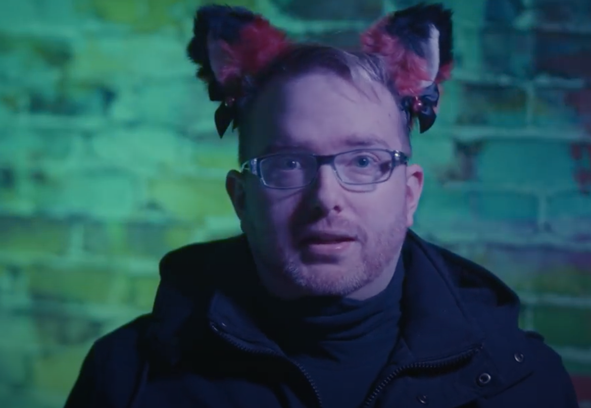

---
redirect_from:
  - "/videos/uidcqnavkpi"

date: 2022-02-10
title: SHIPPING - The Good, The Bad, and the Thirsty
runtime: 1:00:21
status: Finished
aka: !!seq
  - "Shipping: A Nuanced Argument"
  - "NOW KISS (Thumbnail)"
topics: !!seq
links: !!seq
  - "https://archive.org/details/james-somerton-youtube-2023-12-03/20220210+UiDcQnavKPI+SHIPPING+-+The+Good%2C+The+Bad%2C+and+the+Thirsty.webm"
  - "https://archive.org/details/james-somerton-videos-backup/James+Somerton/James+Somerton+-+SHIPPING+-+The+Good%2C+The+Bad%2C+and+the+Thirsty.mp4"
description: "a video essay ostensibly talking about shipping but mostly complaining about how lesbians have it so much better."
notes:
  - dec5-delete
  - odd-linebreaks
  - script-diff
  - w-nick-james

contributors:
  transcription: $cite$from-script
  downloaded: $cite$TerraJRiley
  formatting:
    - $cite$tobicat
    - $cite$tustin2121
  factcheck:
    - $cite$hbomb
    - $cite$tobicat

cite:
  clips: !!map
    eternals: { short: "Eternals (2021)", full: "Feige, K.,Moore, N. (Producers). Zhao, C. (Director). (2021). <em>Eternals</em> [Film]. Marvel Studios." }
    the_lego_movie: { short: "The Lego Movie (2014)", full: "Lin, D., Lee, R. (Producers). (2014). <em>The Lego Movie</em> [Film]. Warner Animation Group, Village Roadshow Pictures, Lego System A/S, Vertigo Entertainment, Lin Pictures." }
    sk8: { short: "SK8 the Infinity (2021)", full: "Miyake, M. (Producer). Utsumi, H. (Director). (2021). <em>SK8 the Infinity</em> [TV series]. Bones Inc." }
    yuri_on_ice: { short: "Yuri on Ice (2016)", full: "Yamamoto, S., Shishido, J. (Directors). (2016). <em>Yuri on Ice</em> [TV series]. MAPPA." }
  other:
    glaad_media: "James cites a GLAAD Media List for his point that just doesn't back up his point."
    acceptance: "Everyone accepts lesbians, James says, though acceptance is a weird bar to try and measure."
    list_of_wlw: "James cites a wikipedia list of lesbians to make his point about lesbians in shipping, but doesn't cite the gay counterpart."
    bury_your_gays: "James talks about the Bury Your Gays trope in a manner that implies he thinks it only applies to gay men?"
  yikes: !!map
    am_i_being_disingenuous: "This speech he gives near the end of the video is so full of yikes and irony in hindsight."
    misgenders: 
      _desc_: "James misgenders several people in this video as women, including"
      casey_mcquiston: "Casey McQuiston (enby)"
      nd_stevenson: "ND Stevenson (trans masc)"
      rebecca_sugar: "Rebecca Sugar (enby)"
    part-four-fake-love: "James spends the entirety of part four of this video (that is, 1/5 of this video's runtime) complaining about women in one way or another." 
  misinformation: !!map
    kawaii: "James pretends to know what the word 'Kawaii' means, when he demonstrably knows nothing about the word, right down to <em>showing the name of a piano brand on screen</em> instead of the word he's ostensibly discussing."
    lesbian_ships: "James claims there's not a lot of non-canonical shipping of female characters. He's wrong."
    call_me_gay: "James outright says that <em>Call Me By Your Name</em> was written by a straight man. This is not true."
    annie_proulx: "James gets some details wrong about Annie Proulx being angry about <em>Brokeback</em> fanfiction."
    bechdel_wallace: "James asserts that the reason there isn't as much lesbian shipping (which already needs a ) is because there's more lesbian representation."
  plagiarized: !!map
---




<compare>
<credits class="desc">

What is shipping? Why do we do it? And what does it mean for LGBT representation?

SUPPORT TELOS HERE  
[link]

Jessie Gender's video  
https://www.youtube.com/watch?v=vxqQwAVEbM8&t=7937s

Thumbnail art by https://twitter.com/ghostlyday?s=21

#VideoEssay #lgbt #anime  
&nbsp;

  
  
  
  
  
  

</credits>
</compare>



<compare>
<james >

I never knew I was into shipping as much as I apparently am until I, well, found out what shipping was. My whole life I’d been shipping characters with one another because, as a gay kid, *how the hell else* was I supposed to have gay characters in anything? The Ryan Murphy-verse was a good two decades away so gay characters in movies and YV were pretty damn rare. Unless they were dying of AIDS or a coded serial killer. 

</james>
<from></from>
</compare>

<compare>
<james >

So instead, my innocent little brain turned elsewhere for gay relationships. Funnily enough, as someone who’s said multiple times over the past couple of years that I was never that big a fan of anime, my first big ships came from<ins>...</ins> anime. Namely Gohan and Trunks from *DragonBall Z* (yes, I know there’s a problematic age difference but there’s also time travel so leave me alone), as well as Heero and Duo, and Trowa and Qautre from *Gundam Wing*. And who can forget my first rivals to boyfriends pairing, Matt and Tai from *Digimon*. 

Never once in any of these series are any of these characters even hinted at being gay. But did I care? Hell no. They were in love, and you were not going to tell my prepubescent brain otherwise. Especially Matt and Tai. That was a ship that could weather any storm. 

</james>
<from></from>
</compare>

<compare>
<james >

It got a lot easier when *Queer as Folk* came on TV and the gay pairings were made obvious. Around the time *Queer as Folk* started airing I also started watching more “adult” media. Deciding wholeheartedly that I was going to go to film school, I started watching the classics. *Gone with the Wind*, *Citizen Kane*, *Whose[sic: Who's] Afraid of Viginia Woolf*, *The Boys in the Sand*. You know, real proper cinema. Not those silly cartoons from Japan. And then after *finishing* film school I spent another decade married to the idea that I was *too* good for anything but the best of cinema (becoming a huge David Fincher stan in the process).

</james>
<from></from>
</compare>

<compare>
<james >

And then, accidentally, I was exposed to the torid[sic: torrid] world of shipping once again. When I, despite not having seen any other MCU movies, went to see *Captain America* on opening night. Because, you know, Chris Evans. 

And I left that theatre absolutely, utterly, convinced that Steve Rogers and Bucky Barnes were in love. It was so clear! Steve flew a plane into an arctic ice-cap instead of being with a woman, but tried everything to save Bucky. It had to be true! It was so obvious. There must be other people on the internet <del>seeing</del><ins>who felt</ins> the same way that I was feeling. And there was. And they’d even seen gay relationships in media I *hadn’t* read into!

</james>
<from></from>
</compare>

<compare>
<james >

Oh my god, you’re right! Sherlock is totally queer! Remus and Sirius? Of course! Sirius, The confirmed bachelor, and Remus, the guy who didnt[sic: didn't] even contemplate being with a girl until Sirius was dead. 

Xena and Gabrielle. How the hell had I never seen that before?! Was I blind?! There were so many examples, and whole mythologies worth of fan fiction, or slash fiction, describing how these couples worked. I even spotted some Matt and Tai stuff. 

So yeah, I found out that shipping was a thing. Never been the same since. 

</james>
<from></from>
</compare>

<compare>
<credits class="opening">

<u>[Titles play intercut with pictures of some of the gay anime pairings discussed, with funky music]</u>

> James Somerton  
Presents

> Written by  
Nick Herrgott  
& James Somerton 

> Produced by  
[Fifteen Patron Names]

> Executive Producers  
[Seven Patron Names]

> Shipping

> A Nuanced Argument

</credits>
</compare>



## Part One: The Truth Untold

<compare>
<james >

One thing that they will not, under any circumstances, teach you in college is that we owe the bulk of humanity’s literature to plagiarism. Heracles was a pan-hellenic[sic: Hellenic] hero who was the focus and topic of plays and poems for the duration of ancient Greece, but also throughout Rome. And then kind of moved into being this point of reference for heroic stories in the Middle Ages of Europe and Byzantium. 

It’s unlikely that whoever was the first to write about Heracles was the only one developing content about the character in their own lifetime. But in ancient cultures, they also didn’t hold the same values about intellectual property as we do now. Because there was no central institution about owning copyright, they did not really believe that one could own a character. Especially when a core component of Heracles is that he is the son of Zeus<del>. Zeus</del>, who was the chief deity of a religion. It would be like Disney making a story about Jesus’s bumbling younger brother, Bob. And then trying to copyright “Jesus” as a character. 

</james>
<from></from>
</compare>

<compare>
<james >

Keep in mind, Disney is the same company that tried to file copyright claims on ‘Odin,’ ‘Loki’ and ‘Thor.’ Because, yes, they have several movies featuring characters of those names who draw influence from the Norse pantheon. However, in copyright law, there would not be a clear way to distinguish the ‘Odin’ in Disney movies from the ‘Odin’ of mythology. In writing, at least. Because Marvel’s Odin has a look. 

But when copyrighting the name itself, that could get messy. Because… Odin is still openly revered in parts of the world — namely Iceland. Norse beliefs are still openly practised, and what happens when you pay homage to a god whose likeness is owned by an American media monopoly? To say nothing of Wagner’s *Ring Cycle* and other prominent media about Norse Mythology. Would Disney own copyright on those characters? 

</james>
<from></from>
</compare>

<compare>
<james >

Also the fact that Marvel’s Odin is based on a comic book character which was created in the 1960s by Stan Lee, &mdash; 

<u>[Correction on screen]: "*& Jack Kirby"</u>

&mdash; who passed away recently. Indicating that… ownership of the comic book Thor… is not necessarily ownership of <ins>the</ins> Movie Thor… Which brings to me a question of… when — or how — *movie* Thor could ever pass into public domain? Will he enter public domain at the same time as Comic book Thor? And like… given that they’re all based on characters who were already in public domain… <u>[blows out cheeks in frustration.]</u>

See — Jack Kirby got around this problem by making all the Eternals’ names slightly different than their modern spellings. 

</james>
<from></from>
<clip >

<ins>Kid: "So Dad said you're the goddess Athena."</ins>

Thena: “<del>It’s just</del> ‘Thena.’ Drop the A.” 

</clip>
<james >

But in the antiquated world, they didn’t even bother with these hang-ups. Using another creator’s creations was seen as a kind of reverence to the original poet, playwright, or bard. In fact, even writing under their name was seen as an homage — for instance, there’s some scholarly debate if the *Odyssey* was written by Homer, or if it was written after his death. 

</james>
<from></from>
</compare>

<compare>
<james >

But the fact that we, in our modern society, do have copyright laws should automatically signal just how natural it seems to us to simply appropriate existing fiction into new fiction. <mark fc=false>Though the phrase is mistakenly associated with Picasso, the phrase <q>‘Good artists create; Great artists steal’</q> seems to be the lynchpin that literary traditions have been built off of.</mark> Every great Greek and Roman play was constructed on a mythological cycle that had existed for centuries prior. *The Divine Comedy* and *Paradise Lost*, were both built off of Christian myth and folklore.

</james>
<comment>


[The phrase is usually said as](https://artofericwayne.com/2017/01/06/good-artists-copy-great-artists-steal-not-so-fast/) "Good artists **copy**; Great artists steal." Steve Jobs attributed it to Picasso, but there is no proof that the artist said it, though he did say, "When there’s anything to steal, I steal." Perhaps the first instance of this saying is from W.H. Davenport Adams' "Imitators and Plagiarists" in 1892, where he states "great poets imitate and improve, whereas small ones steal and spoil." Then in 1920, T.S. Eliot states in "The Sacred Wood: Essays on Poetry and Criticism" the following: 

> "One of the surest of tests is the way in which a poet borrows. Immature poets imitate; mature poets steal; bad poets deface what they take, and good poets make it into something better, or at least something different. The good poet welds his theft into a whole of feeling which is unique, utterly different from that from which it was torn; the bad poet throws it into something which has no cohesion. A good poet will usually borrow from authors remote in time, or alien in language, or diverse in interest.”

<footer><a href="https://artofericwayne.com/2017/01/06/good-artists-copy-great-artists-steal-not-so-fast/">“Good artists copy, great artists steal.” Not so fast.</a> by Eric Wayne</footer>

</comment>
</compare>

<compare>
<james >

So yes… as most of literature exists because it was, as it would be considered now, a kind of fan-fiction — shipping, by extension, is also a valid method of narrative creation. Half of Greek myth is shipping. Pairing off different Gods, Kings, Heroes, and Deities together is the backbone of the mythological cycle. It’s how Gods like Pan, Zagreus, and even Aphrodite have uncertain or conflicting parentage. 

</james>
<from></from>
</compare>

<compare>
<james >

In our society, perhaps more so out of a need to categorise everything and less out of respect, we consider the creator to be the authority on a creation, even after they’re long dead and their creations are used by the masses. As an example: it doesn’t really matter which version of Sherlock Holmes we’re observing, we generally default to Sir Aurther Conan Doyle as the authority on the figure, in a way we do not generally attribute creative licences made by Stephen Moffat as ‘canonical.’ 

</james>
<from></from>
</compare>

<compare>
<james >

So in a classical context, there was little to no friction when using other writers’ characters. In part, because most of the characters worth referencing had been created hundreds if not thousands of years before. But in a modern context, you know. Copyright — for better and for worse. 

<del>I mean,</del> I think there’s a lot of ways that copyright does protect creators, but there are ways that corporations and well-known, fabulously wealthy creators abuse it. 

<u>[Previous sentence said over the Toei Animation logo zooming in to fill the whole screen.]</u>

Given that media awareness has shifted from the classics to contemporary characters, if you want to write about characters that already exist, as the vast majority of writers in history have, these days, you are probably writing about characters that are protected by copyright. Which even though all that usually means is that you can’t make money off of what you’re writing,that really doesn’t seem to deter people. Popular fanfiction websites like Archive of Our Own get a dizzying amount of content every day. If ever there was an argument against people acting exclusively for profit it would be fanfiction. 

</james>
<from></from>
</compare>

<compare>
<james >

One of the most popular forms of which is taking central characters and putting them in romantic entanglements with either characters in the plot with whom they share<del>d</del> good chemistry, or inventing entirely new characters. This is what is referred to as ‘shipping.’ As per a relation-*ship*. These are non-canonical relationships that make up the bulk of fanfiction now, and throughout literature. It can be argued that all fanfiction is, in some way ‘shipping.’ Because fanfiction changes the way in which characters interact with each-other. 

</james>
<from></from>
</compare>

<compare>
<james >

And even though there’s a kind of literary stigma against fanfiction in general, though specifically shipping, there are elements of society that can find a use for it. YOU may not be able to get paid for your ships and fan fiction, but that shouldn’t suggest that there isn’t money to be made off of it <del>somehow</del><ins>somewhere</ins>. It’s just a question of who gets <del>that</del><ins>the</ins> money and how. 

</james>
<from></from>
</compare>



## Part Two: Boy In Luv

<compare>
<james >

Though shipping has its roots in antiquity, there is a somewhat concrete instance for when it shifted into the modern world. And it was actually earlier than most people would expect — Kirk and Spock from the original *Star Trek* series.

</james>
<from></from>
<clip >

<ins>LEGO figure: FRIENDSHIP!!!</ins>

</clip>
<james >

This was a unique instance of shipping for several reasons, though namely the fact that it was not a ship that was done with characters in public domain. This was based around contemporary characters whose personalities and plots were unfolding over three seasons. Fans had something new and tangible to cling on to, with promises of new material to come that would further enrich the fictional romance. And, for those in the 60s and even today, the romantic and/or sexual tension between Kirk and Spock was *palpable*. 

</james>
<from></from>
</compare>

<compare>
<james >

It may not be right to say that it was the first ship in a given fandom. There may have been local book clubs which chose to read into the companionship between Sam and Frodo, for instance. However, *Star Trek* was one of the first fictional properties to host significantly large conventions for the fandom at large. The open-venue atmosphere generated a place to find like-minded niches within the fandom, which, itself, was niche. Finding queer or queer-friendly fans who openly read into latent, perhaps unintentional queerness was easier than it had ever been. 

So in an era before the internet, developing these physical spaces was necessary for developing fan theories and having head-cannon[sic: headcanon] spread throughout the entire fanbase. <mark>Head-cannon[sic: Headcanon], for reference, is an element of the story that, while not confirmed or able to be confirmed by the creator, is a theory, or a story that the majority of a fanbase has accepted.</mark> For more on the Star Trek shipping phenomen [sic: phenomenon] [check out Jessie Gender’s video](https://www.youtube.com/watch?v=vxqQwAVEbM8&t=7937s) linked below. 

</james>
<comment>


A headcanon refers to a noncanonical theory that an individual has about an element of a story, such as the plot, setting, or most often, characters and character relationship. James' definition refers to fanon, which is when a particular headcanon becomes so popular that it is accepted by a large number of people within a fandom.

</comment>
</compare>

<compare>
<james >

So how do we go from fans filling in the blanks in a fictitious social-utopia — to me having very conflicting gay thoughts about a popular anime about skateboarding? One that leans on a shonan[sic: shōnen] aesthetic for extra flavour, but owing most of it’s[sic: its] popularity to multiple ambiguously obvious queer relationships. And a cat boy. *This is the future progressives are giving you.*

</james>
<from></from>
</compare>

<compare>
<james >

*Sk8 The Infinity* is a 2021 Anime directed by Hikoro[sic: Hiroko] Utsumi, the director of similarly queer baited and shipped anime *Free!* and *Banana Fish*. *Sk8* tells the story of Reki, a Japanese teenager obsessed with skateboarding, and Langa, a Japanese Canadian who used to be a championship snowboarder &mdash;

<u>[James accidentally says "skateboarder," the correction is shown on screen.]</u>

&mdash; until the death of his father. The pair meet up and Langa discovers that skateboarding isn’t that different from snowboarding! <ins>(</ins>It actually is but let’s <ins>just</ins> go with it.<ins>)</ins> Together they start attending underground skateboarding tournaments called S, organised by Adam, an embezzling businessman in *Digimon* villain drag. 

</james>
<from></from>
</compare>

<compare>
<james >

In an oddly generous offering of gay ships, *Sk8* serves up not one <del>by</del><ins>but</ins> *three* potential gay pairings for fans to write and create art about. First up we’ve got the main pair Reki and Langa. While it all began at least sort of casually - they were classmates before becoming friends – their relationship eventually grew into some more… close. Something more close — let’s go with close. 

However, fans immediately started seeing a lot of the hints that Reki and Langa might wind up as more than just friends, but this never officially happened, of course, leaving the fans no choice but to ship them. 

</james>
<from></from>
</compare>

<compare>
<james >

Next <del>up</del> we’ve got Joe and Cherry, or as they’re fondly known online: Cherry Blossom, or matchablossom. These two appear to be a real couple in every way, yet they refuse to admit it. 

</james>
<from></from>
<clip >

<ins>Miya: "What's with the parasol?"</ins>

<ins>Joe: "*Precious* doesn't want to get a tan. He's delicate."</ins>

<ins>Miya: "Where are your clothes, bro?"</ins>

<ins>Cherry: "He's charring his chesticles for locals in heat. Such a *thirsty* gorilla."</ins>

</clip>
<james 

It’s beyond easy to read into the idea that these two were once an item, broke up, and now simultaneously love and hate each other. But mostly love. They bicker like a married couple, act as surrogate parents to our younger group of skaters, and have a tumultuous past relationship with Myotismon over here. 

</james>
<from></from>
</compare>

<compare>
<james >

Speaking of Adam. He’s a part of the third ship in the series along with his personal assistant, Tadashi. A pairing the internet has named… [closes eyes] LoveDog. If you’ve seen the show you know why. 

This is… <u>[*mouth pop*]</u> a problematic yet obvious ship. It’s clear that these two have some kind of relationship beyond official duties, but *goddamn it’s abusive!* I’ve already made three videos about abusive gay relationships in media so I’m not going to go into the gritty details <ins>on this one</ins>. But there is some hardcore gaslighting going on here. 

</james>
<from></from>
</compare>

<compare>
<james >

But let’s focus on our main pair. Reki and Langa. Since they’re the whole reason I’m making this video. Throughout the series these two are given multiple moments *scientifically designed* to urge on the potential shippers. Whether it’s Reki teaching Langa how to skateboard in a really cute montage, or Langa’s now notorious “Reki, my love (of skateboarding)” line. <u>[brief fade in to Langa saying the line.]</u> 

As the series progresses Reki becomes more and more a cheerleader of Langa, ever more enthusiastic, even though Langa is much more reserved and shy. Until the final episode when he excitedly jumps into Reki’s arms after winning a race. 

</james>
<from></from>
</compare>

<compare>
<james >

The pair even play out a typical rom-com break up scenario as the show crests into the third act. But don’t worry they get back together. That’s when they create a special fist bump that<ins>&mdash;</ins>, YOU KNOW, if one of them was a girl that damn fist bump woulda been a kiss. It’s their way of kissing. Am I the only one seeing— 

This is also when Langa realises how important their friendship is and tells Reki,

</james>
<from></from>
<clip >

Langa: Let’s do it. I want to skate infinitely with you.

</clip>
<clip >

<u>[Cutaway to James staring blankly as another clip plays behind him.]</u>

Victor (from *Yuri on Ice*): <ins>"</ins>That sounded like a marriage proposal.<ins>"</ins>

</clip>
<james >

<del>So</del> on one hand *Sk8 the Infinity* has a very simple, if not entirely unremarkable plot. It’s a typical rookie-makes-the-big-leagues narrative. You can pretty much assume the broad strokes and outcomes of almost every set-up. It’s the relationships that make it stand out. *Sk8* shines in the grace notes and nuances that build the story. What’s really meant to be entertaining, animation aside, are the colourful characters, sardonic comedy, wild antics, a couple of neurodivergent characters who find a peer group that accepts them (which is one of the more touching elements of the story, actually) and, the adorable boys being boys and doing boy things. Very<del>…</del> heterosexual boy things. 

</james>
<from></from>
<clip >

<u>[Slow pan up on Miya riding a skateboard, with background audio.]</u>

</clip>
<james >

Oh look a catboy. 

And, in spite of what issues with the show that I bring up, my opinion of it remains net-positive… Conditionally. The series doesn’t seem entirely sure whether it wants to conform to rookie-narrative tropes or subvert them. A lot of the time the show wants to push an emotional moment for the sake of driving characters' pathos. But then usually will turn right around and break the in-universe rules about how fast skateboards can go. But this is forgivable because when it comes to this anime, actual skateboarding is ironically one of the last things you’re meant to pay attention to. 

</james>
<from></from>
</compare>

<compare>
<james >

Another difficulty the show tends to have is saying one thing in spoken dialogue, but completely rebutting that message with visuals and plot beats. While on one hand Reki’s personal narrative is partly about him coming to terms with the fact that he doesn’t need to be the best skateboarder. That he has value on and off of the track. On the other hand Reki is given this pep-talk by a character — the owner of a skate shop — who is… basically not in the plot. And then immediately after that, Reki decides he wants to skateboard-race Adam, who, in a prior race, served him a broken arm and a molestation allegory. Trauma which was there to drive interpersonal drama, but then disappeared when it was no longer convenient to the plot. This has some really dodgy subtext when it comes to <ins>the</ins> villains. 

</james>
<from></from>
</compare>

<compare>
<james >

But this — this isn’t that video. This video is about the subtext you’re meant to read into. The shipping. Turns out the shonen anime’s take on <del>the</del> Japanese skateboarding is that everybody’s gay. 

</james>
<clip >

Adam: HEY BITCHES, <ins>AND</ins> BROS, AND NONBINARY HOES.

</clip>
<james 

Like… if you’re going to make the villain woke and awesome at the same time, can we ease off the assault and battery against minors? And the… creepy obsession he has with teenagers? I really wanted to LIKE him but like… it’s just so uncomfortable. 

</james>
<from></from>
</compare>

<compare>
<james >

But right, the non-problematic couple. 

There’s an entire industry of buzz built around the ways in which these homo-ambiguous teenagers are almost a gay couple. Articles on websites as disparate as [CBR.com](https://www.cbr.com/sk8-the-infinity-gay-romance-anime/), [Kotoku](https://kotaku.com/the-11-best-anime-of-2021-1848196754/slides/3)[sic: Kotaku], and The Advocate. And the fervour of this community on twitter, reddit, and fan-discords may very well be a pivotal reason why this show has risen to the kind of popularity it has. There’s even a two night stage show for god’s sake. That I really wanna see. COVID, can you go away I <del>really</del> wanna see that. 

</james>
<from></from>
</compare>

<compare>
<james >

This media knows you’re going to ship these characters… in fact, it seems to be expected. We, the audience, are expected to read into the suggested ship, to draw fan art, to write fan fiction, to engage in an entire constructed community around how these two characters would interact if the ship was cannon. And how<del>…</del> do we feel about that? 

</james>
<from></from>
</compare>



## Part Three: Pied Piper

<compare>
<james >

Why couldn’t we just get the gay sk8er boys? Why couldn’t we get the gay sk8er dads? It seems clear that not only does the audience want this, but that the studio knows this and wants to play to that audience. If everyone wants it… why hold back? What’s the rationale? What’s the reason? 

It seems that the queerness is being deliberately withheald[sic: withheld] where it would otherwise fit into the plot. And if this is deliberate, then we can gauge the ethical merits of the situation. Really… *Sk8* doesn’t seem like the kind of series that would spurr[sic: spur] on an hour long discussion about ethics of representation. But as much as the writing does seem to be on the wall about gay coupling in this show, it is — once again — a big load of ‘almost’ representation. 

And the show goes pretty far to ‘almost’ show gay romance. But it’s that last <ins>like</ins> ten yards that we’re not crossing for some reason. So what’s stopping media like this from making the final step? 

</james>
<from></from>
</compare>

<compare>
<james >

My theory is that shipping is a component of audience engagement that is filling in for something that mass media has lost: merchandising. Seeing <ins>as</ins> how merchandising and boys’ love(or more commonly known as BL because it sounds less creepy) are both things that saw great advancement within Japanese media in the 1990s, it’s probably best to start there. There had been times when Anime had broken into American Airwaves, like *Astro Boy*, *Speed Racer*, Simba (i mean *Kimba*), and *Sailor Moon*. And anime from the 80s like *Akira* have been incredibly influential in modern Hollywood. 

</james>
<from></from>
</compare>

<compare>
<james >

However, among consumer masses, nothing hit quite like *Pokémon*. It used to be that cartoons made for kids were created solely as 20 minute commercials to sell you toys. Like with the *Transformers* series. For a couple years *Transformers* dominated toy shelves and Television. It was *Pokémon* before *Pokémon*. 

But *Pokémon*… has been around for twenty years. So has Transformers — longer, actually — but *Pokémon* never went away. *Pokémon* was a game-changer, not only because it was an anime tie-in to a video game that was already popular, but it was incredibly toyetic. And being able to make toys from characters, creatures, and objects in a piece of visual media is something that American companies had proven to be cash cows before. Look at Star Wars. With this merchandising angle, a producer can double or even quintuple income by constructing an ongoing series in a way where the plot is intrinsically tied to something that can very easily be made into a toy. Especially when you have a way to refresh <del>the</del><ins>that</ins> toy line every few years. 

But where *Pokémon* was more successful... is how characters were so simple and so recognizable that you can stick them on a T-shirt and everyone will know its[sic: it's] Pikachu. Whereas, to the layman, Starscream and Megatron might not be so easy to tell apart in robot form. There’s another problematic ship for you. 

</james>
<from></from>
</compare>

<compare>
<james span=4  id="kawaii">

When it comes to *Pokémon*, enter the Japanese word and concept — kawaii. 

![[On screen, the word "kawai" appears, with the corresponding katakana (カワイ) beneath.]](../media/kawai.png)

<mark fc=false>Contrary to popular belief, kawaii does not mean ‘cute.’ It means something much deeper. When something is kawaii, it means that it cannot not be cute. It means that this idol has been reduced to a state of existence where the ONLY opinion that can exist about it is that it’s cute.</mark> 

</james>
<comment>


On screen, the word "kawai" appears, with the corresponding katakana (カワイ) beneath. However, "Kawai" is a Japanese piano brand; the word "kawaii" is spelled differently in katakana (カワイイ), and is more commonly spelled in hiragana (かわいい) or occasionally kanji (可愛い).

</comment>
<comment>


Yeah no kawaii literally just means “cute”. It ain't that deep.

It’s like anglos assigning some Speshul Meaning to a word like 仲間 which can literally mean anything within the range of ally and friend. It’s not some Speshul Deep Friend Connection. What the fuck would 友達 exist for?

Like in the case of kawaii it only gained “significance” when the term was incorporated into the aesthetics of a Japanese fashion subculture that came out in the 1980’s. And it was only significant because the style was gaudy to the point of not being treated as a “respectable” form of dress for women in Japan because of all the frills. So it was countercultural against the standardized cultural norm for Japanese women in fashion. And it’s why it went onto have a massive influence on Harajuku fashion.

</comment>
<comment>


*Technically*, 可愛い/カワイイ/kawaii can [also refer to something pretty or charming despite its flaws](https://kotobank.jp/word/可愛い-468533), fitting Somerton's one interpretation, but essentially, it still comes down to meaning "cute."

</comment>
<comment>


Somerton is hyperbolizing (I suspect he's lifted the concept from some pop linguistics article) but the core of it isn't outright wrong.

Basically the meaning lies somewhere between lovable and cute (leaning more towards cute these days, but the former is still important). In [the kotobank entry](https://kotobank.jp/word/可愛い-468533), for example, the definition it leads with is 愛情をもって大事にしてやりたい気持ちを覚える (= something that makes you want to love and cherish it), and the next sentence goes even farther: 愛すべきである (= something that should be loved).

That there is an obligation: the -べきである structure rarely comes up in definitions outside of proverbs ("one must know one's enemy" or something). So from there you can see how someone could extrapolate that to "the essential substance is cuteness" even though all it's really saying is that かわいい ["kawaii"] has a stronger emphasis on the relationship between an object and the observer than "cute" does in english. The actual problem with his argument is that かわいい can be used to describe a lot of things that sound weird if you strictly translate it as "cute" (you can describe a river as かわいい, but that doesn't mean the river is the platonic ideal of cuteness).

And tangentially かわいい quite famously doesn't take the hearsay form. Most adjectives you can add a -そう to the stem to say something "seems/looks" a certain way, but かわいそう comes from an otherwise obsolete homonym, so if you try to say someone is cute-looking with かわいそう you've instead called them a miserable wretch (this is how you get the argument that since cuteness is not a quality that can be observed without being ungrammatical it must be an innate characteristic). There's also the -がる suffix, which means "to feel an emotion in a noticeable way", and in the case of かわいがる it doesn't mean "to be cutesy" but instead "to dote on". and that only makes sense from the "something that makes you want to love it" definition.

<footer>I have added the highlighting to make it easier for us monolingual western plebs (ie, me) to spot the hiragana affixes discussed. </footer>

</comment>
</compare>

<compare>
<james >

*Pokémon* is a prime example, specifically with mascot characters like Pikachu, Bulbasaur, Eevee — and nearly all first-stage evolutions. But the example that *typifies* this process is Hello Kitty. Hello Kitty, as a brand, is fascinating, but I won’t get into it here. Hold on, I need my cat ears— 

<u>[Sudden cut to James with black and orange cat ears on his head, complete with bells as sort of earrings on them.]</u>

Hello Kitty didn’t even have a piece of media it was attached to right away, but this little cartoon kitty seemed to be like something you would see in a TV special. But it wasn’t until the brand was already a national sensation in Japan that there was any visual media. The process that makes Hello Kitty kawaii is an aesthetic exercise in minimalism and abstractism. You take a cat, and you gradually reduce features until you have a bare minimum amount of details that allow you to recognize <ins>that</ins> this as a cat. Or Keroppi as a frog. Et cetera. With so little features, this is not just a cat. Your imagination makes you pack-bond with the idea of a cat. 

</james>
<comment>


</comment>
</compare>

<compare>
<james >

But when it comes to using toyetics to sell a given brand… well, *Pokémon* did it so well that nothing else has managed to come close. Even Disney. And *Pokémon* has only been around half as long as Hello Kitty. It’s still not clear — even to cultural analysts — why or how *Pokémon* completely dominated culture [to the point of traumatising Burger King employees.](https://www.reddit.com/r/nostalgia/comments/nn0xa0/golden_pokemon_cards_from_burger_king/) Things were ‘cute’ before *Pokémon*. Things have been ‘cute’ after *Pokémon*. So it's not really clear why it stands out. 

But as *Pokémon* was first and foremost a video game, it managed to retain its market relevance as a video game when kids began making the christmas-list switch from action figures to games. It’s difficult to make a cartoon or anime with a strong merchandise tie-in because video games occupy so much of the childrens’ market now. *Pokémon* endured because there was a monopoly. It’s almost not fair for any franchise to assess its success if *Pokémon* is seen as the standard. 

We’re not here to talk about *Pokémon* — an anime with actually *visible* queer representation. 

<u>[On screen, James shows a few clips of Ash and Goh interacting in the *Pokemon* anime, with the text "Don't @ me" superimposed.]</u>

We’re here to talk about how *Pokémon*’s industry dominance has made it difficult for new media to focus their branding strategy around merchandising visually-distinct elements. 

</james>
<from></from>
</compare>

<compare>
<james >

So for lack of up-front merchandisable effigies, how can you really make your media stick? Well, that’s where shipping ties in… 

I’m sure more than a few marketing directors noticed that there was a pattern of how certain media developed cult followings. Sometimes a TV series or movie will manage to stand the test of time specifically because it has a strong gay or gay-friendly following. And this following is full of shippers. And when your audience is taking to social media to discuss non-canonical relationship dynamics, you can say that they’re pretty engaged. 

</james>
<from></from>
</compare>

<compare>
<james >

As online fan communities dedicated themselves to filling in the blanks with fanfiction and fan art, networks across Japan and America realised they didn’t need a line of toys to tie-in to their franchise. An engaged audience is one that keeps tuning in, which means a longer-running show and increased ad revenue. And apparently a stage production. 

Branding executives said: “hold on a second… let’s lean into it and see what happens?” Queer… became the new kawaii. And maybe that was even better because there’s a whole lot less commitment involved in putting two young men in suggestively romantic situations than hiring an entire design team to create and focus-group a number of mascot figures in the hopes that just one of them would break through into cultural permeance. 

</james>
<from></from>
</compare>

<compare>
<james >

Similar to how kawaii functions by minimalizing and removing features, so does the process of gay-baiting. You take what is ostensibly a romance between two people. Whether it’s a gender-swap straight romance dynamic, or two bros who are too close to function. And then you remove explicitly romantic language until there is plausible deniability. What remains in the plot is a collection of romantic visual cues, a very hot, intense, dedication, and devoted personal investment between two characters. 

</james>
<from></from>
</compare>

<compare>
<james >

Now, ships can take many forms — even in *Sk8*. You’ve got the strong, pining commitment, but you also have the more distant, nobody-else-but-you, friend-<ins>to-</ins>rivals who rush to each other's side when the other gets physically assaulted in a skateboard race… which everyone seems perfectly fine with, by the way. You also have the abusive relationship with <ins>the</ins> suggested ‘he can change’ tenderness. And you even have an alluded bitter friends-to-enemies scenario. With a catboy. 

</james>
<from></from>
</compare>

<compare>
<james >

It’s hard to really gauge what exact qualities a pairing needs to have to be shippable, because everyone has their preferred ship dynamic and honestly… I think at this point people will ship any two-or-more characters for any reason. Just look at *Avatar the Last Airbender* and *Legend of Kora[sic: Korra]*. There really aren’t any limits. What two characters do need to have to get shipped is just literally any kind of chemistry. But this chemistry needs to be BIG. 

And of course I’m not saying ‘modern shipping bad.’ There are plenty of examples in media where you have two characters who are meant to be just friends. Believe it or not, there is still a demand for straight romances and creators willing to depict them. I know! I know… 

As a result, there are a lot of instances where a creator makes a property with no intended queer reading, for which there is an audience who fully enjoys shipping two men in the plot. 

</james>
<from></from>
</compare>

<compare>
<james >

The thing about *Sk8* is that there’s a lot in here that’s genuinely entertaining. Great comedic timing, coupled with a carnivalesque approach to mixing skateboard culture, shonen melodrama, and good ol’ camp. That said. Would I have watched it if it wasn’t for people recommending it to me because of the queer references? … No. No… p… probably would not. 

When it comes to media I do consume, I just gravitate towards gay stuff. Sorry. I spent the first 25 years of my life being dominated by heterosexual characters. And now that I’m making the decision to consume media about characters with whom I can identity[sic: identify]… …I’m still consuming straight meida[sic: media]. 

Because in spite of the fact that *Sk8* goes out of it’s[sic: its] way to imply that multiple characters are in queer pairings, it also goes out of it’s[sic: its] way to ‘confirm’ heterosexuality of one half of each couple. Either Reki’s random fawning over the girl in one episode for five minutes, or Joe’s chronic boob’d arm candy. 

</james>
<from></from>
</compare>

<compare>
<james >

Funnily — the implicit ship that there isn’t any heterosexuality confirmation is… the villain. The villain who openly admits to ‘loving’ underage skater-boys. Which happens to be a recurring pattern within… media.. in general. For decades! *The gay predator: still at large in 2022.* 

Even if the heroes are implied to be gay, the villain has the most pluasibly[sic: plausibly] confirmed queerness. I’m not willing to say that this is carrying deliberate homophobic subtextual messaging, though there is a role that bigotry has in modern queer baiting. But when it comes to Adam from *Sk8* or Gozine from *Banana Fish*, their queerness, is much more explicit than that of our more understated heroes. 

</james>
<from></from>
</compare>

<compare>
<james >

Compare and contrast to *Yuri!!! On ICE*. We’re already talking about Anime, might as well jump in. And yes, I’ve already talked about it, but that shouldn’t suggest I don’t have evolving feelings on it. I praised *Yuri on Ice* for it’s[sic: its] subtle representation of queerness, and I thought it was a greater asset than it was a detractor. Could it have used a kiss…? Without <del>the</del><ins>an</ins> arm blocking the way? Yes. But *Yuri on Ice* was also missing a lot of the staples of the other gay-baits. Mainly, that there was no third-wheel heterosexual love intrest. And of characters who could be considered antagonists, Yurio softens as he begins to come into his budding, if only implied, attraction to Otabek. (Though how implied is this REALLY?) And when it comes to JJ. Well, he’s straight, they can have him. 

</james>
<from></from>
</compare>

<compare>
<james >

And I’m not completely absolving *Yuri On Ice* for concealing queerness, but it does seem like I’m pointing out that there are many ways that queer-baiting can happen. Bear in mind that there is not as much ‘shipping’ of Yuri and Victor as there is with Reki and Langa. By all means, it’s there. But as someone who is not particularly involved in any shipping communities, there is not nearly as much spill-over for *Yuri on Ice* as there is for *Sk8*. 

<u>[Dutch angle]:</u>

It’s also interesting that the 2016 *Yuri on Ice* shippers went over to *Killing Stalking*, *but we won’t talk about that.* 

</james>
<from></from>
</compare>

<compare>
<james >

And this isn’t to speak of the popularity of either series, because years after the fact… and *Yuri on Ice* still seems to retain it’s[sic: its] popularity along side *Sk8*, which came out just this past year. A distinction can be made where *Yuri on Ice*, while being much more understated, seems to want to imply that these characters ARE in a relationship. Whereas *Sk8* is going out of it’s[sic: its] way to imply that it’s[sic: its] characters COULD BE in a relationship. 

</james>
<from></from>
</compare>

<compare>
<james >

And if we’re interested in getting into the nuance, there is a difference between an implication and a suggestion. As a matter of fact, I can sort queer-*implied* character pairings into four groups. 

Of the ones I find tolerable… We have <q>Accidental Ships</q> <ins>which</ins> are when you have a creator who is making no effort to really depict queerness. They’re just making some art, and their audience takes it upon themselves to read into the chemistry between two given characters. Prime example would be Sokka and Zuko from *Avatar the Last Air Bender[sic: Airbender]*. 

<q>Subversive Ships</q> are when a creator actively wants to depict queer characters, but is restricted either by network morality clauses, or national censorship laws. I would include *Yuri On Ice*, as per the ongoing battle to depict the core pairing openly, but also *<ins>The</ins> Legend of Korra*’s Korrasami. As the creators wanted an out, bisexual female couple but had to settle for some hand holding in the very last scene of the very last episode. At least they got to kiss in the comic. 

</james>
<from></from>
</compare>

<compare>
<james >

And of the shipping groups that piss me off… <q>Oblivious Ships</q> don’t annoy me so much but they still bother me. This is when you have creators who include a degree of platonic yearning where it’s not clear how they overlooked ‘gay’ as an option. A sub-sect of oblivious shipping is when you have a creative team that is either so misogynistic or so hyper-masculine that they procedurally eliminate all female characters, or make the women in the story so incredibly boring, that there is no one else to ship but the boys. Think of *Supernatural*. 

And then, we have my least-favourite category — <q>Industrial Ship</q>ping. This is the one I’ve been raising red flags over. An act of soulless, corporate infringement on the identity-centric needs for visible representation. This is what I would refer to as ‘traditional gay baiting.’ And I’ve made multiple whole videos about this. But, for a prime example, see *Teen Wolf*. I consider this malicious enough that it’s a pretty serious accusation to bring up — even when it’s about media that I do like. But am I willing to say that this is what’s going on in *Sk8*? 

</james>
<from></from>
</compare>

<compare>
<james >

If it’s a deliberate branding tactic, then we have to consider who they are marketing to. And just like the largest consumer base of BL in television, anime, manga, and manhua are women, we can extrapolate that they would also be the most significant consumers of gay-baited content. Which isn’t a bad thing in and of itself. There are more women than gay men in general, so the fact that they occupy a larger section of the market is<ins>...</ins> *probably* something we can just take for granted. And similarly, straight women are also the largest group of creators who choose to depict gay men. But if the suppliers of gay media are straight women… and the audience of gay media are straight women… what about gay men? 

</james>
<from></from>
</compare>



## Part Four: Fake Love

<compare>
<james >

This whole topic of shipping is a sticky situation, isn’t it? Not just because it COULD be queer baiting, but because even the intentional ships aren’t meant for a gay audience. <mark yikes>In most cases, they’re meant for a straight female audience. Hell, a very good portion of gay media that isn’t baited is really meant for a female audience.  And a lot of it is even written by women.</mark> 

Just going over some of the things I’ve covered in past videos: *Killing Stalking*, written by a woman. *Painter of the Night*, written by a woman. *Yuri on Ice*, written by a woman. *Banana Fish*, written by a woman. *The Untamed*, based on the books written by a woman. 

</james>
<from></from>
</compare>

<compare>
<james >

I realise all of those examples come from Asian media, but this is not uniquely an Asian phenomenon. Many, in fact most, of the gay media that manages to reach a mainstream audience in the west is also <mark yikes>written by women</mark>. *Brokeback Mountain* certainly comes to mind. 

Gay Young Adult novels have become pretty popular in recent years, but the biggest crossover hits are almost exclusively written by women. *Simon VS The Homosapien[sic: Homo Sapiens] Agenda*, also known as *Love, Simon* by Becki Albertali[sic: Becky Albertalli]. 

<mark stat:id="y-misgendering" fc=false>*Red, White and Royal Blue* by Casey McQuiston.</mark> 

The *Simon Snow* novels by Rainbow Rowell, which are actually high concept *Harry Potter* fanfiction where Harry and Draco get together in the end. Though in the *Simon Snow* books the Harry analogue, Simon, has dragon wings, and the Draco analogue, Baz, is a vampire. 

</james>
<comment id="casey_mcquiston">


Casey McQuiston is non-binary and they have openly identified as such since the end of 2020.

</comment>
</compare>

<compare>
<james >

<mark yikes></mark>Now, I’m not saying that women shouldn’t write gay characters. I’ve read these books and I’ve really enjoyed them. Look. <u>[Holds up stack of physical books.]</u> I’ve got them right here. 

But it is<del>…</del> interesting that the biggest gay books to hit it really big these past years have been written by women and not gay men. Including bestsellers like *The Song of Achilles*, <u>[Holds that up too]</u> which came out a decade ago, when I first read it, but recently became a mega hit when it was discovered by Book-Tock[sic: BookTok]. 

With the exception of books by Adam Silvera, you’d be hard pressed to find gay books that have gone mainstream. And it’s not like they don’t exist. 

</james>
<from></from>
</compare>

<compare>
<james >

<u>[Panning across a bookshelf of physical books.]</u>

Look at this. Look at this shelf. All of its[sic: it's] gay. I’ve read them all and most of them are really good. Some of them are damn brilliant.

<mark yikes>But I ask, again, why is it that the majority of readers, let alone the general public, would probably only recognize the books written by female authors.</mark> Even in the olden times, books like *The Frontrunner[sic: The Front Runner]* by Patricia Nell Warren published in 1974, or *The Persian Boy* by Mary Renault published in 1972. Gay books, written about gay men, written by women. 

</james>
<from></from>
</compare>

<compare>
<james span=2  id="rebecca_sugar">

So why don’t gay men get to represent themselves in media? At least media that’s widely accepted by the mainstream? <mark fc=false>Queer women get to represent themselves. At least sometimes. Look at animated hits like *Stephen[sic: Steven] Universe*, or *She-Ra and the Princesses of Power*.</mark>

</james>
<comment id="nd_stevenson">


This approach to female queers reaches a territory where he doesn't even accept other people's identities if he has a bone to pick. In one video while trying to argue queer women have it better than men in Hollywood, he misgenders two show runners. ND Stevenson and Rebecca Sugar are trans masculine and non-binary respectively, but for the purposes of James' point, they count as women.

<u>[The screen displays a photo of ND Stevenson (he/him) and Rebecca Sugar (they/them), before superimposing the word "woman" in red over both of the photos.]</u>

</comment>
<comment>


Also, both creators identified as such well before this video came out, so that's not an excuse either.

</comment>
</compare>

<compare>
<james >

<mark fc=false>In fact we don’t really see a whole lot of non-canonical shipping among female characters <ins>at all</ins>.</mark> With the aforementioned gigantic exception of Xena and Gabrielle. And the ship that actually became canon, Korrasammi. <mark yikes></mark>

</james>
<comment id="lesbian_ships">


Not mentioned: Kara Danvers and Lena Luthor from *Supergirl*, Emma Swan and Regina Mills from *Once Upon a Time*, pretty much every character in *My Little Pony: Friendship is Magic*, Robin Buckley and Nancy Wheeler in *Stranger Things*, a whole bunch of pairings, some of which became canon, in *Steven Universe* and *She-Ra and the Princesses of Power*, many ships in *RWBY* including the eventually canon Blake Belladonna and Yang Xiao Long, and many, many more.

</comment>
</compare>

<compare>
<james >

But media has been much more accepting of out lesbian characters in recent years. *Not always, for sure.* Gay men dominated LGBT representation in media for a long time. Specifically white gay men. <mark fc>But in recent years, producers, especially of television, have realized that lesbian characters are the perfect way for them to get points on the annual GLAAD Media List for representation. </mark>

</james>
<comment id="glaad_media">


When this video was published, [the latest GLAAD "Where We Are On TV" was the 2020-2021 report](https://glaad.org/whereweareontv20). In this report, gay men made up a plurality of queer representation in scripted media - 134 out of 360 LGBTQ characters (37%). By comparison, lesbians made up 29%, bisexual women made up 18%, and bisexual men made up 9% of characters. (The remaining 7% were trans characters who were straight or of unknown sexuality, plus two nonbinary characters and one asexual character.) Gay men have always made up a majority or plurality of representation ever since the first GLAAD report, though representation of other groups has greatly increased over the years. 

</comment>
</compare>

<compare>
<james >

Straight men love lesbians, but usually only the ones who are hyper sexualized, straight women, for the most part, are pretty accepting of lesbians, and the assumption is that everyone on the <mark yikes>LGBTQIAPA… D…</mark> 2S+... spectrum will be accepting of them as well. 

</james>
<comment id="acceptance">


It's difficult to tell differences in acceptance between gay men and lesbians, because most surveys lump them into one group. [This article from 1998](https://www.jstor.org/stable/3813671) found that heterosexual men view gay men more negatively than lesbians. Heterosexual women viewed both gay men and lesbians less negatively than the heterosexual men, but there was no difference in how they viewed the two groups, except on the "contact" subscale, where heterosexual women viewed lesbians more negatively than gay men (i.e., they were less likely to want to be friends with lesbians than friends with gay men.) 

[A 1999 article](https://www.jstor.org/stable/3078695) found similar results, as did [a 2012 study](https://link.springer.com/article/10.1007/s11199-011-0110-6#Tab1) and [a 2021 meta-analysis of many studies](https://psycnet.apa.org/record/2022-00905-001). So, straight men don't "love" lesbians even if they generally view them slightly better than they view gay men, and straight women aren't any more accepting of lesbians than they are of gay men. As for how they view gay men and lesbians specifically in the media? Hard to say, though theoretically it would follow the same pattern.

</comment>
</compare>

<compare>
<james >

Look at this list. This is a pretty comprehensive list of lesbian, or at least women who love women, representation on TV. From shows as diverse as *Hannibal*, *Glee*, *All My Children*, *Orange is the New Black*, *Killing Eve*, *Nancy Drew*, and *Doctor Who*. 

</james>
<comment id="list_of_wlw">


The list that James views on screen is the article ["List of lesbian characters in television"](https://en.wikipedia.org/w/index.php?title=List_of_lesbian_characters_in_television&oldid=1070061549) from Wikipedia, with a yellow filter for some reason. The table is 545 rows long. There is another article, ["List of gay characters in television,"](https://en.wikipedia.org/w/index.php?title=List_of_gay_characters_in_television&oldid=1066535641) which has 619 rows. 

Not to mention, this does not account for how prominent the character actually is in the show, if they died or were written off, etc. 

Also, *Killing Eve* is not on this list, as far as I can tell, at any point in time. It is on the ["List of bisexual characters in television"](https://en.wikipedia.org/w/index.php?title=List_of_bisexual_characters_in_television&oldid=1069946762) (341 rows, for those counting).

</comment>
</compare>

<compare>
<james >

Granted, many of these characters are written by straight male writers, so there is definitely an element of lesbian fetishization to be accounted for. But a whole lot of them are written by lesbian or bisexual women. Which allows the characters to experience a range of storylines, many of which *don’t* involve their lesbianism at all. Allowing many of them to have some kind of a happy ending. <mark fc=false>Which explains why there isn’t as much lesbian shipping as there is gay shipping. There doesn’t appear to be as much need for it.</mark> 

</james>
<comment id="bechdel_wallace">


A far better explanation would be that there are fewer well-developed female characters, fewer female main characters, and especially, fewer interactions between female characters. [Ever heard of The Bechdel-Wallace Test?](https://dykestowatchoutfor.com/the-rule/) It's more difficult for a "lesbian" ship to happen, simply because writers largely do not meaningfully develop the relationships between female characters. Even for pieces of media that do pass the Bechdel-Wallace Test, often the conversations between women are brief or insubstantial, or the women are related or of vastly different ages, or any other number of variables that would discourage shipping. And I seriously doubt that there is so much "good" lesbian representation out there that there would not be "as much need" for lesbian shipping.

</comment>
</compare>

<compare>
<james >

Where as a lot of the highest profile representations of gay men in media (*Brokeback Mountain*, *Philadelphia*, *Milk*) certainly do NOT have happy endings. Nothing of the sort. This is where the Bury your Gays trope came from. Which forces gay people, and people who want to see happy gay relationships (oddly enough, women) to create imaginary ones with characters who are not actually confirmed to be gay. 

</james>
<comment id="bury_your_gays">

The "Bury Your Gays" trope very much applies to women in queer relationships as well. In fact, [queer women in television rarely get happy endings](https://www.autostraddle.com/autostraddles-ultimate-infographic-guide-to-dead-lesbian-tv-characters-332920/). [The year 2016 in particular was infamous for having many lesbian characters killed off on television, including "high profile" main characters like Lexa from *The 100*, Denise from *The Walking Dead*, and Nora and Mary Louise from *The Vampire Diaries*.](https://www.vanityfair.com/hollywood/2016/11/tv-lgbtq-representation-glaad-report-dead-lesbian-syndrome) [Here's a list of all the dead queer women in television.](https://www.autostraddle.com/all-65-dead-lesbian-and-bisexual-characters-on-tv-and-how-they-died-312315/) Including characters from half of the television series James mentioned as representing lesbians: *Orange is the New Black*, *Killing Eve*, *All My Children*, and *Doctor Who*. [For some balance, all the happy endings for television lesbians as well.](https://www.autostraddle.com/all-26-lesbian-and-bisexual-tv-characters-who-got-happy-endings-331601/)

</comment>
</compare>

<compare>
<james >

And so ships are built. Whether they’re pretty understandable, like with Steve and Bucky, Kirk and Spock, Sokka and Zuko, Aang and Zuko… hell, Kitara[sic: Katara] and Zuko, Toph and Zuko. Everyone and Zuko. 

Oh, and one lesbian ship that did happen and I was 100% on board for, Yara and Daenerys from Game of Thrones. Should have happened. Should have been canon. Would have been amazing. And maybe if Dany had been banging a ship captain she wouldn't have forgotten about the iron fleet. <u>[clicks tongue]</u> Anyway. 

</james>
<from></from>
</compare>

<compare>
<james >

Not all ships are all that obvious though. Many times there’s not a hint of evidence but people want the relationship to be a thing anyway, like my own personal ship of James and Butch from the *Pokémon* anime. Who are *obviously* bitter exes. Or Rachel and Quinn from *Glee*. Magneto and Professor X. Cap and Ironman. Spiderman and Venom. There’s not really any textual, or subtextual evidence that these pairings could ever actually be a thing, but since we need to create ships anyway, why not go the whole way and make some up out of whole cloth? 

</james>
<from></from>
<james >

For instance, in my point of view anyway, there’s a few pairings that I personally ship in the works of <del>J\*K R\*W\*L\*I\*N\*G</del><ins>[bleep]</ins>. Sirius Black and Remus Lupin are obvious candidates. As well as Albus Potter and Scorpis Malfoy in the broadway play, *Cursed Child*. [Which, apparently, has <del>kind of</del> been confirmed now that the play has been condensed into a one night thing.](https://lorriekim.com/immediate-thoughts-on-abridged-harry-potter-and-the-cursed-child/) I cannot confirm myself, since I havent[sic: haven't] seen it with my own eyes, but my broadway gays have told me this. 

</james>
<comment>


The relevant passage about the Cursed Child gay confirmation, for posterity (since it's one of my favorite ships, don't @ me).

> ### [Yes, it’s gayer](https://lorriekim.com/immediate-thoughts-on-abridged-harry-potter-and-the-cursed-child/)
> This version ships Albus/Scorpius, although it stops just short of saying “gay.”  There’s just enough room for a (weak) argument from someone who is really invested in reading these boys as not romantically involved.  But the burden of proof will be on them.
> 
> When Delphi controls Albus by torturing Scorpius, in the original script, she notes that Albus’s weakness is “friendship.”  In this version, she says “love,” and she points to Scorpius as she says it.
> 
> In the final scene at Cedric’s grave, there’s a new conversation in which Albus tells Harry that Scorpius is the most important person in his life and might always be.  Harry says he is glad of that and likes Scorpius.  In manner and mood, the actors played it completely as a teen and parent gay-acceptance scene.
> 
> Most tellingly, this version has removed any reference to Scorpius or Albus possibly being attracted to any girl or woman.  When Scorpius talks to Rose at the end, he doesn’t ask her out; he asks her to be friends.  He tells Albus that Rose’s pity will be the foundation of their new “palace of harmony.”  In the original script, he called it a “palace of love,” unconvincingly.  Albus is not portrayed as attracted to Delphi.  She refers to Scorpius as Albus’s [significant pause] “…friend.”

</comment>
<james >

And of course the original ship to come out of <del>J\*K R\*W\*L\*I\*N\*G</del><ins>[bleep]</ins>’s work, Harry and Draco themselves. Now I never understood this, personally. I never felt any romantic tension between the two of them but apparently everyone else on the internet did. So much so that the fan-fiction fervour that arose online actually sparked a few producers to insert queer baiting into the text of their media on purpose to bring in fans. Such as with *Teen Wolf* and *Sherlock*. 

</james>
<from></from>
</compare>

<compare>
<james >

Fans have written, literally, billions of words about these ships online. Whole libraries full of stories. All of this work to try and get some gay male couples to have a happy ending. And even this fan fiction, for the most part, is written by women. Gay men, for sure, contribute, but the vast majority of these fan-written works are written by women. Straight women, and lesbians funnily enough.

And some of it goes very mainstream. <mark fc=false>Like the *Blood Right*[sic: *Bloodright*] book series, which started its life as <ins>a</ins> Finn/Poe fan fiction before being redeveloped and picked up by a publisher.</mark> 

</james>
<comment>


The *Bloodright* trilogy, though heavily influenced by *Star Wars*, [was never published as fanfiction, at least according to its author.](https://www.themarysue.com/emily-skrutskie-bonds-of-brass/)

</comment>
</compare>

<compare>
<james >

And again, I don’t want to say women shouldn’t write gay characters. The kawaii version of gayness created by these women has gone a long way to creating more acceptance of queer people, mainly queer men, among straight women. But sometimes it gets kind of<del>…</del> creepy. 

After I released the *Killing Stalking* video you wouldn’t believe the amount of (mostly) straight women who told me they loved *Killing Stalking* because it let them explore extreme kinks without the associated trauma of a woman being involved. Which is just… no. Don’t do that. Do not use gay men as experiments. In real life or fiction. We’re not marionettes to play with for your amusement. Especially when something like *Killing Stalking* becomes a huge success and media producers might look and say “Ah. So this is how we should portray the gays.” 

</james>
<from></from>
</compare>

<compare>
<james >

Gay readers seem to love messy gay characters. Gay readers even love problematic gay characters. I sure do — I <del>ship</del><ins>love</ins> Hannibal and Will! Where the line is drawn is difficult to nail down though. But if we — gay men, women, lesbians, trans writers, and even straight men — are going to exist in a community of writers and content creators without gatekeepers, we need to be able to recognize how certain identities would like to be *respected*. And while there aren’t any hard rules about this, the best way to pick up the guidelines are to listen to what these people have to say about themselves. 

</james>
<from></from>
</compare>



## Part Five: Life Goes On

<compare>
<james >

I realize this is heavily focused around the psychological condition of gay men. Who are, admittedly, probably<ins>, definitely</ins> the most privileged of the whole community. However — my concern comes from the development of a bunch of baby gays who are coming of age now and in the future. With them in mind, they are going to have to fight against a lot of patriarchal or even toxic masculinity. 

<del>(Insert Sean Penn quote)</del>  
<u>[Flashed on screen: Fox News headline]: "Sean Penn says American men have become 'feminized,' blames 'cowardly genes'" "'Flag Day' actor doubled down on comments he previous made about American culture"</u>

Ugh. <u>[closes eyes, sighing]</u>

</james>
<from></from>
</compare>

<compare>
<james >

And insofar as queer acceptance is constructed around assimilation into straight values, the modern depiction of gay-baited pseudo-representation, constructed by straight people to feed into a straight industry, is going to perpetuate those straight values. And it is MUCH more difficult to un-indoctronate oneself from internalized homophobia than it is to model oneself after constructive, and realistic archatypes[sic: archetypes] of openly-expressed queerness. 

Because make no mistake, a growing trend of gay-baiting DOES communicate to gay audiences that the only way you can be visible in society… is to be straight. And coupled with the instances of visible gayness in awards-bait <del>media</del> where gay characters can only exist if they’re sad — we can only be ‘happy’ if we’re straight. Or at least not confirmed to be gay. 

</james>
<from></from>
</compare>

<compare>
<james >

And even in this day and age of tolerance, we exist in a world that is consistently trying to shove us back into the closet, to define the acceptable expressions of our gayness, or to put us in dollhouses for the bemusement of a cis-het audience. 

And *so…* we ship. We ship characters created by straight writers. And indeed, straight writers are more likely to bury their gays. Is their perspective of queerness that it involves suffering insofar that suffering is the direct result of that queerness? 

</james>
<from></from>
</compare>

<compare>
<james >

You will find bury your gays’ much more commonly in visual media. This becomes especially true as a particular piece of media is meant to receive awards. Following the critical and awards-success of *Philadelphia*, starring Tom Hanks, this seemed to be what Hollywood really latched on to as far as what it was willing to depict. Didn’t help that Hollywood’s first big gay love story, *Brokeback Mountain*, which not only featured one dead gay, a surviving gay who had to feel bad about it, and closeted, forbidden love, but it was written<ins>...</ins> by a *woman*. And as a piece of media made by a woman,  developed into a film made by straight people, featuring straight actors, you naturally miss out on a lot of the nuances of being gay. <ins>(</ins>Like, I don’t know, being blissfully ignorant to the consequences of bottoming without using lube after eating a plate full of beans.<ins>)</ins> 

</james>
<from></from>
</compare>

<compare>
<james >

But *Brokeback Mountain* itself is a great instance of the ethics behind writing outside your lived experiences. Writer Annie Proulx actually spoke out against a trend among gay men who shipped her *Brokeback* Characters Enis[sic: Ennis] and Jack. She did not take kindly to gay men who wrote fan fiction and re-wrote her ending that they both survived and lived happily ever after. Having a dead gay was so *important* to her that <mark fc=false>she wrote angry articles about it.</mark> She refused to listen to the voices of identities whom she used to expand her platform. Though yes these are her characters, Proulx was writing without the awareness that gay people, go figure, wanted an alternative story where they could be happy. She didn’t seem to understand why gay men would be so interested in re-writing her tragedy into an ending about happy gays. 

</james>
<comment id="annie_proulx">


Proulx didn't write the articles; she was interviewed by journalists and discussed a variety of subjects. The articles are [on WSJ](https://www.wsj.com/articles/SB122065020058105139) and [the LA Times](https://www.latimes.com/archives/la-xpm-2008-oct-18-et-proulx18-story.html). Proulx says that the men who sent fanfiction to her, for the most part, were allegedly straight, prefacing their manuscripts with "I'm not gay, but..." She doesn't like the rewrites because she feels they don't understand the characters, and that she was writing in a certain context, a place and time. That said, homophobia does probably play a part in her attitude.

</comment>
</compare>

<compare>
<james >

By all means, it isn’t just women who do this. <mark fc=false>*Call Me By Your Name* was written by a straight man.</mark> And there were no burried[sic: buried] gays, but there was a closeted romance and sad gays. And because, for a significant amount of time, a dead gay was the only thing we could really expect from major media, as a reaction, we had to ship. The alternative to shipping was a world that believed that gay people’s only role in life was to offer up some saucy fashion advice and then die tragically. 

</james>
<comment id="call_me_gay">


The director of the film adaptation of *Call Me By Your Name*, Luca Guadagnino, is gay, as is the screenwriter, James Ivory. The author of the original book, André Aciman, arguably [isn't](https://www.mrporter.com/en-us/journal/lifestyle/a-conversation-with-mr-andr-aciman-on-love-sex-and-peaches-1058350) [straight](https://inews.co.uk/culture/andre-aciman-interview-call-me-by-your-name-enigma-variations-217483) [either](https://www.playboy.com/read/andre-aciman-total-fluidity).

</comment>
</compare>

<compare>
<james >

Shipping our way to a world where we could be happy, however, may have snapped in the other direction. Particularly in publishing. Where queer writers are interested in exploring gay characters as they would factor into different genres of fiction, and exploring queer identity itself insofar as it exists in a world that is designed to cater to cis-het people. <mark fc>However straight creators either lean to the melodramatically tragic, or the melodramatically… fluffy.</mark> Which is how you get a whole generation of gays who have deblitating FOMO <mark fc>because their life experiences did not match the experiences about gayness set by straight women with a kawaii idea of two gay people.</mark> 

So there’s this kind of perfect storm of angst as different areas of media interplay off each other and send conflicting messages. You have high-brow fiction telling us to expect tragedy. Which. Thanks for the anxiety. <mark fc>You have mass-consumption media which takes gay emotions and removes gay expiriences[sic: experiences], leaving a husk of empty gestures and unanswered questions which feels more like a gambling addiction than even implied representation.</mark> And then, in response to that, you have publishing. Where gay authors are trying to depict their own experiences with queerness, but where a lot of content being created is either an overly positive response to gay tragedy-media, or as filling in the blanks that media like *Sk8* refuses to fill in. And in either case that results in this weird rose-tinted world where the beginning and end of the queer expirience is defined by your ability to have a boyfriend and look cute being gay together. 

</james>
<comment id="straight-women">


As arbiter of gender, James also gets to decide who's queer and who isn't. I don't know who gave him this power, but it means he has a lot of fascinating opinions about *Love, Simon.* The film is based on a book by Becky Albertalli-- a bisexual woman who was not public about her sexuality when the book was published. Albertalli was subsequently harassed for years, accused of writing a book about being gay without being queer herself and being a straight woman profiting off the queer community. In 2020, she came out publicly with [a quite powerful essay about how she was doing it specifically because of this type of shit](https://medium.com/@rebecca.albertalli/i-know-im-late-9b31de339c62). This event hopefully serves as a lesson not to make assumptions of people's sexuality and then write criticism based on those assumptions. 

But James didn't get the memo. In 2022, he managed to write a video complaining that many stories about gay people are written by straight women and used "Love, Simon" as the only example.

<u>[Harry superimposes the text "(this is footage from Love, Simon) (which was directed by a gay man)" over the clips.]</u>

James was years late to the party and still accused the openly-bi author of being a straight pandering to the gays. 

I'd say I wonder what Becky Albertalli thinks about this but I know what she thinks because she left a comment on his video explaining how shitty it feels getting lumped in with the straights yet again years after coming out specifically after being treated poorly by people like James.

> @beckyalbertalli1955 1 year ago  
> I don't typically comment directly on videos like this, but since accuracy and nuance seem to matter to you, I'll say this. Your video heavily implies that Love, Simon was written and created by straight people (despite the involvement of countless queer people-most notably, the director, Greg Berlanti). I wrote the book that film was adapted from, and I'm not straight. I was, however, overtly harassed and interrogated about my identity for years by people who felt like they were righteously advocating for authentic representation- using many of the exact arguments you make in this piece. In reality, I was secretly questioning my sexuality while living under this particular hellhole of a microscope. I came out as bi in 2020, at age 37, out of sheer desperation. To be clear, this meant coming out to my parents, my entire extended family, and everyone I'd ever met, plus hundreds of thousands of strangers on the internet.. And here I am, lumped in with *the straights* yet again on a major creator's video. I typically really enjoy your content, and I liked a lot of the points you made in this video. But your assumptions about creators' identities would have been so easy to fix with a basic google search. No one has to connect with every piece of queer media. But if your argument mislabels and misgenders multiple creators, your take isn't as nuanced as you think it is.

When this happened this is how he complained to his fan Discord about her. "She isn't happy I included her in "the straight female authors section. But I never said she was straight." James is still sore about this mild push back. He now refuses to acknowledge "Love, Simon" by name, referring to some unspecified incident. [...]

He's having to twist the story pretty hard to seem like he didn't do a shitty thing here. He called a bi author a straight with kawaii ideas about gay people, didn't think she would see it, and she criticized him for doing it.

</comment>
</compare>

<compare>
<james >

And sure. Yes I did just make a video about how we need to have more queer representation in media directed at children. But just like there are hordes of queer people who literally *always* knew that they were queer (myself included), it’s just as valid that some people literally don’t have a clue they were gay until they’re in their twenties, thirties, forties, whenever. 

And while I’d like to say that it’s perfectly valid that teenagers like Reki and Langa don’t have their crap together yet, what about the other two heavily implied pairings that the show is counting on the audience shipping the crap out of? To say nothing of how strongly the show sets up Reki and Langa in visually-romantic settings. And I’d like to say that *Yuri!!! On Ice* has every right to be as understated as it wants to be, because sometimes you do want a relationship drama where the drama does not come from the relationship. 

</james>
<from></from>
</compare>

<compare>
<james >

And this would be fine if this was not the (almost) only way we had to consume queer characters. And that understated ‘subtlety’ just starts to feel like a cop-out after a while. It would be nice if this wasn’t the excuse every. Single. Time. 

And because these instances are so subtle, either by design or necessity, we, L, G, B, T’s, and Q’s have to endure a barrage of straights trying to beat us down. All we really want is the ability to project our shared experiences to re-enforce our community bonds. But somewhere, there’s a straight person saying that we’re ‘forcing gayness’ into everything. But the only reason we have to read queerness into anything is because it’s been ‘forced OUT’ of society for the last couple hundred years. 

</james>
<from></from>
</compare>

<compare>
<james >

Or that we get ‘crazy’ when people refuse to see the obvious coding of clearly gay characters. Because it’s not enough to say ‘hey. This experience really reminds me of some formative moments of my adolescence.’ There’s some straight person who’s never been worried about being rejected by their family saying that *Luca* is absolutely a cis-het mood. And you’re crazy for thinking otherwise! 

And in order for us to consume actual feel-good gay media that is even remotely happy, we have two options. Watch fictional gay people <del>having</del><ins>who have</ins> expiriences we’re never going to have, or fictional presumed-straight people having pretty gay expiriences that look a whole lot like the ones we have had. 

</james>
<from></from>
</compare>

<compare>
<james >

Not to mention that there is a quiet homophobia to the celebration of gay-baiting. Our implicit romances are being framed under the pretence of being something forbidden. And I have to say that there is <del>this</del><ins>a</ins> kind of<ins>...</ins> insensitivity around the popularity of forbidden romance. Because here in the queer community, forbidden romance is kind of the EXACT OPPOSITE of what we’re trying to accomplish with our fight for rights. That we need to work so damn *incrementally* to get real representation is *so*<ins>...</ins> frustrating. By now we should have gay mainstream movies on the regular, gay TV shows that arent[sic: aren't] just about teaching straight men how to wash their asses. Stories that aren’t just fantasy outcomes, or horrible outcomes. 

</james>
<from></from>
</compare>

<compare>
<james >

But no. We’re stuck here arguing about fish boys, and searching for justification that mens’ figureskating JUST MIGHT be stuffed with glorious queers, and fighting people who insist <ins>that</ins> they’re straight every step of the way. We’re no further ahead than we were when *Queer as Folk* was on TV and *Brokeback Mountain* came out in 2005. SEVENTEEN YEARS AGO. 

*Oh god I feel old.*

</james>
<from></from>
<james >

You’d think, especially in the world of anime production, the success of shows like *Given*, both its animated and live-action adaptation, would light a fire under producers and make them realize theres[sic: there's] a hell of a market out there for non-baited gay content. And I’m not letting Hollywood off the hook either. Half the damn city is gay. Where. Are. My. Gay. Superheroes Marvel!? 

My marketing brain tells me they’re missing out on so much money,seeing how the writing is on the wall when it comes to BL fiction. Even here in North America, there’s a consumer base *far* larger than you would expect for subtitled cute-boy gay-drama from Korea and Tailand[sic: Thailand] and Taiwan and, yes even Japan. Which forces me through a mental obstacle course to reason why they wouldn’t be capitalising on this! 

</james>
<from></from>
</compare>

<compare>
<james >

And the conclusion I come to is that they are making a comfortable profit off of our titillation. That this rash of gay-baiting is not only deliberate, calculated, and modeled, but that we are encouraged to do it. We, the audience, are encouraged to fill in the blanks that some… *corporation* has left empty on purpose. 

And the fact that this kind of gay-bait is looped in with visible queer representation isn’t unintentional either. Producers want this to be tied to other actively queer media to lend it validity, and feed into the fanbase which already ships what they are intended to. 

Having Reki and Langa doesn’t mean we have more gay representation. Having Hiyori and Ikuya isn’t more gay representation. It’s media gaslighting. It’s malicious. It’s dishonest. It’s fraudulent. It’s telling us we should be satisfied with effigies. 

</james>
<from></from>
</compare>

<compare>
<james >

And the worst part is that it’s working. It’s so successful to the point where corporations encourage us to ship real people. Half of BTS is shipped together. And once upon a time One Direction, when they realised that their fanbase shipped them, even played into it by hugging each other <del>a</del><ins>an awful</ins> lot. And even kissing sometimes. Which has become a staple of almost all k-pop boy-bands. Boy band personalities are all developed by focus groups so they might as well be fiction right? Why not ship them? 

</james>
<from></from>
</compare>

<compare>
<james >

But then there arises the problem of shipping real human beings where; (a) you remove their ability to self-declare identity; (b) if it is something like a boy band, or two television costars, you’re feeding into a corperation[sic: corporation]’s exploitation of sexual identity as a marketing ploy, and; (c) it is a reduction of gayness to an object of fascination, a charicature[sic: caricature] <del>or</del> steryeotype[sic: stereotype], rather than how some people live their lives because that’s who they are.

</james>
<from></from>
</compare>

<compare>
<james >

So again… is<del>…</del> shipping<del>…</del> bad…? Honestly when it comes to you in your room alone at night I say the sky’s the limit. Ship as much as you want. Ship as much as you need. Even when it comes to making ships that, like the *Blood Right[sic: Bloodright]* series, go on to have their IP serial numbers filed off and made into their own standing property, by all means. Show Marvel, and Star Wars, and other gay-baiters that there *is* an audience out there that they’re missing out on. 

But when it DOES come to depicting characters that are outside your lived experience, all I ask is that you *please* be respectful of these communities’ need for self-determination. And if you do reach critical acclaim, please help promote other gay, lesbian, bisexual, and trans creators themselves. 

And honestly, most authors already do just that. And the favouratism[sic: favoritism] of women when it comes to depicting gay men is more of an ‘industry’ problem. My concerns are primarily directed at the ways these industries use shipping as a way to manipulate fanbases.

</james>
<from></from>
</compare>

<compare>
<james >

So if you are going to ship, I would advise you to be aware of which series ‘want’ you to ship their characters, because you may very well be nothing more than a cog in their marketing machine. And you’re a person. Not a billboard. And I don’t like that some media producers treat their audiences like that. 

But how can we separate media that is actively trying to manipulate their audience into shipping, media that is actively trying to subvert conservative values, and media which is full of well-written and flushed[sic: fleshed] out characters who share strong chemistry with each other? The only answer I can offer is that… It… depends? On like… a lot of things. But mostly, it depends on intention. Which sucks because that’s the only thing that you really can't gauge. 

</james>
<from></from>
</compare>

<compare>
<james span=2 stat:id="irony" id="am_i_being_disingenuous" >

Especially that, if we’re gonna get philosophical, people are rarely honest with themselves. *I’m* making a monetized video about how it’s bad that corporations are using queerness to sell a product without actually either promoting queer identity, or promoting queer creations. Is there really a way to objectively say that *I’m* not just making this video for the money? Other than the fact that my YouTube ad revenue is NOT impressive. But there’s no way for you, the audience, to verify if I’m being disingenuous or not. If I’m *baiting* you anymore or any less than these producers I’ve been ranting about.

I’ve spent the last two years on here, on literally every live stream, talking about how my dream is to make movies and series about queer characters that aren’t JUST about being queer. A way to give back to the community, create movies and series, the likes of which *I never got to see* growing up. Hell, I still don’t get to see them much. But I haven’t actually gone ahead and done that, now have I? You can assume I will actually give back to the community, create works for the community that go above and beyond youtube. But will I? 

</james>
<comment>


lol

</comment>
<comment>


*She cannae take it, captain! The irony detector is gonnae blow!!!*

</comment>

</compare>

<compare>
<james >

Just like we assume that creators who encourage shipping, either actively via baiting, or inactively by just supporting fan communities, have the best interest of the queer community at heart. But do they really? Most probably do! But some probably don’t… How the hell are we supposed to know? We used to think that <del>J\*K\*R\*W\*I\*G</del><ins>[bleep]</ins> was the biggest queer ally in the world, and oh boy did that blow up in our faces. Instead, why not put some power in the hands of queer creators? So we don't have to guess if a pairing is supposed to be a couple for real, if we’re being baited by a corporation, or if we really are just reading too much into things. 

So shipping is probably fine, as long as we’re dealing with fictional characters. We keep asking for the real thing, we keep begging for it. For years. Decades. We say “please let me see myself on screen without it being about dying, gay bashing, being depressed, or some completely illogical teen fantasy. Please.” But we don’t get it. So we have to play make-believe. 

</james>
<from></from>
</compare>

<compare>
<james >

But why play make believe when we can make the real thing ourselves? So I’m starting a production company. Telos Pictures. Which will focus exclusively on queer stories written by queer people for queer audiences. And if the straights wanna watch too, by all means. But I think there’s a pretty sizable audience out there for this kind of thing. 

After all, 14% of the United States is African American – and Tyler Perry used that to create an empire of afro-american-centric media produced for black audiences. However… Recent polling shows that 1 in 6 adults born after 1989 identify as LGBT. That’s 16 percent! Let’s see what we can do! 

As much as I believe that people outside the LGBT community can and should write about us, I believe the best way to communicate our experience is to create media that they can use to help expand their understanding of gay, lesbian, trans, bisexual, and nonbinary expiriences. 

Now I’m <del>going</del><ins>gonna</ins> need some help, and I don’t expect to burst onto the scene with some million dollar movies. We’ll start small and build our way up. If you’re interested in supporting this, or just want to find out more, visit the IndieGoGo link in the description of this video. We’ve got *a lot* in the works, and I’d love to have you on board. This is a team effort. Let’s show those heteros <ins>that</ins> we mean business.

</james>
</compare>

<compare>
<credits class="closing" >

> Thank you to my patrons!

[Patron names roll over an upbeat rock instrumental.]

</credits>
</compare>