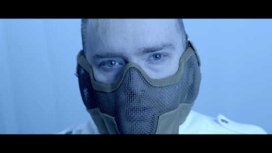

---
redirect_from:
  - "/videos/zdgwhnddwou"

# cspell:words: Hannibal Lecter
date: 2021-11-04
title: '"Hannibal" and the Appeal of Toxic Love'
runtime: 1:04:50
status: Finished
aka: !!seq
  - "The Gay Appeal of Toxic Love"
  - "Fear Coded (Thumbnail)"
  - "Toxic Gay Love (Thumbnail)"
topics: !!seq
  - "Hannibal"
  - The Vampire Chronicles
links: !!seq
  - "https://www.youtube.com/watch?v=SduGQEP8goU"
  - "https://archive.org/details/james-somerton-youtube-2023-12-03/20211004+ZDgWHNDdwoU+The+Gay+Appeal+of+Toxic+Love.webm"
description: "a video essay ruminating on why people would rather be in toxic relationships than being alone, complete with portion where James dresses as Hannibal."
notes: 
  - hbomb
  - dec5-delete
  - commentary
  - script-diff
  - w-james-nick

contributors:
  transcription: $cite$from-script
  downloaded: $cite$TerraJRiley
  citation: 
    - "[@kermitlesbian / Radhika Mohan](https://www.tumblr.com/kermitlesbian/735887223459807232/buy-radha-a-coffee-ko-ficomradha)"
    - "[/u/yaniism](https://www.reddit.com/r/hbomberguy/comments/18aowau/looking_for_the_sourcesplagarism_victims_for/kc1ii8l/)"
    - "[/u/maddrgnqueen](https://www.reddit.com/r/hbomberguy/comments/18aowau/looking_for_the_sourcesplagarism_victims_for/kcfqwfq/)"

cite:
  clips: !!map
    carmilla: { short: "(Le Fanu, 1872)", full: "Le Fanu, J.S. (1872). <em>Carmilla</em>. Retrieved Dec 29, 2023, from The Project Gutenberg eBook at", url: "https://www.gutenberg.org/files/10007/10007-h/10007-h.htm#:~:text=Sometimes%20after%20an%20hour%20of%20apathy" }
    drag_race: { short: "", full: "" }
    hannibal: { short: "", full: "" }
  yikes: !!map
    love_simon: "James continues to show his dislike of <em>Love, Simon</em> by positing that queer people don't engage with dream-like love stories."
  misinformation: !!map
    fan-fiction: "James takes an anecdote about Anne Rice and presents it as fact."
  plagiarized: !!map 
    monsters_made: { color: 1, short: "(Demchuk, 2021)", full: "Demchuk‚ D. (2022, Jan 21). <em>Where Monsters Are Made</em> [Excerpt]. On Hazlitt. (Reprinted from <em>Red X</em> by D. Demchuk, Aug 2021, Strange Light Books, Penguin Random House Canada.) Retrieved Dec 29, 2023, from", url: "https://hazlitt.net/feature/where-monsters-are-made" }
    vampires_r_us: { color: 2, short: "(Primuth, 2014)", full: "Primuth, R. (2014). Vampires Are Us [Article]. <em>The Gay & Lesbian Review</em> (is.108 for Mar-Apr). Retrieved Dec 29, 2023, from", url: "https://glreview.org/article/vampires-are-us/", type: "academic" }
    ranking_video: { color: 3, short: "(Hansen, 2020)", full: "Hansen, E. (2020, Nov 30). <em>Anne Rice's Vampire Chronicles RANKED</em> [Video]. YouTube.", url: "https://www.youtube.com/watch?v=F_PPB31wJjo&t=3179s" }
--- 


<compare>
<credits class="desc">

From the toxic love of 'Hannibal' to the immortal gaslighting in Anne Rice's Vampire Chronicles...
Why are LGBT people so attracted to society's monsters?

PATRON: [link]

#Hannibal #AnneRice #interviewwiththevampire

  
  
  
  
  

</credits>
<comment >

James in the infamous "Well today's been fun!" live stream where the accusations of plagerism started. After vaguely mentioning about stealing from [AreTheyGay in Unrequited](m8DRQ9-sCSI), and getting "permission" for [Evil Queens](Qvu84kjtGvE), he says this: 

> And then there was the silly one about the Hannibal video, <u>[laughing]</u> um... which I talked about before, but it's, um... it was, uh.... a younger YouTuber. She made a mistake. It was, you know, she and I... She and I spoke to each other and... you know, she apologized and everything and there's nothing... there, no kind of drama or anything there.

<u>[TODO figure out what he's talking about.]</u>

</comment>
</compare>



<compare>
<credits header="Disclaimer:">

<u>[Text on screen over black]:</u>

> Content Warning
> 
> This video contains discussions of violence,  
> gaslighting, and emotional abuse.

<u>[After a moment, text changes to]:</u>

> Sign up for my Pareon at the link below  
> for extras like audio commentaries,  
> behind the scenes, monthly Q&As, and more.

</credits>
</compare>

<compare>
<credits class="opening">

> FEAR  
CODED

> Written by  
James Somerton 
& Nick Herrgott

> Produced by  
[Six patron names]

> Executive producers  
[Two patron names]

> Executive producers  
[Three patron names]

> Directed & Edited by  
James Somerton

<u>[James walks up to the camera from the darkness]</u>

</credits>
</compare>

<compare>
<james >

<mark>Horror has always been an inherently traditionalistic genre, since fear is an inherently</mark> traditional, <mark>conservative emotion</mark>, and <mark>horror is often used for preserving traditional values</mark>: <mark>the victory of those who are virtuous, the punishment of those who are wicked, and rejection of the</mark> “other”. 

Nevertheless, <mark>for centuries, queerness and horror have been inextricably linked</mark>. With <mark>horror relying on queerness for shock</mark> value, and <mark>queerness relying on horror for visibility and validation</mark>. <mark>The horror genre we know today has its roots in the eighteenth-century romance and Gothic genres</mark>, <mark>the more gruesome works of</mark> <mark>Shakespeare</mark>, <mark>as well as the works of</mark> <mark>Dante, which described in graphic detail the torments of Hell that await those who sin.</mark> 

But <mark>the arrival of</mark> the printing press spurred a demand for long-format literature. Enter the <mark>Gothic</mark> genre, and the growing dominance of the novel as the go-to English language prose-fiction format. More demand meant more authors. More authors meant more voices. Namely, queer voices. 

However, <mark>we would only step into the spotlight as one of the few great leading roles we were allowed to fully inhabit: The Villain.</mark> Queer attraction and subtext could suddenly be explored in works like <mark>Sheridan Le Fanu's *Carmilla*, Oscar Wilde's *The Picture of Dorian Gray*, and Bram Stoker's *Dracula*,</mark> and <mark>queer characters could take a role at the heart of the story, albeit as predatory monsters with perverse desires</mark>. 

</james>
<from >

For most of its history, <mark>horror has been an inherently conservative genre, as fear is an innately</mark> <mark>conservative emotion</mark>, and <mark>horror has traditionally been employed to uphold conservative values</mark>: <mark>the triumph of the virtuous, the punishment of the wicked, the rejection of the different</mark>, the dissident, the unknown, the preservation of family, country, and God. As I write in the genre, I continually have to question whether I am demonizing sides of myself that I should be embracing and celebrating: my values, my relationships, my sexuality, my otherness.

<mark>For centuries, queerness and horror have been intertwined</mark>, <mark>horror relying on queerness for shock</mark> and pungency, and <mark>queerness relying on horror for visibility and validation</mark>. <mark>The genre we describe as horror today has its roots in the romance and Gothic genres of the eighteenth century</mark>, which in turn were influenced by the pre-Romantic movement known as the Graveyard Poets, <mark>the more gruesome works of</mark> Marlowe, <mark>Shakespeare</mark>, Webster, and Middleton, <mark>as well as the works of</mark> Milton and <mark>Dante, which described in graphic detail the torments of Hell that await those who had sinned.</mark> While the Renaissance and Enlightenment eras were more liberal in their depictions of queer historical figures, relationships, sexuality, and romance (though often with tragic ends), such positive portrayals declined as the Church and the State both worked to criminalize and demonize such behaviour. With <mark>the arrival of</mark> <mark>Gothic</mark> novels, the early Victorian thrillers known as “sensation novels,” pulp novels, and penny dreadfuls, <mark>we stepped into the spotlight in one of the few great leading roles we were allowed to fully inhabit: the villain.</mark> In such works as Matthew Lewis’s *The Monk*, <mark>Sheridan Le Fanu’s *Carmilla*, Oscar Wilde’s *The Picture of Dorian Gray*, and Bram Stoker’s *Dracula*</mark> (who warns his “brides” as they approach Jonathan Harker, “He belongs to me!”), queer attractions and subtexts could suddenly be explored, and <mark>queer characters could take a role at the heart of the story, albeit as predatory unnaturals with perverse desires</mark>, seeking out innocents—including children and animals—to corrupt and consume. From Henry James’s *The Turn of the Screw* to H.G. Wells’s *The Island of Dr. Moreau*, from Wilkie Collins’s *The Woman in White* to Robert Louis Stevenson’s *The Strange Case of Dr. Jekyll and Mr. Hyde*, chances are that if you read a story from this period that depicts “a secret side,” a “hideous transformation,” a “debilitating disease,” a “tainted bloodline,” “wanton decadence,” “unbridled hedonism,” “a duplicitous nature,” or a “twilight underworld,” you are likely confronting a carefully coded example of queer horror.

</from>
</compare>

<compare>
<james >

<mark>LGBT authors discovered that we could operate within the constraints of this most conservative of genres, utilizing metaphor</mark> and coding to depict our queer culture… <mark>For a while, it was preferable to be seen as a monster rather than to go unnoticed. </mark>

<mark>However, in our eagerness to use the genre to depict some element of ourselves, we most frequently revealed</mark> <mark>our self-hatred</mark>, <mark>the stinging toxin gay readers were obliged to ingest</mark> in order <mark>to fulfill our desires to see ourselves.</mark> 

</james>
<from >

<mark>Queer writers found we could work within the confines of this most conservative genre, using metaphor</mark> and allusion to describe meeting places, encounters, relationships, occupations, and networks through which queer people could find each other, gather, and form community. At least <mark>for a while, it was better to be seen as a monster than to remain unseen.</mark> <mark>However, in our zeal to use the genre to portray some aspect of ourselves, what we most often revealed</mark>—or were required to reveal—was <mark>our self-hatred</mark>. For queer readers, hatred, and self-hatred, were <mark>the stinging medicines we were forced to consume</mark> if we were <mark>to satisfy our need to see ourselves.</mark>

</from>
</compare>

<compare>
<james >

<mark>Into the early 1900s, through two world wars and the extremely conformist 1950s and early 1960s</mark>, <mark>so-called sexual deviation and perversity continued to play a prominent part in the horror genre</mark>. As novels, <mark>movies, and television became increasingly permissive, graphic depictions of passionate lesbian vampires, pansexual covens, mother-obsessed maniacs, and cross-dressing cannibals startled and titilated mainstream audiences... while infuriating censors</mark>, and many in the queer community alike. 

But <mark>the anti-hero was becoming a prominent protagonist now, and the prim, prudish, heterosexual heroes</mark> of the past <mark>were ridiculed for being painfully boring, while the bizarre monsters and murderers were applauded for their defiance of societal conventions.</mark>

</james>
<from >

<mark num=2>So-called sexual deviance and perversity continued to play a starring role in horror</mark> past the turn of the century and <mark num=1>into the early 1900s, through two world wars and the deeply conformist 1950s and early ’60s</mark>. As stage plays, fiction, <mark>cinema, and television became more permissive, explicit portrayals of lusty lesbian vampires, pansexual covens, mother-obsessed maniacs, and cross-dressing cannibals shocked and titillated mainstream audiences and enraged censors</mark> and queer activists alike. The lines between good and evil began to blur, <mark>the anti-hero became a dominant protagonist, and the prim, prudish, unfailingly heterosexual heroes</mark> <mark>were subtly mocked for their dullness while the outlandish monsters and murderers were quietly cheered for their rejection of social norms.</mark>

</from>
</compare>

<compare>
<james >

<mark>Up until then, families</mark> were considered a perfect <mark>microcosm of society</mark>. <mark>Sacred. A source of power and security. The heroes would do whatever was required</mark> <mark>to defeat the monster and restore order</mark>, <mark>including sacrificing themselves</mark>. But then <mark>a transition</mark> took place. We went from <mark>'killing the deviant to save the family and society' to the insinuation that family and society was where the deviance lay, and that they may destroy you</mark>. <mark>*Rosemary’s Baby*</mark>, <mark>*Carrie*</mark>, <mark>*The Exorcist*</mark>, *The Shining*, and *The Omen*. <mark>In these stories, family and society were where the monsters were made… through divorce, abuse, or neglect… through isolation and exclusion, and *especially* through a disregard for and degradation of the rules of gender and sexual identity that “good families” obeyed.</mark> 

<mark>This was the new order</mark> of things in horror. These stories were in <mark>high contrast with those</mark> of decades prior, <mark>where the monster</mark> <mark>was still an external force we could fight and destroy</mark>. 

</james>
<from >

<mark>Up until this point, family</mark> as a <mark>microcosm of society</mark> had been held up as a <mark>sanctity, as the source of strength and safety, and heroes would do anything</mark>, <mark num=5>including sacrifice themselves</mark>, <mark num=4>to destroy the monster and restore order</mark>. Then we began to see <mark>a transition</mark> from the common theme of <mark>“destroying the abnormal to preserve family and society” to the implication that family and society were themselves the abnormal and would destroy you</mark>. This new wave of horror was the one I grew up with, precociously reading novels such as Ira Levin’s <mark>*Rosemary’s Baby*</mark>, Thomas Tryon’s *The Other*, Stephen King’s <mark>*Carrie*</mark>, William Peter Blatty’s <mark>*The Exorcist*</mark>, and V.C. Andrews’s *Flowers in the Attic*. <mark>In these stories, family and society were where the monsters were made—through divorce, abuse, neglect, through isolation and exclusion, and especially through a disregard for and degradation of the rules of gender and sexual identity that “good families” obeyed.</mark> <mark>This was the new order</mark>, and while “good people” and “good families” could try to combat it, they risked sacrificing themselves for no reason or, worse, becoming monsters themselves in the process. These narratives unfolded in <mark>stark contrast to those</mark> I’d seen in old creature features on television, <mark>where the monster</mark>, even if created by our greed or misadventure, <mark>was still an external force we could fight and destroy</mark>. Now we were in the era of Bob Clark’s influential proto-slasher Black Christmas, where the obscenity-spewing woman-hating killer—whose perverse and monstrous tirades alluded to abuse within his family—was calling from inside the house.

</from>
</compare>

<compare>
<james >

<mark>In recent years, the queer villain/anti-hero has made an interesting and largely welcome return within horror, as we have seen an increase in the psychological complexity of its monsters and the conflicted nature of its heroes and victims.</mark> Anne Rice’s vampires come to mind as an example, as well as Bryan Fuller’s TV series, *Hannibal*. 

</james>
<from >

<mark>In recent years, the queer villain/anti-hero has made an interesting and largely welcome return within horror, as we have seen an increase in the psychological complexity of its monsters and the conflicted nature of its heroes and victims.</mark> Michel Faber’s cerebral sci-fi horror novel *Under the Skin* (and its more oblique 2013 film adaptation with Scarlett Johansson) presents an alien who performs gender, taking on the image of a vulnerable, feminine woman to attract, ensnare, and harvest her human male prey; her journey both illuminates and subverts the trope of “trans woman as male deceiver.” In John Ajvide Lindqvist’s novel *Let the Right One In*, the genitally mutilated child vampire Eli befriends and imperceptibly grooms the bullied boy Oskar to replace the aging “father” in Eli’s thrall. Oskar and Eli ultimately escape the town where Eli has been feeding; we understand that Oskar too will grow older, will become protector and facilitator and “father,” as Eli remains ageless. And then there is the titular creature of the 2014 film *The Babadook*, who was embraced by film-savvy queers as a darkly dapper symbol of queer resistance—“I’ll wager with you, I’ll make you a bet: the more you deny, the stronger I get.” Once it bursts out of the closet, it refuses to be repressed or restrained. In the end, despite all attempts to exorcise it, it cannot be defeated, nor can it be driven away; it can only be integrated into the family, fed and nurtured, accepted and embraced.

</from>
</compare>

<compare>
<james >

In pervious[sic: previous] horror-themed videos I’ve discussed the drawn empathy between queer peoples and monsters. We see ourselves in monsters because we have also been cast out of society. We’ve been decreed unfit for all audiences, something we must protect women and children from. We must be regulated, and if necessary, slain — for no other reason than how we are different from society’s expectations. 

So we look at Frankenstein’s creation and think, well, I’m also a social outcast, and I have feelings. I have a heart, and aspirations, social needs, and dreams of living a good life. Shouldn’t that mean that he does also? 

But there’s something that’s overlooked. That queer people are fundamentally the *same* as straight people. And just as there is narcissism, ego, exploitation, and abuse among straight people — When it comes to queer people… sometimes a monster… is just a monster. It’s like we — queer people in our relationships — are so conditioned to seeing the person behind the monster that we overlook the elements that are genuinely monstrous because to us, as historical societal outcasts who lacked connection to human society at large, we value the human connection enough to tolerate or even condone monstrous behaviour. 

And yes, we’re always on the lookout for monsters who want to eat your heart. 

But far more insidious is the monster that wants to eat your mind. Your self worth. And we seem to be *very* comfortable with those monsters. 

</james>
<from></from>
</compare>

## Part I: They Eat Your Heart


<compare>
<james >

<u>[James sits with some food on a place setting in front of him for this segment.]</u>

Over the course of its three seasons, *Hannibal*, lead by out gay show-runner Bryan Fuller, made a significant impact on both the horror and crime drama fandoms. With a focus on comprehending the psychology of serial killers — the driving line of the show was built around learning how to develop human connections with people who lack humanity. Empathy for those who cannot empathize. 

</james>
<from></from>
</compare>

<compare>
<james >

The emotional through-line of the show, however, is built around the relationship between the titular antagonist Hannibal Lecter, and the Psychological Profiler Will Graham. In the book *Red Dragon* the story begins, and the infamous Dr. Lecter — Hannibal the Cannibal — is incarcerated. Will Graham is recruited by the FBI to track down a serial killer, and it’s referenced that this is not the first time the FBI has approached Will for consultation. 

Apparently, Will and the FBI had worked with Hannibal Lecter, who was a practicing psychiatrist, to profile one of a number of serial killers. Eventually, Will realized it was Hannibal who was the killer that they were tracking, and Hannibal nearly killed him before he was arrested. The result was a complete fallout with the FBI, and Will himself coping with the trauma for years before Agent Jack Crawford tracked him down again to help with a new case. But through the mystery of the Red Dragon, there are constant call backs to Will’s work with the FBI and his twisted relationship with Hannibal, which… it’s hinted... that they were much closer than we’re being led to believe. 

</james>
<from></from>
</compare>

<compare>
<james >

The *Hannibal* TV series for NBC focused around filling in these plot details. What would a relationship between Hannibal and Will be like? How did they get to that point in *Red Dragon*? What did it take to bring Hannibal down? And most importantly, appropriately presenting Will Graham in a way that honours his collection of neurotic behaviours that were outlined in the book. 

In the series, Will Graham is a cocktail of personality disorders, as he describes himself, closer to autism and aspergers than an antisocial personality disorder. Will is able to look at a setting, and accurately describe an individual based on cues within the scene. Now while this could do wonders on Drag Race for reading the other queens—

</james>
<from></from>
</compare>

<compare>
<clip >

"You could never have a sugar daddy because *you* are not that kind of girl!"

</clip>
</compare>

<compare>
<james >

—this has a very *practical* application for crime scene investigation. By looking at the scene of a murder, Will can slip into the mind of the killer. He can observe clues, see the sequence of the events, and then construct the psychological profile of the person who did the murder based on who he becomes while he re-expiriences it. 

</james>
<from></from>
</compare>

<compare>
<james >

Developing a profile of a serial killer is useful in determining how they select their targets. Given how most serial killers operate, figuring out how they select their victims could lead investigators to where the serial killers live, or intercept them before they kill again. From observing these crime scenes, Will can figure out how they think and what they think about their victims.

Will, from a perspective of self-analysis, reports to the FBI what he feels and thinks when he re-lives the murder. A psychological profile is constructed based on who Will says he becomes. In the mythology of the show, Will’s perspective is second-to-none. 

</james>
<from></from>
</compare>

<compare>
<james >

Now, for Will, that does mean that he has to distance himself from his own mind and take on the world view of people who conduct very… elaborate crimes. Naturally this kind of identity flux is of immense interest to Dr. Hannibal Lecter, who first wants to study Will, but then as he learns the extent of Will’s ability, begins to feel the need to transform Will. Hannibal has an unparalleled capacity to read and interpret body language. Contrast to Will’s ability to construct human models based on reading environments. 

He sees Will’s neurotic behaviour as the result of Will rejecting elements of his own identity. Hannibal feels that Will's ability to see into the heads of serial killers is an indication that Will is drawn to these people — and that Will can only be his true self while he is re-experiencing these murders. 

</james>
<from></from>
</compare>

<compare>
<clip >

Dr. Lecter (to Will): "Perhaps you didn't come here looking for a killer. Perhaps you came here to find yourself."

</clip>
</compare>

<compare>
<clip >

Will (pointing gun at Hannibal): "You wanted me to embrace my nature, doctor. I'm just following the urges I kept down for so long."

</clip>
</compare>

<compare>
<james >

The show is ambiguous about whether this is or is not, in fact, the case. Will seems to adapt his personality to whoever he is with — so what Hannibal sees may be a reflection of himself, instead of the real Will. His interactions with Will are most likely to be a matter of Hannibal interacting with Will’s interpretation of Hannibal. 

</james>
<from></from>
</compare>

<compare>
<clip >

Will: "I can't get you out of my head."

</clip>
</compare>

<compare>
<james >

But this is the psychology of fictional characters so take it with a grain of salt. 

While the show begins as a kind of... best possible version of a procedural cop drama, the serial killing becomes a vessel for Hannibal and Will to connect. Two men who keep people at arms length because they fear human contact for one reason or another. Through a discourse on why Will feels the way he does, he is drawn to someone who offers him clarity of identity.

</james>
<from></from>
</compare>

<compare>
<clip >

Will: "I've never known myself... as well as I know myself... when I'm with him."

</clip>
</compare>

<compare>
<james >

And through the process of Will empathising with monsters, Hannibal is comforted in knowing that there is someone who could and would understand *him*. And while Hannibal takes peevish delights in being *beyond* comprehension… 

</james>
<from></from>
</compare>

<compare>
<clip >

Woman: "Could I have ever understood you?"

Hannibal: "No."

</clip>
</compare>

<compare>
<james >

…Mads Michelson delivers a Hannibal that is yearning for contact with a human from whom he does not have to leverage emotional intimacy with. 

Now. There’s hardly a discourse to be had here that actively verifies the textual evidence to confirm that Will and Hannibal are more or less romantically engaged. 

</james>
<from></from>
</compare>

<compare>
<clip >

Woman: "Betrayal and forgiveness are... best seen as something akin to falling in love..."

</clip>
</compare>

<compare>
<clip >

Will: "I forgive you..."

</clip>
</compare>

<compare>
<james >

It *really* doubles down on the gay stuff as the show goes on, but it was still there in season 1. 

</james>
<from></from>
</compare>

<compare>
<clip >

Will: "Did you just *smell* me?"

Hannibal: "Difficult to avoid."

</clip>
</compare>

<compare>
<james >

But I’m not sure you can qualify it as GAY representation in its purist sense. Both because the show’s driving relationship existed in subtext, but also because the development of Will and Hannibal was focused around empathizing with people who we... maybe should not empathize with. 

But it’s some of the best and most insightful *queer coding* that’s ever made it into a visual medium. These are two men, coping with different kinds of deep-seeded trauma from their youth. They keep themselves isolated and distant because they are familiar with society’s fear or disgust with what they are. 

One hides in plain sight, holding a shield of lavish opulence that enchants those around him into believing that nobody this gentlemanly and eccentric could be anything else. The other, keeps himself physically distant, preferring the unconditional friendship of animals. Brilliant, solitary, engrossed in their hobbies. They dream of normality, paternity — being in a family. Though they have both reserved themselves to their lives, and their fantasies. And when they meetmet, by complete accident, they recognize that they see their own fantasies in the other, making steps to develop their own kind of family — from the people who need them most. 

</james>
<from></from>
</compare>

<compare>
<james >

The main difference is that… one of them knowingly eats people. 

<u>[Meme cutaway to show someone unwrapping a human leg.]</u>  
<u>[James takes a bite of the food in front of him.]</u>

And this is just the thing, right? It’s very clearly gay without saying it is. In fact, by all accounts, Bryan Fuller fully intended to give Will and Hannibal an explicit romantic arc. Mads Michelson said that during the filming of the last scene of Season 3, he was trying very hard not to kiss Hugh Dancy. That’s… not acting, apparently. 

The intention to canonize the Hannibal and Will relationship may also be one of the reasons why NBC didn’t move ahead with a 4th season. Because although there were lesbian characters on the show, lesbians are famously more easy to sell to advertisers. Which is why you see a lot more lesbian rep in kids cartoons these days. 

</james>
<from></from>
</compare>

<compare>
<james >

But gay characters, at least gay lead characters, are still something that network TV shies away from. It’s that threat of penetration that creeps under the skin of a lot of executives and viewers. Subconsciously creating an unease around gay men that isn’t there for gay women. At least as long as the gay women look like this. <u>[Showing clip of a lesbian kiss.]</u>

But in spite of the avid, and continuing flow of fan art depicting Mickelson and Dancy in compromising postions[sic: positions] donning[sic: in] varying degrees of undress, I’m not only hesitant to label this as good gay representation, I’m *slightly* resistant to it. God forbid we have a generation of gays who describe themselves as a Hannigram power couple. 

What they have, while intense and fun to watch, is still… very toxic. 

</james>
<from></from>
</compare>

<compare>
<clip >

Therapist woman (to Hannibal): "Will Graham asking to see you betrays his clear intent to manipulate you."

</clip>
</compare>

<compare>
<james >

You’ve got a know-it-all, gaslighting, mansplainer on one hand. And on the other, you have a passive-aggressive, self-victimizing martyr. That should not be relationship goals. 

And while there are fans who realize that no, the point of the show is that you should probably get some help if you see yourself as Will and/or Hannibal, there’s quite a romantic drive in the show’s fanbase. 

</james>
<from></from>
</compare>

<compare>
<clip >

Therapist woman (to Hannibal): "You are obsessed with Will Graham."

Hannibal: "......I'm intrigued."

Therapist woman: "Obsessively."

</clip>
</compare>

<compare>
<james >

I’ve even seen the show be compared abundantly to the online comics *Killing Stalking* and *Warehouse*, and I see where the take is coming from, but I’m not entirely sure that I agree with it. *Killing Stalking* is a story about a serial killer who has complete dominant control over another man. Who explicitly wants to use and exploit a literal prisoner. The added twist is that the prisoner is in love with the captor — or at least thinks he is. This is less about relationship toxicity and more a carnivalesque example of abuse in relationships. 

*Warehouse* tells a story of an assault and abuse brought on by childhood trauma. A revenge fantasy of sorts where neither of the characters are all that likeable, and after an untold amount of torture, the victim’s mind breaks. Leading to the victim accepting an actual relationship with his abuser. In both cases, the power dynamic is all off. One character has far more power than the other. 

But Hannibal functions a little differently. Will is rarely, if ever, a prisoner specifically of Hannibal’s. In fact, Hannibal is more often being held captive in a situation Will had orchestrated somehow. This fits more of the bill of relationship toxicity… because Hannibal is never really trying to dominate Will. 

</james>
<from></from>
</compare>

<compare>
<james >

In season 1, Hannibal’s objective is to manipulate Will into becoming something that he is repressing. He urges Will to admit that he enjoyed killing someone that he had to kill in order to save another life, and going further in the series, urges Will to do it again. Will does not realize that he’s being manipulated by Hannibal though until Hannibal has already perfectly framed him for the murder of multiple people, resulting in Will being sent to a hospital for the criminally insane. 

Going into the second season is interesting because Will has a greater awareness of Hannibal’s methods. He both trusts and distrusts Hannibal — and, in an attempt to assassinate Hannibal while he was inside the asylum — Will demonstrates that he is willing and capable to take power into his own hands. Thereafter, the power-dynamic inof their relationship becomes much more evenly shared between themthe two. Each demonstrating that they are not willing to tolerate the other’s bullshit. But each demonstrating that they’re going to keep getting up to their bullshit. And yet… its also abundantly clear that they would not have this kind of emotional intimacy if they *didn’t* keep get up to their bullshit at all. 

This kind of codependency is... well, we've all seen a relationship like that. And we all know that it doesn't end well. Because... it doesn't end.

</james>
<from></from>
</compare>

<compare>
<clip >

Hannibal: "Don't you want to know how this ends?"

</clip>
</compare>

<compare>
<james >

These kinds of bitchy, catty relationships are sort of ride or die situations that revolve around a cycle of stockpiling emotions for a once-a-year blowout fight. Maybe part of them likes these fights? Maybe they get bored and tired of people who don’t play mind games? Maybe they’re self-aware enough to know that this is just who they are, and they know that nobody else in the world is going to put up with them. 

There are darker sides to us, more intimate, and personal parts. Little back-brain remnants of feral humans stuck in our heads. These parts of us tell us to pit ourselves against each other, seek supremacy, push ourselves into authority, to seek our own pleasure at the expense of others. 

And yet, our society is so tightly constructed around co-operation, civility, and respecting the other that our feral-brains are not useful for existing in this modern world. It is, after all, the co-operation that has allowed civilization to flourish. 

</james>
<from></from>
</compare>

<compare>
<james >

We often hide these parts of ourselves. Not because we’re embarrassed about them, but because we acknowledge that there is almost no way to function in society by letting these internal savage parts of us bubble up to the surface. It’s not just everyoneanyone who we can let see this part of ourselves. Because by exposing these very closely guarded artefacts[sic: artifacts] of prehistoric human tribalism, we are letting someone know that we, ourselves, are aware that there are parts of us that lack humanity. 

And while everyone knows that we all have corners of our minds that are still overgrown and wild… it is not in good taste to admit it. There is always a risk that the person you trust will point you out as a monster. 

Hannibal and Will, in this sense, lucked out with each other… or… were incredibly unlucky to come across each other. For both men have a capacity to read beyond what the other is saying. Their ability to reach each other fosters a kindred sense of belonging. For lack of literally anyone else who can understand them, they crave connection in each other. Is this romantic? Actually... 

</james>
<from></from>
</compare>

<compare>
<james >

My significant argument about a situation which separates an abusive relationship from a romantic one is a matter of power. Who has it in a relationship, and who is itit is being taken away from. This is pivotal in understanding and interpretingthe interpretation of *Killing Stalking* and *Warehouse*. And this is also the case in the first season of *Hannibal…* where Will is mostly unaware that he’s even being manipulated. His subconscious is filling in the blanks though. 

However, as Will becomes more aware of who and what Hannibal is… he begins to make steps to reclaim his power. In the second season, especially toward the end, there could be an argument that Will holds the greater amount of power because Hannibal demonstrates abundantly that his decisions are reactive to Will’s actions. But by the end of the series, the question arises of why Will and Hannibal stay ‘together’ in spite of lying, manipulation, entrapment, killing each-others friends, killing their own daughter-figure, tampering with evidence, feeding their friends to each other, numerous attempts to kill each other and a solid attempt on one to ablate and eat the other’s brain. 

</james>
<from></from>
</compare>

<compare>
<james >

On one hand, within the mythology of the show… I just don’t think they’d be that interested in each other if they didn’t pull this kind of shit. It’s like the Joker and Batman. What would they have to do with themselves if they didn’t have this other guy to keep edging them on? Their numerous attempts to kill each other could easily be seen as a way of pressing each-other’s buttons to see where the other will draw the line at what they are willing to tolerate. 

But on the other hand… The alternative is being alone. You’ve let someone in your head, what happens when you let them out? Yet in spite of the murders and the cannibalism, Will and Hannibal *together* establish an even ground where the monstrous parts of themselves are in the open. Nobody would ever look past Hannibal’s cannibalism or art piece murders. But Will does. Will looks at each of the Chesapeake Ripper murders and thinks: who is the kind of person doing this. While everyone else thinks what kind of monster would do this? 

</james>
<from></from>
</compare>

<compare>
<james >

And similarly, Hannibal is the only person willing or able to look past Will’s neuroses. Alana Bloom refuses to romance Will because she sees a subject. Jack Crawford sees an ace-in-the-hole for catching serial killers. Hannibal sees a person. So the pair of them can see past the monstrosities, and appreciate the human being in the chair across from the other. 

So naturally… we, queer people are drawn to this. Because we, too, want people to look past the homosexual, the bisexual, the transgender, the genderqueer, nonbinary, fluid labels that have been imposed upon us by society and ourselves. We see what Will and Hannibal have and we, too, see past the horror of the show, the horrors that they put each other through. Because it is not the horror we want, it is the unconditional connection. 

</james>
<from></from>
</compare>

<compare>
<clip >

Hannibal: "All my knowledge and intrusion I could never entirely predict you."

</clip>
</compare>

<compare>
<james >

We can endure horror. Each of us — we already have. What we cannot endure is solitude. 

In a discussion of representation, why would we clamor for this, and yet leave *Love, Simon* out to dry at the box office? <mark yikes id="love_simon">No discredit to Ms. Albertalli, but could it be that queer people do not emotionally engage with a teenage twink whose dream-style love story goes off like choreographed fireworks? Most of us have never experienced that.</mark> But a toxic relationship we aren’t willing to admit is toxic? That’s far more likely. 

</james>
<from></from>
</compare>

<compare>
<james >

And because of that, are we not more drawn to the reflection of the darker parts of us? And while we don’t want straight people en masse to think of us as cannibal serial killers… we do like to see ourselves represented. We want to see the darker parts of our lives staring back at us from the other side of a mirror, or camera. Being gay isn’t pride floats and kissing at the top of ferris wheels. And neither is it the suffering that society puts us through. Not always. 

When you stick a bunch of traumatized people into a community, you’re going to get a handful who don’t have the best ways of coping with that. And as people do, sometimes we just fall in love with these monsters. And our need for Will and Hannibal to find a way to co-exist stems from our own memories… wondering if there was any way we and our exes could get over our drama and make it work. Because when you find someone who understands you… who truly understands you… you want to hold onto them... forever… 


</james>
<from></from>
</compare>

## Part II: They Suck The Life Out Of You

<compare>
<james >

Vampires have always been a little bit gay. And they’ve always been a part of human history, believe it or not. Though what we recognize as modern day vampires is a product of the last five hundred years or so, there are creatures which could resemble Vampires going back to Ancient Rome. 

The Greek Goddess Hecate, a triple deity, was associated with magic, witchcraft, the moon, the undead, the night, and wild, forested areas. She was said to turn women into creatures which fed off the blood of men. These women would either be vicious monsters, or keep rural roads and paths safe for travelling women. Hecate herself was a later addition to the Greek Pantheon, and some scholars believe she was the Greek adaptation of a goddess that may have originated in Egypt or what is modern day Turkey. Egypt itself possessing a version of vampires. Though these figures being less monsters and more the result of a society which religiously revered a rigorous relationship between life and death, and the pathways to and from either. 

</james>
<from></from>
</compare>

<compare>
<james >

Blood is one of the earliest symbols that humans associated with the concept of life and death, for obvious reasons. It’s not a stretch to say that our earliest societies would have had a fixation on blood’s symbolic ability to transfer life from one to another. In these days, vampires didn’t need to be gay because everybody was gay. And then Christianity took off for… a hot minute and then before you knew it everything that was interesting about human culture was a sin or a demon. So Vampires became more monstrous than they already were. 

The vampire especially was a symbol of distance from God’s natural order. Which… wasn’t much of a difference from the way vampires had previously been depicted violating the natural order of life and death. Because it used to be you only went to hell for committing cosmic treason, cheating death, direct acts of warfare against the Gods, or actively trying to end the world. But these days, eternal damnation awaits you for something as easy as masturbation. 

</james>
<from></from>
</compare>

<compare>
<james >

And while once Vampires were beasts and monsters, beholden to the whim of their associated deities, vampires in christian[sic: capitalization] orthodoxy were creatures who had simply strayed from God’s plan and protection. As a result, they resembled not only monsters, but men and women who embodied the antithesis of the good christian citizen. Ranging from cannibalism, sexual perversion, and vast displays of opulence. 

But it was never something explicitly explored — instead vampires lived within folklore as parables preaching the need to stay away from people who exhibited un-christianly behaviour. The 18th and 19th centuries marked a shift in the way many people in Europe examined their heritage and mythology. Additionally spurred by the advent of the printing press, allowing an ease-of-access for increasingly literate populations, European writers grew tired of dramatic wealthy families and war stories. Attention turned towards fantasy stories, science fiction, a more gripping and tangible expression of imagination. 

And particularly, a re-examination outside the rigid christian moral take of European folklore. And within this, we began to decode the queerness of the vampire. Even if we were just using vampires to call out our queer friends for being jerks. 

</james>
<from></from>
</compare>

<compare>
<james >

In <mark>1819</mark>, <mark>John Polidori</mark> published <mark>The Vampyre</mark>. <mark>In this story, the vampire, Lord Ruthven, is written as an aristocratic seducer</mark>. A rich man who has given up the idea of following society’s norms. 

</james>
<from >

VAMPIRES HAVE BEEN a part of popular culture in the West for several centuries. American vampire stories are rooted in the folklore of Eastern Europe, but similar creatures have also turned up in Western Europe, India, and China. The contemporary vampire story has roots in traditional folklore, in 17th- and 18th-century pseudo-science, and in historical figures such as the “Blood Countess,” Elizabeth Bathory, and Romanian ruler Vlad “The Impaler” Tepes. Well-known precursors to today’s stories include the 1748 German poem, “Der Vampyre” and an <mark>1819</mark> short story by <mark>John Polidori</mark> titled “<mark>The Vampyre</mark>.” <mark>In this story, the vampire, Lord Ruthven, was first portrayed as the “aristocratic seducer”</mark> that is so familiar to Americans. Polidori was Lord Byron’s physician, and many readers saw a resemblance between Byron and the vampire.

</from>
</compare>

<compare>
<james >

This was a great fear in western Europe at the time, by the way, especially among poorer people. The catholic church had maintained power for nearly 1500 years thanks to a propaganda effort that said that poverty was pivotal to morality and getting into heaven. The more accepting the poor were with poverty, the less likely they would be to rise up against the wealthy and powerful. And it meant the church got to decide who got to be wealthy and powerful. 

</james>
<from></from>
</compare>

<compare>
<james >

Yet the projected messaging, and this was heavily adopted by the poor, was that excessive wealth was the most pivotal component in distancing oneself from propper sexual conduct. Specifically, homosexuality. 

</james>
<from></from>
</compare>

<compare>
<james >

But Palidori wasn’t writing about the corruption of homosexuality, oh no. His Lord Ruthven was, quite obviously, the real life Lord Byron — who… may or may not have been a vampire himself. But he was fabulously wealthy, fabulously sexy, fabulously bisexual, and who Palidori had been fabulously in love with for a time. But Lord Byron got bored, and casually moved on to suck the life out of some other, less talented, sycophant. Which normally wasn’t a problem, but Palidori was salty enough that he was gonna tell the world just what kind of sexy… irresistible monster Lord George Gordon Byron actually was. And probably also how Palidori would take him back in half a second if Byron came around. We all know a guy like that, don’t we? 

</james>
<from></from>
</compare>

<compare>
<james >

Later on in the century, <mark>In 1871, a vampire story with</mark> — let’s say... <mark>‘subtle’ lesbian undertones — “Carmilla” by Sheridan Le Fanu, was published.</mark> The idea of a vampire female presence was nothing new, but one preying on other women was revolutionary and scandalous. 

</james>
<from >

By the 1840s, vampires were seen in English theatrical productions, and “Varney the Vampire,” created by James Malcolm Rymer, was a popular newspaper serial. <mark>In 1871, a vampire story with</mark> <mark>subtle lesbian undertones, “Carmilla,” by Sheridan Le Fanu was published.</mark> In 1897, the best known vampire book, Bram Stoker’s *Dracula*, was published. Hugely popular in the U.S., it had been adapted for both stage and screen by the 1920s. The first vampire films were actually made by the French in the 1890s. By the 1920s, the Germans had produced *Nosferatu*, and in 1931 Hollywood jumped in with Tod Browning’s *Dracula*.

</from>
</compare>

<compare>
<clip >

<u>[Text scrolling on screen]:</u>

> "Sometimes after an hour of apathy, my strange and beautiful companion would take my hand and hold it with a fond pressure, renewed again and again; blushing softly, gazing in my face with languid and burning eyes, and breathing so fast that her dress rose and fell with the tumultuous respiration. It was like the ardor of a lover; it embarrassed me; it was hateful and yet overpowering; and with gloating eyes she drew me to her, and her hot lips traveled along my cheeks in kisses; and she would whisper, almost in sobs,
>
> 'You are mine, you shall be mine, you and I are one for ever.'
>
> Then she had thrown herself back in her chair, with her small hands over her eyes, leaving me trembling."

</clip>
</compare>

<compare>
<james >

Feel like I could get demonetized for that. 

</james>
<from></from>
</compare>

<compare>
<james >

And then came *Dracula* by Bram Stoker, who many believe to have been a closeted gay man in love with his employer, Henry Irving, who many believe was the progenitor of the character of Dracula, himself. For this, Stoker himself was a young, impressionable Johnathan Harker, trapped in the castle of opulence, alone, with a man worth his obsession — kept from his benign relationships with women. 

</james>
<comment>


The article  continues to talk about *Dracula*, but only the book. This section doesn't directly pull any sentences, but James summarizes bits of it.

</comment>
</compare>

<compare>
<james >

Dracula’s most famous screen incarnation, the 1931 adaptation, which is actually adapted more so from the play than the book for budgetary reasons, was directed by Todd Browning, a gay director. And he made his Dracula sexy, exotic, and fabulous with that flowing cape. 

Throughout the mid 20th century vampires fell into the realm of b-movie camp, having more than one meet-up with Abbott and Costello. And though many a gay man found *ample* sexual tension between Christopher Lee’s Dracula and Peter Kushing’s Van Helsing in the Hammer horror classics, there wasn’t much to speak of gay vampires in mainstream culture at the time. 

If you want more on Dracula’s queer coding, my video [Monsters in the Closet](4zPCM14-SCQ.md) goes more in depth on that. 

</james>
<from></from>
</compare>

<compare>
<james >

The pre-Stonewall era for gay men in American society was mostly a time of repression, fear, and the darkness of the closet. It was a time of conformity not just for gay people, but everyone, who were expected to play their role in order to keep America safe from “Godless Communists.” 

Senator Joseph McCarthy and his notoriously closeted right hand man Roy Cohn (and others of their ilk) were hunting not just communists but gays as well. There were congressional hearings aimed at rooting “sexual perverts” out of government jobs, and surveillance of the American postal service for gay magazines continued until 1966. The Lavender Menace knew no bounds. 

</james>
<from></from>
</compare>

<compare>
<james >

Finally, as the 60’s hit its stride, the sexual revolution began to take hold, and the Stonewall riots forced mainstream America to deal with the existence of gay men and women… it was only a matter of time before the gay vampire returned. But this time he wasn’t a monster, but a hero. Ironically, a Byronic hero. 

After the tragic loss of her young daughter to leukaemia, an aspiring San Francisco based writer named Anne Rice began dealing with her grief by writing about creatures that could, potentially, live forever. 

</james>
<from></from>
</compare>

<compare>
<james span=2 >

Now before we get TOO far into Mrs. Rice I want to cover the sticky subject of <mark x num=1>her opinion on fan-fiction</mark>, since I know it’s a hot button issue. The Anne Rice V Fan Fiction war began around the release of her novel *Merrick*, <mark x num=2>at the dawn of the e-book revolution.</mark> Her publisher, <mark num=3>believing physical books were dying</mark>, wanted to <mark num=4>publish *Merrick* as an e-book exclusive release</mark>. And <mark num=5>so they told Rice that any fan fiction available online would cannibalize those ebook sales</mark>, <mark num=6>advising her to file a cease and desist</mark> <mark x num=7>against all fan fiction websites</mark>. 

<mark num=8>The e-book exclusive of *Merrick* ended up doing absolutely terrible sales,</mark> because e-books were not taking over the world and most people barely even knew they existed at the time, and <mark x num=9>so a physical copy was eventually released</mark>. But, <mark num=10>due to some advice from her publisher</mark>, <mark x num=11>Anne Rice has been known ever since as the lady who hates fan-fiction ever since.</mark> <mark x num=12>Even though in 2012</mark> she said: 

> <mark x num=13></mark>"Maybe [writing] fan-fiction is a transitional phase. [Whatever gets you there, gets you there](https://metro.co.uk/2012/11/11/how-fan-fiction-is-conquering-the-internet-and-shooting-up-book-charts-617396/#:~:text=But%20maybe%20fan%20fiction%20is%20a%20transitional%20phase%3A%20whatever%20gets%20you%20there%2C%20gets%20you%20there.)."

</james>
<from >

So you *may* have heard a little story about <mark x num=1>Anne Rice and fan-fiction</mark>. There was a... *debacle* on the interwebs about 20 years ago where where Anne Rice proclaimed that she would *not* tolerate any fan fiction of her books, *especially* The Vampire Chronicles, and that any website hosting it must *cease* and *desist*. Back then, this mostly just meant fanfiction.net. (She couldn't find us on livejournal!) Tons of fan works were deleted from the internet and lost to the sands of time and everyone was super salty about it. 

Anne Rice has since come back around and says that <mark x num=13>while she doesn't understand the appeal of fan fiction, she won't begrudge anyone for writing it anymore</mark>, and you do you. Live and let live, she says. <mark x num=12>That retraction was in... 2012, so it's been a while now</mark>. Vampire Chronicles fan fiction is cool again, you all! Join me on a03!

But, what most people don't know is the reason *why* she came down so hard on fanfic. She never liked it, sure, and she said she was afraid it would block her own writing, but she hadn't actually done anything about it before the year 2000. 

<mark fc>Now, I don't have specific sources for this anymore. I used to, but I can't find them now, but! *The story goes*</mark> that when this book, Merrick, was coming out, <mark x num=2>her publisher decided that with e-books on the rise,</mark> <mark num=3>print publishing was dying</mark>. *The advent of the e-book were dark times, full of terrors.* And her publisher *had* to get ahead of the industry! So, they thought it would be a *great idea* to <mark num=4>release Merrick as an e-book exclusive</mark>.

<mark num=5>So, they told Anne Rice that all the fan fiction out there would cannibalize her shiny new ebook sales</mark> and mess with her copyright. And *they* <mark num=6>advised her to put the cease and desist</mark> <mark x num=7>on the fanfic</mark> in order to protect her brand. And she believed them. Because e-books were still *new and scary and who even really knew how these things worked* back then?!

So, yeah, <mark num=10>she got some really bad advice</mark> and followed it and <mark x num=11>it ended up pretty disastrous for her reputation</mark> in certain circles... and then, *of course*, <mark num=8>the ebook exclusive of Merrick did *terribly*,</mark> <mark x num=9>so they ended up releasing it in print after all</mark>, as you can plainly see. So, it was all for naught in the end. 

So.... Merrick left a bitter taste and a lot of mouths. But, yes! In case you haven't heard, Anne Rice regrets her actions towards fan fiction in the past, and she is cool with it! And has been for eight years now!

</from>
<comment id="fan-fiction">


> A little over a year ago, fans shared one of James Somerton’s vampire videos in my server, and when I watched it, I noticed he repeated something from one of my videos almost exactly. It was an anecdote I explained I’d lost the source for, so to take it with a grain of salt.

> He stated it as if it was all clear facts. I DMed him to very politely ask if he’d found my lost source and he ignored me (meanwhile following practically ALL of my Youtuber friends on Twitter but not me).  
> Turns out I was his source.

</comment>
</compare>

<compare>
<james >

However, Rice’s adventures in publishing began much earlier than Ebooks and the internet. In her premier novel, *Interview With The Vampire*, she used these creatures as sympathetic heroes. Through them, she conceptualized both the concepts of death and the illusion of immortality. 

However, her vampires weren’t going to get weighed down with all that coding and subtext brought about by Christian conservatism. Her vampires were gonna be here and (mostly) queer. As a woman who lived in San Francisco, and who openly engaged with queer elements of The City in the 60s and 70s, she took on by osmosis, the internal lifestyle struggles of the queer community. Their lives, their heartbreaks, and the ways that their ostracised existence generated problems that would not typically be seen or understood in straight circles. But Anne Rice was going to make straight people understand it… by making them vampires. Vampires who, in spite of being monsters, she made you sympathise with. 

</james>
<from></from>
</compare>

<compare>
<james >

Published in 1976, Rice’s first novel: *Interview With The Vampire*, tells the story of Louis De Point Du Lac, an immigrant to America in 1791, who ran a plantation just outside of New Orleans. A happy man, he cared for his mother and sister, as well as a younger brother Paul, a very religious man who claimed to see angelic visions regularly. After an argument in which Paul told Louis that the Virgin Mary had come to him and told him to sell the plantation, Paul accidentally died, though some believed it was suicide, and others believe the he’d simply seen god. 

Louis took to drinking to cope with the grief, and moved to New Orleans, not really caring for this whole ‘life’ thing much anymore. Which is when he met Lestat De Lioncourt, a vampire who grooms Louis into accepting the dark gift himself. Eternity in the night doesn’t really… make Louis feel any better though, naturally. His eternity began while he thought of nothing but the loss of his loved one, and for the rest of his eternity that is who he would be. 

</james>
<from></from>
</compare>

<compare>
<james >

While Lestat tries to win Louis over with gifts and companionship, their relationship develops with an unhealthy amount of gaslighting. And once again we see a pair of men slip into a codependent relationship where neither is particularly welcome anywhere else but in each other’s company. 

For Lestat, this arrangement offers him a feeling of importance, and someone he can ‘fix.’ And for Louis, this arrangement offers him someone who can make him feel anything at all. And though they enjoy being with each other, to a point, what they dislike is that they have no other option but to be with each other. Who else would accept them? Who else could? 

</james>
<from></from>
</compare>

<compare>
<james >

It doesn’t help that Lestat is consistently rolling his eyes at Louis because this boy still hasn’t gotten over his catholic hang-ups and refuses to drink the blood of another human. Just rats. When he finally does drink from a person, it’s a lonely, dying girl who’s weeping over the corpse of her mother who had died from the plague. He nearly drains the girl and then flees. Only to find Lestat waiting for him at home with the girl, ready to turn her into a vampire so that Louis and he can have a daughter, Claudia. So they can be the gay dads! 

It takes some convincing but Louis gives in, creating a daughter who will never physically age. Because like every other couple who shacked up together too quick toand find the magic fading just as fast, they think a child is gonna fix everything. 

Claudia herself grows up, trapped in a child’s body though with the temperament and desires of a grown woman. Over the years, she fosters positive relationships with her fathers, drawing close to either of them for different reasons. She is more gentle and nurturing than Lestat, and empathises with Louis over their shared trauma — the loss of family. And yet, she gives into the darkness where Louis wont, going on nightly hunts with Lestat for human blood. 

</james>
<from></from>
</compare>

<compare>
<james >

But, as time passes, Louis and Claudia decide that Louis really needs to break up with Lestat. That’s he’s abusive, and gas-lighty, and needs to go. And so they kill him. Well they kill him a few times because he’s a vampire and he doesn’t take to death well. They don’t even manage to kill him when they do kill him. Why? Because Lestat is a bad ass bitch. But they do manage to escape to Europe, where they hunt around for other vampires like them, eventually finding a troop in Paris lead by Armand, who in the books is a Ukrainian teenaged twink described as: 

<u>[Quote scrolling on screen]:</u>
> "An abandoned angel, of auburn curls and perfectly formed limbs, of fair and mysterious face. His soft reddish hair was loose and tangled. His flesh was pale and the bones of his face only faintly sharpened by his Slavic blood."

But in the movie is… Antonio Banderas. Slight difference in interoperation[sic: interpretation], really. But I understand it would have been hard to have this scene between Brad Pitt and a sixteen year old boy. 

</james>
<from></from>
</compare>

<compare>
<james >

One might wonder why Anne Rice would create a vampire so young and yet so adult as Armand? But once again, Anne Rice was writing in 1970s San Francisco. How many gay and trans teenaged runaways would she have met who could have told her forty years worth of life experiences, with an emotional wisdom of someone even older? Because as is common with her vampires, they carry a kind of trauma with them. Oftentimes, they are vampires *because* of their trauma. 

And yet, like us, they treat each other as their trauma demands. Either they inflict it on each other, or they fear exposure to others, letting their trauma twist and manipulate others away from who they are — to fall in love with the facade, never to let the face underneath see the light of day. 

And… these vampires hurt each other. Louis does not and cannot trust Armand. And Armand, in turn, hurts Louis. Claudia dies, and the mask of immortality shatters, and even Armand is no longer a child, but a monster whose gruesome visage is a youthful face which conceals centuries of schemes and horrors. Paradise lost. 

</james>
<from></from>
</compare>

<compare>
<james >

Anne Rice let her Vampires rest in peace for nearly ten years after that book. But then, following her writing of *Cry to Heaven*, a *very* bisexual book about the castrati of Italy, and the Sleeping Beauty Books, which basically explore every kink and sexual orientation imaingibale[sic: imaginable]. We finally got the sequel to *Interview with the Vampire*… *The Vampire Lestat*. 

Typifying that there are “two sides to every story”, we have Lestat’s take on the events that Louis had described. But while John Polidori’s Vampyre was marred in queer subtext, Anne Rice was over that shit. No subtext. No bachelors living together with ambiguous shared parental responsibilities. Lestat’s queer. He’s gay. That’s it. He’s gay, he lives with his boyfriend, and they’re theatre queens. 

Lestat leaves his crumbling family estate to live with the love of his life, Nicolas de Lenfent, who he lovingly refers to as Nicky. Nicky is a musician, and Lestat is an actor, and they live together in Paris helping to run a small theatre. And they’re not best friends. They’re not roommates. Rice makes it abundantly clear that they are lovers. 

</james>
<from></from>
</compare>

<compare>
<james >

When Lestat is turned into a vampire by his suicidal maker, Magnus, he hides from Nicky. Scared that he’ll be rejected. But Nicky believes that it is Lestat who had rejected him, even though Lestat sends him expensive gifts like a Stradivarius violin. The abandonment that so many of us in the queer community fear sends Nicky into a spiraling state of depression. 

When he finally does meet with Lestat once more, he begs to become a vampire. At first Lestat refuses though eventually gives in, but while turning Nicky he senses the darkness in Nicky’s soul that has developed because of his depression. He can feel the love of his life slipping away, even as he holds him closer than ever before. After becoming a vampire Nicky becomes nearly catatonic, and eventually slips away from Lestat entirely. And after centuries of dealing with depression and severe mental illness, Nicky kills himself. 

</james>
<from></from>
</compare>

<compare>
<james >

In a later book when Lestat travels to heaven and hell— (Yes this happens. Maybe, sort of, it's complicated.) —he searches for Nicky’s soul but can’t find him in either realm. Leading to many years of solitude for Lestat, mourning the complete and utter loss of his Nicky. 

Lestat and Nicky aren’t the only queer characters in *The Vampire Lestat* though. Most of the characters seem at least queer adjacent, but the one that stands out the most to me is Gabrielle, Lestat’s mother. After becoming a vampire, Lestat turns his sickly mother as well. Upon her birth as a vampire, Gabrielle takes on the appearance of a man, wearing only men’s clothing and courting women. Becoming, arguably, a trans or gender queer character in the mid eighties. She and Lestat stayed together for a long while until just shortly after the French Revolution when she leaves him. 

</james>
<from></from>
</compare>

<compare>
<james >

As Rice’s vampire novels, which became known as *The Vampire Chronicles*, continued, the overall pansexuality of vampires was further explored. Since any vampire can seemingly fall in love with any person, no matter their sex or gender expression. Male characters are often referred to as beautiful, while women are called handsome. Rice has spoken about her depiction of gay vampires: 

<u>[Quote scrolling on screen]:</u>
> "People told me 'Interview with a Vampire' was a gay allegory, and I was very honored by that... I've always been very much a champion of gay rights, and art produced by gay people.. I'm highly sensitive to it. I get teased a lot by my gay friends because we have a rapport on things we find exciting or interesting. It's very hard for me to remember that I have a gender."

</james>
<from></from>
</compare>

<compare>
<james >

Anne Rice created a world that the queer community felt wolcomed into, and one we felt we knew. One of characters perceived as monsters by many, and fetishized by others. Where living forever was a possibility, but where some vampires would go insane because of being alone. And that even for the brat-prince Lestat himself, the anxiety of being alone is palpable. 

It’s no surprise that anxiety is prevelant in the queer community. We’ve been outcast for one reason or another — even those of us who are accepted by their families. Members of the queer community feel a desperate need for connection. For community. For knowing we’re not alone in the world. Much like Louis and Lestat travelled to Europe and Northern Africa to find others like them, in their respective books, we too search out others like us. 

</james>
<from></from>
</compare>

<compare>
<james >

But we’re not always welcomed into the community. We don’t always find the fabled found family. And so when someone does come along… even if they’re monstrous, we may attach to them out of necessity. And never let them go. We may change ourselves to be what they want, and ask only for their company in return. 

This is especially true for marginalized communities within our marginalized community. Queers who live with disabilities, or who are mentally ill. When being queer isn’t the only reason someone might not love you, we’ll hold on to whatever and whoever we can get. No matter what they do to us. No matter how little we mean to them. Because at least, at the end of the day, we mean something to them.

</james>
<from></from>
</compare> 

## Part III: They Take Away Your Friends

<compare>
<james >

As we engage with our media, the relationship between queer people and the monsters becomes stronger. There’s always been a component of monstrousness in the inner circles of queer spaces — specifically in the areas of kink, drag, and performance. It should come as a surprise to no one that the booming popularity of adults going into mouth-foaming frenzies for halloween arose as queer people began receiving social and political recognition. 

Queer people have a fascination with costumes — and this is something documented for most of our time in recorded history. As social outsiders, there’s nothing more appealing than becoming someone who is publicly accepted. Even if that costume was just a plain old normal person. When what’s under your skin is decriedderided as being freakish, you begin to see everything as a costume — especially the conventions of society that are taken for granted. The business suit. The Sunday dress. The fake smile. The things you wear to fit in with the straights. 

</james>
<comment>


Note: James is in a Hannibal Lector-eqsue muzzle costume for this segment. And the camera has a tendency to zoom unsettlingly into his eyes. It's likely one of the most... ambitious? interesting? weird? costumes he's donned during a video essay.

</comment>
</compare> 

<compare>
<james >

Alternately, where once we were artists, creators, rule breakers in our day to day lives, now our creativity and rule-breaking may be tolerated only for certain events. Halloween. Pride parades. Certain fairs where we can be ourselves. And then there are the… twinks and gym bunnies who put on a jock strap and harness and dance on some tables. A costume all its own. 

A problem with focusing so clearly on Halloween and pride week as spaces where ‘true selves’ are acceptable is that we arewe're being harassed out of being our ‘true selves’ for the rest of the year. If you’re so excited for pride week so that you can be a seven-day slut, why are you so ashamed of sexual promiscuity for the other fifty-one weeks? Obviously, this is how you want to live your life — why are you tolerating only ONE week where this behaviour is ‘permissible’ or even only tolerable by straight social-gatekeepers? 

</james>
<from></from>
</compare>

<compare>
<james >

Modern manifestations of queer circles are facing these struggles, as the cisgender-heterosexual hegimony imparts more and more statutes for conditional tolerance. You can be accepted, but only if you can check off A, B, and C on the application for public recognition. This is just a more nuanced version of outrightly shutting out these identities and lifestyles as a whole. Instead, SOME queer people can naturally fit into these parameters. Others will force themselves to conform for the sake of social comforts and conveniences. 

Others are either unable to conform, or refuse to. And why should they have to? Forcing hegemonistic spaces to remove restrictions on a social definition of personhood — rather than broadening an increasingly-complex cataloge of valid identities — should be the main objective of queer rights, I think. 

Instead, we record and document every sub-genre of sexuality and gender — deciding who can be valid and when. Instead of just realizing it’s nobody’s business and letting people live their lives… we are relegating queer noncomformists to exist in the shadows. And in the shadows, there are always... monsters. 

</james>
<from></from>
</compare>

<compare>
<james >

Given that queer circles at large were once forced to live in the shadows, maybe this is why we’ve always been drawn to the monsters within them. 

There’s also a theatrical element to the beast, isn’t there? An ethereal fantasy constructed around the Alfar of northern europe. The strength and poise of the faefolk of the Celts. Oberon, The Earlking, and their court of nature spirits of southern France and Germany that survived the collapse of the Roman Empire. All stories banned by the authority of the Catholic Church. And each figure recategorized as a servant of Satan. 

</james>
<from></from>
</compare>

<compare>
<james >

But the nature of our secret, solicitelicit meetings facilitated an exchange of ideas between the rich, the educated, and those lacking in either. Why wouldn’t the young, poor, rentboy growing up on the streets of London be enchanted by pillow-talk lessons of creatures and heroes from an era where same-gender attraction was not so taboo? 

In which case, I may be suggesting that our love of monsters — both academic and fetishistic — is a matter of carrying on the stories and traditions from pagan cultures where *our* identities and expressions of sexuality did not hold the same taboo, as it has for the last fifteen hundred years. 

This proves to us that a world can exist where we can live without homophobic and transphobic baggage. Our freedom, our pride, does not need to be fiction because our ancestors got by just fine without homophobia. We see that homophobia is in contradiction to social cohesion, progress, social institutions, trade, commerce, or family structures. Maybe that gives us hope that it could be different one day, or that we could eek out our own existence where we can make this once-truth a present day reality. 

</james>
<from></from>
</compare>

<compare>
<james >

The need to build a community has translated into the trope of found family. Which itself is a defense mechanism from — to this day — living in a world where your family may push you out if you don’t fit their checklist of acceptable identities. Found family wasn’t intended to be a fiction trope about a plucky group of misfits coming together for a shared purpose. It was necessary for queer survival — not for the survival of our community… no, actual survival of individuals. The alternative was filling the streets with disowned and desperate queer youth. And if there is one area where fiction and reality overlap, it’s that monsters feed on desperation. 

There are quiet corners of queer history that we’ve omitted from the discussion at large. These are specifically rooted in white colonial circles; and subsequently focused on a dynamic of privilege, power, and exploitation. Given that queer identity for a large section of history was, itself, illegal, there were almost no legislative protections that queer people would have been able to seek out. Doubly true is that law enforcement itself has had a history of targeting queer individuals and whole communities alike. A gay street kid who gets assaulted by an established, closeted man has no legal recourse. 

</james>
<from></from>
</compare>

<compare>
<james >

But even more unsettling are the ways that we, as disowned and desperate people, tolerated these abusive partners simply because the alternative was a never-ending cycle of shelters, dark allies, and drugs. As an example, the culture of the ‘houseboy’ had been a staple of the gay community, and to some, an indication of status and success. Wealthy gays taking on young gay men, offering room and board in exchange for eye candy, performing household chores, and sexual favours. The latter of which would often be extended to friends and guests, at the patron’s whim. 

The end result was a socially-accepted precedence for a power dynamic that exploited vulnerability. That isn’t to say that all those who provided shelter to younger gay men were predatory. That also isn’t to say that all of these arrangements violated consent. But the fact that it was so accepted as status-quo is what should be troubling. But the power dynamic within the culture certainly made for an enticing opportunity for some — to match the monstrous elements of themselves with the perceived success that home-cleaning concubines indicated to other queers. 

</james>
<from></from>
</compare>

<compare>
<james >

We may never know the degree of exploitation that has occurred within this very community. Because there are good Samaritans in the world, who do aim for the comfort of others. But for each one of these, how many are there who get drunk off of having a desperate boy at their mercy? The monster, after all, does not know it is a monster. A monster is as they have always been: they do what is natural to them. And it is those outside who place labels on the monster. 

Or, are we so desperate to live out these monster fables that we seek them out? We want to be both damsels in need of rescue, and also chrome-clad knights. And it may not be the princess or Prince we want to save from the monster, but the monster from itself. Through the process of wanting to redeem the monster in ourselves, we may seek out other monsters who neither see the need for their own redemption nor do they feel that they do anything requiringthat requires redemption. With them we remain, sinking into habits and patterns, where their monstrous behaviour becomes our normal over time. And those watching us simply cannot understand why. 

</james>
<from></from>
</compare>

<compare>
<james >

This is by no way something only present in queer circles, but we tend to frame our lives in ways that mimmic the media we watch. We see these squabbles, these fights, these struggles play out over a few seasons of television, or over the course of a film. We feel this immense fulfilment over seeing a satisfying conclusion, over the resolution of drama, the poetic justice of everyone finally understanding your side of the story, after the evil monster is recognized as a sympathetic man. And everyone just decides to forgive and forget the ways they hurt others. 

But Real life doesn’t have a plot. Real life does not have a resolution and nor will there ever be. Not as we’d understand it anyway. So *our* attempts to find meaning and significance in what happens is a matter of us superimposing our own understanding of literary devices and dramatic licence upon the events that happen around us in real life. And always in a way which feed into our own story, our own character development. 

And some of us want our story to be about turning the beast into a prince. 

</james>
<from></from>
</compare>

<compare>
<james >

I can’t think of a single queer person who has not gone through some kind of abusive relationship – and that’s even outside our garden-variety trauma. We all have that one ex who, if they didn’t outright abuse us, treated us like they were the most important thing in our lives. Like we couldn't exist without them. Some of us have more than one, of course. And yet… we all know exactly why we stuck around for so long. Why we tolerated the behaviour, the treatment. Because the alternative was being alone. The alternative was not being understood. Even if the alternative was not explicit rejection, maybe it’s just as bad to earn indifference. 

And regardless of the behaviour… That one person ‘got’ you. They understood you. In fact, that kind of emotional proximity is exactly why they were able to twist you around the rusty nails they pounded into your heart. They knew where your heart was… when nobody else cared enough to look for it. And leaving them? Even if you did find somebody else… would they ever understand you the way the monster had? Human survival has depended on establishing connections with others. So how can anyone say that it’s your fault for craving that connection with a monster over no connection at all? 

</james>
<from></from>
</compare>

## Part IV: They Isolate You

<compare>
<james >

<mark>So much of queer horror is about the aspects of our culture that straight people fear, that straight society fears: women's strength and independence, men's vulnerability and intimacy, the upending of gender and family roles, the rejection of the primacy of reproduction, the hollowness and bankruptcy of the dominant social structures, and challenges to the Church's pronouncements. And our inherent invisibility, our cunning—that we might be anyone, anywhere, lurking in plain sight. I have to confess, there's something delectable about the fact that we would cause so much anxiety</mark>, and anguish, and unreasonable, unwarranted fear simply by existing. There seems to be great power in that. 

</james>
<from >

I’ve had to reckon with my own personal history with queer horror, how it has shaped my view of my community and of myself. <mark>So much of it is about the aspects in queer culture that straight people fear, that straight society fears: strength and independence in women; vulnerability and intimacy in men; the upending of gender and family roles; the repudiation of the primacy of reproduction; the hollowness and bankruptcy of the dominant social structures; challenges to the pronouncements of the Church. And our intrinsic invisibility, our insidiousness—that we could be anyone, anywhere, hiding in plain sight. I have to admit, there is something delicious in that—that we would provoke so much unease</mark>, so much discomfort, so much irrational, unfounded terror just by existing.

</from>
</compare>

<compare>
<james >

<mark>Aside from the obvious, what are queer people terrified of?</mark> <mark>Of course, we are scared of death, as well as violence, torture, sickness, and suffering, as well as being exposed, humiliated, shunned, and persecuted. We are concerned about being erased, unseen, or forgotten. We're terrified of being alone.</mark> 

<mark>But being queer is sometimes about all of those things; they are at the heart of our history and the source of our oppression. Being queer sometimes means being cast out; other times, it means casting ourselves out, walking or running away</mark> from abusive families and partners <mark>while we still can. Being queer sometimes means being the</mark> sympathetic beast. Frankenstein’s monster. Just yearning to be left alone. To live our lives. 

Depending upon where in the world you live being queer can mean losing your family, your friends, your religion. The pillars of society that held you up and now you’re left alone, forced to fight for yourself because sometimes no one else is willing to fight for you. Like the victim of a slasher movie, you’ve watched as everything and everyone you held dear drops around you. 

But there’s strength there. Because <mark>sometimes, after everything and everyone has been stripped from us, sometimes being queer means being the last one standing.</mark>

</james>
<from >

<mark>But what are queer people afraid of, apart from the obvious?</mark> I asked myself this as I was writing my first novel, *The Bone Mother*, which included an array of queer and trans people among its many monstrous and human characters. <mark>We are afraid of death, of course, of violence and torture and sickness and suffering, of being exposed and humiliated and shunned and persecuted. We are afraid of being erased, or unseen, or forgotten. We are afraid of being alone.</mark> <mark>Sometimes being queer is about all those things; they are at the heart of our history and the root of our oppression. Sometimes being queer is about being cast out; sometimes it’s about casting ourselves out, walking or running away</mark> <mark>while we still can. Sometimes being queer is about being</mark> the monster, the one who corrupts, the one who devours. <mark>Sometimes—after everything and everyone has been stripped from us—sometimes being queer is about being the last one standing.</mark>

</from>
</compare>

<compare>
<credits class="closing">

<u>[Credits scrolling over [Chopin's "Raindrop" (Prelude in D-Flat Major, Op. 28, No. 15)](https://www.youtube.com/watch?v=J_6APTb3RNQ)]</u>

> Excerpts from the works of  
Sheridan Le Fanu  
David Demchuk  
GE Haggerty  
Richard Primuth  
Lisa Lee  

> Featuring art by  
Sheep Skeleto  
Daerick Gross  

> Written by  
James Somerton  
Nick Herrgott  

> Cinematography by  
Nick Herrgott  

> Edited & Directed by  
James Somerton  

> Thank you to my amazing patrons!  
[Scrolling list of patron names]

</credits>
</compare>

-----



Maybe someone else has already posted this, but another youtuber, Radhika Mohan, accused Somerton in 2022 of plagiarising from her video "why do we root for destructive love?" (since renamed to "Destructive Love: Parallels between Hannibal and Killing Eve" and her channel is now named Radha) in his video "the gay appeal of toxic love" though when I looked for this video on youtube it seems to have been taken down ( https://www.tumblr.com/kermitlesbian/735887223459807232/buy-radha-a-coffee-ko-ficomradha?source=share ) and has said she's now got a career in tv writing and linked her kofi for ppl to compensate her for the theft of her content. Really sucks to steal from someone actually pursuing a career as a writer when he could have boosted her video instead and potentially helped her get more exposure when she was starting out.


