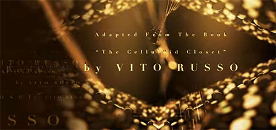

---
redirect_from:
  - "/videos/fzn9x4xgtwy"

date: 2023-05-18
title: When Hollywood Came Out of the Closet
parent: pW_RjbZYi1s
status: Auto
aka: !!seq
  - "Opening Hollywood's Closet (Thumbnail)"
topics: !!seq
links: !!seq
  - "https://www.youtube.com/watch?v=PimkEyKQqoQ"
  - "https://archive.org/details/james-somerton-youtube-2023-12-03/20230518+fzN9x4XgtwY+When+Hollywood+Came+Out+of+the+Closet.webm"
notes:
  - hbomb

contributors:
  downloaded: $cite$TerraJRiley

cite:
  clips: !!map
    sunday_bloody: { short: "Sunday, Bloody Sunday", full: "TODO sunday_bloody" }
    archie_bunker: { short: "archie_bunker", full: "TODO archie_bunker" }
    pink_flamingos: { short: "pink_flamingos", full: "TODO pink_flamingos" }
  yikes: !!map
  misinformation: !!map
  plagiarized: !!map
---


<compare>
<credits class="desc">

[sponsor plug]

[patreon link]
[website link]

00:00 Introduction  
08:06 Chapter One  
17:13 Chapter Two  
22:53 Chapter Three  
#lgbt #lgbtq  

</credits>
</compare>



<compare>
<james >

This video is brought to you by Squarespace.

</james>
<from></from>
</compare>

<compare>
<james >

> "This film is not about lesbianism, it's about the power of lies to destroy people's lives"
>
> "This film is not about homosexuality, it's about loneliness"
>
> "This film is not about homosexuality, it's about insanity"

</james>
<from></from>
<clip >

(Four guys doing some kind of line kick thing) "Kick'em up, Jeremy!"

</clip>
<james >

This film is definitely about homosexuality. *The *Boys in the Band** is a 1970 American film directed by William Friedkin of *Exorcist* fame, based on the 1968 Off-Broadway play of the same name by Mark Crowley. The film takes place in New York City in 1968, and follows a group of gay friends who gather for a birthday party. 

The main character is Michael, a neurotic and self-loathing gay man who is hosting the party for his... "friend" Harold, a flamboyant and witty gay man. As the night wears on, the guests become increasingly drunk and confrontational, leading to heated arguments and revelations about their personal lives. The arrival of a *straight* friend, Alan, adds to the tension as he is uncomfortable with the gay culture and the... open homosexuality on display. 

</james>
<from></from>
<james >

As the night progresses, the character's relationships with each other become more complicated, leading to a climactic confrontation that exposes their vulnerabilities and insecurities. On the strength of a classy set of New York stage reviews, and its billing as a "comedy", despite its dead serious content, *The *Boys in the Band** was taken for *gospel* in an America populated by people who had never met a homosexual in their entire lives.

The film... was not *positive*, but it was fair. The only heterosexual character, Alan, can easily despise the nelly Emery because he is everything a gay is supposed to be... a butterfly in heat. Alan even comes to pity the battered sissy in the end. 

</james>
<from></from>
<james >

But what *scares* Alan and the audience, what they could not come to terms with or understand, is the homosexuality of Hank and Larry, who are both just as queer as Emery yet *look* just as straight as Alan. The possibility that there could be non-stereotypical homosexuals, who are *also* staunch Advocates of a working gay relationship, is presented by the two lovers throughout the film. And they are the two characters most often ignored by critics and analysts. It is Larry who speaks of rejecting heterosexual concepts of marriage and creating a relationship with respect for one another's freedoms, with no need to lie or pretend. 

At the end of the film, Larry and Hank win a telephone Truth game that Michael has *viciously* devised. When they call each other and say...

</james>
<from></from>
</compare>

<compare>
<clip >

"I love you."

</clip>
</compare>

It is when Larry and Hank express affection for each other *physically and verbally* that the audience and the lone straight party guest are *most* uncomfortable. In contrast, Michael's inability to deal with his own homosexuality is exposed as old-time movie melodrama, and Harold's final *equally* melodramatic speech puts it into perspective:

<compare>
<clip >

"You're a homosexual and you don't want to be. But there's nothing you can do to change it. Not all your prayers to your God. Not all the analysis you can buy in all the years you've got left to live. You may very well one day be able to know a heterosexual life, if you want it desperately enough. If you pursue it with the fervor with which you annihilate. But you'll always be homosexual as well. Always Michael. Always."

</clip>
<james >

The speech encapsulated self-hatred and reflected a generation of gay men who were indoctrinated to blame their problems all on their homosexuality. In the end Michael's self-hatred and inability to function became as archaic as Harold's habit of putting his weed in a Band-Aid box in the medicine chest so that he could flush it down the toilet in case the cops arrived. 

Michael's weeping fits and old movie visions shone light, not on his homosexuality, but on the fallacies and illusions of Hollywood dreams. Dreams that had taught gay men that they were not welcome in polite society. Hollywood was not moved to change a wit by all of this hysteria in gay drawing rooms in Manhattan though. Yet *Boys in the Band* moved gay men throughout the country. 

</james>
<from></from>
<james >

The internalized guilt and self-hatred of eight gay men at a Manhattan birthday party formed the best and most *potent* argument for Gay Liberation ever offered in popular media. It provided actual and personal instances of the detrimental repercussions of what gay men learn about themselves through media falsehoods. And the film sparked the first public pushback by a budding gay rights movement *against* Crowley's plays accepted prejudices. Gay protesters did not deny the existence of such stereotypes. bUt they were quick to point out that the viewpoint was one-sided and the prejudice is defined as the sole depiction or representation of any group of people by a minority stereotype. 

</james>
<from></from>
<james >

The *Boys in the Band* was a movie about gays... and a gay movie. It was a creation born of a subculture and reflected a *harsh* reflection. Society viewed it as if it were a scientific trip. But it was an interior journey for many gays who were shocked by the sadness of Michael's sickening rituals. Many of Crowley's caricatures were misconceptions that gays had accepted and even fit themselves into since there seemed to be no other option. 

The audience for *Boys in the Band* included gay people who had grown up thinking that they were the only gays in the world. The film explored passing and not being able to pass, loving and not being able to love, and above all else, surviving in a world that denied one's very existence. But it did so before an American public that was at the stage of... *barely* being able to *mention* homosexuality at all.

</james>
<from></from>
</compare>

<compare>
<james >

But before we explore in more detail how homosexuality actually started to be shown on film, let's hear a word from our sponsor:

[Sponsor read]
<!-- this video is brought to you by Squarespace building a site with Squarespace is a great way to build your brand and reach a wider audience whether you're a visual artist photographer a writer a video producer or work in any creative field it's vital to have a site that you can use to help build your brand on your own terms Nick and I have had a presence on social media for a while now and obviously this channel but using Squarespace is incredibly intuitive and easy to use tools we've built the James Summerton Channel website featuring a Blog where Nick and I write about topics that probably wouldn't make for a full video a special section where you can check out preview chapters of my upcoming novel as well as check out Nick's novel gentlemen's club and using squarespace's video hosting features we're able to give you access to videos that YouTube made us remove you can head to squarespace.com right now for a free trial and when you're ready to launch your site go to squarespace.com James S that's j-a-m-e-s-s to save 10 off of your first purchase of a website or domain start showing the world how amazing you are today with Squarespace -->

</james>
<from></from>
</compare>

<compare>
<credits class="opening"  style="letter-spacing: 6px; font-family: serif;">

> Telos Pictures  
> presents

> Written by  
James Somerton  

> Adapted From The Book  
> "The Celluloid Closet"  
> by VITO RUSSO  

> Executive Producers  
[Ten Patron Names]

> Executive Producers  
[Ten Patron Names]

> Executive Producers  
[Ten Patron Names]

> UNREQUITED  
> The History of Queer Hollywood

</credits>
<comment>


</comment>

<credits >
<header>Title card:</header>

\[Over black]:

> Episode Five
>
> A Crack in the Closet

</credits>
</compare>

<i class="fa-solid fa-right-to-bracket"></i> For the compilation video, resume here.

<compare>
<james >

Within a few years of *Boys in the Band*, there was *Summer Wishes, Winter Dreams*, in which Joanne Woodward's son's homosexuality is solely perceived in terms of how it impacts her current midlife crisis, as yet another sign of her failure as a wife and mother. She eventually comes to terms with it, but her son leaves for Amsterdam with a friend and refuses to visit his parents until they can live with him as he truly is. He makes *their* reluctance to recognize him as a full person their problem. A family affair rather than his.

</james>
<from></from>
<james >

*A Very Natural Thing*, the first film with homosexual liberation themes designed for commercial distribution, was then released in 1973. The film investigated the possibilities available to gay couples on society's terms and raised the questions "how do two guys who refuse to play society's game define a non-role-based relationship?" While the film was inspired by the gay liberation movement, it was dismissed as a trivial soap opera by the establishment press and *savaged* by gay liberationists for its romantic illusions and lack of radical conviction. 

David, an ex-seminarian, teaches school in New York City, and settles into a monogamous relationship with Mark, a straight-identified insurance salesman in the film. The first part of the movie examines their meeting, romance, union, and split. The relationship is a protracted and planned love story parody, in which they go to the Opera, roll in the fall leaves in Central Park, watch each other shave in the morning, and imitate *every* heterosexual movie cliche about love and marriage. 

</james>
<from></from>
<james >

The connection ends due to Mark's reluctance to be "possessed" and David's nagging fears. David investigates the alternatives in the second half of the film: promiscuous sex in Fire Island bath houses and orgies are as unsatisfactory to him as his persistent loneliness. David meets Jason, a divorce photographer, who helps him begin to alter his notions about the nature of homosexual relationships. 

Freedom from the assumption of roles in an unstructured relationship is difficult to depict on film in a poetic style without inviting skepticism. But the filmmakers were aware of this and purposefully opted to regard romance as the bottom line. As a result of the filmmakers couching his message in such endlessly romantic terms, the picture *enraged* the same people fighting for such a political redefinition. *A Very Natural Thing* had such significant promotion and distribution issues that it had little influence. 

</james>
<from></from>
</compare>

<compare>
<james >

However, it is still viewed as a breakthrough film in queer cinema theory classes. The New York Post described it as "an argument" rather than entertainment. While Judith Christ said:

> "If the gay liberation movement wants its own mediocre movie...
>
> Here it is!"

Elsewhere in cinemas, John Schlesinger's *Sunday Bloody Sunday* was a poignant, understanding, and interesting story that has *consistently* been cited since as an example of a good gay film... that failed to make it at the box office: proof that homosexuality is not a money-making proposition in movie terms. The problem however was in the packaging. 

</james>
<from></from>
<james >

*Sunday Bloody Sunday* was a talky introspective British production that wasn't intended for a wide audience in the United States. It was noted in the 1980s that:

> "There appears to be very little room in the American market anymore for the 'small but interesting' film. According to producers and writers, this is now the specialty of television films."

Interesting how history repeats itself, as small and interesting now seems to be the forte of streaming services. 

> "This film... <ins>(Schlesinger said)</ins>
>
> ...is not about the sexuality of these people."

</james>
<from></from>
<james >

(These movies *never* seem to be about the sexuality of the people in them.) These people were a gay doctor, a straight career lady, and a bisexual artist with whom they were both in love. *Sunday Bloody Sunday* was *not* about sexuality as Schlesinger correctly said, however it was a film in which alternative sexuality was taken for granted. Something that gay activists had long sought. It was a film on human relationships, and how they do not always correspond to our expectations of what love should be. 

The film portrayed a joyful ending for a gay character whose boring resignation is not the result of his homosexuality. In his final monologue, he informs the audience:

</james>
<from></from>
<clip >

"They say, it never made you happy, and I said, but I *am* happy. Apart from missing him. All my life I've been looking for somebody courageous... resourceful... he's not it. But something... we were something..."

</clip>
<james >

But America ***despised*** *Sunday Bloody Sunday*. One kiss between the men created *even more controversy* than scenes of them *in bed* together! Male-male relationships were characterized by... nothing but sex. Yet genuine *love* between men was frowned upon in most eyes. And it was the first time on-screen when a loving kiss between two men was not intended to shock or repulse in American cinema. It drew *gasps* from Spectators! And as a result, several theaters refused to book the film at all.

However, it provided gay moviegoers with a *mostly positive* experience, even if they were the only people in the theater. Aside from the more serious gay films, gays were popping up in small roles all over Hollywood, mostly as comedic foils. Perhaps most famously in Mel Brooks's *The Producers*. But all of this laughter was lost on the National Gay Task Force, which issued a set of guidelines for studios to follow including:

> - Homosexuality isn't funny.
> - Use the same rules you have for other minorities. If bigots don't get away with it if they hate Catholics, they they can't get away with it if they hate gays.
> - Stereotypical people do exist. But if such a minority of any group receives exclusive media exposure... That is bigotry. 

Hmm... Television, which is subject to the regulation of the FCC *and* to the reaction of its advertisers to vocal public opinion, was more vulnerable to this type of activist pressure than was the motion picture industry. Television programming, which aired nearly 24 hours a day, was always in need of societal concerns to address. Homosexuality being one of them. A film must be a success, but if a television show fails, there is *always* next week and another subject to try. Therefore experimentation was encouraged.

</james>
<from></from>
</compare>

<compare>
<james >

Pressure from gay liberation influenced television's approach to portraying homosexuality for the American audience. And it was successful in achieving a more balanced and... *surely* more prolific discourse on television than in film. Archie Bunker, Norman Lear's charming bigot, first encountered homosexuality in 1972, when he realized that one of his drinking buddies, a former football star, was gay. 

</james>
<from></from>
<clip >

Buddy: "How long you known me? 10-12 years?"

Archie: "Yeah?"

Buddy: "In all that time, did I ever mention a woman?"

Archie: (staring) "But what difference does that make? You're a bachelor!"

Buddy: "So?"

(Laugh track)

Archie: "I know, but pastors, they're... they're always acting kind of private."

Buddy: "Exactly."

(Beat as they stare at one another. Laugh track.)

Archie: "Oh, come on, Steve..."

</clip>
<james >

Watching from the White House, President Nixon... [chuckles] declared it "*distasteful*"! Because it made "a good man look like a fool". It is unclear if Nixon was talking about Archie Bunker or the football player.

</james>
<from></from>
</compare>

<compare>
<james >

That same year, ABC made a *significant* step forward in the portrayal of ordinary gay men on television. *That Certain Summer*, a two-hour movie of the week, presented the story of a divorced dad who chooses to tell his 14 year old son that he is gay when his son arrives for a weekend visit. When the father eventually gets around to describing the issue to his son, the boy rushes away unable to deal with it. 

For gay liberationists, the narrative was a little too soft. While it earned *glowing* reviews in the mainstream press, several gay writers criticize it for being too hesitant and unduly cautious. But with the *critical* success of *That Certain Summer*, the barriers seemed to come *crashing down* for television. 

</james>
<from></from>
<james >

By the mid-1970s, queer characters had appeared on virtually *every* sitcom, drama, and talk show in prime time TV: *All in the Family*, *Rhoda*, *Maude*, *Barney Miller*, *Mash*, *The Bob Newhart Show*, and scores of others featured gay characters. *The Naked Civil Servant* and *The War Widow*, two spectacular television dramas, were uplifting depictions of the lives of LGBTQ people, both real and fictitious. Both series instilled in its key characters a sense of history, and their position as strugglers for sexual freedom. Both shows revealed a hidden aspect of the gay experience through romance and humor. 

Although Quentin Crisp's story in *The Naked Civil Servant* was [chuckling] not a gay liberationist's dream by any means, gays greatly admired and respected Crisp's defiant lifestyle.

</james>
<from></from>
<clip >

Quentin (in voiceover): "When you're being followed, there are a number of rules to obey:"

\[Presented as a silent movie title card, read out loud by Quentin]:
> Never look back.

(dramatic music as a person walks) 

> On no account run.

(More walking) 

> Gradually increase the pace to five miles an hour.

(Faster walking)

> If this does not deter him&mdash;

(man following catches up quickly, looking at main character)

> Do not stop until forcibly stopped.

Follower: (stops main) "Hey."

> Stand still and look at him. It may work.

Follower: "Who de 'ell do you fink you are?!"

> Be very polite. It may work.

Quentin: (to man) "No one, really. Sir."

> Offer money. It may work.

</clip>
</compare>

<compare>
<james >

Yet, no gay heroes emerged on the movie screen. At least not until the release of *Dog Day Afternoon*. The film, directed by Sydney Lament and starring Al Pacino, is a complex and nuanced exploration of the queer experience. Set during a bank robbery gone awry in Brooklyn, the film tells the story of Sunny, a man who robs a bank in order to pay for Leon's (Sunny's partner's) gender confirmation surgery. (Leon isn't given a feminine name in the movie, FYI.)

As the story unfolds, we learn more about Sunny and Leon's relationship. We discover that Leon is a pre-op trans woman and Sunny is willing to do whatever it takes to support her, *including* robbing a bank to fund the procedure. This is a powerful statement about the lengths that queer people will go to in order to support and care for one another. Especially in a society that is often hostile and unwelcoming. 

</james>
<from></from>
<james >

The film also explores the impact of queer identity on the character's relationships with their families. When Sonny's mother comes to the bank to try and talk him out of the robbery, he reveals to her that Leon is a trans woman. Her reaction... is one of shock and disgust. 

Another important queer theme in *Dog Day Afternoon* is the way that Sunny sexuality and gender identity intersect with his working class background. Throughout the film we see Sunny interacting with other members of his community, including his friends and the police officers who are trying to negotiate with him. His working class background is an important part of his identity, and it's clear that he feels a sense of loyalty and connection to his community. Something not often seen among queer characters, who were usually artists or working in fields of high esteem, like universities.

</james>
<from></from>
<james >

Made for a budget of <q>3.5 million dollars</q> it went on to gross <q>56 million dollars</q> at the box office, or <q>381 million dollars</q> when adjusted for inflation. And was nominated for six Oscars, including Best Picture, *bursting the bubble* of the assumption that movies with queer characters and themes can't succeed. 

But... Al Pacino returned to gay cinema five years later with *Cruising*, which... did not go over so well. *Cruising* was based on a 1970 novel by the New York Times editor Gerald Walker, that portrayed the process by which a New York city policeman, assigned to capture a psychotic killer of gay men, becomes aware of his own homosexuality... and then commences killing gay men. 

</james>
<from></from>
<james >

The gay characters in the novel are all filled with self-hatred and hatred for the people who "turned them gay"; the blame usually falls on the first man with whom they had sex. The killer intimates that the homosexual lifestyle is an inherently violent one. The killer in the *film adaptation* knifes his victims to death during or immediately following sex, and the film opens with a shot of a gangrenous severed arm floating in the Hudson River.

Al Pacino's character, a cop, immerses himself in the underground of heavy leather and sadomasochism. As the film goes on he becomes agitated and restless, a state brought about by his own sexual identity crisis, though his motives are never explored or explained. When he finally *locates* the killer, he stabs him, which puts the killer in the hospital under police custody.

</james>
<from></from>
<james >

Pacino's assignment is over. However, another murder follows... this time that of Pacino's gay next door neighbor, who was the only relatively happy gay character in the movie. It is implied in the end that Pacino himself had committed this final murder and the film ends with him gazing at himself in a mirror. 

In a statement to the press the director/screenwriter William Friedkin (of *Boys in the Band*) said that he was not sure who the real murderer was and that furthermore he did not consider the murderer to be homosexual. A more likely conclusion is that Friedkin *deliberately* obscured the identity of the killer, either consciously or unconsciously as a response so the wave of protests that arose in the summer of 1979, when he began filming. Gays who protested the making of the film maintained that it would show that when Pacino recognized his attraction to the homosexual world, he would become psychotic and begin to kill. So Freedkin avoided that situation by leaving the ending of the film relatively ambiguous.

</james>
<from></from>
<james >

Yet Friedkin realized that his film said what gay activists claimed it said... and he had a disclaimer to all prints of the film:

> "This film is not intended as an indictment of the homosexual world. It is set in one small segment of that world, which is not meant to be representative of the whole."

Gay audiences around this time began to see that Hollywood was willing to overlook successful queer films, but would **mire** themselves in their failures. The most insightful and important films were those which... had been made in struggle, by small groups of people, and against tremendous odds.

</james>
<from></from>
<james >

The producers and directors of the British film *Nighthawks* spent five years preparing and gathering funds for their film about a gay teacher who spends his nights cruising in bars and discos and having one-night stands. *Nighthawks* offers an almost documentary style look into the evening cityscape of the ritualistic life of a man who is becoming aware that he lives two lives. The dispassionate view of London gay nightlife allows a gay male audience to experience *the hunt* as more than a passive spectator. There is an uncanny feeling that each member of the audience is *himself* cruising, recognizing a look, a gesture, a glance, then realizing it is meant for the character in the film, through whose eyes we are looking. 

No slick and sensational Hollywood peep show. *Nighthawks* is a perceptive film with, modest intentions, and it succeeded without compromising its scope for commercial reasons. While William Friedkin was on New York streets filming the blood and guts Hollywood version of the gay underground, *Nighthawks* opened in New York and got what turned out to be... better reviews than *Cruising* would get six months later. And some queer filmmakers were willing... not just a step outside of the Hollywood system... [chuckling] but *shit all over it.*

</james>
<from></from>
</compare>

<compare>
<james >

John Waters became *synonymous* with the queer underground cinema movement of the 1970s thanks to his outrageous and subversive style. Waters' films are known for their irreverent humor, over the top characters, and outrageous subject matter. He has always been drawn to the marginalized and the taboo, and his films often explore themes of sexuality, gender, and identity. Many of his films feature queer characters, and he has been credited with helping to break down barriers and challenge stereotypes about queer people. *Especially* the messy ones. And we love a messy queer.

Waters's film *Female Trouble*, released in 1974, is a classic example of his queer cinema. The film follows the story of Don Davenport, played by *the divine* Divine, who is a rebellious teenager with a troubled home life. She runs away from home and becomes involved in a series of crimes, ultimately leading to her downfall. The film features a cast of characters that includes drag queens, sex workers, and other outsiders, who challenge societal norms of gender and sexuality. 

</james>
<from></from>
<james >

Another notable film in Waters' canon is *Desperate Living*. The film takes place in a fictional town called Mortville, where the residents are all social outcasts and deviants. The film features a cast of characters that includes a lesbian couple, a transgender woman, and a group of militant feminists. The film is a... ***dark*** comedy, that explores themes of power, privilege, and oppression. 

And, most iconically, there's *Pink Flamingos*. The queerness of this film is evident in the way it portrays its characters and its themes, and it remains a *potent* example of the power of queer cinema to disrupt and subvert *all expectations*.

</james>
<from></from>
<clip >

Divine: "Gentlemen of the press, get ready, 'cause you are about to witness the biggest news event of the year: Live homicide!"

</clip>
<james >

One of the most striking aspects of *Pink Flamingos* is the way it portrays its Central character. Divine is a *larger than life* figure, both in terms of her physical appearance and her personality. She is a force of nature, unapologetically embracing her own queerness, and challenging *anyone* who tries to limit or control her. Her sexuality is fluid, and she engages in relationships with both men and women throughout the film. 

</james>
<from></from>
<james >

In addition to its portrayal of queer characters, *Pink Flamingos* also explores themes that are central to the queer experience. The film's focus on outsiders and those who are marginalized by mainstream society is a recurring theme throughout, with characters like Divine and her cohorts living on the fringes of society and rejecting traditional norms. At the same time, *Pink Flamingos* is also a celebration of queer culture, and a testament to the power of queer resilience. Despite the violence and degradation they face, Divine and her cohorts remain defiant, *refusing* to be cowed by the oppressive forces of society. Their queerness is a source of strength, and a way of connecting with others who share their experiences, creating a sense of community and belonging in the face of adversity.

Content warning, though. [laughing]

</james>
<from></from>
<james >

Waters' films are also notable for their celebration of Camp, a style that embraces theatricality and excess. Water's influence on the world of film and popular culture is *undeniable*. He has inspired countless artists and filmmakers, and his work has been celebrated for its subversive and irreverent humor. His films have also helped to pave the way for a greater representation of queer characters and stories in *mainstream* media. By challenging societal norms and pushing boundaries, Waters has left an indelible mark on the world of cinema and beyond. These queer underground round films opened the minds of many who wanted *nothing to do* with queer people.

Throughout the 1970s we continued to appear on some of the most popular TV shows in the world, such as *Dallas* and *MASH*. And in 1979, came the groundbreaking documentary *Before Stonewall*. The documentary combines archival footage, interviews with queer activists and scholars, and personal accounts to Chronicle the history of the queer community in America. It highlights the experiences of queer people in different regions of the country and in various spheres of society, including the arts, politics, and even Sports. 

</james>
<from></from>
<james >

One of the documentary's key strengths is its emphasis on diversity in the queer community. The film showcases the lives of people like Bayard Rustin, a gay African-American civil rights leader who worked with Martin Luther King. And Sylvia Rivera, a transgender activist who played a *significant* role in The Stonewall Riots. Film and television were now being used to show the world that we were people. Complex and diverse. 

And with a burgeon and queer political power structure rising up in California New York and DC, as well as a crop of new gay filmmakers beginning to be noticed by Hollywood, it seemed like we were ready to tear down those closet doors for good. And in the summer of 1981, pre-production had even begun on *Making Love*, a major studio film from 20th Century Fox about a married man coming to terms with his homosexuality and the love triangle that develops between him his wife and another man. 

</james>
<from></from>
</compare>

<compare>
<james >

[Music suddenly stops.]  
But in that same summer... a rare cancer began appearing in gay men, followed by a cluster of pneumocystis pneumonia cases in San Francisco and New York. And then gay men across the world began dying. And suddenly *Hollywood's* opinion of us... didn't matter so much.

</james>
<from></from>
</compare>

<compare>
<credits >

\[On screen over black and silence:]
> Part 6:  
> Hollywood, America, & AIDS
>
> Coming This Fall

</credits>
<comment>


This never happened.

</comment>
<credits  class="closing">

\[Patreon credits roll over silence.]

</credits>
</compare>
