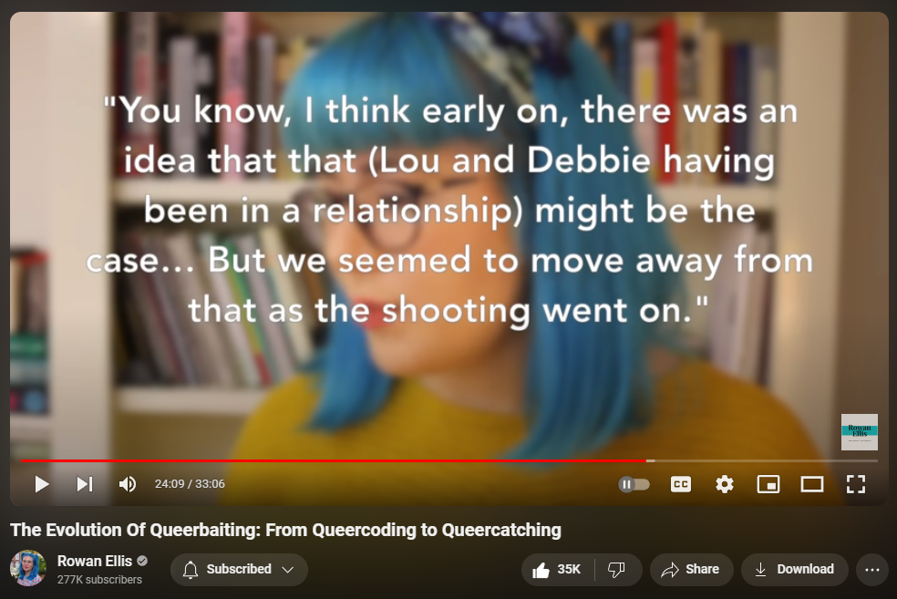

---
redirect_from:
  - "/videos/Unrequited1"
  - "/videos/unrequited1"
  - "/videos/m8drq9-scsi"

# cspell:words: Umbridge ALBUS Snape Hermione Dementors Diggory Slytherin Gryffindor Malfoy
date: 2020-07-01
title: "Unrequited: The History of Queer Baiting"
status: Finished
aka: !!seq
topics: !!seq
  - The Hays Code
  - Rebel Without A Cause
  - Ben-Hur | Children's Hour
  - Merlin | Sherlock | Cursed Child
  - Teen Wolf | Frozen | Star Wars
  - Ocean's Eleven | Captain America
links: !!seq
  - "https://www.youtube.com/watch?v=cLWZV-SHmeY"
  - "https://vimeo.com/907695863"
  - "https://web.archive.org/web/20200703125317/https://www.youtube.com/watch?v=m8DRQ9-sCSI&gl=US&hl=en"
description: "a video essay repackaging The Celluloid Closet and Alexander Avila's videos."
notes:
  - visual
  - hbomb

contributors:
  downloaded: "[tobi-cat](https://github.com/tobi-cat) from [YouTube Archive video](https://www.youtube.com/watch?v=cLWZV-SHmeY)"
  formatting: $cite$tustin2121
  citation: 

cite:
  clips: !!map
    celluloid_closet: $cite$celluloid_closet_doc
    cabaret: { short: "Cabaret", full: "TODO Cabaret" }
    rebel_without_cause: { short: "Rebel Without A Cause", full: "TODO Rebel Without A Cause" }
    merlin: { short: "Merlin", full: "TODO Merlin" }
    sherlock: { short: "Sherlock", full: "TODO Sherlock" }
    teenwolf: { short: "teenwolf", full: "TODO teenwolf" }
    not_star_wars: { short: "not_star_wars", full: "TODO not_star_wars" }
    star_wars_7: { short: "star_wars_7", full: "TODO star_wars_7" }
    ellen_starwars: { short: "ellen_starwars", full: "TODO ellen_starwars" }
    starwars_interview: { short: "starwars_interview", full: "TODO starwars_interview" }
    captain_america: { short: "captain_america", full: "TODO captain_america" }
    winter_soldier: { short: "winter_soldier", full: "TODO winter_soldier" }
    
    buzzfeed_costumes: { color: 11, short: "(Vary, 2018)", full: "Vary, A.B. (2918, Jun 8). <em>Everything You Need To Know About The Fabulous Costumes In \"Ocean's 8\"</em> [Article]. Buzzfeed News. Retrieved Feb 16, 2024, from", url: "https://www.buzzfeednews.com/article/adambvary/oceans-8-costumes" }
  yikes: !!map
  misinformation: !!map
    historians: "James just steals a made-up (sarcastic?) term and passes it off as something commonly heard in the queer community."
    misinterpretation:
      _desc_: James has a propensity to misunderstand what he's playwriting from, like
      scorpius_life: the time he said Scorpius's life was worse with Albus in it
    wrong_names:
      _desc_: James seemingly deliberately gets multiple names wrong in his script, presumably to avoid plagiarism detection, including
      richard_dyer: "Richard Dyer"
  plagiarized: !!map
    celluloid_closet: $cite$celluloid_closet_doc
    peter_howell: { color: 2, short: "(Howell, 2014)", full: "Howell, P. (2014, Jun 20). <em>Why Rebel Without a Cause was a milestone for gay rights</em> [Article]. Toronto Star.", url: "https://www.thestar.com/entertainment/movies/why-rebel-without-a-cause-was-a-milestone-for-gay-rights/article_2243c10d-f260-5dfa-b132-1e6911d0bffd.html"}
    maddy_myers: { color: 12, short: "On Stucky Fandom (Myers, 2016)", full: "Myer, M. (2016, Jul 5). <em>On Captain America: Civil War, Stucky Fandom, and “Why Can’t They Just Be Friends?”</em> [Article]. The Mary Sue. Retrieved February 15, 2024, from", url: "https://www.themarysue.com/why-cant-stucky-just-be-friends/" }
    jill_gutowitz: { color: 7, short: "Ocean's 8 (Gutowitz, 2018)", full: "Gutowitz, J. (2018, Jun 11.) <em>‘Ocean’s 8’ is Extremely Gay—So Why Isn’t It Gay?</em> [Article]. INTO. Retrieved February 15, 2024, from", url: "https://www.intomore.com/culture/oceans-8-is-extremely-gay-so-why-isnt-it-gay/" }
    aretheygay_merlin: { color: 1, short: "Merlin (Avila, 2016)", full: "Avila, A. (2016, Nov 23). <em>Are They Gay? - Merlin and Arthur (Merthur)</em> [Video]. YouTube.", url: "https://www.youtube.com/watch?v=6BkOoEhtxTs"}
    aretheygay_finnpoe: { color: 3, short: "Poe/Finn (Avila, 2016)", full: "Avila, A. (2016, Jan 24). <em>Are They Gay? - Poe and Finn (Star Wars)</em> [Video]. YouTube.", url: "https://www.youtube.com/watch?v=NVompS_JoJw" }
    aretheygay_sherlock: { color: 4, short: "Johnlock (Avila, 2016)", full: "Avila, A. (2016, Apr 8). <em>Are They Gay? - Sherlock Holmes and John Watson (Johnlock)</em> [Video]. YouTube.", url: "https://www.youtube.com/watch?v=RpItybDHavo" }
    aretheygay_sterek: { color: 6, short: "Sterek (Avila, 2017)", full: "Avila, A. (2017, Jul 6). <em>Are They Gay? - Derek Hale and Stiles Stilinski (Sterek)</em> [Video]. YouTube.", url: "https://www.youtube.com/watch?v=7ei-Le2O7lc" }
    aretheygay_cursed: { color: 5, short: "Albus/Scorpius (Avila, 2016)", full: "Avila, A. (2016, Oct 11). <em>Are They Gay? - Albus Potter and Scorpius Malfoy</em> [Video]. YouTube.", url: "https://www.youtube.com/watch?v=MNntQQ1qHuo" }
    rowan_ellis_queerbaiting: { color: 15, short: "Queerbaiting (Ellis, 2019)", full: "Ellis, R. (2019, Jan 30). <em>The Evolution Of Queerbaiting: From Queercoding to Queercatching</em> [Video]. YouTube.", url: "https://www.youtube.com/watch?v=riKVQjZK1z8" }
    merthur_ytcrack: { color: 9, short: "(Wolflynn98, 2019)", full: "Wolflynn98 (2019, Jul 16). <em>merthur crack(?) or whatever</em> [Video]. YouTube.", url: "https://www.youtube.com/watch?v=8CZtuSNqlnM" }
    johnlock_clips: { color: 8, short: "(hehehegay, 2014)", full: "hehehegay (2014, May 12). <em>JOHNLOCK EVIDENCE (Series 1-3)</em> [Video]. YouTube.", url: "https://www.youtube.com/watch?v=fsKWdvsxvN4" }
    johnlock_maryamv: { color: 13, short: "(OneAllysa, 2017)", full: "OneAllysa (2017, Mar 19). <em>BBC Sherlock || Mary Watson || Love and War</em> [Video]. YouTube.", url: "https://www.youtube.com/watch?v=xc_L7oSPdgQ" }
---



<compare>
<credits class="desc">

A video essay exploring the history of queer coding, queer baiting and, basically, the history of gay representation in Hollywood.

Patreon: [link]

Twitter: [handle]

(Please ignore the scrolling text at 58:48. It's the wrong text. That's what I get for editing a 90 minute video in one day XD )

A very special thanks to Vito Russo and the producers of "The Celluloid Closet", without whom the first part of this video would have been pretty much impossible. 

This video contains copyrighted material. The use of which has not always been specifically authorized by the copyright owner. I am making this material available in my efforts to further bring to light the history of LGBTQ+ representation in film and television. I believe this constitutes a fair use of any such copyrighted material as provided for in section 107 of the US Copyright Law.

</credits>
<comment>

  
  
  
  
  
  
  
  
  
  
  

</comment>
</compare>



<visual >

James uses MANY clips from *The Celluloid Closet* (1996).

</visual>
<visual-line></visual-line>


<!-- 

The "RESTRICTED" list
Rope
Tea and Sympathy

-->



<compare>
{{ VISUAL_TCC }}
<credits class="opening">

<u>[Piano music playing over fancy title screen]:</u>

> Unrequited  
The  
History  
of  
Queer Baiting

</credits>

<james vid >

The queer community has become incredibly good at finding queer subtext in movies and TV shows, whether it exists or not. 

For over a century of film and television, we've probably been the most  
underrepresented minority in media. It was never illegal for a character of color to exist in a movie, but it *was* illegal, for a long time, for a queer character to exist. Writers, directors, and producers could be taken to court under obscenity laws, fined and even jailed, for having the nerve to show a queer character. 

At the same time, it's become a culturally agreed upon fact among  
cis-straight people, to the point of parody, that the queer community runs Hollywood. The Velvet or Pink Mafia, supposedly now run by David Geffin, is even an assumed queer media cartel that inserts LGBT messaging into movies and TV shows to corrupt the youth of America.

The funny thing is, this isn't entirely false. I mean, we're not trying to corrupt the youth of America; growing up alone in the suburbs is doing a fine job of that all on its own. 

</james>
<from></from>
<james >

But there has always been a loose collective of queer creators that *do* insert coding into a lot of movies, TV shows, and books, coding that would likely be ignored by straight audiences but immediately recognized by those of us who are on the lookout. It's reached a bit of a fever pitch lately, with Poe and Finn, Steve and Bucky, *Teen Wolf*, *The Legend of Kora*, and even *Frozen*. But just because people outside queer spaces are finally recognizing it doesn't mean it's a new thing. What we now call queer baiting has been around since the early days of cinema. Sort of. Film historians have given the early days of this phenomenon the name "queer coding", which a lot of people confuse with "queer baiting", but there is a big difference between the two. 

</james>
<from></from>
<james >

"Queer coding" is when you're unable to show actual queer characters on screen, either because of the laws or morals of the day, or because studio executives just won't let you. So you create characters that the right audience will *obviously* view as gay, lesbian, bi, or transgender, to allow for LGBT representation when the entire world is telling you not to. A little golden nugget hidden deep underground for the people who are willing to dig for it. 

While "queer baiting" is when you *do* have the ability to add queer characters to your film or TV show, but just don't want to risk turning off certain audiences or advertisers by doing so. One is an effort to give LGBT audiences at least a taste of representation, while the other is used to reel in said audience with an implied promise of queer characters without ever actually intending on fulfilling that promise.

It's like the cinematic equivalent of edging without the money shot.


</james>
<from></from>
<james >

So let's look at the history of this practice, discover media you may not know is intended to be read as queer, see when the line between queer coding and queer baiting began to blur, and why we still don't have an out LGBT superhero in the MCU.

</james>
<from></from>
</compare>

## Part One: Cracking the Code


<compare>
{{ VISUAL_TCC }}
<james span=2 >

<u>[Text printing on screen (typewriter effect)]:</u>

> <mark></mark>"Your ideas about who you are don't just come from inside you, they come from the culture. And in this culture they come especially from the movies. So we learn from the movies what it means to be a man or a woman. What it means to have sexuality."
>
> <mark fc=false id="richard_dyer" stat:id="changed-name">-Richard Dryer, film historian</fc>

</james>
<from >

Richard Dyer (Film Historian): <mark>"Your ideas about who you are don't just come from inside you, they come from the culture. And in *this* culture, they come especially from the movies. So we learn from the movies what it means to be a man or a woman. What it means to have sexuality."</mark>

</from>
<comment >

Throughout this section, James uses the same footage and same examples that *The Celluloid Closet* does, in the same order, but crops the video in close to remove the titles showing what movie it is, or cuts around when the titles appear, and makes the edits faster.

</comment>
<james >

A long time ago, in a Hollywood Far Far Away, gay characters were not all that uncommon. But they were played for laughs. In the early days of silent film,  
movies like *A Florida Enchantment*,  
*Algae the Minor*,  
and *The Soilers* featured gay characters as easy comic relief. The idea of homosexuality was even a gag  
in <mark num=1>*Behind the Screen*</mark>, <mark num=2>an early Charlie Chaplain film</mark> <mark num=3>that showed him kissing a tomboy</mark> and <mark num=4 x>being mocked for it</mark>. Being mocked by someone whose eye makeup could make Trixie Mattel blush.

</james>
<from >

<!--<u>[Showing footage of *Wanderer of the West* (1927)]</u>

<u>[Silent movie card]:</u> "Clarence, the clerk &mdash; &mdash; one of Nature's mistakes in a country where mene were men."

Dyer: "The movies did provide us with some kind of history of how society though homosexuals were."

<u>[Silent movie card]:</u> "'I wonder if you're going out with the boys tonight?'" -->

<u>[Showing footage now of *Behind the Screen* (1916)]</u>

Dyer: "A very good example, is <mark num=2>a Chaplin film</mark>, <mark num=1>'Behind The Screen'</mark>. There's an extraordinary moment <mark num=3>where Chaplin kisses someone who looks like a man</mark>. He knows that it's a woman. And someone else comes along and sees it. And <mark num=4 x>immediately starts swishing around in the most kind of overt effeminate way</mark>."

<u>[Footage shows just that.]</u>

Dyer: "It's fascinating that those stereotypes were so completely in place. That a, you know, a mainstream popular film could assume that the audience would know what this-- this swishy mime was all about."

</from>
<james >

It was around this time that that <mark num=1>the "sissy" stereotype was born</mark>: flouncy, bouncy, frilly men with creative jobs. Artists, designers... This grew out of the self-hatred among straight men who found it hard  
to provide for their families in lean times. You weren't a man if you couldn't support a wife and three kids. You weren't a man if you couldn't go off to war. So to appeal to the egos of these (quote-unquote) "real men",  
producers created <mark num=2>characters to make them feel better about their masculinity</mark>. Movies like *Our Betters*, *The Broadway Melody*,  
*Myrt and Marge*, and  
*Call Her Savage* were just a few films with such characters.

</james>
<from >

Narrator: "<mark num=1>Enter the sissy</mark>. Hollywood's first gay stock character."

<u>[Footage from *The Gay Divorcee* (1934)]</u>

Narrator: "<mark num=2>The sissy made everyone feel more manly</mark> or more womanly by occupying the space in between. He didn't seem to have a sexuality. So, Hollywood allowed him to thrive."

Jau Presson Allen (Screenwriter): "They were sissies. They were never addressed as homosexuals. It was a convention that wsa totally accepted."

</from>
<james >

This type of representation of gay men was not appreciated.

</james>
<from></from>
<clip >

Quentin Crisp: "<mark visual={{tcc}} on="10:48" off="11:02">We're always a joke. There's no sin like being a woman. When a man dresses as a woman, the audience laughs. When a woman dresses [as] a man, nobody laughs.</mark>"

</clip>
<from >

<u>[Showing footage of *Call Her Savage* (1932). Clip continues a little into Crisp's talking, cutting after "in movies".]</u>

Quentin Crisp (Writer): "Well, sissy characters in movies <mark>were always a joke. There's no sin like being a woman. When a man dresses as a woman, the audience laughs. When a woman dresses [as] a man, nobody laughs.</mark>"

<u>[Showing footage of *Morocco* (1930)]</u>

Quentin Crisp: "They just thought she looked wonderful."

</from>
<james >

This wasn't the only representation though. The 1927 film *Wings* featured a... a very intense friendship between two pilots that culminates in this scene:

</james>
<from></from>
<clip visual=none on="?" off="?" >

<u>[Silent clip from *Wings* where the main character kisses and talks to his co-pilot buddy who's dying.]</u>

</clip>
<james >

But scenes like that were few and far between. So while gay men were played for laughs, lesbians were something else entirely. 

<mark num=1>Marina Dietrich turned on both men and women</mark> with this scene in 1930s *Morocco*. A woman in a tuxedo wasn't entirely unheard of coming out of the Roaring 20s, but a woman in a tuxedo on film? That was groundbreaking. The lesbian kiss, a cherry on top. <mark num=2>Gary Cooper may have been Dietrich's real love interest in the film</mark>, but everybody left the theater talking about that scene.

</james>
<from >

<u>[Showing footage from Morocco (1030)]</u>

Susie Bright (Writer): "I saw Marlene Dietrich in *Morocco* when I was a teenager. I just was flipping the channels and saw her and decided to settle in for an old movie. And there's this scene where she comes into a nightclub and she's just stunning in this tuxedo."

<u>[Showing footage from Morocco (1030)]</u>

> Dietrich: (to lady at table) "May I have this?"
>
> Woman: "Of course."
> 
> [Dietrich takes flower, sniffs it, then kisses lady. Everyone bursts into raucous laughter and applause.]

Bright: "And the camera lingers. I mean, it wasn't like I was catching this out of the side of the screen. It's right in the center."

Bright: "<mark num=2>She has a romance with Gary Cooper in this movie</mark>. But that romance just went right out the window for me. I was just like, 'Who was that woman? What had happened?'" I started writing a whole other script <u>[laughs]</u> for what was really going on."

Arthur Laurents (Screenwriter): "So the thing worked for everybody of every sex. And what's amazing, I don't think they've done anything as delicious sexually as that since. They didn't pretend it was anything but what it was. <mark num=1>She was doing it to turn on both the woman and the man</mark>, which appealed to everybody. As it should. It was so free."

</from>
<james >

Not long after *Morocco*, we got *Queen Christina* the story of a realife Swedish Monarch who was infamous for being a,,, pretty out and proud lesbian for the day, though the filmmakers went out of their way to straightwash the historical figure, her real life sexuality bled onto the celluloid despite their best efforts.

</james>
<from span=2 >

Narrator: "The movie *Queen Christina* was based on the life of a real Swedish monarch and lesbian. Hollywood changed the story, but traces of the truth seem to linger."

> Chancellor: "There are rumors that your majesty is planning a foreign marriage?"
>
> Queen Christina: (shrugs) "They're baseless." (walks away)
> 
> Chancellor: "But your majesty! You cannot die an old maid!"
> 
> Queen Christina: (turns) "I have no intention to, Chancellor. I shall die a bachelor!"
> 
> <u>[Fades out]</u>

</from>
<clip visual={{tcc}} on="13:08" off="13:28" >

Chancellor: "There are rumors that your majesty is planning a foreign marriage?"

Queen Christina: (shrugs) "They're baseless." (walks away)

Chancellor: "But your majesty! You cannot die an old maid!"

Queen Christina: (turns) "I have no intention to, Chancellor. I shall die a bachelor!"

<u>[Fades out]</u>

</clip>
<james >

Along with homosexuality, sex, violence, and orgies were pretty common in early Hollywood, oddly in biblical films. And some people we're getting fed up with it.

Starting in 1922, after the earliest of these morally questionable films had become massive successes, and a series of real life Hollywood scandals had rocked the papers, <mark num=1>studio heads enlisted William H. Hayes, the former Postmaster General</mark> (so he was obviously qualified) to rehabilitate Hollywood's image. He was one of the few <mark num=2>unindighted members of Warren G. Harding's administration</mark> at the time, so obviously his moral fortitude was robust.

</james>
<from >

Gore Vidal (Screenwriter): "The big change occurred when the movie moguls got together. Let's save Hollywood. We must get an outsider, preferably some politician who was above suspicion. So they looked into <mark num=2>the cabinet of Warren G. Harding. At that time there were a number of unindicted members of his cabinet</mark>. And <mark num=1>they picked the post-master general, Will Hays</mark> of Indiana. Who looked not unlike Mickey Mouse."

<u>[Will Hays appears on screen, heralded by grim music foreshadowing the terror to come.]</u>

Hays: "The code sets up high standards of performance for motion picture producers."

</from>
<james >

In 1924, he introduced a set of recommendations dubbed "The Formula", which Studios were advised to strictly follow. Back in 1915, the Supreme Court case *Mutual Film Corporation v. Industrial Commission of Ohio* had already decided that Free Speech laws didn't extend to Motion Pictures, stating that "because film may be used for evil, we cannot regard censorship as beyond the power of the government". So the industry was on thin ice as it was. It could be a *disaster* for them to draw the ire of conservatives in government. Directors and writers, though, mostly ignored the suggestions.

</james>
<from></from>
</compare>

<compare>
<james >

In 1927, Hayes strongly suggested Studios form a committee to discuss film censorship. The heads of MGM and Fox complied and created a list of "don't"s and "be careful"s. This oddball list included things like:

<u>[Displayed on screen, read out word for word]:</u>

> Pointed profanity -- by either title or lip -- this includes the words "God", "Lord", "Jesus", "Christ" (unless they be used reverently in connection with the proper religious ceremonies), "hell", "damn", "Gawd" and every other profane and vulgar expression however it may be spelled;

> Any licentious or suggestive nudity -- in fact or in silhouette, and any lecherous or licentious notice thereof by other characters in the picture;

> The illegal traffic of drugs;

> Any inference of sex perversion;

> White slavery 

(but not black slavery, that was fine!)

> Miscegenation [or] (sexual relationship between the races);

> Sex Hygiene and Venial Diseases

> Scenes of actual childbirth -- in fact or in silhouette; as long as it isn't shown on screen

> Children's sex organs

(okay this one actually, you know, makes sense)

> Ridicule of the clergy;

> willful offense to any nation, race or creed;

(I feel like not *all* races were included in that)

> Special care should also be taken when portraying the use of firearms, the American flag, men and women sharing a bed, and actual murder[s].

So it was relatively okay to show *actual murder*, but even *the idea*, *the inference*, of homosexuality was a big no-no. 

</james>
<from></from>
</compare>

<compare>
{{ VISUAL_TCC }}
<james >

The Federation of Women's Club was one of the loudest voices of the era calling for theaters to be raided by police if they *dare* show any films released before The Code was put into effect.

</james>
<from></from>
<clip visual={{tcc}} on="13:28" off="13:42" stat:id="blatant-bgm" >

Woman: <mark>"We hope that it will not be necessary to close all the motion picture houses because of some of the ones that are not desirable. But that we will have cleaner and better motion pictures so that they may all stay open.</mark>"

</clip>
<from >

> Mrs. Gustav Ketterer (Federation of Women's Club): <mark>"We hope that it will not be necessary to close all the motion picture houses because of some of the ones that are not desirable. But that we will have cleaner and better motion pictures so that they may all stay open."</mark>

<u>[Cut to a scene labeled "Tarzan and His Mate (1934) / Censored Scene"]</u>

</from>
<james >

In 1930, the code was agreed upon by the studios and put into effect, essentially making the depiction of homosexuality on screen more or less illegal.

</james>
<from></from>
<clip visual={{tcc}} on="14:42" off="14:57" >

<u stat:id="blatant-bgm">[Grim foreboding music.]</u>

Man: <mark>"The Code sets up high standards of performance for motion picture producers. It states the considerations which good taste and community value make necessary in this universal form of entertainment."</mark>

</clip>
<from >

Vidal: "[...]Who looked not unlike Mickey Mouse."

<u>[Will Hays appears on screen, heralded by grim music foreshadowing the terror to come.]</u>

> Will Hays (Head of Production Code): <mark>"The code sets up high standards of performance for motion picture producers. It states the considerations which good taste and community value make necessary in this universal form of entertainment."</mark>

Narrator: "Will Hays would head the movie's first voluntary effort at self-censorship."

</from>
<james >

<mark>[Joe Breen](https://en.wikipedia.org/wiki/Joseph_Breen) ran the code office for two decades.</mark> His position <mark>authorized him to change anything about a movie, from the script, plots, edits, characters</mark>, even camera angles. 

Under his rule, <mark>*The Lost Weekend*, a novel about an alcoholic coming to terms with his sexuality, became a movie about an alcoholic with writer's block.</mark> <mark>*Crossfire*, a novel about gay bashing, became a novel about antisemitism.</mark>

</james>
<from span=2 >

Narrator: "Code director, <mark>Joe Breen, ran Hollywood's censorship machenery for over two decades.</mark> He was <mark>authorized to change words, personalities, and plots</mark>."

<!-- 15:56 -->
<u>[Footage of *The Lost Weekend* (1945)]</u>

Narrator: "<mark>A novel about a sexually confused alcoholic became a movie about an alcoholic with writer's block.</mark>"

<!-- 16:04 -->
<u>[Footage of *Crossfire* (1947)]</u>

Narrator: "<mark>A novel about gay-bashing and murder became a movie about anti-Semitism and murder.</mark>"

<!-- 16:11 -->
> Joseph Breen (Code Enforcement Officer): "Our American people are a pretty homely and wholesome crowd. <mark>Cock-eyed philosophies of life, ugly sex situations, cheap jokes, and dirty dialogue are not wanted. Decent people don't like this sort of stuff.</mark> And it is our job to see to it, that they get none of it."

<!-- 16:34 -->
<u>[Footage of *Dracula's Daughter* (1936)]</u>

</from>
<clip >

Joe Breen(?): "<mark>Cockeyed philosophies of life, ugly sex situations, cheap jokes, and dirty dialogue are not wanted. Decent people don't like this sort of stuff!</mark>"

<footer>Unlike *The Celluloid Closet*, James makes no attempt to label the people speaking in any of these clips. </footer>

</clip>
<james >

Many writers and directors in Hollywood, many of them gay themselves were, not too happy with the implementation of the Hays Code. Especially since in places like Weimar Republic Germany, advancement of queer representation on film was becoming mainstream. (At least until the rise of Adolf Hitler.) They saw what little progress that was taking place in North American Cinema come to a screeching halt with the Hays Code introduction, and they decided to fight back against it any way they could. And the only way they could at the time was to create characters that were quite obviously gay to any queer person watching, but who could fly under the radar of the censors.

</james>
<from></from>
<james >

One way to get the censors to turn the other way was to code villains as gay. Such as the obsessive Mrs Danvers and Alfred Hitchcock's *Rebecca*. After the titular Rebecca dies, it is revealed to the audience that her housekeeper Mrs Danvers has kept all of her clothes, with a special care given to her underwear.

</james>
<from >

<u>[Showing footage of *Rebecca* (1940)]</u>

Bright: "Rebecca is one of the movies in which the word homosexuality or lesbianism is never uttered. But there's this *one scene* that, uh, really stands out for a gay audience. And that is, Rebecca is dead. She was the beautiful woman who is mysteriously not on the scene any longer. And her former housekeeper, Mrs. Danvers, is obsessed with her. Even after her death."

[...] 

</from>
<james >

Another example is <mark>1941's *The Maltese Falcon*</mark>. In the film, Peter Lori plays Joel Cairo, one of the film's villains. <mark>In the book on which it's based, Cairo is stated very clearly to be gay, queer in fact, but in the movie it's instead inferred,</mark>  
with his business card being sprayed with perfume,  
a lilting feminine demeanor, and his propensity to orally fondle his cane.

</james>
<from >

<u>[Showing footage of <mark>*The Maltese Falcon* (1941)</mark>]</u>

Dyer: "We know Peter Lorre is gay in The Maltese Falcon, even before we *see* him. We're told that there's a man outside wearing perfume. Gardenia. And then we also hear some kind of funny, slightly Oriental, feminine music."

Narrator: "<mark>The original novel didn't mince words about Peter Lorre's character. It read 'This guy is queer.' The movie could only hint, broadly.</mark>"

</from>
<james >

This trend of coding villains as gay lasted for decades, a topic I covered *more* in depth in my [Monsters in the Closet video](4zPCM14-SCQ.md). Sometimes the censors would turn a blind eye to lesbians on the screen, but only under certain circumstance. The "lesbian prison movie" became almost a cliche in the 1940s and 50s, killing two birds with one stone: scaring girls into following the law lest they end up in prison with big scary lesbians, and convincing many young lesbians to go straight, since lesbians seem to have no fate *but* to end up in prison.

</james>
<from span=3 >

<u>[Showing footage of *Caged* (1950)]</u>

Bright: "There's supposed to be a social message to all this. Isn't it terrible to go to prison? Isn't it terrible to lose your femininity? Uh, isn't it terrible for a woman to go hard?"

<u>[Showing more footage of *Caged* (1950)]</u>

[...dialog...]

<u>[Showing footage of *Young Man With a Horn* (1950)]</u>

Bright: "In *Young Man With a Horn*, we have one of my favorite lesbian glamor symbols."

> Amy: <mark>"She sure is interesting, isn't she? So simple and uncomplicated. Must be wonderful to wake up in the morning and know just which door you're going to walk through. But she's so terribly normal."</mark>
> 
> Rick: "She's a good singer, too."

Bright: "I like Lauren Bacall because she gets up in the morning and she has no idea what's going to happen to her next."

<u>[Showing more footage of *Young Man With a Horn* (1950)]</u>

</from>
<james >

Lesbians in these movies tended to be played by large imposing women, and they likely had a position of authority within the prison. Not guards or anything like that, God forbid, but the women who had been in prison the longest had relationships with the guards. And so the guards were more likely to turn a blind eye to their sapphic tendencies.

Representation of queer women was more subtle in 1950s *Young Man With A Horn*, but just barely. Lauren Bacall plays Amy, an obviously bisexual character that becomes a chaotic force in the life of our main character, Rick. While observing Doris Day's Joe Jordan, Amy comments:

</james>
<clip visual={{tcc}} off="23:21" >

Amy: <mark>"It was interesting, isn't she? So simple and uncomplicated. Must be wonderful to wake up in the morning and know just which door you're going to walk through. But she's so terribly normal."</mark>

</clip>
<james >

She's referred to by other characters as having a twisted mind, and eventually <mark>Rick tells her that she's sick</mark>; this description falling into the prevailing medical opinion on homosexuality at the time.

</james>
<from >

<u>[Showing more footage of *Young Man With a Horn* (1950)]</u>

Rick: "What a swell combination we were. You said you wanted experiences, Amy. Well here's one for you. I'm leaving you."

Amy: (turning, growling) "I'd like to kill you."

Rick: "You almost did. <mark>You're a sick girl, Amy.</mark> You'd better see a doctor. "

</from>
</compare>

<compare>
<james span=2 >

An iconic example of queer coding that straddles the line of Hays Code approval is 1955's *Rebel Without a Cause*. Starring two teen heartthrobs, James Dean and Sal Mineo, both of whom are at least *rumored* to have been queer. <mark>Dean's character Jim is a teenager kicking against authority and parental neglect. Who becomes both friend and fascination to Mineo's Plato, a lonely younger kid.</mark> 

<mark>Plato is obviously gay, although it's easier to say that in 2020 than it was in 1955. If you don't pick up on that from the photo of hunky Alan Ladd that Plato has taped inside of his locker, or the looks of adoration he gives Jim, it becomes *abundantly* clear when he makes a coded declaration of love to Jim late in the film.</mark>

</james>
<comment >

James doesn't use *The Celluloid Closet*'s footage of *Rebel* for this section.

</comment>
<from >

<mark>Dean’s character Jim, a teen kicking against authority and parental neglect, becomes both friend and fascination to Mineo’s Plato, a lonely younger kid.</mark>

<mark>Plato is obviously gay, although it’s easier to say this in 2014 than it was in 1955. If you don’t pick that up from the photo of hunky Alan Ladd that Plato has taped inside his locker, or the looks of adoration he gives Jim, it becomes abundantly clear when he makes a coded declaration of love to Jim late in the film.</mark>

</from>
</compare>

<compare>
<clip >

Jim: "No? Not ready to come out yet?"

Plato: (verge of tears) "No."

Jim: "No? Okay. Promise you nothing will happen if you do."

Plato: (shaking head) "No."

Jim: "Are you cold? Here." (takes off jacket) "It's warm. Here. My jacket; it's warm."

Plato: (deer-in-the-headlights look) "Can I keep it?"

</clip>
<james >

<mark>Jim has feelings for Plato too, although the main narrative is him falling in love with Natalie Wood's character Judy.</mark> <mark>James Dean could read the subtext though.</mark> <mark>Prior to filming the intense encounter with Mineo in the abandoned Getty Mansion, he told him, "look at me the way that *I* look at Natalie".</mark> 

</james>
<from >

<mark>Jim has feelings for Plato, too, although the main narrative has him falling in love with Natalie Wood’s schoolgirl character Judy.</mark>

<mark>Dean knew what was going on.</mark> <mark>Prior to filming the intense encounter with Mineo in the abandoned Getty Mansion, he told him, “Look at me the way I look at Natalie.”</mark>

</from>
</compare>

<compare>
<james span=2 >

<mark>Such homoerotic bonding couldn't be spoken about in the repressive 1950s.</mark> <mark>Being gay was still illegal in most of the country,</mark> and at minimum frowned upon everywhere else, and <mark>the censors of the day took pains to keep it that way.</mark> <mark>A Production Code officer sent a memo to Jack Warner in the spring of 1955 during the filming of *Rebel Without a Cause*, reminding the Warner Brothers executive that</mark>--<wbr off />

<u>[on screen, radio filter]:</u>
> <mark>"it is of course vital that there be no inference of a questionable or homosexual relationship between Plato and Jim."</mark>

</james>
<from >

<mark>Such homoerotic bonding couldn’t be spoken about in the repressive ’50s,</mark> even though Mineo actually was gay and Dean was reputed to be bisexual.

<mark>It was an era when homosexuality was still a crime in many parts of America.</mark> Indeed, <mark>the censors of the day took pains to keep it that way.</mark>

<mark>A Production Code officer sent a memo to Jack L. Warner in the spring of 1955, during the filming of *Rebel Without a Cause*, reminding the Warner Bros. honcho that</mark> <mark>“it is of course vital that there be no inference of a questionable or homosexual relationship between Plato and Jim.”</mark>

</from>
<comment >

A correction to the article - [Mineo was openly bisexual](https://web.archive.org/web/20150924093740/http://www.salmineo.com/news/inter_hadleigh.html). 

</comment>
</compare>

<compare>
<!-- Theoretically, this clip could come from either rebel directly or its use in TCC. -->
<clip visual={{tcc}} on="26:40" off="26:48" >

<wbr on /><u>[Plato and Jim close a garage door]</u>

Plato: "Hey, you want to come home with me? I mean, there's nobody home at my house and, heck, I'm not tired. Are you?"

</clip>
<james >

Now *that's* some *subtle* inference. 😏

</james>
<from></from>
</compare>

<compare>
<james span=2 >

<wbr on /><mark>Most straight reviewers of *Rebel* didn't pick up on anything beyond "Boy Meets Girl" and the romantic entanglements.</mark> <mark>The strongest impact the film makes is non-verbal, operating on an unconscious level. The mere sight of Dean and Mineo exhibiting unabashed love for each other sent a powerful message. Dean's Jim isn't afraid to show affection for Plato as well as Judy.</mark> 

</james>
<from >

<mark>Most straight reviewers of Rebel didn’t pick up on anything beyond boy-meets-girl in the romantic entanglements,</mark> even as they recognized the effect the film would have on young viewers.

</from>
<from >

<mark>The strongest impact the film makes is non-verbal, operating on an unconscious level. The mere sight of Dean and Mineo exhibiting unabashed love for each other sent a powerful message. Dean’s Jim isn’t afraid to show affection for Plato as well as Judy.</mark>

</from>
</compare>

<compare>
<james >

As brave as the filmmakers were to show a pretty blatant example of a gay, or at least questioningly gay, relationship on screen, they knew the strict morals of the day might take the picture down. So Plato, the more obviously gay of the two characters, has to die in the end. He can't live happily ever after. He can't live at all. Can't give the impression that that kind of lifestyle could result in anything but pain and death. James Dean would die in a car accident before the film was even released. And... Sal Mineo would be stabbed to death in West Hollywood at the age of 37. <wbr off />

</james>
<from></from>
</compare>

<compare>
{{ VISUAL_TCC }}
<james span=2 >

And now for an abrupt segue!


You wouldn't expect expect there to be queer coding in *Ben-Hur*, of all movies -- the book was subtitled "The Tale of the Christ" -- but there actually is. Gore Vidal, screenwriter of the film, said this in 1996:

</james>
<comment >

The reason for the "abrupt segue" is because James apparently couldn't think of a good way to go from his insert about *Rebel* and the next part of the documentary he's ripping off.

Also note, all footage for this next section is flipped and the footage of *Ben-Hur* is additionally vignetted, zoomed, and sepia-toned, to avoid copyright.

</comment>
<from span=2 >

<u>[Showing the scene where Plato is shot in *Rebel Without A Cause*]</u>

Gore Vidal (Screenwriter, *Ben-Hur*): "Well, you got very good at, uh, projecting subtext without saying a word about what you were doing. The best example I lived through was, uh... writing Ben-Hur."

<u>[Footage of *Ben-Hur* (1959)]</u>

Vidal: "Ben-Hur and Messala, one Jewish, one Roman, had known each other in youth. They disagree over politics and now they hate each other for the next three hours. Well, that isn't much to put a whole three hour movie on, even something as gorgeously junky as Ben-Hur."

<u>[Footage continues of *Ben-Hur* (1959)]</u>

Vidal: "The director of the movie, William Wyler, said, 'What do you do?' I said, well, look. Let me try something.

Vidal: "Let's say that these two guys, when they were 15-16 when they last saw each other, they had been lovers, and now they're meeting again, and the Roman wants to start it up. Messala, played by Steven Boyd, wants to started up again with Ben-Hur, played by Charlton Heston, heaven knows why, but he does. Anyway, he's Roman.

Vidal: "So, uh, Willie stared at me, face gray, and I said 'well, I'll never use the word, there'll be nothing overt, but it'll be perfectly clear that Messala is in love with Ben-Hur.'

Vidal: "Willie said 'Gore, this is Ben-Hur. A Tale of the Christ, I think is the subtitle,' he said rather vaguely looking around. And Willie finally said, 'Well, it's certainly better than what we've got. We'll try.'"

<u>[Footage from *Ben-Hur*, music swelling]</u>

> Messala: (laughing, clasping hands with Ben-Hur) "After all these years! Still close!"
> 
> Ben-Hur: "In every way." (chuckling)

Vidal: "He said, 'Have you talked to anybody about this?' and I said 'No.' He said, 'You talk to Boyd (Messala). Uh... don't say *anything* to Heston, because Chuck will fall apart. I'll take care of him.'" <mark>[laugh-snort]</mark> "So Heston he's doing 'Francis X Bushman'. In the silent version, his head is always constantly on high like this and like this." <mark>[demonstrating]</mark>

Vidal: "And Steven Boyd is acting it *to pieces*. There are looks that he gives him that are just *so clear*."

<u>[Footage from *Ben-Hur*]</u>

> Messala: (giving one of said looks) "I said I'd come back."
> 
> Ben-Hur: "I never thought you would. I'm so glad." <u>[Both laugh]</u> [...]

</from>
<clip visual={{tcc}} on="29:06" off="30:44" >

<mark num></mark>Gore Vidal (being interviewed): "Let's say that these two guys, when they were 15-16 when they last saw each other, they had been lovers, and now they're meeting again, and the Roman wants to start it up. Messala, played by Steven Boyd, wants to started up again with Ben-Hur, played by Charlton Heston, heaven knows why, but he does. Anyway, he's Roman.

Vidal: "So, uh, Willie stared at me, face gray, and I said 'well, I'll never use the word, there'll be nothing overt, but it'll be perfectly clear that Messala is in love with Ben-Hur.'

Vidal: "Willie said 'Gore, this is Ben-Hur. A Tale of the Christ, I think is the subtitle,' he said rather vaguely looking around. And Willie finally said, 'Well, it's certainly better than what we've got. We'll try.'"

<u>[Playing clip from Ben-Hur, music swelling]</u>

> Messala: (laughing, clasping hands with Ben-Hur) "After all these years! Still close!"
> 
> Ben-Hur: "In every way." (chuckling)

Vidal (being interviewed): "He said, 'Have you talked to anybody about this?' and I said 'No.' He said, 'You talk to Boyd (Messala). Uh... don't say *anything* to Heston, because Chuck will fall apart. I'll take care of him.'" <mark>[laugh-snort]</mark> "So Heston he's doing 'Francis X Bushman'. In the silent version, his head is always constantly on high like this and like this." <mark>[demonstrating]</mark>

Vidal: "And Steven Boyd is acting it *to pieces*. There are looks that he gives him that are just *so clear*."

<u>[Playing clip from Ben-Hur]</u>

> Messala: (giving one of said looks) "I said I'd come back."
> 
> Ben-Hur: "I never thought you wouldn't."


</clip>
<james >

<u>[Abrupt cut back to James's face]</u>

Ben-Hur wasn't the only surprising movie you'd find queer coding in as the production code began to lose its grip on Hollywood. westerns were also not immune.

</james>
<from></from>
<clip >

<u visual={{tcc}} on="32:48">[Black and white cowboy movie]</u>

Cowboy A: "Can I see it?"

<u>[Cowboy B scratches his nose in a strangely knowing way then pulls out his pistol and hands it to A handle-first.]</u>

A: "Maybe you'd like to see mine." (examining gun) "Nice. Awful nice."

-----

A: "You know, there are only two things more beautiful than a good gun: Swiss watch or a woman from anywhere. You ever had a good Swiss watch?"

<u visual={{tcc}} off="33:24">[B contemplates this]</u>

</clip>
<from >

<u>[Footage of *Red River* (1948)]</u>

> Cowboy A: "That's a good looking gun you were about to use back there. Can I see it?"
> 
> <u>[Cowboy B scratches his nose in a strangely knowing way then pulls out his pistol and hands it to A handle-first.]</u>
> 
> A: "Maybe you'd like to see mine." (examining gun) "Nice. Awful nice." 

Laurents: "Mony Clift and John Ireland knew what they were doing. I think that's why the scene is, I think, funny. Cause of their delight in playing the sexuality of the gun."

> A: "You know, there are only two things more beautiful than a good gun: Swiss watch or a woman from anywhere. You ever had a good Swiss watch?"
> 
> <u>[B contemplates this, then]</u>
> 
> B: (points) "Go ahead, try it." [...]

</from>
<clip visual={{tcc}} on="31:39" off="31:53" stat:id="blatant-bgm" >

<u>[Technicolor western movie]</u>

Cowgirl A: (staring at girl in ballerina dress up and down in awe) "Gosh almighty... You're the perttiest thing I ever seen. Never know a woman could look like that." (Comes forward) "Say, how do you hold that dress up there?!"

Ballerina: (freaks out) "Please!"

</clip>
<from span=2 >

<u>[Footage of *Calamity Jane* (1953)]</u>

Narrator: "Hollywood had learned to write movies between the lines. And some members of the audience had learned to watch them that way."

> Cowgirl A: <u>[staring at girl in ballerina dress up and down in awe]</u> "Gosh almighty... You're the perttiest thing I ever seen. Never know a woman could look like that." <u>[Comes forward]</u> "Say, how do you hold that dress up there?!"
> 
> Ballerina: <u>[freaks out]</u> "Please!"

Bright: "It's amazing how if you're a gay audience and you're accustomed to crumbs, how you will watch an entire movie, just to see somebody wear an outfit that you think means that they're a homosexual."

<u>[Footage of *Johnny Guitar* (1954)]</u>

Bright: "The whole movie can be a dud but you're just sitting there waiting for Jaon Crawford to put on her black cowboy shirt again."

> Cowgirl B: <u>[in awe, staring up at C]</u> "I'm going to kill you."
>
> Cowgirl C: <u>[looking down haltingly]</u> "I know. If I don't kill you first." 

</from>
<clip visual={{tcc}} on="32:16" off="32:25" >

Cowgirl B: (in awe, staring up at C) "I'm going to kill you."

Cowgirl C: (looking down haltingly) "I know. If I don't kill you first." 

</clip>
<james >

Characters meeting the obvious gay stereotypes even started popping up in mainstream comedies, like in *Lover Come Back* in 1961.

</james>
<from span=2 >

Paul Rudnick (Screenwirter): "In the 50s and 60s, especially in sex comedies, there were often characters who could be read as gay. Whether they were the Tony Randall roles or the boss of the decorating establishment."

<u>[Footage from *Lover Come Back* (1961)]</u>

> Man: "And here..."
> 
> Woman: "Hm, this is bad either. But what color is that floor?"
> 
> Man: "Lilac."
> 
> Woman: "Lilac?! Leonard, who has a lilac floor in their kitchen?!"
> 
> Man: (serious, to her) "I have."
> 
> Woman: "Oh..." (recalculating) "Well, Leonard everyone isn't as artistic as you are."
> 
> Man: (Seems satisfied with that, smiling)
> 
> Woman: "We have to sell this wax to average, ordinary, everyday people."
> 
> Man: "Ehhh... *them*."

</from>
<clip visual={{tcc}} on="36:37" off="36:59" >

Man: "Yeah?"

Woman: "Hm, this is bad either. But what color is that floor?"

Man: "Lilac."

Woman: "Lilac?! Leonard who has a lilac floor in their kitchen?!"

Man: (serious, to her) "I have."

Woman: "Oh..." (recalculating) "Well, Leonard everyone isn't as artistic as you are."

<footer>Footage zoomed in and has a slight "old-timey movie" (slight sepia and crease lines) filter over it?</footer>

</clip>
<james >

And straight characters started <mark num=1>acting gay in order to get a woman in bed</mark>. Funnily enough, an awful lot of <mark num=2>these characters were played by Rock Hudson</mark>. 

</james>
<from span=3 >

<u>[Footage of *Pillow Talk* (1959)]</u>

Armistead Maupin (Writer): "Rock had a screening room in his house, and he liked to assemble his house guests and show his old movies. Most of the guys I knew really liked to see the old Doris Day films. And I think one of the reasons we laughed at them so hard, was that there was a real gay in-joke occurring in almost all of those light comedies. Because at some point or another, <mark num=2>the character that Rock Hudson played</mark>, <mark num=1>posed as gay in order to get a woman into bed</mark>."

> Rock Hudson: "Tell me about your job. Must be... very exciting working with all them colors... and fabrics, yaknaw?"
>
> <u>[Doris Day freezes in confusion. He takes a drink from a glass with his pinky in the air. Her eyes follow the finger in concern.]</u>

Maupin: "It was tremendously ironic, because here was a gay man, impersonating a straight man, impersonating a gay man."

> Rock: <u>[takes bite of chip and dip]</u> "Mmm-mmm! Ain't these tasty?! I wonder if I could get the recipe."
>
> <u>[Doris Day freezes with a thousand-yard stare again.]</u>
>
> Rock: "Sure would like to surprise my ma when I go back home."

<u>[Horizontal wipe to *Some Like It Hot* (1959) footage.]</u>

</from>
<clip visual={{tcc}} on="38:08" off="38:21" >

Rock Hudson: "Tell me about your job. Must be... very exciting working with all them colors... and fabrics, yaknaw?"

<u>[He takes a drink from a glass with his pinky in the air as the woman he was flirting with looks on in concern.]</u>

</clip>
<james >

And then came *Some Like It Hot*, a movie where two straight musicians dress in drag in order to avoid the mafia killer looking for them. One of the first major studio films to be released *without* the Motion Picture Production Code... approval since the 1930s.

</james>
<clip visual={{tcc}} on="39:25" off="39:34" >

A: "Men!"

B: "Oh, you don't have to worry about that!"

A: "We wouldn't be caught *dead* with men! Rough hairy beasts with eight hands!"

</clip>
<james >

The Code had been weakening for years as social attitudes became more progressive, and many consider *Some Like It Hot* to be the final nail in the code coffin. even though it would technically remain in effect until 1968.

A famous instance of gay coding being too obvious, even for the Production Code Office, was 1960 *Spartacus*, where slave Antoninus, played by Tony Curtis who was also in *Some Like It Hot*, bathes his master, played by Laurence Olivier.

</james>
<from >

<u>[Footage from *Sparticus* (1960)]</u>

Narrator: "When the subject turns serious and actual sex was suggested, out came the blue pencil, the scissors, and the scene."

[...]

</from>
</compare>

<compare>
<clip ><!-- no filter? -->

Crassius: "Do you eat oysters?"

Antoninus: "When I have them, master."

Crassius: "Do you eat snails?"

Antoninus: "No, master."

Crassius: "Do you consider the eating of oysters to be moral, and the eating of snails to be immoral?"

Antoninus: "No, master."

Crassius: "Of course not." 

----

Crassius: "My taste includes... both snails and oysters."

</clip>
<comment >

This clip did not come from *The Celluloid Closet*, which interviewed the actor playing Antoninus, and he summarized the scene more than they showed. James must have specifically gone and gotten this deleted scene footage from somewhere else.

</comment>
<james >

The bisexual overtones of "snails and oysters" was too obvious even for the pretty oblivious censors of the day.

An adaptation of the Tennessee Williams play, *Cat on a Hot Tin Roof*, also had a blue pencil taken to it to remove queer references.

</james>
<from></from>
</compare>

<compare>
{{ VISUAL_TCC }}
<clip visual={{tcc}} on="42:54" off="43:18" >

Brick "What are you suggesting?"

Big Daddy: "Nothing, but..."

Brick: "But what? Come on! Say what's on your mind! Say it!"

Big Daddy: "Why are you so excited?"

Brick: "Go ahead! Say it!"

Big Daddy: "What are you shouting like that for?"

Brick: "Skipper and I were friends! Can you understand that?!"

Big Daddy: "Gooper and Mae said that Skipper was goi--"

Brick: "Skipper is the only thing that I got left to believe in! And you are dragging it through the gutter!"

Big Daddy: "Now just a minut--!"

Brick: "You are making it shameful and filthy, you--!" <u>[Ditches his crutch to attack Big Daddy, falls over instead]</u>

</clip>
<james >

And even more egregiously with another <mark>Tennessee Williams adaptation *Suddenly Last Summer*</mark>. Screenwriter Gore Vidal (...seemed to be writing a lot of these movies at the time) said <mark x>the film was forced before the legion of decency and cut to bits until it made no sense at all</mark>. But the messaging, though now coded, was still there. That the unseen character of Sebastian used the women in his life to attract men  
he could sleep with, ending in his violent murder by a savage mob.

</james>
<from >

Vidal: "It was perfectly clear to anybody on the right wavelength what you were doing. You just couldn't use the word. And I met this head-on in a movie called <mark>*Suddenly, Last Summer,* from a Tennessee Williams play</mark>."

<u>[Footage from *Suddenly, Last Summer* (1959)]</u>

> Woman: "You know why I was doing it? I told you. I was procuring for him. Sebastian was lonely, doctor."

<mark x>Vidal: "The legion of decency, headed by this sort of shark-like Jesuit priest. I must have had five meetings with him. 'Oh, well, you can't say this, you can't say that.' By the time we started to cut it, it was making no sense at all."</mark>

> <u>[...More Footage from *Suddenly, Last Summer* (1959)...]</u>

Vidal: "It was like working under the Kremlin. You know, like writing for Pravda. You did learn how to write between the lines, or photograph between the lines. You do it with a look, or something. There'd be a take on Hepburn's face as Elizabeth Taylor would be telling her, getting closer and closer to the truth. Which the Legion of Decency wouldn't dare let us say."

> <u>[...More Footage from *Suddenly, Last Summer* (1959)...]</u>

</from>
<james >

<mark>When the film was released, the New York Times ran a *scathing* review</mark>, telling potential movie goers <mark>"if you'd like incest, rape, sodomy, cannibalism, degeneracy, this *sickening* picture is the the one for you."</mark> *Inadvertently* they had given the film the best advertising campaign it could possibly hope for! <mark>Making it a *breakaway* success</mark> for stars Elizabeth Taylor and Katharine Hepburn.

</james>
<from >

Vidal: "<mark>So, *Suddenly, Last Summer* opens and The New York Times is going to destroy this degenerate film</mark>, the work of degenerates. So you've got a review from Bosley Crowther that says, <mark>'If you like incest, rape, sodomy, cannibalism, degeneracy, this is the movie for you, this sickening picture.'</mark>

Vidal: "Everyone in the country went to see it. <mark>That review made the movie</mark>."

</from>
<james >

Coding went out *the window* with 1961's *Victim*, giving filmgoers their first gay hero. And a sympathetic betrayal of homosexuals in general.  
The British film was attacked by censors in the UK and the US. with UK censors giving it an X rating and America's production code refusing to classify at all. Decades later, when it was eventually released on home video? It was rated PG-13.

</james>
<from >

<u>[Footage from *Victim* (1961)]</u>

Narrator: "While Hollywood remained reticent, British films began to tackle homosexuality head-on... with a major star like Dirk Bogarde as the screen's first gay hero."

</from>
<james >

<u>[A purple-filtered <mark>graphic of the jail door opening on the things banned by the code... and one by one they vanish, save for "sex perversion".</mark>]</u>

As the production code slowly began to fade away in America, with original restrictions like open-mouth kissing, nudity, profanity, abortion, and prostitution now finding their way through the censoring process, only one remained: the sex perversion clause.

</james>
<from span=3 >

Back in Hollywood, the production code had gradually been whittled away. Movie makers, fed up with restrictions, set out to smash the last taboo.

<u>[Dramatic music as a <mark num=1>graphic of the jail door opening on the things banned by the code... and one by one they vanish, save for "sex perversion".</mark>]</u>

Narrator: "Homosexuality was finally being talked about on the screen. But only as <mark num=2>something that nice people didn't talk about.</mark>"

<u>[A scene from *The Children's Hour* (1962)]</u>

Shirley MacLaine (Actor): "At the time that we made the picture, there were not real discussions about homosexuality. It was about a child's accusations. It would have been about anything."

MacLaine: "So none of us were really aware. We might have been the forerunners, but we weren't really cause we didn't do the picture right. We were in the mindset of, um, of not understand what we were basically doing."

<u>[Another scene from *The Children's Hour* (1962)]</u>

MacLaine: "<mark x num=3>These days, there would be a tremendous outcry. As well, there should be.</mark> Why would Martha break down and say, 'Oh my God, what's wrong with me? I'm so polluted. I've ruined you.'? She would fight. She would fight for her budding preference. And when you look at it, to have Martha play that scene... <mark num=4>And no one questioned what that meant, or what the alternatives could have been underneath the dialog.</mark>" <u>[Shakes her head]</u> "It's, uh... It's mindboggling. We were unaware."

<u>[Another scene from *The Children's Hour* (1962)]</u>

MacLaine: <mark num=4>"The profundity of this subject was not in the lexicon of our rehearsal period, even. Audrey and I never talked about this. Isn't that amazing? Truly amazing."</mark>

Bright: "The loathing she feels, how sick she is with herself, it still makes me cry when I see that. And I think, well you know, why am I crying? Why does this till get to me? This is just an old silly movie, you know, and people don't feel this way anymore. But I don't think that's true. <mark x num=5>I think people do feel that way, today, still.</mark> And there's part of me, despite all my little signs, you know, like, *happy, proud, well-adjusted, bisexual, queer, kinky!* You know, now matter how many posters I hold up saying 'I'm a big pervert and I'm so happy about it,' there's this part of me that's like.. 'How could I be this way?'"

</from>
<james mark=cont >

No major studios and stars had yet tackled the subject of homosexuality in any meaningful way in Hollywood... But that would change with 1961's *The Children's Hour* starring Audrey Hepburn and Shirley MacLaine.

The film was willing to show that, yes, homosexuality *is a thing*, it *does exist*, <mark num=2>but it's not something good moral people should talk about.</mark> MacLaine and Hepburn play two friends, Martha and Karen, who  
opened a private school for girls. When  
one of their students, a vicious little bi-- ...bully, is punished by Karen by not allowing her to attend that weekend's boat race, the little wretch concocts a story about the two women being lesbians and tells her grandmother. This leads to a series of ever  
escalating circumstances, including a lawsuit,  
that leave the two women emotionally drained. And Karen's engagement (to a man) left in limbo. 

But even after the accusation has proven false,  
their lives are not the same. Karen's fiance leaves, so Karen wants to leave town for good start a new life somewhere else. A fevered back and forth leads to Martha realizing that she actually does *love* Karen, and not just as friends. She's *in* love with her best friend and feels *terrible* about it. She feels responsible for ruining their lives and is disgusted by her feelings for Karen. And so one day while Karen is out for a walk... Martha hangs herself.

</james>
<james span=2 >

The film was nominated for five Academy Awards and is considered one of the best courtroom dramas ever made, but <mark x num=3>its Legacy is not quite so positive</mark>. The entire movie is about how horrible it would be for two nice young women to be lesbians, just the idea of it leads people to gasp, and end with one of them killing herself. Homosexuality was not really a part of the movie, it was only a negative plot device. How people are treated when accused of a crime so heinous. The lesbian experience isn't really expressed in the film at all, and <mark num=4 x>even Shirley MacLaine has gone on record in 1996 <mark fc=false>saying William Wyler, the director</mark>, </mark><mark x num visual={{tcc}} on="48:33" off="48:35">never even *spoke* to her about the lesbian elements.</mark>

But though the film's depiction of homosexuality and reactions to it are flawed, <mark x num=5>it still rings true to many. People still live in environments where they're called "sick" and "dirty" for being gay, either by those around them or by depictions of queer people in the media.</mark> So Martha's self-loathing is *all* too familiar to *many* people. After *The Children's Hour*, movies about queer self-loathing became more frequent.

</james>
<comment >

Technically, Shirley MacLaine said nothing about the director specifically. She was talking about the production much more generally.

</comment>
<clip visual={{tcc}} on="54:22" off="55:22" >

<u>[Clip from *Walk on the Wild Side* (1962)]:</u>

Jo Courtney: (slams door) "Oliver saw you. You were with Dove all afternoon. Now you know lying to me, Hallie. Oh well, perhaps maturity will change all that."

Hallie: "what do you think I'll mature into? You?"

Jo: (Slaps her, grabs her) "I want to know what's going on between you and that boy! You in love with that Texas dirt farmer?!"

Hallie: "He's more than that."

Jo: "Ahhhh, it's gone quite far already, hasn't it? You'd like to make him happy, wouldn't you? Make all his dreams come true!"

Hallie: "That man is ju--"

Jo: "Perhaps even get married!"

Hallie: "Yes, even get married."

Jo: (in shock) "...Alright, Hallie. I'll be sorry to lose you. But if you think the world is your oyster, go ahead and take it! But how do you think the boy is going to feel when he finds out what you are?! What you've been?!"

Hallie: "He'll forgive me."

Jo: "All right, go to him! After all, a girl like you has so much to offer a man!"

Hallie: (Opens mouth, doesn't speak)

Jo: "A knife to cut his heart out!"

Hallie: "I'll change!"

Jo: "Of course, you'll change! But haven't you said that so many times before?! But go on and tell him! Tell them about the days and nights of Hallie Gerard! Tell them about the mud you've rolled in for years! Well, tell him!!"

</clip>
<clip visual={{tcc}} on="55:32" off="56:09" >

<u>[Clip from *The Detective* (1968)]:</u>

MacIver (voice over): "The thought of turning, of turning *involuntarily* into one of them, frightened me and made me sick with anger. I went down there. I had heard about the waterfront. People giggle and make jokes about it. I had had only two experiences before: once in college... once in the army... I thought I'd gotten it out of my life, but I hadn't. I looked at them..."

<u>[Camera cuts to two guys kissing behind a truck.]</u>

MacIver (voice over): "Was this what I was like?! Oh my God!"

</clip>
<comment >

These clips are nearly back to back in *The Celluloid Closet*, save for a very brief snippet of an interview between them. The Detective clips goes on for another minute.

</comment>
<james >

And that self-loathing, inevitably, turned to death, suicide, murder, whatever it needed to be, because it was clear that if you were gay, or coded gay, in a movie, you *had* to die.

</james>
<from></from>
<clip visual={{tcc}} on="58:56" off="59:58" >

<u>[Montage from several movies of people getting shot, killed, stabbed, railing-killed, etc, ending with a long clip of the ending of *The Children's Hour*.]</u>


</clip>
</compare>


<visual >

James uses MANY clips from *The Celluloid Closet* (1996). (Add 1 hour to all below times.)

</visual>
<visual-line></visual-line>


<compare>
{{ VISUAL_TCC }}
<james >

But as the 1960s came to a close, there was change in the air. Following the Stonewall riots, Hollywood finally released a truly gay film, with the release of *The Boys In The Band* in 1970. We saw our first major release, feature gay characters who are out... and nobody dies!

Two years later we even popped up in an Oscar juggernaut with *Cabaret*.

</james>
<from></from>
<clip visual={{tcc}} on="+05:24" off="+05:41" >

<u>[Brian walks away from the bed, changes record.]</u>

Sally: "Maybe you just don't sleep with girls."

<u>[Brian says nothing, shifts uncomfortably.]</u>

Sally: "Oh... You don't."

</clip>
</compare>

<compare>
<james >

It wasn't the end of gay coding, but gay stereotypes began to replace it. There would still be stereotypical gay portrayals across *every* genre of film: Butch lesbians, feminine men, and *sneaky* bisexual and transgender people. Would become tropes in Hollywood that still find their ways into movies to this day. Representation was rare, but for the most part when it, existed it existed for all to see.

</james>
<from></from>
</compare>

<compare>
{{ VISUAL_TCC }}
<clip >

<u>[Montage of various movies to ["I'm Coming Out" by Diana Ross](https://www.youtube.com/watch?v=F-mjl63e0ms) (severely pitch-shifted and sped up to avoid copyright).]</u>


I'm coming
... out
I'm ... coming ... out
&nbsp;
[Hook]
I'm coming out
I want the world to know, 
got to let it show
I'm coming out
I want the world to know,
I got to let it show
&nbsp;
[Verse 1]
There's a new me coming out 
and I just had to live
And I wanna give, 
I'm completely positive
this time around,
I think I am gonna do it
Like you never knew it,
oh, I'll make it through
The time has come for me 
to break out of this shell
I have to shout 
that I am coming out
&nbsp;
[Chorus]
I'm coming out[...]

&nbsp;

</clip>
</compare>

<compare>
<james >

By the new millennium, the queer audience was one the producers, mostly on TV but some movies, were willing to appeal to. <wbr on />*Will and Grace* became a smash hit for NBC. *Queer as Folk* and *The L-Word* broke ratings records for showtime. And *Queer Eye For The Straight Guy* became a cultural sensation/ In Hollywood *Kissing Jessica Stein* became a surprise hit. *The Hours* was an award season darling, and *Brokeback Mountain* made $178 million, breaking the hearts of movie goers around the world in the process.

</james>
<from></from>
</compare>

<compare>
<james >

But it wasn't all roses. TV networks faced advertiser boycotts and people picketed movie theater showing *Brokeback Mountain*. There was money to be made by appealing to the LGBT community, but it came with great risk. That risk was compounded by a string of queer inclusive bombs like *Running With Scissors*, under-performers like *Milk*, and gay backlash toward movies like *Bruno* and *I Now Pronounce You Chuck and Larry*. 

The queer audience was a volatile one. One that wouldn't accept just any movie you gave them. And if you directly appealed to the queer audience, you ran the real risk of turning off the straights. So producers and writers needed to figure out a way to appeal to the gays without putting off the heteros. And they looked to a burgeoning internet fan community to find the answers.

</james>
<from></from>
</compare>

<compare>
<james >

The Harry Potter series of books and movies had birthed Harry / Draco slash fiction, on online forums, and was becoming a massive trend with stories and art spreading all over the internet. Although the characters have almost no positive interactions at all in the books or movies, let alone romantic ones, fans were drawing romantic conclusions from breadcrumbs that really didn't even exist. This is when creators realized that the queer community would do the work for you. They'd fill in the LGBT-shaped blanks and all you had to do was drop a few hints. And leave a few empty spaces. And straight audiences be none the wiser. 

And so, gay-bating was born.


</james>
<from></from>
</compare>

## Part Two: Taking the Bait

<compare>
<james >

Now here's where I lay out a little caveat for you. In doing my research for this, I found enough instances of gay baiting to fill a whole book, let alone a video. So I decided to break it down into eight instances that stood out amongst the rest. These got the most media attention and the most fanfiction and the most fan attention. 

I'm also not going to be covering any queer baiting that was eventually made canonical, like with *The Legend Of Korra* and *Adventure Time*. That's actually called "queer catching", which is when a character's queerness is confirmed *after* a media franchise has finished and therefore you're not running the possibility of impacting its ratings or its sales. Or you reveal that a character is gay on a press tour for a movie but it's never really manifests in the movie itself. 

</james>
<from></from>
<james >

The most infamous example of this would be a certain British author confirming that Dumbledore was gay after her book series had ended. But she doubled down by *actually* queerbaiting him in a future film installment. But we're not done talking about her and her Wizards. Oh no. Not yet.

An interesting trend in queer baiting is that slightly more loose rules apply to lesbian characters. When two female characters are queer they may actually end up coupling up in the end of the story. This is of course because according to market research (and I work in marketing so I know this), male and female audiences are both more okay with lesbian characters than gay characters. While straight male audiences are likely to turn off immediately when two male characters turn out to be gay. It's even shown that parents are more likely to be okay with their kids seeing a lesbian couple than a gay couple. The assumption, at least among media researchers, is that it's easy for heteronormative audiences to view lesbian couples asexually, since there's technically no penetrative sex. Unless you *actually* know a lesbian and know that sex toys exist.

</james>
<from></from>
<james >

But even then, lesbian characters are only likely to be confirmed to be queer at the end of the story if not afterwards in some other form of media, uh novels, comic books, stuff like that. Again, this happened with *The Legend Of Korra*, notoriously. It also *almost* happened very recently with the new incarnation of *She-Ra*, but they got that lesbian confirmation in *right* under the wire. And of course, that research doesn't cover everyone and there are plenty of people who find lesbians just as disgusting as gay men. 

The acceptance of lesbians in mainstream culture is just slightly more prevalent, mostly thanks to Ellen's brand of family safe gayness. *But* if anyone of you wants to share some videos or articles that cover lesbian queer baiting that I might have missed, please share them with me and I will link them in the description below. 

And I just want everyone to know... I tried to include *Supernatural*, I did, but try as I might I could not follow that show at all, it makes no sense!

So now that the caveats are out of the way...

</james>
<from></from>
</compare>

## Merlin


<compare>
<comment >

Note, this whole section was cut out of re-released versions of this video due to Alexander Avila calling James out about stealing his videos.

</comment>
</compare>

<compare>
<visual >


Most of the clips of the show below James lifted from Alexander Avila's *Are They Gay?* video.

</visual>
<visual >


Several clips have been taken from random YouTube compilation videos, like this one entitled "merthur crack(?) or whatever".

</visual>
<visual class="color-none">


Clips marked in gray I cannot find in the above video, and so therefore must be from some compilation video on YouTube, as they include emphasis zooms and overlaid text to indicate comedic thoughts.

</visual>
<visual-line></visual-line>
<james  span="2">

Merlin premiered on the BBC in September of 2008 and almost immediately became fodder for gay fan fiction. And it's no wonder why: Colin Moran's Merlin and Bradley James's Prince Arthur (he's not a king yet) have so much sexual tension between them you could cut it with a knife.

Merlin is set in ancient Albion, a mythical version of England, in a time prior to the Arthurian legends (mostly prior to the Arthurian legends). <mark>Merlin has become the apprentice of Gaius the king's potions master.</mark> Merlin, in case you didn't know, also <mark>has the ability to use magic</mark>, but he needs to keep it secret from everyone. Because--

-- the King Arthur's father Uther is homophobic-- I-I mean he hates magic!

<mark>Hates it so much, that he believes people ought to be executed if they have magical powers.</mark> Because it's simply not natural.

</james>
<from >

For those of you who don't know: Merlin is set in arthurian legend, A time when king Arthur ruled over Albion. Which is a nerdy way of saying England. There's a lot of stories about king Arthur like: The round table, the holy grail and Monty Python!

</from>
<from >

Merlin, the titular character, is the new guy in town. And as Merlin enters this new kingdom <mark>he becomes apprentice to the court <del>positions</del><ins>physician</ins>/gay mentor/exposition man Gayus.</mark> <mark>He also has magic</mark>, which, acording to King Uther of Camelot is a bad thing. <mark>So bad, in fact, that he thinks people should be executed for it.</mark>

<footer>Avila says "physician", but his subtitles say "positions", and James says "potions". So, did James rip off Avila's subtitles...?</footer>
</from>

<james  span=2>

We soon meet his annoyingly <mark num=1>arrogant son, Arthur</mark>, and I mean... yeah I'd probably be annoyingly arrogant too, if I looked like that. <mark num=2>When Merlin meets the prince, they don't quite get along.</mark> 

But, while at a <mark num=3>royal function as Gaius's guest</mark>, Merlin ends up <mark num=4>saving Arthur's life. To thank him</mark> for his bravery, King <mark num=5>Uther bestows Merlin the *wondrous* honor of being Arthur's manservant</mark>. (I mean there could be *worse* jobs.)<wbr off />

</james>
<from >

Along with Uther, there's his <mark num=1>arrogant son, Arthur</mark>. And his kind of daughter Morgana who also secretly has magic. And also turns evil.

<mark num=2>When Merlin and Prince Arthur meet, they don't like each other.</mark> At all. It's like the beginning of one of those high school animes. That I (uh) definitley don't watch and definitely wouldn't know ANYTHING about. Since I... never watched one. Never. *WEEB MUSIC*

</from>
<from >

And so our story kind of begins now with Merlin attending <mark num=3>a kingdom event with his friend Gayus</mark>. And he happens to <mark num=4>save Arthur's life. As thanks</mark>, <mark num=5>Uther decides to give Merlin the previlege of being Arthur's manservant</mark>. It really is like a romantic comedy.

</from>
<james >

<mark>Merlin, though, is not happy</mark>. But he decides to go along with it after meeting a dragon that <mark>informs him that Arthur is his destiny.</mark>

</james>
<from >

<mark>Merlin isn't happy</mark> about being this dude's servant. He doesn't like Arthur at all. So imagine his thoughts, when he meets a dragon that tells him something outrageous. A dragon named Kilgharrah. That <mark>tells him that Arthur is his ... destiny.</mark>

</from>
<clip visual={{atg}} on="3:46" off="4:01" >

Merlin: "How can it my destiny to protect someone who hates me?"

Dragon: "A half cannot truly hate that which makes it whole."

Merlin: "Oh, great, just what I needed: another riddle."

Dragon: "That your and Arthur's path lies together is but the truth."

</clip>
<from >

Merlin: "How can it my destiny to protect someone who hates me?"

Dragon: "A half cannot truly hate that which makes it whole."

Merlin: "Oh, great, just what I needed: another riddle."

Dragon: "That your and Arthur's path lies together is but the truth."

</from>
<james >

If you've read Plato Symposium, that whole "two halves making a whole" thing will mean a lot. Or if you're *not* a nerd and just understand romantic language tropes. As a quick aside, as TV dragons go, can you believe Game of Thrones came came out just 3 years after this?

</james>
<from></from>
<james  span="3">

So, <mark num=1>how is it that these two characters who hate each other could become friends?</mark> Each other's destiny? Oh come on, you've seen <mark num=2>a romantic comedy</mark>, you know how this works! 

By <mark num=3>episode 4</mark>, they've grown *so* close, that when <mark num=4>Merlin has been poisoned</mark>, <mark num=5>Prince Arthur risks his life to save him</mark> by venturing into the <mark num=6>cave of an evil *beast* in order to get a flower</mark> that acts as the antidote to the poison.

Arthur, who starts off as a pompous ass, is willing to risk his own life to save the life of <mark num=7>his *servant*</mark>, one that could *easily* be replaced, maybe even by someone who *doesn't* need a limb so much.

<mark num=8>By the end of the first season</mark>, <mark num=9>they're both willing to drink poison to save the other's life</mark>. But even after that, <mark num=10>there's a *tension* between them</mark>, <mark num=11>since Arthur is a prince and Merlin is just a lowly servant</mark>.

</james>
<from >

So, the question is: <mark num=1>How is it, that these two that hate each other become friends</mark> or - dare I say? - Lovers?

</from>
<from >

It really is like <mark num=2>a romantic comedy</mark>.

</from>
<from >

In fact, in <mark num=3>episode 4</mark>, they're already risking their lives for each other. When the weekly life-or-death situation is happening and <mark num=4>Merlin was dying from poison</mark> the only thing that could save him is that <mark num=6>special flower that's guarded by this venemous beast</mark>. <mark num=5>Arthur wanted to take that risk of his own life to save Merlin</mark>. <mark num=7>For a servant</mark>. 

<mark num=8>Towards the end of the first season</mark> Arthur and Merlin are faced with two Goblet/challice/fancy cup things. It's like... It's like a princess bride situation Except... both of them are willing to die for each other. <mark num=9>Willing to poison themselves, so the other could live</mark>.

Even though they're self-sacrificial for each other, <mark num=10>there's still a disconnect between them</mark>. There's the issue that <mark num=11>Merlin is a servant and Arthur is a prince</mark>. And that they could never be friends.

</from>
<clip visual={{atg}} on="5:31" off="5:44" >

Arthur: "All right, I know I'm a prince, so we can't be friends. But if I wasn't a prince--"

Merlin: "What."

Arthur: "Well then... think we'd probably get on."

<u>[Snippet of Marvin Gaye's ["Let's Get It On"](https://www.youtube.com/watch?v=54LgyqSPfsQ) plays.]</u>

</clip>
<from >

Arthur: "All right, I know I'm a prince, so we can't be friends. But if I wasn't a prince--"

Merlin: "What."

Arthur: "Well then... think we'd probably get on."

<u>[Snippet of Marvin Gaye's ["Let's Get It On"](https://www.youtube.com/watch?v=54LgyqSPfsQ) plays.] \*Gay ass music\*</u>

</from>
<james >

As the seasons go on, Merlin's feelings for Arthur become more prevalent.</spam>  
He becomes incredibly jealous when women show affection to Arthur. There's a  
running gag about him wanting to *hug* Arthur. And he's not shy about  
ripping Arthur's pants off.

</james>
<from></from>
<james >

But there's a bond between the two, one that Merlin can't *let* become too strong. He can't become too connected to Arthur because he's gay-- I mean, a wizard. He's gay *and* a wizard. And Arthur's own father would execute Merlin if he found out about him. In fact<mark> the show doesn't exactly *hide* that magic is a metaphor for homosexuality</mark>. It's on the level of obviousness of *X-Men 2*. Even in the language used, <mark>no one ever says they *practice* magic, they say that they *have* magic.</mark> It's something they're born with, something they have no say over, and yet they're persecuted for it anyway, because of the ignorance of the majority.

</james>
<from >

But we can't ignore the obvious here. Merlin has magic and Camelot is strictly anti-magic which brings us to our sub point.

<u>[On screen]: "2. magic is gay"</u>

<mark>Throughout the series it's pretty obvious that magic is a metaphor for being LGBT+</mark>. From just the overall exclusion to the death penalty. It gets in your face at times. 

<u>[Various clips from the show as a big rainbow flag slowly grows over the screen]:</u>  
"What if... magic isn't something you choose?"  
"Face it, man, we're really alike."  
"I've always been taught... magic is evil."  
"That it corrupts yourself."  
"You don't know what it's like to be an outsider!"  
"To be ashamed of how you were born, to have to hide who you are!"  
"Until then ... we go unmarked in death as in life." 

<mark>It's not even "I practice magic" it's "I have magic".</mark> Merlin has to deal with that shame while at the same time using magic to save Arthur's life and never getting recognition. He speaks out about his frustrations;

</from>
<clip visual=none on="?" off="?" >

Morgana: "What if... magic isn't something you choose? What if it chooses you?"

<u>[Merlin looks contemplative.]</u>

</clip>
<comment>


This clip James did *not* lift directly from Are They Gay. Because in the Are They Gay video, this clip plays under a slowly encroaching pride flag, and thus was unusable for James. So he had to get it elsewhere, but knew about it from Avila's video.

</comment>
<james >

Magic is Merlin's greatest weapon, though, and he uses it to save Arthur's life time and time again throughout the series. Merlin is so close to Arthur, so drawn to him, despite the servant-master divide between them, that he's willing to risk his *life*, not just to save Arthur's life but to even be *around* him.

If he were to accidentally use magic in front of the wrong person, it would be the end of him. He even hides his magic from Arthur because he fears Arthur would hate him if he found out, a feeling all too familiar to queer kids developing crushes on their... presumed straight friends.

</james>
<from></from>
<james >
As the series progresses, the dynamic between the two becomes even clearer. Arthur seems to prefer the company of Merlin to most *anyone* else. And though Arthur falls in love with a servant girl named Gwen, that only intensifies Merlin's hope, as <mark>it means Arthur *can* love a servant</mark>.

</james>
<from >

If you don't know, Gwen is this other servant girl who works in Camelot and is the son[sic: daughter] of a blacksmith, is also a badass and is local friend to Merlin and Arthur and she's great. And although that may seem like a bad thing for a love-struck Merlin, <mark>it helps him believe that maybe Arthur can learn to love a servant</mark>. His relationship with Gwen gives him hope. Hope that Arthur can look beyond class and love somebody for who they are.

</from>
<james >

And when Merlin goads Arthur into revealing his true feelings about Gwen, it sounds like he's talking about Merlin.

</james>
<from span="2" >

jeez I mean even when Arthur's talking about Gwen it sounds like he's talking about Merlin.

> "Just say it!" 
> 
> "I can't!" 
> 
> "How can i admit that..." "I think about it all the time?" 
> 
> <u>[Spliced in clip]:</u> "Merlin" 
> 
> "Or that I care about her more than anyone?"
> 
> <u>[Spliced in clip]</u>
> 
> "How can I admit that..." "I don't know what I'd do if any harm comes to her."
> 
> <u>[Spliced in clip]</u>
> 
> "To admit my feelings knowing that..." "Hurts too much"

</from>

<clip visual={{atg}} on="16:03" off="16:31" >

Merlin: "Just say it!"

Arthur: "I can't!"

<u>[Merlin smiles at him]</u>

Arthur: "How can I admit that I think about her all the time?"

<u>[Spliced in clip]:</u> Arthur (in bed): "Mer..."

Arthur: "Or that I care about her more than anyone."

<u>[Spliced in clip]:</u> Woman (voice over): "Arthur's strangely fond of the boy."

Arthur: "How can I admit that... I don't know what I'll do if any harm comes?"

<u>[Spliced in clip]:</u> Arthur: "I came back 'cause you're the only friend I have and I couldn't bear to lose you."

Arthur: "To admit my feelings, knowing that... hurts... too much."

<u>[Merlin isn't smiling anymore.]</u>

</clip>
<james >

But even Gwen's not blind to how Arthur feels about Merlin.

</james>
<from span="2" >

And the comparisons to Gwen don't end there. When Gwen's bro Elliot is gossiping with her about Arthur he uses the fact that Arthur would rescue her, a servant, as evidence that Arthur loves her. 

> Gwen: "Maybe Arthur can think of something."
> 
> Ellion: "Arthur?" 
> 
> Gwen: "Prince Arthur." "I came with him."
> 
> Ellion: "Prince Arthur of Camelot?" 
> 
> Gwen: "Yes, Ellion, Prince Arthur of Camelot." 
> 
> Ellion: "Why would he want to help you?"
> 
> Gwen: "Why shouldn't he?" 
> 
> Ellion: "Ha. Cause he's a prince and you're a servant?" 
> 
> Gwen: "He doesn't care about that sorta thing, he's..." "You know." "Chivalrous." 
> 
> Ellion: "Alright." "So he's like that with all the maids in Camelot?"
> 
> Gwen: "No." 
> 
> <u>[On screen, next to her, like Gwen is thinking this]: "oh right he'd like that with merlin"</u>
> 
> "Yes." "I mean..."
> 
> <u>[On screen, next to her, like Gwen is thinking this]: "wait a second..."</u>

</from>
<clip visual={{atg}} on="16:56" off="17:18" >

Ellion: "Why would he want to help you?"

Gwen: "Why shouldn't he?"

Ellion: "Cuz he's a prince and you're a servant?"

Gwen: "He doesn't care about that sort of thing. He's... you know, chivalrous."

Ellion: "Right... so he's like that with all the maids that come up?"

Gwen: "No."

<u>[On screen, next to her, like Gwen is thinking this]: "oh right he'd like that with merlin"</u>

Gwen: "Yes. I mean..."

<u>[On screen, next to her, like Gwen is thinking this]: "wait a second..."</u>

</clip>

<james >

And then, Arthur's <mark>father dies</mark>. And since he was the homophobic-- I mean, magic-phobic? -- son of a bitch that was making everyone's lives so difficult, it's the catalyst for <mark>Arthur to become his own person, a king. He can think the way he wants to</mark> and love who he wants to. 

<footer>Clip used above includes thinking text [Merlin: "why can't you just give me a hug ;(("]</footer>
</james>
<from >

And then, the turning point: Ah yes, the turning point. It's those things like the Battle of Saratoga and that point in 11th grade when you stop being emo that makes life interesting and for Arthur that is <mark>Uther dying</mark>. Uther his father is the one that imposed all these ideals on Arthur the idea that magic is bad a king must be strong and unforgiving the kingdom is more important than the heart and that wearing the same haircut for ten years is a good idea. But after there's no one else to impose these ideals onto <mark>Arthur he starts to think for himself</mark>. That is not without his friend's help.

</from>
<james >

So it's telling that at <mark>a single point in the show where he feels the most isolated emotionally</mark>, the most down, the most defeated... he <mark>looks to Merlin with longing. He realizes he's not alone</mark>, that he'll never be alone, because Merlin is with him. And from that point on, he not only shows real respect for Merlin, but admiration.

</james>
<from >

He starts to realize that he doesn't need those old age ideas. He realizes that class isn't everything and <mark>at that point where he feels the most alone</mark> there's a moment when the camera makes this sneaky but powerful move. <mark>He looks at merlin and realizes that he isn't alone</mark>. It's that first shot that smile of reassurance that Merlin gives him. An onward Arthur starts actually giving him compliments and more importantly fully reciprocating the eye sex.

</from>
<james >

When Merlin is in danger, Arthur rides to his rescue. The king doesn't send his Knights to <mark num=1>save his servant</mark>, <mark num=2>he goes himself</mark> to save his partner.

</james>
<from >

When merlin is presumed to be dead in "A Servant of two masters" Arthur cannot accept that Merlin is dead and <mark num=2>the freakin king of Camelot goes by himself</mark> <u>[On screen: "(Not by himself)"]</u> <mark num=1>to look for a servant</mark>! Guys this isn't a one-time thing! It keeps happening.
 
</from>
<james >

At the end of the series, after a battle with Morgana and Mordred leaves Arthur mortally wounded, <mark num=1>his final words are for no one but Merlin.</mark>

</james>
<from span="3" >

But Arthur's giving up with Arthur dying Merlin's hope for himself and the future dies as well. Arthur starts to say <mark num=1>his last words and they're for no one else but Merlin.</mark> 

> Merlin: *panting*
> 
> Arthur: "All your magic, Merlin..." "can't save my life."
> 
> Merlin: "I can! I'm not going to leave you!"
> 
> Arthur: "Just... just... "Just hold me..." 
> 
> Merlin: *heavy panting* 
> 
> Arthur: "Please."

I think that the speaks for itself. <mark num=2>Wanting to be held by your lover as you die.</mark>

</from>
<clip visual={{atg}} on="30:50" >

> Arthur: "All your magic, Merlin, you... can't save my life."
> 
> Merlin: "I can. I'm not going to lose you."
> 
> Arthur: "just-- just-- just hold me, please."

</clip>

<james >

<mark num=2>Wanting to be held by the person most important to you, your best friend and partner</mark>. A small comfort at the end of your life. 

A final prophecy foretells that Arthur will one day return, and so Merlin, the immortal wizard-- 

--wanders the earth, waiting for that day, when they can be reunited.

</james>
<james >

Obviously, Merlin and Arthur are never confirmed to be gay. But the chemistry between the two characters was so potent, from the *very* beginning of the series, that fans immediately ran with it in fan fiction. Fan fiction that made it to the showrunners, who decided to give those fans a little bit more red meat as each new season went on. 

And even though there is nary an uncoded queer moment on the show, Merlin is still listed as an LGBTQ show on many sites online. The Merlin fandom turned it into a big hit for the BBC, and it ended up airing all across the world because of it.

</james>
<from></from>
</compare>

<compare>
<james >

But they weren't the only show on the BBC that realized what kind of audience queer baiting could bring you.

</james>
<from></from>
</compare>

## Sherlock 


<compare>
<visual >


James lifts clips of the show from Alexander Avila's *Are They Gay?* video. 

</visual>
<visual >


James also lifts clips from a clip compilation video.

</visual>
<visual >


James also lifts clips from an AMV on Mary Watson.

</visual>
<visual-line></visual-line>
<james >

Sherlock began its on-again-off-again run on the BBC in 2010. A modern reimagining of Sir Arthur Conan Doyle's Victorian mystery novels, Sherlock explores the lives of the residents of 221 B. Baker Street London. Those being John Watson and Sherlock Holmes. 

</james>
<from></from>
<james >

The gay question is actually brought up before they even move in together.

</james>
<from span="2" >

John has always questioned Sherlock's sexuality. In fact, when they first meet, it's one of the first things to come out.

> Watson: "You don't have a girlfriend then?"
> 
> Sherlock: "Girlfriend? No, not really my area."
> 
> Watson: "Alright." "Do you have a boyfriend?" "Which is fine by the way-" 
> 
> Sherlock: "I know it's fine."
> 
> Watson: "So you got a boyfriend?" 
> 
> Sherlock: "No."
> 
> Watson: "Alright, okay." (licks lips) 
> 
> <u>[Avila adds "lick" on screen]</u>
> 
> Watson: "No one attached, just like me."

John assumed that Sherlock was gay when he said that women weren't his area and Sherlock didn't even deny the question of having a boyfriend right away. Instead he went right away to saying he knows it's fine. 

</from>
<clip visual={{atg}} on="1:40" off="2:00" >

Watson: "You don't have a girlfriend then?"

Sherlock: "Girlfriend? No, not really my area."

Watson: (staring in concern) "Alright... Do you have a boyfriend? Which is fine by the way--"

Sherlock: "I know it's fine."

Watson: (quickly) "You you got a boyfriend--"

Sherlock: "No."

Watson: "Right, okay."

</clip>
<james >

<mark num=1>Sherlock then does assume John is coming on to him</mark>, and <mark num=2>explains he's too wrapped up in his work to be in a relationship</mark>. While this could easily be read as a fun misunderstanding, <mark num=3>Sherlock is a *master* at reading people.</mark> He's practically psychic at times. <mark num=4>So if he read the situation as if John had a hard-on for him... well, maybe he did!</mark> 

</james>
<from >

And then Sherlock goes on to reject John coming on to Sherlock by saying:

> Sherlock: "John, um, I think you should know that <mark num=2>I consider myself married to my work</mark> and while I'm flattered by your interest, I'm really not looking for any-" 
> 
> Watson: "No, I'm not asking- No. I'm just saying, it's all fine."  
<u>[End clip]</u>

<mark num=1>Sherlock assumed that John was interested</mark>. Sherlock isn't stupid. He knows when people are romantically attached to him. He knows the science of attraction. <mark num=3>He's the master of body language and deduction</mark>, <mark num=4>so why did he read John as coming on to him? Maybe it was because he was.</mark>

</from>
<james >

Hell, <mark>when the waiter approaches Sherlock, he assumes John is his date!</mark>

</james>
<from span="4" >

Let's also think about the beginning of the restaurant scene. <mark>When Angelo first brought John and Sherlock their food, he assumes that John is his date.</mark>

> Waiter: "Sherlock. Anything on the menu, whatever you want: free. On the house for you, and for your date." 
> 
> Sherlock: "Do you want to eat?" 
> 
> Watson: "I'm not his date." 

And Sherlock brushes it off and doesn't even comment about it. But why would Angelo assume John is Sherlock's date? Surely Angelo and Sherlock have a long history together since Angelo and Sherlock are both very friendly to each other. So, after all these years Angelo made the conclusion that Sherlock is attracted to men? <mark num=2>And Sherlock doesn't even deny it</mark>, he just went with the flow. 

Who else has known Sherlock for a long time? His landlady, Mrs. Hudson. And she assumed that Sherlock and John were a couple too:

> Watson: "I've met someone."
> 
> Landlady: (squeal, claps hands) "Oh, lovely!"
> 
> Watson: "Yeah, we're getting married. Well, I'm gonna ask anyway."
> 
> Landlady: "So soon after Sherlock?"
> 
> Watson: "Hm, well yes."
> 
> Landlady: (smile falters for a few seconds) "What's his name?"
> 
> Watson: (sighs) "It's a woman."
> 
> Landlady: "A woman?!"
> 
> Watson: "Yes, of course, it's a woman!"
> 
> Landlady: (laughs) "You really have moved on, haven't you?"
> 
> Watson: "Mrs. Hudson! How many times? Sherlock was NOT my boyfriend."
> 
> Landlady: "Live and let live, that's my motto."

</from>
<clip visual={{atg}} on="4:17" off="4:25" >

Waiter: "Sherlock... anything on the menu whatever you want, free. On 'e house for you and for your date."

Sherlock: (to Watson) "Do you want to eat?"

Watson: (to Waiter) "I'm not his date."

</clip>
<james >

So one must presume that Sherlock has brought men here before. <mark num=2>And Sherlock isn't the one to deny it.</mark> John is. Emphatically.

Another person who knows Sherlock very well would be his land lady, who also assumes Watson to be Sherlock's boyfriend.

</james>
<clip visual={{atg}} on="4:48" off="5:06" >

Watson: "I've met someone."

Landlady: (squeal, claps hands) "Oh, lovely!"

Watson: "Yeah. We're getting married. Well, I'm gonna ask anyway."

Landlady: "So soon after Sherlock?"

Watson: "Well, yes."

Landlady: (smiling wide) "What's his name?"

Watson: (sighs) "It's a woman."

Landlady: "A woman?!"

Watson: "Yes, of course, it's a woman!"

</clip>
<james >

<mark></mark>Yet another person to assume Watson to to be at least incredibly close with Sherlock is Moriarty, who knows John is the one person he can threaten and Sherlock will actually give a damn.

</james>
<from >

And when Moriarty - Sherlock's evil big bad enemy - is doing his big bad plan, he uses JOHN as Sherlock's sensitive spot. Moriarty is an evil genius. He knows how to get to people. He knew to use John because of the affection Sherlock has for him.

</from>
<clip visual={{atg}} on="7:03" off="7:12" >

Watson: "I'm glad no one saw that."

Sherlock: "Hm?"

Watson: "You ripping my clothes off in a darkened swimming pool. People might talk."

<footer stat:id="blatant-bgm">Note: The music heard in the background of James's clip is music that AreTheyGay added to the video.</footer>
</clip>
<from >

And also this happens:
> Sherlock: "Alright?" "Are you alright?"
> 
> Watson: "Yeah yeah."
> 
> Watson: "I'm glad no one saw that."
>
> Sherlock: "Hm?"
>
> Watson: "You. Ripping my clothes off in a darkened swimming pool. People might talk."

What are you thinking about John? You're so defensive when it comes to people saying he was gay.

</from>
<james >

John is so no-homo it hurts. He's so no-homo, in fact, <mark>that he dates a string of unremarkable women</mark>, all of whom he chooses Sherlock over.

</james>
<from span="2" >

<mark>So John instead dates a string of women: women who aren't really that important to him</mark>. The women are even angry at him for putting Sherlock above them. They outright say it, even hinting that Sherlock and John are a couple.

> Watson: "I'm really sorry."
> 
> Woman: "You know, my friends are so wrong about you." 
>
> Watson: "Hm?"
>
> Woman: "You're a great boyfriend."
> 
> Watson: (Taken aback) "Okay, that's good." "I mean, I always thought I was great -"
> 
> "And Sherlock Holmes is a very lucky man."
> 
> Watson: "Oh.... Janette, please -" [...]

</from>
<clip visual={{ytc1}} on="1:15" off="1:22" >

Woman: "You're a great boyfriend."

Watson: (Taken aback) "Okay, that's good. I mean I always thought I was great."

Woman: (looking at watch) "And Sherlock Holmes is a very lucky man."

<u>[Watson groans.]</u>

<footer>James uses the same clips here that Avila uses, but did not source them from Avila. James's clips are lower quality, have a watermark in the top corner.</footer>
</clip>
<james >

Even they think he's gay. 

But <mark>after Sherlock</mark> (quote-unquote) <mark>"dies", John is left broken.</mark> 

</james>
<from >

So, John puts Sherlock above everything, and <mark>when Sherlock</mark>--

<u>[Sudden sirens and full majenta warning screen]: </u>
> FOUR YEAR SPOILER FOR THE REICHENBACH FALL KIND OF, I GUESS???

--<mark>dies, John is broken.</mark> Heartbroken. HEARTBROKEN.

</from>
<james >

He doesn't know how to cope. He wanted to say something to Sherlock before he died, something incredibly important. When <mark>his therapist asks him to say it now, he can't.</mark> He can't bring himself to say it out loud to another person. It was *only* for Sherlock.

</james>
<from span="3" >

John also has a similar scene where <mark>his therapist asks him to say what he wanted to say to Sherlock before he died. He can't.</mark>

> <u>[There's a long build up to the dialog. During this, Avila adds "15 minutes into dramatic zoom and chill and he gives you this look".]</u>
> 
> Therapist: "The stuff that you wanted to say..." "... but didn't say it."
>
> Watson: "Yeah."
>
> Therapist: "Say it now."
>
> Watson: "No." (Long pause) "Sorry, I can't."

<mark>What did he want to say?</mark> So, when they shake hands, Sherlock gets on a plane.[...]

<footer> When James stole this clip, he cuts around the on-screen text.</footer>

</from>
<clip visual={{atg}} on="10:25" off="10:36" >

Therapist: "Say it now."

Watson: (shakes head) "No." (Long pause) "Sorry, I can't."

</clip>
<james >

<mark>What could it have been...? </mark>

</james>
<james >

<mark num=1>Irene Adler</mark> knows...

</james>
<from span="3" >

<mark num=1>Irene Adler</mark> confronts him about this:
> Adler: "You jealous?"
> 
> Watson: "We're not a couple."
> 
> Adler: "Yes, you are."
>
> <u>[Watson looks confused]</u>
> 
> Adler: "There." "I'm not dead." "Let's have dinner."
>
> Watson: "Who the hell knows about Sherlock Holmes, but, for the record, if anyone out there still cares:" "I'm not actually gay."
>
> Adler: "Well I am." "Look at us both."
>
> <u>[Watson stares off. On screen, added by Avila: "2soon"]</u>

What Irene is saying here, ASSERTING, is that John and Sherlock are a couple. She doesn't even deny it, she just says: "Yes, you are." John returns with the usual "I'm not THAT way response", but Irene dismisses that excuse with "Well, I am." 

<mark num=3>As in they're both primarily attracted to women, but somehow they fell in love with Sherlock.</mark> Irene isn't one to get these sorts of things wrong. <mark num=2>She's an expert of sorts on human sexuality</mark>. She knows what she sees. John stands there in silence: not in denial, but in defeat. As in: "Oh. She got me."

</from>
<clip visual={{ytc1}} on="0:57" off="1:15" >

Watson: "We're not a couple."

Adler: (not looking up from phone) "Yes you are."

----

Watson: "Who-Who the hell knows about Sherlock Holmes. But for the record, if anyone out there still cares, I'm not actually gay."

Adler: "Well I am. Look at us both."

<u>[Watson stares off, and scoffs.]</u>

<footer>James uses the same clips here that Avila uses, but did not source them from Avila. James's clips are lower quality, have a watermark in the top corner, and are not a subset of usable footage of Avila's.</footer>

</clip>
<james >

<mark num=2>An expert in human sexuality</mark> and how men's minds work. Her statement that she is in fact gay is interesting, since she's *obviously* in love with Sherlock. <mark num=3>Saying, in essence, that you can be primarily attracted to *women*, but still fall in love with Sherlock Holmes.</mark>

</james>
<james visual={{ytc1}} on="5:29" off="5:43" >

Moving forward, John gets *so incredibly jealous whenever Sherlock* comes in contact with a woman. And Sherlock gets incredibly jealous whenever John interacts with another man. 

</james>
<from></from>
<clip visual={{ytc1}} on="6:02" off="6:26" >

Sherlock: "So that's him. Major [unintelligible]."

Bride: "Uh huh." (affirmative)

---

Sherlock: "If they're such good friends, why does he barely even mention him."

Bride: "He mentions him all the time to me. He never shuts up about him."

Sherlock: "About him?"

Bride: "Mm hmm." (affirmative, while drinking)

---

Sherlock: "It's definitely him that he talks about?"

Bride: "Mm hmm." (affirmative)

---

Bride: "John says he's the most unsociable man he's ever met."

Sherlock: "He is, he's the most unsociable."

Bride: "Mm hmm." (affirmative)

Sherlock: "Ah. He's bouncing around him like a puppy."

</clip>
<james  span="2">

Then there is Mary, the woman John eventually gets married to. She's a special one,  
someone who understands his relationship with Sherlock and even encourages it. They kind of become a throuple for a while. Until she does the one thing Sherlock could never forgive. 

She hurts John. John forgives her, but Sherlock  
holds on to that anger until the day *she* dies, jumping in front of a bullet to protect him.

</james>
<comment>


AreTheyGay goes into Mary, but not for very long or this deep. So this must be sourced from elsewhere.

</comment>
<from></from>
</compare>

<compare>
<james >

So, does Sherlock love John? Yes. He might be the only person he *does* love. Does John love Sherlock? Everyone certainly seems to *think* he does. Is it ever confirmed, really, one way or another? *Of course not*, because confirming it one way or another means that you might lose one group of fans or another. The oblivious straights or the love struck shippers. They knew better. They knew how to queer bait, and become an international hit show doing it. Plus, it's extra egregious because one of the show's creators, Mark Gatiss, is gay himself! 

<u>[Sighs heavily.]</u>


</james>
<from></from>
</compare>

## Harry Potter


<compare>
<james >

God damn it, British people. I said we'd be getting back to the wizards, didn't I? *Harry Potter And The Cursed Child* is a two-night play that's been dominating the West End and Broadway since it first opened in 2016. Now, since it's a play without a whole lot of live footage, we'll be relying on quotes from the script here. But before I even start, Albus Potter and Scorpius Malfoy are gay. Don't care what anyone says! Not going to change my mind!

</james>
<comment>


Transcription note: In lieu of showing clips, James shows the script on screen over black during this section, presumably copied from the book. He doesn't read out character name markers, and I'll <del>mark</del> anything else he leaves off.

</comment>
</compare>

<compare>
<james >

Now why do I think this? Well, let's start off with how they meet. <mark>Albus and his cousin Rose are on their way to their first year at Hogwarts.</mark>

<u>[Quote from script on screen]:</u>
> <mark></mark>Albus opens a door- to look in on a lonely blonde kid, Scorpius - in an otherwise empty compartment. 
> 
> Albus smiles. Scorpius smiles back.

Well, that's innocent enough. Two boys smiling at each other doesn't... *scream* gay agenda to me. 

Eventually, <mark>Rose leaves </mark>the two and we get this description:

> <mark></mark>Scorpius and Albus look at each other and something passes between them.

<mark>Things pass between me and my straight friends all the time</mark> when we were starting puberty, no big deal. 

</james>
<from >

<mark>Albus and his cousin Rose are going to start their first year at Hogwarts.</mark> Rose believes that when they enter the train they're going to have to decide who they're gonna be BFFs for life with. They get into the train, and Albus opens the door where conveniently the son of his father's rival is sitting because destiny of course. <u>[Saxophone solo plays]</u>

> <mark></mark>*ALBUS opens <del>a</del><ins>the</ins> door — to look in on a lonely blond kid — SCORPIUS — in an otherwise empty compartment. ALBUS smiles. SCORPIUS smiles back.* 

Ok. That's definitely Very Straight and Platonic.

Albus and Scorpius exchange an awkward introduction, and soon after <mark>Rose leaves </mark>after being the third wheel or something.

> <mark></mark>Scorpius and Albus look at each other, and something passes between them. 

Come on, <mark>I get that ambiguous and subtextual feeling with my bros all the time</mark>! Calm down.

</from>
<james >

<mark>The play moves on to follow the lives of our two boys over the next few years. Focused obviously on Albus</mark>, since he's Harry Potter's kid and all. 

We learned more about Albus's life at home, his awkward relationship with his family -- <mark>he feels like he doesn't fit in</mark>, especially after being <mark>sorted into Slytherin</mark> with a family entirely made up of Gryffindors. 

Same for Scorpius: he doesn't live up to his father's expectations either. He's a bit weird, kind of a goofball, which doesn't fly with the Malfoy family. 

So although they both feel alienated from their families, <mark>they feel at home with each other.</mark> A safe harbor in an otherwise rocky sea. 

</james>
<from >

<mark>As this play goes on, it follows Albus and Scorpius's lives over the next few years. Mainly focusing on Albus</mark> because, you know son of... main character.

We start to explore Albus's past, his relationship with his father, Harry, and the tension there. Albus has a lot to live up to under his father's name, And <mark>he feels like a black sheep in the Potter family</mark> at every turn. He's <mark>sorted into *Slytherin*</mark> while his family are notoriously from the Gryffindor house, He and his friends are outcasts, 

Both Scorpius and Albus don't live up to other people's expectations. <mark>but they still have each other.</mark> And despite the other relationships that are built in this story, Albus and Scorpius's story is the heart of the play. Their need for each other is emphasized throughout the story.

</from>
</compare>

<compare>
<james >

<mark>Harry *tried* to make Albus feel welcome</mark>, but he just doesn't understand his son. It's an easy allegory for parents of queer kids trying to be accepting, but they're just can't get it right. <mark>Scorpius is the only person that Albus feels comfortable with.</mark>

> <mark></mark>Albus hugs his friend.  
> With fierceness.  
> They hold for a beat. Scorpius is surprised by this. 
> 
> **Scorpius**  
> Okay. <ins>uh,</ins> Hello. Um, have we hugged before? Do we hug?
>
> The two boys awkwardly dislocate.

Albus *will not* hug his father or family. But he'll hug Scorpius. <mark>Fiercely. With passion.</mark>

</james>
<from >

So going back to Albus's narrative <mark>Harry tries to reconcile things with a son</mark>, but there's a disconnect. Albus still feels like an outsider like he's not enough for his dad. <mark>The only person he's comfortable with is... Scorpius.</mark>

At the start of their fourth year, they share a moment of intimacy, one that Albus doesn't really show with other people.

> <mark></mark>*ALBUS hugs his friend. With fierceness. They hold for a beat. SCORPIUS is surprised by this.*
>
> Okay. Hello. Um, Have we hugged before? Do we hug?
>
> *The two boys awkwardly dislocate.*

That is a unique thing between them. Albus is desperate for someone to care for, and when he believed that no one else could give him love. He turns in desperation to Scorpius. He hugs him. And not only hugs him, but note the language: <mark>With Fierceness. That is passion.</mark> A passion we have only seen for Scorpius so far.

</from>
</compare>

<compare>
<james >

So because the structure of this play is a bit... *off*, <mark>we're in year four now!</mark> And <mark>Albus wants to</mark> go back to his father's fourth year and <mark>save Cedric Diggory</mark> from being murdered. Because that's something his father couldn't do. 

</james>
<from >

<u>[Flashing on-screen]: "CONFUSING TIME TRAVEL PLOT??? (because they all are)"</u>

So now it's Albus and Scorpius's <mark>4th year at Hogwarts</mark>, and <mark>Albus wants to</mark> <mark>save Cedric Diggory</mark> (Aka Edward Cullen.) because... Albus believes it was a mistake that he had to die.

And after talking to Amos Diggory, Cedric's father kind of, uh, wants to, uh. <u>[mumbles]</u> fix ...the past or something... 

<u>[Suddenly meme cutaway to Back to the Future poster, with "Back In Time" by Huey Lewis and the News]</u>

</from>
</compare>

<compare>
<james >

So <mark>he and Scorpius ditch the train to Hogwarts</mark> in order to find the last surviving <mark>Time Turner</mark> and <mark>save Cedric</mark>.

</james>
<from >

So Albus and Scorpius are gonna start their fourth year, And they're at the train station ready to go to Hogwarts!

Except <mark>Albus and Scorpius decide to ditch the train to school</mark> so that they can go find a time-traveling device called the <mark>Time Turner</mark>, so they can go back in Time-- 

<u>["Back In Time" meme cutaway again]</u>

--then <mark>save Cedric</mark>! Because they're super rebellious now!

</from>
</compare>

<compare>
<james >

> <mark></mark>**SCORPIUS:**
> If we're doing this, we're doing it <del>(he puts on a pair of familiar-looking glasses with a smile)</del> together.

</james>
<from >

They can't be apart from each other even when they're saving this guy in the past, they have to do it together
> <mark></mark>SCORPIUS: No, no way, José. If we're doing this, we're doing it *(he puts on a pair of familiar looking glasses with a smile)* together.

</from>
</compare>

<compare>
<james span=2 >

Tagging along with them is a girl who -- in case you haven't seen the play or read the script... I don't want to say who she *really* is because it's a spoiler and... stupid. But there's a girl named Delphi[Del-fi] or Delphi[Del-Fee] and Albus kind of *digs her* and... <mark num=2>Scorpius is conflicted</mark> about this.

> <mark num=1></mark>SCORPIUS appears at the back of the stage. He looks at his friend talking to a girl -- and part of him likes it and part of him doesn't.

</james>
<from >

They join up with Delphi Diggory who claims to be Cedric's cousin... okay?

</from>
<from >

It's not just the two of them like it's always been. They're accompanied by... *an unnecessary love Interest~* (so pointless) 

or *is* she an unnecessary love interest? You see, Scorpius isn't too fond of the way Albus has suddenly taken an interest in Delphi and how she's suddenly splitting the pair apart. 

> <mark num=1></mark>*SCORPIUS appears at the back of the stage. He looks at his friend talking to a girl. and part of him likes it and part of him doesn't.*

Naturally, a bro is happy for his bro finding a person that they're interested in but <mark num=2>Scorpius is conflicted</mark>. He isn't sure whether he should be happy, or if he should just be jealous

</from>
</compare>

<compare>
<james >

Delphi won't be going back in time with them though because... reasons. As they <mark>make their way through the Forbidden Forest</mark>, the pair talk about their lives. And <mark>Albus reveals how how much he hates it at Hogwarts, how terrible it is for him</mark>.

> <mark></mark>**SCORPIUS:** Not for me.
>
> ALBUS looks at his friend, shocked.
>
> All I ever wanted to do was go to Hogwarts and have a mate to get up to mayhem with. Just like Harry Potter. And I got his son. How crazily fortunate is that?

</james>
<from >

Alone and leave Delphi behind, because apparently she'll stand out too much? I don't know. Just read the boo--

And as Scorpius <mark>make their way through the Forbidden Forest</mark> alone, they spill their hearts out to each other. <mark>Albus is talking about Hogwarts and how much of a horrible experience it is</mark>. But Scorpius doesn't see it that way. He thinks that Albus has made it worth it. 

> <mark></mark>SCORPIUS: <del>Not for me.</del>
> 
> SCORPIUS: <del>*ALBUS looks at his friend, shocked.*</del>
> 
> SCORPIUS: All I ever wanted to do was go to Hogwarts and have a mate to get up to do mayhem with. Just like Harry Potter And I got his son. How crazily fortunate is that.

</from>
</compare>

<compare>
<james >

They more or less <mark>succeed</mark> in saving Cedric but... when they return to their time everything is odd. <mark>Albus is in Gryffindor</mark> now and Harry doesn't want him seeing Scorpius anymore.

> <mark></mark>**HARRY:** I need you to stay away from Scorpius Malfoy.  
> 
> **ALBUS:** What? Scorpius?  
> 
> **HARRY:** I don't know how you became friends in the first place, but you did, and now -- <ins>I-</ins>I need you to --  
> 
> **ALBUS:** My best friend? My only friend?  
> 
> **HARRY:** He's dangerous.  

<mark>This reads painfully like a parent finding out that their son has a boyfriend, and telling them that under No circumstances... are they to see them again.</mark> <mark>Albus gives in</mark> and promises not to see Scorpius anymore.

</james>
<from >

They <mark>succeed</mark>, but they don't really because when they get back to their future, They've made a messed up world where <mark>Albus is a Gryffindor</mark>, and it's all weird, and also Rose doesn't exist because Ron and Hermione never got together.

Harry is also telling Albus that he and Scorpius can't be together because the centaur told them that Scorpius is a black cloud around Albus. And Albus isn't happy about it at all. 

> <mark></mark>HARRY: I need you to stay away from Scorpius Malfoy.  
> 
> ALBUS: What? Scorpius? 
> 
> HARRY: I don't know how you became friends in the first place, but you did, and now I need you to—  
> 
> ALBUS: My best friend? My only friend?
> 
> HARRY: He's dangerous. 

<mark>It's also kind of an experience that mirrors a homophobic father telling his son to stop seeing his boyfriend. It's eerily similar. Maybe it's not intentional, but as a queer person it reminded me of the experience. </mark>

So for whatever reason, <mark>Albus gives into it</mark>. To please his father? To prove something to himself? To say "It's just a prank bro!" 

</from>
</compare>

<compare>
<james >

> <mark></mark>**SCORPIUS:** Albus? You're okay. That's fantastic.
>
> **HARRY:** He's completely cured. And we've got to go.
> 
> ALBUS looks up at SCORPIUS and his heart breaks. He walks on.
> 
> **SCORPIUS:** Are you mad at me? What's going on?
>
> ALBUS stops and turns to SCORPIUS.
>
> **ALBUS:** Did it work? Did any of it work?
> 
> **SCORPIUS:** No . . . But, Albus--
> 
> **HARRY:** Albus. Whatever gibberish you're talking, you need to stop it, now. This is your final warning.
>
> ALBUS looks torn between his dad and his friend.
> 
> **ALBUS:** I can't, okay?
> 
> **SCORPIUS:** You can't what?
> 
> **ALBUS:** Just -- we'll be better off without each other, okay?
>
> **SCORPIUS** is left looking up after him. Heartbroken.

Harry's a dick. 

</james>
<from >

> <mark></mark>SCORPIUS: Albus? You're okay! That's fantastic! 
>
> HARRY: He's completely cured. And we've gotta go.
> 
> SCORPIUS: *ALBUS looks up at SCORPIUS and his heart breaks. He walks on.*
>
> Scorpius: Are you mad at me? What's going on?
>
> SCORPIUS: *ALBUS stops and turns to SCORPIUS.* 
> 
> ALBUS: Did it work? Did... did any of it work?
>
> SCORPIUS: No . . . but Albus—
>
> Harry: Albus, whatever gibberish you're talking you need to stop it now. This is your final warning 
>
> SCORPIUS: *ALBUS looks torn between his dad and his friend.*
>
> ALBUS: I... I can't, okay? 
>
> SCORPIUS: You can't what?
> 
> ALBUS: Just — we'll be better off without each other, okay?
> 
> SCORPIUS: *SCORPIUS is left looking up after him. Heartbroken.*

And then begins the sequence of heartbreaks Their time apart makes them realize how much they need each other. One cannot exist without the other. And we know Albus doesn't like it just as much as Scorpius doesn't like it. The love is mutual.

</from>
</compare>

<compare>
<james >

Hell, even *Draco* becomes the voice of reason, <mark>confronting Harry about the situation</mark>.

> <mark></mark>**DRACO:** I'm not here to to antagonize you. But my son is in tears and I am his father and so I'm here to ask you why you would keep apart two good friends.
>
> **HARRY:** I'm not keeping them apart.
>
> **DRACO:** You've changed school timetables, you've threatened both teachers and Albus himself. why?
> 
> HARRY looks at DRACO carefully and then turns away.
>
> **HARRY:** I have to protect my son.

Again, Harry is a dick.

Later on <mark>Delphi approaches Scorpius</mark>.

> <mark></mark>**DELPHI:** Albus needs you, Scorpius. That's a wonderful thing.
>
> **SCORPIUS:** He needs me to do what?
>
> **DELPHI:** That's the thing, isn't it? About friendships. You don't know what he needs. You only know he needs it. Find him, Scorpius. You two -- you belong together.

</james>
<from >

And that's what we're seeing here Draco even <mark>confronts Harry about this</mark> and asks him for his reasoning.

> <mark></mark>DRACO: I'm not here to antagonize you but my son is in tears, and I am his father. So I'm here to ask you why you would keep apart to good friends 

And then, <mark>Delphi confronts Scorpius</mark> directly. Someone needs to tell him how much it's broken them both. 

> DELPHI: And that's why Cedric has to wait. It's all become quite confused, and you're entirely right to be keeping hold of the Time-Turner, Scorpius. But what I mean was — someone's got to do something about the two of you.
>
> SCORPIUS: Oh. 
>
> DELPHI: You're best friends. Every owl he sends I can feel your absence. He's destroyed by it. 

> <mark></mark>DELPHI: Albus needs you, Scorpius. That's a wonderful thing. 
>
> SCORPIUS: He needs me to do what? 
>
> DELPHI: That's the thing isn't it? About friendships. You don't know what he needs. You only know that he needs it. Find him Scorpius. You two — you belong together.

And so Scorpius and Albus meet up again and discuss how to fix the mess they've made and then as they're beginning to talk about their plan, it starts getting personal, very personal, and the truth comes out~ 

</from>
</compare>

<compare>
<james >

<mark x id="scorpius_life">Scorpius's life is even worse now that Albus isn't in it.</mark> The two eventually have a fevered argument that leaves Scorpius even more distraught and lost. People think he's the <mark>son of Voldemort</mark>. (It's complicated, very complicated, stupidly complicated.)

He thinks he's a terrible person. That maybe all the horrible things said about him are true. Albus disagrees.

> <mark></mark>**ALBUS:** No. They're not true. And I'll tell you why. Because I don't think Voldemort is capable of having a kind son -- and you're kind, Scorpius. To the depths of your belly, to the tips of your fingers. I truly believe Voldemort -- Voldemort couldn't have a child like you.
>
> Beat. SCORPIUS is moved by this.
>
> **SCORPIUS:** That's nice -- <ins>that's-</ins> that's a nice thing to say.
>
> **ALBUS:** And it's something I should have said a long time ago. In fact, you're probably the best person I know. And you don't -- you couldn't -- hold me back. <ins>You-</ins>You make me stronger -- <del>and</del> when Dad forced us apart -- without you --
>
> **SCORPIUS:** I didn't much like my life without you in it either.

</james>
<from >

<mark>Scorpius feels worthless. Even with Albus in his life who makes it bearable</mark>, he thinks his life is a mess. Even in a different world, his life is a bigger mess and Albus doesn't understand Scorpius' side of the situation.

It's that disconnect of communication, of intimacy Albus and Scorpius are not used to being close with other people besides each other, and for Scorpius to reveal and expose himself to Albus is... something big for him.

Albus begins explaining why he was avoiding Scorpius and how Harry thinks Scorpius is <mark>Voldemort's son</mark>. And then the hidden love confession starts. Scorpius has just exposed the angry part of himself but now Albus is exposing how he really feels, too. <u>[another sax solo]</u>

> <mark></mark>ALBUS: No, they're not true. And I'll tell you why. Because I don't think Voldemort is capable of having a kind son — and you're kind Scorpius. To the depths of your belly, to the tips of your fingers. I truly believe Voldemort — Voldemort couldn't have a child like you.
>
> SCORPIUS: *Beat. SCORPIUS is moved by this.*
>
> SCORPIUS: That's a nice — that's a nice thing to say. 
> 
> ALBUS: And something I should have said a long time ago. In fact, you're probably the best person I know and you don't — you couldn't — hold me back. You make me stronger — and when Dad forced us apart — without you —
> 
> SCORPIUS: I didn't much like my life without you in it either 
> 
> ALBUS: Friends?
> 
> SCORPIUS: Always. 
> 
> SCORPIUS: *SCORPIUS extends his hand. ALBUS pulls SCORPIUS into a hug.*
> 
> SCORPIUS: That's the second time you've done that.
>
>SCORPIUS: *The two boys break apart and smile.*

</from>
</compare>

<compare>
<james >

<mark>The two boys reconcile</mark>, finally realizing that they need each other in their lives. <mark>They go back in time again</mark> to fix the mistakes in the timeline, but they... screw it up even worse. So bad, now, that <mark>Albus doesn't even exist</mark>. <mark>Dolores Umbridge is head Mistress</mark> of Hogwarts, and Voldemort is still alive. Time travel is problematic. 

<mark>In this new timeline, Scorpius is super popular.</mark> The guy everyone wants to be, but he hates it. <mark>He wants his old life</mark>. <mark>Even with how unhappy he was</mark>, none of this new happy life is worth it, because he can't have Albus with him.

</james>
<from >

So <mark>their friendship is reconciled</mark> and now Scorpius and Albus continue with the plan. In the meantime, Harry realizes he's being a dick, and all the adults partner together to find their children.

<mark>Albus and Scorpius go back in time</mark> to do their stupid plan and *succeed*, quote-unquote. Then they get back and their plan failed so badly that <mark>Albus stopped existing</mark>. I felt bad when I got a D on my history test But at least I *existed*, geez

<mark num=5>And in this new universe they've created, Scorpius is popular.</mark> He's not a loner or a loser. He's respected.

Also that <mark num=4>teacher everyone hates is headmistress</mark>:

> DELORES UMBRIDGE: Scorpius, I've thought a long time that you have Head Boy potential, as you know. Pure-Blooded, a natural leader, wonderfully athletic...

Polly Chapman is even his romantic interest. I guess in this universe he's straight? I don't know. Oh yeah, and also Voldemort exists. Nice. 

But Scorpius doesn't want respect and popularity. <mark>He prefers his old life</mark>. Maybe there's more nuance to this, But he prefers a life with Albus. <mark>Even his old life, which he claims to be unhappy with</mark>, is far better than a world without Albus.

</from>
</compare>

<compare>
<james >

<mark>Scorpius finds out that Snape is still alive</mark> and approaches him to help in getting Albus back. Snape, along with <mark>alternate timeline Ron and Hermione</mark>, agree to help Scorpius. In the process, <mark>Ron and Hermione are attacked by Dementors</mark>. Albus is terrified, but Snape tells him that the memory of one person, one person who makes you *so* happy, that memory is enough to defeat the Dementors. 

<mark num=4>Snape even compares how Scorpius feels about Albus to how *he* felt about Lily Potter.</mark> As problematic as Snape's infatuation with Lily is, <mark num=5>he loved her</mark>. And he sees that Scorpius feels the same way for Albus. <mark>Taking the Albus Scorpius relationship beyond even a teenage romance,</mark> and into a love that lasts for decades. That death, murder, war, and magic cannot stop.

And unlike with Snape and Lily, though, Albus feels the same way. <mark>They're completely devoted to one another. </mark>

</james>
<from >

So <mark>he learns that Snape is still alive</mark> and decides to risk it. By the way, if you for some reason don't know who Snape is because you live under a rock [...] why are you watching this video? Go home y'all!

So Scorpius asked Snape for help to get his lover back. He tells Snape all about Albus and how he needs to get back to his timeline. So Snape brings in two <mark>alternate timeline Hermione and Ron</mark>, who are now secret Anti-Voldemort rebels. 

As they attempt in helping Scorpius to get back to fix the past, Scorpius watches <mark>Hermione and Ron's souls get sucked out of them by dementors</mark>. It makes Scorpius reluctant. But Snape offers him words of encouragement.

> SNAPE: Listen to Me, Scorpius. Think about Albus. You're giving up your kingdom for Albus, right?
>
> SCORPIUS: *SCORPIUS is helpless. Consumed by all the dementor is making him feel.*
>
> SCORPIUS: One person All it takes is one person. I couldn't save Harry for Lily. So now I give my allegiance to the cause that she believed in, and it's possible — that along the way, I started believing in <del>it</del> myself.

This comparison is incredibly important. Snape cared for Harry's mother Lily,
Beyond just an adolescent crush. <mark num=5>He loves her deeply.</mark> It was romantic and it was also a simple and deep affection. <mark num=4>Snape compares his lifelong attachment to Lily with Scorpius's affection to Albus.</mark> 

This is what makes Albus and Scorpius's relationship so important and obvious. <mark>It goes beyond the heterosexual adolescent crushes that are deemed as love interests.</mark> And it goes beyond a simple awesome friendship. This comparison serves to show that this is a romantic love story. <mark>Between two boys that are completely devoted to each other.</mark>

</from>
</compare>

<compare>
<james >

Scorpius succeeds in bringing Albus back and is speechless when he sees him again, though Albus is completely unaware of what's taken place and thinks he's only blacked out for a couple of minutes. Scorpius grabs him and hugs him tight. 

The rest of the play is pretty much a hot mess. Eventually dark wizards are after them, ready to go in for the kill. 

</james>
<from >

Then Scorpius succeeds in fixing the past and sees Albus again for the first time.

> *<del>Breathing deep, panicked breaths.</del> He looks up at the sky the sky certainly seems — bluer than before*
>
> [...]
>
> SCORPIUS: You have no idea how good it is to see you again.
>
> ALBUS: You just saw me two minutes ago. 
>
> SCORPIUS hugs ALBUS in the water, a difficult task.

Another hug and another display of intimacy.

</from>
</compare>

<compare>
<james >

<u>[There's a completely unrelated quote that is now scrolling on screen, but James is reading it like it's part of the Cursed Child script. The quote on screen is as follows:]</u>

<blockquote class="del">"You know, early there was an idea that Lou and Debbie having been in a relationship might be the case, but we seemed to move away from that the shooting went on."</blockquote>

<u>[What James is reading out:]</u>

<blockquote class="add">

<mark></mark>SCORPIUS: So, we hide in a hole? 

ALBUS: As pleasurable as it will be to hide in a hole with you for the next 40 years, they'll find us and we'll die, and time will be stuck in the wrong position. No, we-we need something we can control, something we know he'll get [at] exactly the right time. we need a-- 

SCORPIUS: There's nothing. Still, if I had to choose a companion to be at the return of Eternal Darkness with, I'd choose you.

</blockquote>

</james>
<from >

> SCORPIUS: Got it! We deliver it ourselves — we wait 40 years — we deliver it —
> 
> ALBUS: Not a chance — Once Delphi has set the time the way she wants, she'll send armies to find us — <ins>and</ins> kill us —
> 
> <mark></mark>SCORPIUS: So we hide in a hole? 
>
> ALBUS: As pleasurable as it <del>will be</del><ins>is</ins> to hide in a hole with you for the next 40 years . . . they'll find us. And we'll die and time will be stuck in the wrong position. No. We need something we can control Something we know he'll get at the exact right time. We need a —
> 
> SCORPIUS: There's nothing. Still, if I had to choose a companion to be at the return of eternal darkness with, I'd choose you.
>
> ALBUS: No offense, but I'd choose someone massive and really good at magic.

</from>
</compare>

<compare>
<james >

Good wins out over evil, of course, and Albus and Scorpius's lives go back to normal. And at the very end of the *damn play*, we get a *forced* scene where Scorpius acts like he has *interest* in a *girl*. Because even *the writers* knew these two were in love with each other, but families were going to go see, this so *God **forbid*** we don't *no-homo* them as *hard as possible* in the *last 5 minutes!* 

</james>
<from></from>
<james >

So, She-Who-Must-Not-Be-Named has said there will never be a *Cursed Child* movie. (Which Warner Brothers might disagree with considering how well this play is doing.) But, I think she's right. Because no one will be able to watch this movie and not see these two boys as gay, no matter *how many* no-homo endings, you tag[sic: tack] on. Honestly, Harry-Draco helped kind of helped create modern gay fan fiction, and then Albus and Scorpius were *this close* to making a version of it canon. *This close.* 

I am thoroughly convinced that at some point in the writing process, the playwrights *did* intend on them being gay. And it got switched somewhere along the line. It's not unheard of, it's not the first time that's happened.


</james>
<from></from>
</compare>

## Ocean's Eleven


<compare>
<james span=2 >

<mark fc>The reboot / sequel to *The Ocean's Eleven* franchise</mark> stars an amazing, almost *all* female cast, including Sandra Bullock, Kate Blanchett, Aquafina, Sarah Palson, Anne Hathaway, Rihanna, Helena Bonham Carter... the first time I watched the movie, I was honestly shocked at how a major movie with some of the *biggest* stars in the *world*... had two lesbian leading characters. But then the movie ended and... oh, they're not lesbians. I call bullshit. 

<mark>Debbie Ocean, played by Sandra Bulock, and Lou, played by Kate Blanchett, are essentially a couple.</mark> I don't care if it's never stated in the movie. They're a couple. Or at least they *were* a couple before Debbie landed in the slammer. And I wasn't the only one who saw this. <mark>Queer people around the world noticed it.</mark> Even straight people! <mark>One could even argue that this movie is meant to set straight women onto the proper path of lesbianism and crime. But nothing of the sort is ever stated outright in the movie.</mark>

</james>
<comment >

It's weird, right? That James never actually says the name of the film? Which is *Ocean's Eight*? To be honest, I thought it was still called *Ocean's Eleven* until I started reading the sources.

</comment>
<from >

<mark>The all-female *Ocean*’s reboot</mark> hits theaters today, starring eight vibrant and galvanic women in the titular roles, and though critics are claiming Anne Hathaway [stole the show](https://www.vanityfair.com/hollywood/2018/06/anne-hathaway-oceans-8-performance-review-daphne-kluger) (she totally did), I had my eye on the bubbling sexual tension between the two leading ladies. <mark>Debbie Ocean and Lou, played by Sandra Bullock and Cate Blanchett, played, essentially, a couple.</mark> <mark>Many a [gay](https://www.intomore.com/culture/identity/what-does-it-mean-to-be-gay/) have picked up on the inherent [queerness](http://www.vulture.com/2018/06/oceans-8-is-a-lesbian-movie.html) of this movie and the nature of their relationship,</mark> and multiple moments in the con film nod to a relationship between the two. <mark>And while this is inarguably a gay movie put forth by [lesbian](https://www.intomore.com/culture/identity/mean-come-lesbian/) propagandists as a means to convert heterosexuals and lead them down the path of righteousness — no one in the film actually confirms this relationship.</mark>

</from>
</compare>

<compare>
<james >

So... why did so many people read it that way? <mark>Well first off, Blanchett's character is coded extremely gay. The outfits that she wears are crafted to queer perfection.</mark> <mark>But if you look past the aesthetic glory of the film, you'll see that there's a real love between Debbie and Lou.</mark> 

</james>
<from >

Lesbian bias aside, I can’t imagine watching this movie and not thinking Cate and Sandra have a long-winded romantic history together. <mark>First of all, the *Carol* actress’s character reads as extremely gay. Every outfit she wears was crafted to queer perfection,</mark> from her emerald velvet suit to her pastel suit to her jumpsuit to—look, there were suits. <mark>But if you can get past the aesthetic porn of *Ocean’s 8*, you’ll see there’s something real and tender between Debbie and Lou.</mark>

</from>
</compare>

<compare>
<james >

Coming at this film with a queer lens, <mark>I initially felt like the filmmakers were saying it without actually saying it,</mark> giving us queer characters whose whole point in life isn't just being queer characters. <mark>While telling about her history of running cons with Lou, Debbie refers to Lou as as her partner.</mark> <mark>Business partner? Life partner? Yes.</mark>

</james>
<from >

<mark>At times, I felt like, maybe the filmmakers are saying it without having to actually say it.</mark> <mark>While recounting her history of running cons with Lou, Debbie refers to Lou as her “partner,”</mark> which can be up for interpretation: <mark>Does this moniker exclusively refer to their business relationship, or is there something more?</mark> It’s an interesting choice of words, made more confusing by the next play.

</from>
</compare>

<compare>
<james span=3 >

When <mark>recalling a rock bottom moment for the two, when they were pulling scams at a retirement home's bingo night, Debbie refers to this as their "rough patch".</mark> <mark>Were they strapped for cash? Or on the Rocks romantically? Again, yes.</mark> 

<mark>Queer people would read this phrasing as an obvious admission of their lesbian relationship, while straight people would just read it as "awww, they're such good friends." Because straight people can be *clueless* like that.</mark> <mark fc=false stat:id="m-context">There's actually a term for this obliviousness in the gay community, it's called "The Great Straight Divide"</mark>, when straight people are so clueless, they actually believe that two men are roommates or two women who have lived together for 20 years are "gal pals".

</james>
<from >

Bullock’s extremely chic lead <mark>recalls a rock-bottom moment for the two, when they were pulling scams at an elderly home’s bingo night. Debbie refers to the period of time 10 years ago as her and Lou’s “rough patch.”</mark> Again, up for interpretation: <mark>Was it “rough” because they were strapped for cash? Or were they on the rocks romantically?</mark> Tough to say, because the moment is so catastrophically ambiguous. <mark>Queer women would interpret this moment as an exclusively lesbian admission, while clueless straight people would easily watch and think, “Aww, gal pals”</mark> — <mark fc>a conundrum known all too well by the gay community as The Great Straight Divide.</mark>

</from>
<comment id="historians">


I have never heard of this term before in my life. I've also asked and several other people in the Former Fans discord have never heard of this term either.

It's definitely a thing that online queer people make fun of all the time, but usually in terms of, like, "historians", eg, ["Historians will say that they were Just Friends"](https://www.reddit.com/r/AskHistorians/comments/kqkmk3/historians_say_they_were_just_friends_but_they/) or ["I'm the historian"](https://www.reddit.com/r/aaaaaaacccccccce/comments/vhrzj2/were_all_the_historian_once_in_a_while/) (and obligatory mention of [/r/SapphoAndHerFriend](https://www.reddit.com/r/SapphoAndHerFriend/) and [/r/AchillesAndHisPal](https://www.reddit.com/r/AchillesAndHisPal/)). Or the whole ["omg, they were roommates" meme](https://knowyourmeme.com/memes/oh-my-god-they-were-roommates).

</comment>
<comment >

It seems like the author was being sarcatic/overdramatic, while James stole her words and then took them literally.

</comment>
</compare>

<compare>
<james >

<mark>Additionally, there's physical flirtation between the duo. In a diner, Sandra spoon feeds Kate a bite of her food, in a very intimate "Lady and the Tramp"-esque manner. I don't know about you, but I never delicately placed sporkfuls[sic: placed forkfuls] of diner food onto my platonic friend's tongues. Whenever the duo interacts, it’s clear there’s a shared intimacy between them that the other women don’t experience with each other.</mark>

<mark>So for me, nothing about their relationship points to just being friends.</mark>

</james>
<from >

<mark>Additionally, there’s physical flirtations between the duo. In a diner, Sandra spoon-feeds Cate a bite of her food, in a very intimate *Lady and the Tramp*-esque manner. I don’t know about you, but I never delicately place forkfuls of diner food on to my platonic friends’ tongues. Whenever the duo interacts it's clear there's a shared intimacy between them that the other women in the crew don't experience with each other.</mark>

And while we’re at it, there’s another scene where Lou reprimands Debbie for trying to exact revenge on her male ex while simultaneously stealing millions of dollars worth of jewels from the Met Gala. “Do not run a job in a job,” Lou chides. But is she genuinely concerned about the ways in which Debbie’s emotional center will interfere with the job, or is she jealous that Debbie still harbors anger towards — excuse my French — a *MAN*! <mark>So for me, nothing about their relationship points to “just really good friends.”</mark>

</from>
</compare>

<compare>
<james span=3 >

And honestly, I could keep going on but it's actually been confirmed. Sarah Edwards, costume designer for the movie said in an interview after the film's release:

<u>[Quote from above now placed correctly, scrolling on screen]:</u>
> "<mark>You know, early there was an idea that</mark> <mark fc stat:id="changed-quote">Lou and Debbie having been in a relationship</mark> <mark>might have been the case</mark>, <mark>but we seemed to move away from that as shooting went on.</mark>"

So when they started production, Lou and Debbie had been in a relationship, but by the time they'd wrapped, that was no longer the case. Secret lesbians confirmed. Now give me a sequel so they can kiss already!

</james>
<comment >

It's iffy if you could consider this plagiarized, since it's technically a quote... but James doesn't cite the source of the quote, *and* he gets the direct quote *wrong*, and there's actually very few places to even get the quote from, according to Google. 

One of the sources you can get the quote from is [Buzzfeed](https://www.buzzfeednews.com/article/adambvary/oceans-8-costumes), who did the interview with the costume designer.

</comment>
<from >

For some viewers, Lou's overall look suggests that the character could be queer, and even that her close friendship with Debbie was perhaps born from a romantic entanglement in their past. When asked if this was intentional, Edwards laughed.

"<mark>You know,  early on, there was an idea that</mark> that <mark>might be the case</mark>," she said. "<mark>But we seemed to move away from that as the shooting went on.</mark>"

</from>
<comment >

The *other* place you can get the quote, and I suspect this is where he lifted it from given the wording, is [Rowan Ellis's video on queerbaiting](https://www.youtube.com/watch?v=riKVQjZK1z8&t=1445s):

</comment>
</compare>

## Teen Wolf


<compare>
<visual >


Most of the clips of the show below James lifted from Alexander Avila's *Are They Gay?* video.

</visual>
<visual >

James uses one more clips from *The Celluloid Closet* (1996) here. ("+" means add 1 hour.)

</visual>
<visual class="color-none">


Clips marked in gray aren't able to be taken from Avila's video, so there must be another source for them aside from going directly to *Teen Wolf* itself.

</visual>
<visual-line></visual-line>
<james >

Oh God, here we go...

Hitting TV screens in 2011, the MTV show became famous for its propensity to show nearly naked men in nearly every episode. 

Maybe it was their way of paying reparations for the "I'm not a fag. I'm a werewolf" line from the 1985 movie. 

The whole show is pretty gay, if we're being honest, kind of like a teenage version of *True Blood* in more ways than one, but the relationship that drove the series into will-they-won't-they territory was  
between lovable nerd Stiles and brooding alpha werewolf Derek. Fondly known online by the couple name "Sterek". 

</james>
<from></from>
<james >

Much like with Merlin, the pair start the series off on a bad paw. But <mark>over the course of a few seasons</mark>, end up in a scenario that, if they were a man and a woman, would undoubtedly end in a relationship. But because they're *two guys*... 

</james>
<from span=3 >

Now, it is the relationship between Stiles and Derek that we're here to talk about, and cherry-picked evidence that preconclude assumptions about. (kidding but kind of not.)

<mark>Over the course of the seasons</mark> they go from sort of hating each other to... Loving each other? <u>[first few notes of George Michael's "Careless Whisper" playing]</u>

It may be my <u>[echoing]</u> HOMOSEXUAL AGENDA talking, but I think there might be something real here. Let's try to examine it with an... open mind.

<h3>1. Stiles is 100% bi</h3>

To the untrained eye Stiles may seem like a straight dude.

> <mark></mark>Stiles: "I-... Well, dad. There's a conversation that we-"
>
> Dad: "You're not gay."
>
> Stiles: (balks) "Well I could be!"

He loves the ladies! Of course he does.

> <mark num=2></mark>Girl: "I do like girls. Do you?"
>
> Stiles: "Absolutely."

But as me and the entire queer community has acknowledged, liking girls doesn't mean you can't like other genders.

> <mark num=2></mark>Stiles: "Do you also like boys?"
>
> Girl: "Absolutely! Do you?"
>
> Music in background: "*I said I love you!*"
>
> Stiles: [Stares off into the distance] *sudden realisation*

</from>
<clip mark=cont visual=none on="?" off="?" >

<u>[Garage]</u>

<mark></mark>Stiles: "Well, Dad, there's a conversation that we--"

Dad: "You're not gay."

Stiles: (balks) "Wha-- I could be!"

Dad: "Not dressed like that."

</clip>
<clip mark=cont visual=none on="?" off="?" >

<u>[Dance club]</u>

<mark></mark>Stiles: "Uh, I thought you liked girls."

Girl: "I do like girls. Do you?"

Stiles: "Absolutely."

Girl: "Great."

Stiles: "So you also like boys?"

Girl: "Absolutely. Do you?"

Music in background: "*I said I love you!*"

</clip>
<james >

So pretty quickly, it set up that Stiles is bisexual. Is it said outright? *No!* Of course <wbr on />not! That would be too easy.<wbr off /> But is it made painfully obvious?

</james>
<from span=7 >

And this isn't just a one-time thing. Stiles' Potential Gayness is hinted at throughout the show. One of the first is when he wonders about how attractive he is the gay guys, which is usually a thing only people who *want* gay guys attention worry about.

> <u>[Walking down school hallway]</u>
> 
> Stiles: "I don't think Danny likes me very much."
> 
> Scott: "I asked Alison on a date and now we're hanging out."
> 
> Stiles: "Am I not attractive to gay guys?"
> 
> Scott: "I make first lineup and the team captain wants to destroy me, and now... I'm going to be late for work."
> 
> Stiles: "Wait, Scott! You didn't--! Am I attractive to gay guy--!? You didn't answer my question."

Now, this may be a vanity thing or an overly self-aware type of humor, but it's still only funny in a world where gay is seen as funny. And if this world -as the creator has stated- is truly a world without homophobia, then why do these lines exist? It's not just the homoerotic dialogue, but Stiles' attraction to men actually manifests in certain forms.

> Stiles (to Scott): "Everyone wants you. You know, you're like the hot girl that every guy wants."

> <u>[Stiles shouting out a car window]</u>
>
> Stiles: "Hey, come on, Jackson, you're way too pretty to be out here all by yourself."

> Man: "We should, maybe, take this upstairs?"
> 
> Girl: "He's my type."
> 
> <u>[Meaningful looks all around]</u>
> 
> Stiles: (scratches neck) "Okay, Issac can come too."

> <u>[School hallway]</u>
> 
> Stiles: (sighs) "And I also got to say, this new-found heroism has making me very attracted to you."
> 
> Scott: "Shut up."
> 
> Stiles: "No, but seriously. You wanna try to make out for a second?" (Scott pushes him) "Just to see how it feels!"

There's even a point where <mark>Stiles and Scott go to a gay bar and a guy ordered a drink for Scott and not Stiles, and Stiles gets jealous!</mark>

> Hot Bartender: "That one's payed for." <u>[Nods across the bar at another guy, who tips his beer at him.]</u>
>
> Scott: [Smiles giddily at Stiles]
>
> Stiles: [Looking pissed] "Oh Shut up!"
> 
> Scott: "I didn't say anything!"
>
> Stiles: "Yeah, well your face did!"

</from>
<clip nark=cont visual={{atg}} on="3:22" off="3:38" >

<u>[Walking down school hallway]</u>

Stiles: "I don't think Danny likes me very much."

Scott: "I asked Alison on a date and now we're hanging out."

Stiles: "Am I not attractive to gay guys?"

Scott: "I make first lineup and the team captain wants to destroy me, and now... I'm going to be late for work."

Stiles: "Wait, Scott! You didn't--! Am I attractive to gay guy--!? You didn't answer my question."

</clip>
<clip nark=cont visual={{atg}} on="4:04" >

Stiles (to Scott): "Everyone wants you. You know, you're like the hot girl that every guy wants."

</clip>
<clip nark=cont visual={{atg}} >

<u>[Stiles shouting out a car window]</u>

Stiles: "Hey, come on, Jackson, you're way too pretty to be out here all by yourself."

</clip>
<clip nark=cont visual={{atg}} >

Man: "We should, maybe, take this upstairs?"

Girl: "He's my type."

<u>[Meaningful looks all around]</u>

Stiles: (scratches neck) "Okay, Issac can come too."

</clip>
<clip nark=cont visual={{atg}} off="4:27" >

<u>[School hallway]</u>

Stiles: (sighs) "And I also got to say, this new-found heroism has making me very attracted to you."

Scott: "Shut up."

Stiles: "No, but seriously. You wanna try to make out for a second?" (Scott pushes him) "Just to see how it feels!"

</clip>
<james >

Yes, yes, it is.

<mark visual={{atg}} on="4:34" off="4:44" >When Stiles and the main character, Scott, go to a gay bar, Stiles even gets frustrated when a guy buys a drink for *Scott* and not for him.</mark> Why are they at a gay bar? Because it's *Teen Wolf*, why would wouldn't they be at a gay bar?

</james>
<clip visual={{atg}} on="5:11" off="5:15" >

<u>[Classroom]</u>

Stiles: "One more question?"

Danny: "What?!"

Stiles: "Do you find me attractive?"

</clip>
<clip visual={{atg}} on="5:39" off="6:03" >

<u>[Locker Room]</u>

Stiles: "Someone needs to have sex with me, like *today*. Like someone needs to sex me *right now*."

Danny: (slams locker, turns, smiling) "Alright, I'll do it."

Stiles: (screams in alarm) "Wh-What?!"

Danny: "Come to my place at 9:00. Plan to stay the night. I like to cuddle."

Stiles: (exchanges surprised looks with Scott) "That was so sweet. Are you kidding?"

Danny: "Yes. I'm kidding!"

Stiles: "Okay, you know you don't toy with a guy's emotions like that, Danny, it's not attractive! Alright?!"

</clip>
<clip visual=none on="?" off="?" >

<u>[Classroom]</u>

<u>[Previous scene, Stiles is apparently waiting for Danny to answer, falls over and causes clattering.]</u>

</clip>
<clip visual=none on="?" off="?" >

<u>[Cafeteria]</u>

<u>[Stiles sits akwardly between Danny and another girl.]</u>

</clip>
</compare>

<compare>
<visual >


Most of the clips of the show below James lifted from Alexander Avila's *Are They Gay?* video.

</visual>
<visual-line></visual-line>
<james >

<u>[Over Black screen]:</u> Okay, this is becoming a "look how queer Stiles is" clip show, so let's move on to Derek.

Derek is straight. Very straight. He has  
all the girlfriends. He's emotionally distant, locked off, and doesn't like being touched.<wbr off /> But Stiles can't get him off his mind.

</james>
<from >
<h3>2. Derek's "immovable" heterosexuality</h3>

Now Derek is your typical Shady Emo who kind of just drifts through the wind and breaks hearts. Well, actually he's the one getting his heart broken See there's the relationship with Paige when he was a kid, and Kate Jennifer Braeden and... Well, he gets around.

</from>

<clip visual={{atg}} on="9:33" off="9:40" >

Stiles: "No more questions. No more talk about the alpha, or Derek. Especially Derek." <u>[Thousand-yard stare]</u>

</clip>
<james >

<mark visual={{atg}} on="11:25" off="11:34">In one episode, Derek is paralyzed by a monster and has to be held afloat in the middle of a pool by Stiles, because... the monster can't swim.</mark>  

<mark visual={{atg}} on="11:36" off="11:38">Stiles holds him up for over two hours.</mark>

<footer>Note, the two seconds between the two clips is so that James can cut around Avila putting "PARALYZED" on screen for a joke. It's not noticeable unless you're literally doing what I'm doing and comparing videos side-by-side. </footer>

</james>
<from >

<mark>There's this one time where they're fighting this... lizard thing called the Kanima, but the Kanima can't swim, so they have to stay in the pool. The problem is... Derek is kind of like uh... **PARALYZED**!</mark>

<mark>Stiles holds up Derek for two hours in the pool.</mark> Two hours. Not to mention that there's this girl named Erica sort of just lying unconscious on the other side of the pool..? Now Derek insists that they don't trust each other, and that the only reason Stiles is keeping him alive is because he's his protection. But Stiles looks really offended at that.

</from>
<james >

Much like Merlin, <mark>Stiles risks his life for Derek</mark>  
*over and over*  
*and over* again, and <mark>becomes visibly jealous when girls show interest in his hunky were-crush</mark>. His feelings for Derek are *not* subtle.

</james>
<from >

He is willing to help Derek in situations where it'll be dangerous. And no matter the monster, <mark>Stiles was willing to sacrifice himself for Derek</mark>. And those close moments, where it seems all is lost and Derek might be in danger Stiles' true colors come out.

He <mark>shows visible Jealousy at Derek for choosing to be with Jennifer</mark>. But it comes from a place of caring. Gay caring. When he sees Derek lying on the ground, perhaps even dead, he stops. There's a moment where... He's sad. Maybe even realizing his true feelings.

</from>
<james >

And this is not an accident. Even the action is pointing toward romance, whether it's obvious or not. <mark visual=none on="?" off="?">Take this scene, where they're both paralyzed (a-again). Stiles falls on top of Derek the same way that we've seen women fall on top of men in a hundred romantic comedies.</mark> The way they lock eyes, time and time again. The way they *annoy* each other, needle each other, but always come to the rescue.

</james>
<from span=2 >

The writers seem to deliberately torture us with these scenes. <mark>Take the suggestive collision that happens when they're both paralyzed: They didn't have to land on top of each other in a way that happens in every movie with a romantic subplot!</mark> It could be a friendship, but it could also be something else, and I fear it's a something else that isn't very good.

<h3>6. Representation and Queerbaiting</h3>

<mark>In an interview with AfterElton, Jeff Davis, the creator of the show</mark>, made this comment about the teenwolf he was trying to create:

> <mark></mark>"I'm trying to create a world where there's no racism, there's no sexism, there's no homophobia. And I know it's not real life, but I kind of don't care. I'd like to create a world where none of that matters: you have the supernatural creatures for that to work as an analogy. In my mind, if you can create a world like that on TV, maybe life starts to imitate it."

<mark>While that certainly *is* an admirable intention... it's not possible.</mark>

</from>
<james >

👏 This 👏 is 👏 not 👏 subtle! 👏 This is on purpose.

<mark>In an interview with AfterElton, show creator Jeff Davis said</mark>:

> <mark></mark>"I'm trying to create a world where there's no racism, there's no sexism, there's no homophobia. And I know it's not real life, but I kind of don't care. I'd like to create a world where none of that matters: you have the supernatural creatures for that to work as an analogy. In my mind, if you can create a world like that on TV, maybe life starts to imitate it."

<mark>That's a very noble pursuit, but it's not realistic to even try to achieve it.</mark> 

</james>
<james >

<mark>There are plenty of out queer characters on Teen Wolf</mark>, <mark>but none of them are leads.</mark> The Sterek fandom became rabid online with art and fan fiction, becoming just as popular as the show itself. Some of the cast encouraged the shipping, including Dylan O'Brien and Tyler Hoechlin, *who would cuddle with each other at fan events*.<wbr off /> They baited Sterek as a couple, they baited Stiles's sexuality, with absolutely *no* intention on following through. 

The reason this is so onerous is because the queer baiting didn't even stay in the show! They moved it over into real life. Stiles wasn't just coded adorably bisexual, they used *queer baiting* to get you to *do something* for them! 

</james>
<from >

<mark>There are some openly queer characters</mark>. The ones that get the most screen time are Danny and Ethan. There's also caitlin and her girlfriend, Callie and Mason, and these stories were done relatively well in some regards, <mark>but they were never at the forefront.</mark> The romances were unexplored and the characters were secondary. Danny even just sort of disappeared!

There is some representation, which I am really grateful for, but the problem is that there seems to be a lot of bait. For Pete's sake they literally queer baited Danny. And also- What about all those queerish moments between Stiles and Derek that were probably put in for fanservice? The actors and creators are sometimes receptive to Sterek in a good way..? But only in ways that attract open-minded and queer viewers, and then kick them to the curb.

</from>
<clip visual={{atg}} on="19:42" off="20:06" >

<u>[Dylan O'Brien and Tyler Hoechlin on a boat, in one another's arms.]</u>

Tyler: "Vote for us. Uh, it's *Teen Wolf* for best... summer show?" (to Dylan)

Dylan: "Yeah, Teen Choice Summer Show."

Tyler: "Something. Just find *Teen Wolf* and vote for it." (puts head down on Dylan's back lovingly.)

Dylan: "Just whenever you see *Teen Wolf*, fill in that circle, cuz we really appreciate it."

(Tyler gives a thumbs up while still cuddling)

Dylan: "And we'll take more naps like these for you. Maybe on UStream. Uh, yeah, and now I'm going to be stuck to that."

(Meanwhile, Tyler puts his finger near Dylan's mouth, and Dylan licks it.)

Dylan: "Sterek all the way."

<footer>James took Avila's clip insert of the video and just cropped out the paper background Avila has in his video, making it black bars instead. </footer>
</clip>
<james >

*I don't know!* Maybe I'm inordinately frustrated by this because... Dylan O'Brien's so cute. <u>[Shrugs]</u>

This is probably the most obvious example of queer baiting to have ever existed in modern media. But it wasn't the most well-known. Bringing out the big guns now.

</james>
<from></from>
</compare>

<compare>
<james >

Arguably, the three biggest media franchises in the world right now are Star Wars, Frozen, and the Marvel Cinematic Universe. They all have a few things in common: they're all owned by Disney and they've all been accused of queer baiting. Disney is actually kind of terrible for this. Not only do they queerbait their characters, they actually create queer media... and then *yank it away* from you! 

*Love, Victor* was a sequel TV series to the hit film *Love, Simon*. It was announced alongside Disney Plus as one of the big reasons to buy into the service. But then when the show actually *had gay content*, Disney shafted it over to Hulu. Which is not available in nearly as many places as Disney Plus, essentially segregating a gay show that they had promised their viewers. Putting it on a service with a fraction of the subscribers. That way when the ratings aren't that great, they can just say it wasn't popular, and let it die. Maybe even use it as an example as to why queer content doesn't sell! Like I said in my [Stonewall Film Effect video](4YWslnyUxcs.md), as far as executives are concerned, a queer movie or show or book that fails *always* fails because it's queer, never because of the circumstances around it.

Okay. Rant over. Frozen!

</james>
<from></from>
</compare>

## Frozen


<compare>
<james >

There's not a whole lot to show about Frozen because most of the queer coding is in song. And Disney will come down on me with the Intellectual Property HammerTM if I play a song from Frozen. But the first film was read as *super queer* by a sizable portion of the population. So much so that homophobic bloggers accused Disney of "indoctrinating children" with the gay agenda. (But they wouldn't have anything to *write* about if children *weren't* being indoctrinated in the gay agenda, so let's ignore them!)

But actual LGBTQ fans of the film latched on to Elsa being the first potentially queer Disney princess, creating the Evergreen social media trend #GiveElsaAGirlfriend. "Let It Go" became a sort of a gay anthem, and the film featured queer icon Idina Menzel in the lead and gay heart throb and (my future husband) Jonathan Groff voicing Kristoff. So fans were hoping for *a lot* when *Frozen 2* finally hit theaters this past year. While the film didn't state Elsa's sexuality one way or another, it left the door *open*, *hinting* at a gay relationship between her and Honeymaren. And the new song "Show Yourself", while not a cultural phenomenon like "Let It Go", became a gay anthem. I mean, with these lyrics how could it not?

</james>
<from></from>
<james >

Every inch of me is trembling
But not from the cold
Something is familiar
Like a dream I can reach but not quite hold
I can sense you there
Like a friend I've always known
I'm arriving
And it feels like I am home

I have always been a fortress
Cold secrets deep inside
You have secrets, too
But you don't have to hide

Show yourself
I'm dying to meet you

</james>
<from></from>
<james >

<u>[About the clip playing at that moment]:  </u>
...That's right, Elsa, you run down that ice vagina.

But seriously though, those lyrics sound like an email I wrote to my online boyfriend in Ohio in the seventh grade. So is Elsa gay? Eh... maybe? *Frozen 3* is in development, so Elsa might climb out of her sapphic slump, or Disney will continue to not say "yes" but not say "no" either, just like they did with one of their other Global spanning IPs.

</james>
<from></from>
</compare>

## Star Wars


<compare>
<james >

*Star Wars: the Force* awakens introduced us to Poe and Finn, a rebellious pilot and a stormtrooper who meet up by chance, escape together, and fall madly in love.

Well, they didn't tell us "they fell madly in love", but the actors certainly showed it. When they escaped the first order, they crash land. When Finn comes to, he searches for Poe, but he's nowhere to be found. Assuming he's dead, Finn is heartbroken and takes Poe's jacket as a reminder of him. 

</james>
<from></from>
<clip >

<u>[Clip from something that isn't Star Wars, where a man is sniffing someone's blue denim jacket.]</u>

</clip>
</compare>

<compare>
<james >

Finn is then set up for <mark>what would *usually* be a love story with the lead female character Rey</mark>, but no, that doesn't go anywhere! <mark>Finn shows *interest*</mark>, for sure, but it's not reciprocated, leaving the door open for Finn to fall in love *with someone else maybe...* 

And eventually, we find out that Poe is still alive. And we get this scene:

</james>
<from >

So then Finn meets Rey, and as I watched the movie I thought, <mark>"here we go: the lead woman in the man meet, brace yourselves for the love story"</mark>. But I was surprised. Though <mark>Finn does find Rey attractive and shows interest</mark>, it's not officially canon, in a sense. Rey and Finn certainly like each other, as in they're becoming good friends. But it's unclear as to whether Rey is completely interested in anything besides friendship. 

</from>
<clip >

<u>[Clip posturized to avoid copyright. Onscreen:] "Disney wasn't too pleased with me using this scene so I had to mess with it a bit."</u>

Poe: (in the distance) "It's so good to see you."

Finn: (in awe, starting to run) "Poe?"

----

Poe: "What happened to you?!"

Finn: "What happened?! I got thrown from the crash! I woke up that night: no you! No ship! Nothing!"

Poe: "You completed my mission, Finn! I--" (noticing) "That's my jacket."

Finn: "Oh, oh..." (Begins taking off the jacket)

Poe: (stopping him) "no no no no! Keep it. It suits you." (Bites lip)

</clip>
</compare>

<compare>
<visual >


James likely lifts the clip of Ellen from Are They Gay's video on Finn and Poe

</visual>
<visual-line></visual-line>
<james >

The eye fucking! Oh my God! 

<mark>Before the movie was released, the cast went on to the Ellen show. </mark>

</james>
<from span="2" >

<mark>There was an interview on The Ellen Show before the film came out.</mark> And she asked them if there's any romance between the three characters. Oscar, who plays Poe, says this:

<u>[Clip from Ellen: Oscar Issac (Poe) and John Boyega (Finn) next to Daisy Ridley (Rey) on Ellen's couch.]</u>

Oscar: "It's very subtle romance that's happening... you know, you have to just look very close-- you have to watch it a few times to see the little hints, but there was... At least I was playing romance."

<u>[General laughter]</u>

John: "I was playing--"

Oscar: "In the cockpit, I was playing, there was a very deep romance happening."

Ellen: "I--! I see! And so it's subtle, but you were playing romance. So when we're watching you, that's what we should be aware of."

Oscar: "I won't say with which character." <u>[More laughter]</u>

Ellen: "In your head, you were having romance with someone."
[...]

</from>
<clip visual={{atg}} on="6:21" off="6:33" >

<u>[Oscar Issac (Poe) and John Boyega (Finn) next to Daisy Ridley (Rey) on Ellen's couch.]</u>

Oscar: "It's very subtle romance that's happening... you know, you have to just look very close-- you have to watch it a few times to see the little hints, but there was... At least I was playing romance."

<u>[General laughter]</u>

John: "I was playing--"

Oscar: "In the cockpit, I was playing, there was a very deep romance happening."

Ellen: "I--! I see!"

</clip>
</compare>

<compare>
<james >

So though it wasn't obvious, Oscar Isaac and John Boyega were certainly playing it that way. So would it be more obvious in *The Last Jedi*? Well, leading up to the release of *The Last Jedi*, *Star Wars* producer Kathleen Kennedy was asked about the potential relationship. She said:

<u>[Quote scrolling on screen like a Star Wars opening text crawl]:</u>
> We've talked about it, but I think you're not going to see that in The Last Jedi. In the next six or eight months we will have some meetings about the stories that we will develop next... After 40 years of adventures, people have a lot of information and a lot of theories about the path these stories can take, and sometimes those theories that come up are new ideas for us to listen to, read and pay attention to.

</james>
<from></from>
<james >

So not *The Last Jedi*, okay. Running out of time here guys. How about *Rise Of Skywalker*? Well, JJ Abrams teased for months before the film's release that there *would* be *real* LGBT representation in the film. A gay kiss, even. *Obviously* fans thought it would be Poe and Finn. But no, instead, Abrams made sure to give Poe a female love interest, neuter Finn entirely, and tossed in an out-of-focus, blink-and-you'll-miss-it lesbian kiss between two ascended extras.

After the release of *Rise Of Skywalker*, Oscar Isaac had "this" to say in an interview:

</james>
<from></from>
<clip >

Oscar: "It's like, there was an absolute natural chemistry with him. uh, I-I *immediately* felt very connected to him. I remember, uh, it was an audition and the two of us just like did that first scene back-to-back, butt-to-butt, you know, just like doing the scene together practicing it in this room, and like it was just like immediately, all you know all kind of artifice, everything just collapsed, and there was like an intimacy that was very just like there. And um and I think the fact that neither of us shied away from that while we were shooting as well... I think it just was like these are two guys that you know are... he's happy being intimate with each other emotionally, and that um...

Oscar: "So it wasn't actually a total shock that, you know, you know, people, you know, wanted to, you know-- s-saw that in there. Personally, I-I kind of hoped and wished that maybe that would have been taken further uh, in the other films but... you know I don't have control over that..."

</clip>
<james >

So he wasn't happy about it. The fans shipping FinnPoe weren't happy about it. The gay community wasn't happy about it. And the *Rise Of Skywalker* became the lowest grossing film of the new trilogy. *Star Wars* is now in brand-rehab at Disney, who are trying to figure out what to do with the property after it seemed like no one could agree on *any* of their five *Star Wars* movies that they made to date! With *Solo* bombing at the box office, and *Rise Of Skywalker* coming *nail-bitingly* close to losing money.

</james>
<from></from>
<james >

I'm not saying making Poe and Finn gay would have saved the box office, probably the opposite, to be honest. But at least Disney could have said that they did something before any other studio. That they put gay characters in a giant cinematic spectacle before most studios are willing to even *give us a movie at all*. But this is the company that tossed *Love, Victor* back into the streaming closet, so what else would we expect? 

I mean, I'm sure Disney hasn't done anything like this before. <u>[Turning as if someone's speaking to him from off-screen]</u> What was that?

</james>
<from></from>
</compare>

## Captain America


<compare>
<james >

Steve Rogers, AKA Captain America, (AKA Chris Evans, because he's the real superhero), and Bucky Burns, AKA The Winter Soldier, are two of the many many many characters in the Disney-owned Marvel Cinematic Universe. They were originally created *way back* in the 1940s, when Bucky was actually Steve's kid sidekick. Because every superhero had to have a kid sidekick.

Fast forward seventy years and about a hundred iterations later, and we see the pairing that become known *the world over* as "Stucky". Right from the off, there's a sort of chemistry between them, with Bucky kind of acting as a big brother figure to Steve, who needs help fighting the bullies in his life. Steve's got a big heart, but that's about the only part of him that's big. (Wait, does the Super Soldier serum make your--?)

</james>
<from></from>
<james >

One of the things I noticed the first time I saw the movie, which was the first MCU movie I saw, by the way, was that Steve *seemed way* more interested in joining the Army than being with girls. It's easy to read this as him just being *so darn patriotic*, but it was actually extremely common for gay men in the first half of the 20th century to join the military. An all male environment seemed pretty appealing to a lot of gay men at the time. Even if you *did* run the risk of getting shot by a Nazi. But at least you'd die a *hero* instead of people back home finding out that you're a queer, and dying ashamed and alone.

</james>
<from></from>
<james span=2 >

There's also a hint of gay shame. Steve feels like he's not good enough, not a real man, and he wants *so badly* to be like everyone else that he's willing to go through a very risky procedure to make it happen. Was this gay coding in the 1940s? Of course not! It was just a superhero origin story. It may not be allegorical, but it's certainly applicable. Which is something that makes superheroes so timeless: no matter who you are no matter where or when you live, you can project yourself onto a superhero.

But I'm not here to say that Captain America and Bucky Barnes are gay. ...I'm here to say that the *MCU's* Captain America and Bucky Barnes are gay. Now, of course, Steve is madly in love with Peggy Carter, but look at the woman: she's smart, she's gorgeous, she's a badass, how could you not *help* but fawn over her? She's not just any woman, she's one hell of an *exceptional* woman. And also the obligatory love interest, but she's awesome, so we'll ignore that.

</james>
<from></from>
<comment >

You know, the word "bisexual" is right there.

</comment>
<clip >

Peggy: "You must have danced."

Steve: "Well, asking a woman to dance always seemed so terrifying. In the past few years, just didn't seem to matter that much. Figured I'd wait."

Peggy: "For what?"

Steve: "Right partner."

(Peggy smiles)

<!-- This is not ripped off from AreTheyGay. Not a subset. -->
</clip>
<james >

Interesting use of the word "partner", there. Could have said "the right girl". 

<wbr on />So, after Steve becomes Captain America, Bucky is captured and presumed killed by Hydra, the super Nazis, and Steve goes out to save him. Bucky means the world to him, and if there's even a *chance* of him being alive, he's not going to lose him. Cap saves the day, of course, and this tiny gesture...<wbr off /> 

<u>[Showed clip of Cap putting a hand on the back of Bucky's neck for a second.]</u>

I don't know, it really caught my attention the first time I saw the movie. 

</james>
<from></from>
<james >

<wbr on />As they're escaping, the facility begin begins to melt down, but Bucky refuses to leave without Steve. Eventually they both escape, and the dynamic between them changes. Steve is no longer the little guy looking up to his bud Bucky. Bucky is now admiring Steve. Becoming his partner. Fighting the Nazis with him. Until... Bucky falls from a train into a frozen European Wasteland below.

This breaks Steve. The All-American man of men superhero breaks down into tears the loss of Bucky. He's seen so much death in this war, so much carnage, so much loss, but it's the loss of Bucky that breaks him. Then Steve decides to *die* rather than be with Peggy, and crashes a Nazi super plane into a glacier, where he's found a few decades later and resurrected. Because superheroes.

</james>
<from></from>
</compare>

<compare>
<james >

Then in *Winter Soldier*, we find out that Bucky isn't dead. He's been kept alive by Hydra all this time, and is an assassin for them. Again, because superheroes. So while Steve is slowly acclimating to living in the 21st century, the return of Bucky shakes him to his core. A part of his life he thought he'd lost forever is back. 

Steve's already seen Peggy, but she's not the Peggy he knew. She's aged, dying. He still cares for her, of course, but Bucky's the same age as Steve, give or take. He's like a memory, plucked from the past and placed smack dab in Steve's present. Like Steve, he's a part of a world that no longer exists. So even though Bucky has been brainwashed and has the blood of *hundreds* of murdered people on his hands, Steve cannot bring himself to kill him. Not his Bucky. Not in this world of a new millennium, where being LGBT isn't so frowned upon, and maybe he and Bucky could be a real thing.<wbr off /> Peggy even kind of gives Steve permission.

</james>
<from></from>
<clip >

Peggy: "The world has changed. None of us can go back. All we can do is our best, and sometimes the best that we can do is to start over." (coughing fit)

</clip>
<james >

And Bucky's the only person in this whole wide crazy world that Steve feels he can really connect with. <wbr on />Though Bucky doesn't remember Steve and everyone around him tells him Bucky *needs* to be taken down, Steve refuses. He hopes beyond hope that he can bring Bucky back, not just to save Bucky but to save himself. To be not so alone.

After fighting in a doomed helicarrier, Steve backs off, takes off his helmet, and bears his soul to Bucky, literally dropping his shield, something he hasn't done before. Something that's only *worth it* because it's for Bucky. He does this again in Civil War, literally and metaphorically letting his guard down. For one person, and one person only. When Bucky holds Steve's life in his hand, about to land the killing blow, Steve tells him to do it:

</james>
<from></from>
<clip >

Steve: "Then finish it. 'Cuz I'm with you to the end of the line."

</clip>
<james >

Steve trusts Bucky, even now in this demented state. He trusts him with his life. And we can see in Bucky's eyes, he's remembering. He's remembering his friend. Looking down into his face, he sees someone he loves. He can't kill him. And when Steve falls from the helicarrier with Bucky left alive, he could just let him fall and drown in the water below. But he saves him. Just like Steve saved him back in World War II. So even after being reprogrammed a hundred times by Hydra, the memory of his love for Steve is so strong,<wbr off /> platonic or romantic, it doesn't matter, their bond is so strong that he overrides *all* of that programming, and saves the most important person in the world to him.

</james>
<from>


[TODO This section seems a lot like AreTheyGay's video on Stucky? But other sections don't quite?](https://youtu.be/oFh_DRZoa2k?t=812)

</from>
<james >

<wbr on />Bucky disappears in into the ether after that, but Steve knows he's alive out there, and he won't give up looking for him. A mission that culminates in *Captain America: Civil War*. In *Civil War*, Steve is willing to let the Avengers fall apart to save Bucky. He's willing to let the might of the *whole world* come down on his shoulders to save Bucky, even after it's revealed that Bucky killed Tony's parents, he still won't let him go, and by abandoning his shield he's even willing to leave the identity of Captain America behind. Because he doesn't need to be Captain America anymore, he doesn't need to be an Avenger, because he's got Bucky. 

</james>
<from></from>
</compare>

<compare>
<james >

So Steve and Bucky love each other. Even Joe Russo, the director of *Civil War*, said so! Calling the movie a love story between the two heroes. 

Now you can say, "James, they're just good friends." <mark>These arguments often start out under the guise of progressive thought, making claims like "there's so few examples of non-toxic masculinity in media, so we need more portrayals of a positive friendship between two men." This sounds like a good argument at first, until you think about it for a minute or two and remember that *almost all* media is about male relationships and male friendships.</mark> 

</james>
<from >

Let’s get back to the “Why can’t they just be friends” argument, though. <mark>These arguments often start out under the guide of progressive thought, making claims like “there are so few examples of non-toxic masculinity in media, so we need more portrayals of a positive friendship between two men.” This sounds like a good argument at first, until you think about it for a minute or two and remember that almost *all* media is about male relationships and male friendships.</mark>

</from>
</compare>

<compare>
<james >

<mark>When it comes to Captain America, and Bucky Barnes specifically, that well has been tapped quite thoroughly. The relationship between two men who fought alongside each other in a war has been the topic of *many* stories throughout millennia. It's one of the most popular male friendship stories ever. And why shouldn't that relationship go beyond just a friendship? Does it ruin the value of the friendship if it's also non-platonic? *The Iliad*'s story of Achilles and Patroclus' relationship should serve as an early counterpoint here.

</james>
<from >

<mark>When it comes to Captain America and Bucky Barnes specifically, that well has been tapped quite thoroughly. The relationship between two men who’ve fought alongside each other in a war has been the topic of many stories throughout millennia. It’s one of the most popular male friendship stories *ever*. And why shouldn’t that relationship go beyond just a friendship? Does it “ruin” the value of the friendship if it’s also non-platonic? *The Iliad*‘s story of [Achilles and Patroclus’ relationship](https://en.wikipedia.org/wiki/Achilles_and_Patroclus) should serve as an early counterpoint here.</mark>

</from>
</compare>

<compare>
<james >

<mark>Ideally, people in a relationship with one another would also be friends. If the idea of characters being in a relationship *ruins* that for you, then perhaps you should think about why you feel that way.</mark>

</james>
<from >

<mark>Ideally, people in a relationship with one another would also be friends. If the idea of characters being in a relationship “ruins” that for you, then perhaps you should think about why you feel that way.</mark>

</from>
</compare>

<compare>
<james >

And flip the coin for a second, say Bucky's a woman. Watching these movies, seeing this relationship, would you think for even a second that these two people *aren't* going to end up together in the end? Really? But of course, they don't, because fucking Disney. 

And oddly enough the Stucky pairing would probably be the most Disney friendly gay relationship they could have. Because fans of the proposed couple aren't fans because of the expected sex. (Sure, there's plenty of porn online of the two of them, if you're willing to go look for it.) But that's not what draws people to them. It's a bond between them. It's a bond that lasts for decades, travels through time, goes through hell and back, and yet in the end, they're still dedicated to each other. It's a love story.

</james>
<from></from>
</compare>

<compare>
<james >

I don't even think it was done on purpose, to be honest. Unlike *Teen Wolf* and *Sherlock*, I don't think the writers wrote this pairing or the actors played these parts with the intent on baiting gays into <wbr on />loving them. We were going to go see Chris Evans anyway it's just kind of happened.<wbr off /> A natural outgrowth of the chemistry between the two actors, playing two characters that are innately drawn to one another. I think it's a beautiful accident that can be read as either platonic or romantic love. The fact that so many gay people read it as being a queer love story just shows how starved we are for representation in movies. Just like in the days of queer coding, we're willing to dig deep into our favorite media to find any hint of us possibly being represented. Whether those golden nuggets are actually there or not. But we keep looking and looking, someday, hopefully very soon, there will be a gold rush. Even if right now we're only finding fool's gold.

</james>
<from></from>
</compare>

<compare>
<james >

This video has been a long time coming. I originally started working on it about a year ago, and it was called "For the Love of Stucky" and was just a look at the Stucky relationship. To say it's grown a bit as a bit of an understatement. uh, I'm hoping to get another video out, oh, maybe *sooner* than a year from now? Uh, you can check out my patreon if you'd like to help out in the production of these videos, or... just like, share, and subscribe. Nothing gets this channel out there more than that. You can also follow me on Twitter, @je_summerton, or check out my Community page to vote on what video I'll be doing next. So, thank you, *so much* for watching. I hope you enjoyed this beast of a video. uh, I will be back soon with more content, I promise. So until then take care stay safe.

</james>
</compare>

<compare>
<credits  class="closing">

> Special thanks to my patrons:  
[Three patron names]

> Written, Filmed, and Edited:  
James Somerton

> Research Assistant:  
Nick Herrgott

> Music from:  
Kenton Chen  
MusicLFiles  
DepasRec  

> In Memory of Vito Russo

</credits>
</compare>

