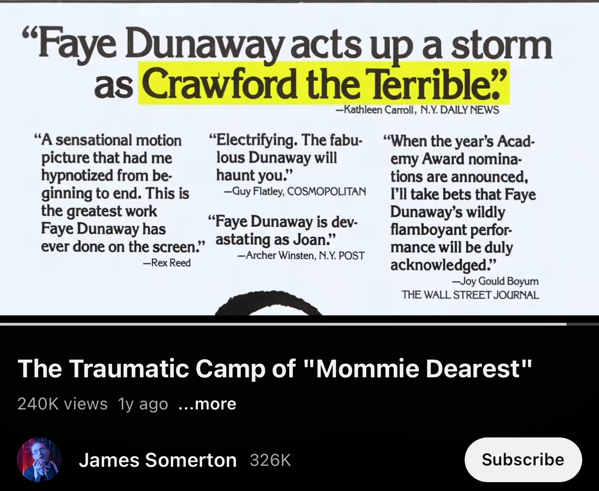
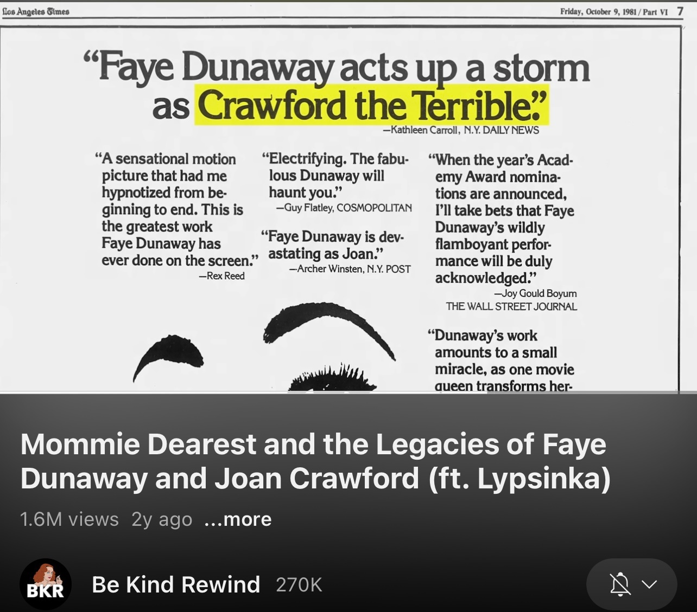



<compare>
<credits class="desc">

If it wasn't camp, it would just be true.

This was previously released as a segment in the "Whatever Happened To Good Taste?" video.

PATREON: [link]

</credits>
</compare>




<compare>
<credits >

> The following was previously released as a segment in the "Whatever Happened To Good Taste?" video.

</credits>
</compare>

<compare>
<credits class="opening">

\[On some interesting stock credits sequence involving a VCR and TV]

\[On the VCR display]:
> James Somerton Presents

\[On a VHS tape going into a VCR]:
> The Traumatic Camp of "Mommie Dearest"  
Written by Nick Herrgott & James Somerton

\[Zoom into TV static]

</credits>
</compare>

<compare>
<james span="2" >

<mark>Susan Sontag</mark>, in her essay "<mark>Notes on Camp</mark>", often cited as the quintessential document on camp culture, remarks an association between gays and camp. And as she was writing in the 1960s, she was highlighting a very retroactive depiction from her upbringing. *Baby Jane* had only just come out when this paper was published. This indicates that gay attraction to overwrought and badly depicted feminine archetypes was well solidified *long* before 1981, when the infamous *Mommie Dearest* premiered: the purported true story of growing up with movie star Joan Crawford as a mother. 

</james>
<from >

[...] I'm going to use <mark>Susan Sontag</mark>'s *<mark>Notes on Camp</mark>* as a guide. Though not the be-all end-all of the camp discourse, it helps put to words why *Mommy Dearest* fascinates audiences. [...]

</from>
<from></from>
</compare>

<compare>
<james >

Through the process of imitation, Baby Jane, Cleopatra, Martha, Eve Harrington, and Crawford herself are imitated here. To the point, wherein Faye Dunaway's mind playing Joan Crawford, this is a *perfectly* nuanced depiction of Hollywood's archetypal movie star. <mark>John Waters described *Mommie Dearest* as <q>"The first drag queen role played by a woman."</q></mark> And he's not wrong.

</james>
<from >

[...] really is key to this whole thing. <mark>John Waters once called it "The first drag queen role played by a woman."</mark> The sheer excess of it is difficult to take seriously. At the same time, it's absolutely captivating to watch. You cannot, and don't want to, look away. [...]

</from>
</compare>

<compare>
<james >

But it seems to be *completely* by accident. Films that are accidental camp are kind of rare. Without clear intent, failed camp either goes so big that it looks cheap and we disconnect, or they don't go big enough. Either way, we don't make a point of remembering those movies, so when one *does* manage to hit the right buttons, we hold on to it for dear life. 

So, enter *Mommie Dearest*: first published as a book by Christina Crawford in 1978 describing her torturous relationship with her mother Joan one year after Joan's death in 1977. The story is about a daughter who is struggling to reconcile her love for an abusive parent, which... would have made a great movie! In no time at all, studios snatched up the rights to the story and Christina herself wrote a script. 

</james>
<from></from>
</compare>

<compare>
<james >

When Faye Dunaway was cast in the lead role, riding on her Oscar from 1977's *Network*, the studio, and Feye herself, wanted to restructure the script to center around Crawford. With Faye's husband, who she managed to make a producer on the film, <mark>trying to "sanitize" Joan</mark>, and *Christina's* husband being accused of trying to turn Joan <mark>into a monster</mark>. So, what Joan did we get? 

</james>
<from >

According to Dunaway, producer Frank Yablans promised her in the casting process that he wished to portray Joan Crawford in a more moderate way than she was portrayed in Christina Crawford's book. In securing the rights to the book, Christina's husband David Koontz was given an executive producer credit, though he had no experience producing films. Dunaway likewise demanded that her own husband, photographer Terry O'Neill, be given a producer credit so he could advocate for her on set. According to Yablans, the two husbands jostled over Dunaway's portrayal of Crawford: "I had two husbands to deal with, David driving me crazy that Faye was <mark>trying to sanitize Joan</mark>, and Terry worried we were pushing Faye too far and <mark>creating a monster</mark>."[7]

</from>
</compare>

<compare>
<james >

The film opens with Dunaway's Crawford, Hollywood queen, musing about how, despite her success and global allure, she feels like there's just something missing from her life. Yes, her career is in a bit of a slump, but she isn't as concerned about that because she thinks that just means that now is a great time to become a mother. Unable to bear children, she begins to suggest the option of adoption, to her then boyfriend and Hollywood lawyer, Greg Sabat, who helps her pull the strings she needs to pull to have an adoption agency hand her a baby. 

This scene is [laughing] played entirely straight, by the way. This visual pulls Crawford to the center of attention, like a Rifenstall-esque monarch or idol. Once again, unnecessary pathos. And all this unnecessary pathos feeds into this lofty visual language of Joan's perfection, channeled through Dunaway. We're only five minutes in, and no it does not slow down from here. 

</james>
<from></from>
</compare>

<compare>
<james >

The first act of the film explores the strange power dynamic between Joan and her young daughter, Christina. This is where most of the iconic scenes of the movie come from, because this is where Joan is depicted at her most unhinged. Now, how can one of the most powerful actresses in Hollywood's history have a struggle for power... with a child? Well, that's something that critics slam the script for. There isn't really any textual reason for why Joan is such a terror to her family. There's no reason why Joan is triggered at the sight of a wire hanger, or why Christopher has to wear a harness to bed, which feeds into the insanity of this role. 

</james>
<from></from>
</compare>

<compare>
<james >

There are all of these compulsions but no exploration as to why. The surface level of the analysis is... out to *seemingly* use Joan to subvert the expectations of a Hollywood star. Someone for whom the public laud is the ideal of perfection and womanhood, though in reality is a monster in her private life. When cameras are on, she's *Joan Crawford*. When they're off, she's a woman who is *desperately* trying to keep everyone in line so that she can *be* Joan Crawford.

Already the gays are on board for that. We *love* expose on fakeness. Feels like gossip with substance. Guilt-free! 

</james>
<from></from>
</compare>

<compare>
<james >

Relating to our personal lives, a lot of queer people people in the community come from families that an outsider would say are ideal. But for those of us who have to *live* with our parents homophobic attitudes, that perfection is a little... *different* behind closed doors. Parents often let nasty things slip when they're away from polite company. And that's doubly complicated, because it means nobody believes you. Especially nowadays when bigotry isn't quite so in vogue, parents still do and say homophobic and transphobic shit, but they do get a little gaslight-y about it. Dare I say... shady. I've even heard of situations, especially from trans people, where their own therapists will try convincing them that they're *making up* their parents transphobia!

However, just because there's no surface reading doesn't mean that explanations *aren't* inferred, which is mostly on Faye Dunaway for sucking up every drop of attention away from any deeper analysis. Look a little deeper into Joan's parenting in Christina's early life, and especially Joan's biographical context, and -- you guessed it! -- there's a commentary about youth and beauty. 

</james>
<from></from>
</compare>

<compare>
<james >

In multiple instances in *Mommie Dearest*, whenever it seems that Christina is coming of age as a lady, Joan's sees that as competition. From living out a fantasy in the spotlight, to taking a few tricks from Joan's own book on how to flirt with men, Christina is a threat to Joan's reign. Christina is both a rival, a symbol of her fading youth, a child, a miniature version of Joan within whom she can place all her expectations, and an opportunity to exercise her authority. Christina must be *better* than Joan, but also Joan must use Christina to prove that she's still at the top of her game. She both pushes Christina *beyond* what is reasonable to expect of a little girl and also smugly revels in Christina's failures, often resorting to humiliating Christina as a punishment for either not being perfect, or for seemingly encroaching on Joan's reign.

</james>
<from></from>
</compare>

<compare>
<clip >

Child Christina (to Joan): "What are you doing?!" 

Joan (muttering, cutting her hair): "Don't you tell me what I'm doing!"

Christina: "[gasp] Oh, mommy, stop! Oh, no! [crying]"

Joan (muttering): "Don't tell me! Don't!"

Christina (crying): "Mommy, I look awful!"

Joan: "Yeah! I know you look awful!"

</clip>
<from></from>
<clip >

Joan (gesturing at a crying Christina wih scissors): "You be quiet!! You're always rummaging through my drawers! Trying to find a way to make people look at you! Why you always looking at yourself in the mirror?!"

[Christina screams as Joan shakes her] 

Joan: "Why are you doing that?! TELL ME!!"

</clip>
<james >

Joan is so fixated on perfection that she can't handle it when things don't quite fall into place. Following several poor performing films, MGM releases Joan from her contract. This compiles with a string of failed romances and triggers a cascade of Joan's greatest fears. Her beauty, something she felt was her primary asset, is fading. But what terrifies her is that she does not have the talent to make up for it. In her defense, yes, MGM was shafting her. As a human being, she was aging. But they continued to cast her in roles as if she was *The* Joan Crawford that she was 15 years prior, instead of... I don't know, letting her play more *mature* roles. They just cut her loose, because she wasn't ageless.

Joan Crawford (it is implied) held herself up to perfection because she (accurately) assumed that a single slip up would have her thrown to the dogs. And when that fear was validated, we can expect some erratic behavior. Which [chuckling] gives us one of the most iconic scenes in camp history. 

</james>
<clip >

[Joan screaming in the darkness while slicing hedges.]

</clip>
</compare>

<compare>
<james >

So Hollywood is an absurd place. It's why movies about Hollywood generally don't click with general audiences, because it's a place like no other. So you're already in absurd territory. But instead of mitigating the absurdity and explaining the kind of anxieties and pressure that exist in this place... There's Joan, down on the ground, hacking away at roses in a... *gorgeous* beaded gown. And that *line* delivery!

</james>
<from></from>
</compare>

<compare>
<clip >

Joan: "Tina!!" [Dramatic pause] "Bring me the axe!"

</clip>
<from></from>
<james >

Where *each word* is punctuated with an *entirely* [voice crack] distinct and separate emotion! It's a complete sensory *overload!* And honestly! ...though the quote gets thrown around, fans of the scene are missing two of the *best parts*. First, the fact that they actually committed to a wide shot [laughing] of Feye hacking away at that orange tree in that gown:

</james>
<clip >

[Joan, in gown, with axe, inhaling and slicing at a small tree.]

</clip>
<james >

Second, Joan says-- 

</james>
<clip >

Joan: "Bring me the axe!"

</clip>
<james >

*Thee* axe. *Thee* axe. Not "bring me *an* axe", "bring me *the* axe". In the literal syntactic text of the movie, we can gauge that this is a [laughing] *regular occurrence* at the Crawford household. Because Christina didn't flinch! And she knew exactly which axe to get and where to get it.

</james>
<clip >

[Joan, in gown, with axe, exhaling and slicing at a small tree, now leaning way over.]

</clip>
</compare>

<compare>
<james >

I feel as if the movie had done even the *slightest* amount of work to bring out the aforementioned subtext, you could pull off this *exact* scene as a harrowing self-destruction of Joan's psyche. Reading into it, Joan feels her perfect garden must match her internalized feeling of inadequacy. If MGM tells her that she's not perfect, then there's no point in having anything perfect around. Why should something be more perfect than her if being perfect was her *only value*. It could be a really gripping scene. The problem is that without adequate build up or actual exploration of Joan's emotions, instead with Dunaway opting to depict these emotions as mood swings, this scene comes out of *nowhere*. 

It's also worth mentioning that this film doesn't really follow a narrative...? We go from Joan's celebrating her long-awaited Oscar win--

</james>
<from></from>
</compare>

<compare>
<clip >

TV: "And the winner is... Joan Crawford!"

[Joan gasps loudly!]

</clip>
<james >

--directly into...

</james>
<from></from>
<clip >

Joan (screaming at a dress): "No! Wire! *Hangers!!* ***EVERRRRRRRR!!!!!***"

</clip>
<james >

--which, again, could be a *legitimately terrifying* scene if there was any kind of narrative consequentialism.

</james>
</compare>

<compare>
<james >

That said, when it comes to abusive households, there's *usually* this soft reset button at the end of the episode, where there's an unspoken agreement to leave it in the past. At least when it involves younger children. Which in and of itself is a really eerie and unsettling concept. Though *Mommie Dearest* does absolutely nothing to establish this precedence with spoken or visual language. 

And no, the abuse does not end with Joan's shipping Christina off to boarding school, which, it is implied, Joan was doing because she observed her daughter beginning to experiment with flirting. *Not on **her** watch!* When Christina is caught kissing a boy at the school, she's reprimanded by the administration, but *Joan* insists that she be expelled -- for some reason -- and instead, pulls Christina out of the school. 

</james>
<from></from>
</compare>

<compare>
<james >

Now, as it turned out, beyond just kissing boys, Christina ended up quite enjoying her time away from her mother at the boarding school. And given that the discipline-obsessed Joan originally intended private school to be a punishment, enjoying a punishment is also something that will not happen on her watch. Leading to... another iconic scene:

</james>
<from></from>
<clip >

Barbra: "Joan..."

Joan: "[Inhales sharply] Barbra, please!? *Please*, Barbra!"

</clip>
<james >

-- bringing Christina home, as she has an interview scheduled, Joan coiley, if not proudly, remarks that Christina was expelled after telling Christina *not* to *talk* about the expulsion. I can't think of a single parent who would gloat about their child's expulsion... but to Joan, it's almost like a victory. A failure for her rival is a victory for her. 

Christina points out to the reporter that she was *not*, in fact, expelled, to which *Joan throws a fit* over being accused of lying, even though... she was lying.

</james>
<clip >

Joan: "Why do you deliberately defy me?"

Christina: "Why did you tell her I got expelled?!"

Joan (dramatic shouting): "Because you ***did*** get expelled!"

Chritina (softly, snarling): "That... is a lie."

[Joan slaps Christina]

</clip>
<james >

When Christina calls her out, Joan just goes right on and slaps her in front of the reporter, and then *blames* her for making her embarrass herself in front of the reporter! 

</james>
<from></from>
<clip >

Joan (wailing): "You--! You *delibrately* embarrsed me in front of a reporter!" [Dramatic whispering] "A reporter!"

</clip>
<comment>


Mmm! The scenery here is just so yummy! \*nom nom nom\*

</comment>
<james >

Joan begins to spiral *aimlessly*, with such and such parental insults about gratitude, but it seems like Christina is done with this song and dance, and asks why Joan *bothered* to *adopt* her if Joan didn't seem to want anything to *do* with Christina. 

</james>
<from></from>
<clip >

Christina (angrily): "why did you adopt me?!"

Joan (dramatic whisper): "Maybe I did it for a little extra publicity."

</clip>
<james >

Tensions rise, and... 

</james>
<from></from>
<clip >

Joan (angry): "Why can't you treat me...?!" (quiet) "Like I would be treated by..." (shouting) "...any *stranger on the* **street!**"

Christina (dramatically): "Because I am *not*...! One of your ***FANSSSS!***"

[Joan looking like she's gonna strangle Christina. Suddenly lunges and grabs her by the neck and, screaming, they fall over and break a lamp.]

</clip>
</compare>

<compare>
<james span=2 >

And *now* we're getting into the territory of Christina's accounts that *can* be backed up by fact. 

Fact number one! ...is that, yes, Joan really did replace Christina [laughing] on a soap opera [laughing] that Christina was cast in. Joan -- in her 60s -- takes the role of a 28-year-old woman while Christina is recovering from a benign ovarian tumor. 

</james>
<from></from>
<comment>


It should be noted here that James has had a Pepsi can sitting next to him on his right this whole time, clearly in frame.

</comment>
<james >

Fact number two! Is *another* iconic scene: Joan Crawford *was* on the board of directors for PepsiCo, via her husband. <mark fc>The company was a nothing up-start to compete with the behemoth that was Coca-Cola. Joan was brought on as a brand ambassador and basically *made* the company into what it was.</mark> Joan married the CEO, and the board of directors *did* try to force her out after his death. 

In the film, this encounter is depicted with Joan... *screaming* into the boardroom, famously saying--

</james>
<comment id="coca_cola">


While Pepsi did take quite a while to get anywhere close to Coke, the catching up started long before Joan Crawford married Pepsi president Alfred Steele in 1955. 

In 1951, the year after Steele became president of Pepsi-Cola, [Pepsi's gross profit before expenses was $30,216,383](https://archive.org/details/pepsicofritolayannualreports/pepsicola1960/page/n27/mode/2up) while [Coca-Cola's was $123,477,571.54](https://archive.org/details/cocacolacoannualreports/cocacola1951/page/n7/mode/2up), so about a quarter of Coca-Cola's. Which is a lot smaller but not 'nothing'. 

The truth in Somerton's claim is that Steele's tenure as president did see a massive growth in Pepsi-Cola's sales, as the report from 1960 linked above clearly demonstrates, but it was pretty continuous before and after marrying Joan Crawford, <mark>so I doubt she played that big of a role.</mark>

</comment>
<clip >

Joan: "*DON'T FUCK WITH ME, FELLAS!!*"

</clip>
<comment>


Note: The word "fuck" is censored out of James's video, though it's obvious what she's saying.

</comment>
<james >

And though this is a famous line from the film, it's *not* the line that was lifted from the secretary's notes of the meeting. But Joan *did say* to the directors--

</james>
<from></from>
<clip >

Joan: "I fought worse monsters than you for *years* in Hollywood! I know how to win the hard way!"

</clip>
</compare>

<compare>
<james >

Ironically, this is one of Dunaway's more understated lines in the entire film. This meeting, in reality, was much more cordial than Dunaway delivered. Why did it need to get turned up to an 11? 

[Laughs, throws up hands] Why not, that's why! 

Rounding off the film is the reading of Joan Crawford's will, with Christina and Christopher. When it comes to what Joan left them, Joan writes that they will receive nothing. 

</james>
<from></from>
</compare>

<compare>
<clip >

Laywer: "For reasons which are well known... to them."

</clip>
</compare>

<compare>
<james >

Which was the *literal* reading of the will. That happened. That's the last thing Christopher and Christina ever heard from their mother. And when asked, apparently neither of them... know what those reasons were. 

There are some suggestions that Joan wrote them out of the will because she heard Christina was already writing *Mommie Dearest* while Joan was alive, but that doesn't explain why she nicks[sic: nixed] Christopher. The film doesn't even mention Joan's younger two children who she adopted... just about the same time that Christina went off to boarding school. Funny timing, that.

</james>
<from></from>
<james >

Now, as with all great camp movies, half of the fun is the gossip. And the making of *Mommie Dearest* is no exception. As mentioned *Mommie Dearest* was a celebrity expose. Christina's account is a pained, tormented struggle between loving her mother and recalling good memories of Joan, but also living through some... *very* traumatic abuse and behavior. Though the way Hollywood figures talk about it, *especially* those who are close to Joan, even Betty Davis herself, Christina makes Joan out to be a demon... that she wasn't.


</james>
<from></from>
</compare>

<compare>
<visual >


James takes several clips and visuals from BeKindRewind's video on Mommie Dearest.

</visual>
<visual-line></visual-line>
<clip visual={{bkr}} on="12:29" off="12:??" >

\[James added on screen]: "Bettie Davis on the Tonight Show"

Host: "So who's one of the *worst* people you know in Hollywood?

Bettie: "That I worked with?"

Host: "Or that you wouldn't want to work with again? If you don't-- You don't have to comment on that--"

Bettie: "One-- One million dollars: Faye Dunaway."

<footer stat:id="blatant-bgm">Note: The audio of the Tonight Show clip starts a second or two before the visual cuts in on both videos. James's version of the clip even fades in. Also, <em>you can hear the background music that BKR added in the background of James's clip.</em></footer>
</clip>

<from >

[...] alongside Betty Davis, which I guess didn't go very well.

\[Clip of Bettie Davis on the Tonight Show]

Host: "So who's one of the *worst* people you know in Hollywood?

Bettie: "That I worked with?"

Host: "Or that you wouldn't want to work with again? If you don't-- You don't have to comment on that--"

Bettie: "One-- One million dollars: Faye Dunaway."

</from>

<from></from>
</compare>

<compare>
<james >

But the book is much *tamer*, especially if your frame of reference is the movie, and honestly a lot of the vitriol that gets slung at Christina is, "well, *I* never saw Joan beat her children."

</james>
<from></from>
<clip >

\[On screen]: "Herbert Kenwith, Director"

Herbert (in interview): "I never saw this happen."

</clip>
<james >

"Well, *I* never saw Harvey Weinstein rape anybody."

Which you'd think, in this post-MeToo, believe-victims society, that excuse wouldn't fly. But Christina, to *this day*, has haters.

</james>
<from></from>
</compare>

<compare>
<clip >

\[On screen]: "Herbert Kenwith, Director"

Herbert (in interview): "I think christine was very very *envious* of Joan Crawford, and her public, and her popularity, and her beauty."

</clip>
</compare>

<compare>
<james >

Hollywood is said to be a small town. And the vitriol directed at Christina may simply be them protecting one of their own. Christina does make a point of specifically blaming Hollywood for crafting Joan's narcissism. 

</james>
<from></from>
</compare>

<compare>
<james >

Before the fall of the studio system, the studios themselves would *mold* their stars into fitting specific personality ideals. To put on airs, not only for cameras, but for fans in private. It was *rare* that you'd get a star like Davis or Catherine Hepburn, who didn't bother with the facade. This is apparent in a documentary called *Bright Lights*, starring Carrie Fisher and Debbie Reynolds, may they rest in peace.

Reynolds, while being interviewed, still had her signature Debbie Reynolds charm. However, the documentary crew kept the cameras rolling when Carrie took her aside. From around the corner, Debbie's voice is much weaker and more vulnerable. Even though she was a woman in her 80s, "Debbie Reynolds" was a mask she had to wear for the public. Luckily she did have a supportive family, with whom she didn't have to wear it. 

</james>
<from></from>
</compare>

<compare>
<james >

Christina's take *seems* to be that Joan's simply wasn't able to take that mask off at all. And resorted to drastic behavior when the porcelain started to crack. But with all the hatred toward the story and toward Christina, it does boggle my mind that Hollywood was *so horny* to get this movie made as soon as the book came out. You couldn't find anyone who had anything good to say about it. Faye Dunaway herself agreed to play the role as long as it was more respectful to Joan's memory... than the book. 

\[Quote on screen]:

> "Though Christina's book was obviously an exploitation book, the first one of its kind, my task was to portray a woman, a full woman who she was in all her facets, not just one. I tried to illuminate who this woman was. But it was more than just about being angry. It was about trying to examine and explore the forces that undermined her." [~Faye Dunnaway]

</james>
<from></from>
</compare>

<compare>
<james >

*I* don't think Faye and I watched the same movie. 

Christina actually did not feel that Dunaway's performance accurately depicted her mother, specifically claiming that Dunaway's depiction of Joan was *far* more monstrous than *she* ever experienced.

</james>
<from></from>
</compare>

<compare>
<visual >


It's highly likely that James pulled the clip he used in his video from BKR's video, as his clip is an exact subset of the clip they used.

</visual>
<visual-line></visual-line>
<clip visual={{bkr}} on="25:37" off="25:??" >

Joy Behar: "Is that anywhere near the way Joan Crawford actually acted?"

Christina: "...only the makeup."

</clip> 

<from >

[...] She didn't really give us an idea of who Joan Crawford was.

\[Clip from *Joy Behar: Say Anything*, them showing a clip from the movie, then cutting to interview:]

Joy: "Is that anywhere near the way Joan Crawford actually acted?"

Christina: "Only the makeup."

<footer>It's highly likely that James pulled the clip he used in his video from BKR's video, as his clip is an exact subset of the clip they used.</footer>
</from>

<from></from>
</compare>

<compare>
<james >

Faye Dunaway specifically went out of her way to manipulate the script, the director, and producers to *humanize* Joan, all the while lambasting the book as tabloid drivel, *only* for the author of that "drivel" to decry the performance for depicting *a monster*. It also didn't help that Dunaway was already kind of a diva. Once again, ironically, Joan Crawford was quoted saying:

\[Quote on screen:]

> "Of all the actresses, to me, only Faye Dunaway has the talent and the class and the courage it takes to make a real star." [~Joan Crawford]

Dunaway later blamed *Mommie Dearest* for hurting her career, and given that she was a bit of a hot ticket actress *before* the 80s, she was forced into roles in smaller films for the rest of her life. And on one hand, you may say it's because of her performance, but plenty of actors have had bad roles. Maybe nothing so monumental as *this*... but... 

</james>
<from></from>
</compare>

<compare>
<james >

Faye was a bit of a... *hassle*, you see. On top of being a prima donna in general, she allegedly terrorized the set of *Mommie Dearest*. For starters, she refused to drop out of character during production. So on top of delivering...

\[Cutaway to visual only shot of Faye-as-Joan screaming and wailing.]

...*that* on camera, the crew and cast had to *live* with that for *weeks*. <mark>Rutanya Alda</mark>, who played Joan's assistant in the film, <mark>wrote a behind the scenes memoir about the filming experience</mark>. She wrote:

> <mark>"People despised Faye...because she was rude to people. Everyone was on pins and needles when she worked, and relaxed when she didn't."</mark> [~Rutanya Alda]

To name a few things, Faye allegedly <mark>manipulated the director to rob other actors of their screen time</mark> to pull it to herself. She also insisted that people on set needed to <mark>turn away from her</mark> while she was performing, because... <mark>she didn't want an audience</mark>. 

</james>
<from >

In 2015, actress <mark>Rutanya Alda</mark> (Carol Ann) <mark>published a behind-the-scenes memoir, detailing the making of the film</mark>, *The Mommie Dearest Diary: Carol Ann Tells All*.[8] In it, she describes the difficulty of working with Dunaway, whose method approach to playing Joan seemed to absorb her and make her difficult to the cast and crew.[9] In an interview with the *Bay Area Reporter*, Alda stated, <mark>"People despised Faye...because she was rude to people. Everyone was on pins and needles when she worked, and relaxed when she didn't."</mark>[10] Alda described the process of acting opposite Dunaway very unfavorably by claiming that she <mark>manipulated the director to deprive the other actors of screen time</mark> and required the members of the cast to <mark>turn their backs</mark> when not in the shot so <mark>she would have no audience</mark>.[9] She also claimed that Dunaway was "out of control" while filming the scene where Joan attacks Christina in front of a reporter (Jocelyn Brando) and Carol Ann has to pull her off. Alda was hit hard in the chest and knocked over several times, while Jocelyn Brando, who was scripted to help Alda pull Dunaway off of Diana Scarwid, refused to get near her for fear of being injured.[10]

<footer>

8. Leon Acord (December 4, 2015). ["What's the Most Shocking Thing About Tell-All 'Mommie Dearest Diary'?"](https://www.huffingtonpost.com/leon-acord/whats-the-most-shocking-t_b_8713984.html). Huffington Post. [Archived](https://web.archive.org/web/20160127090252/http://www.huffingtonpost.com/leon-acord/whats-the-most-shocking-t_b_8713984.html) from the original on January 27, 2016. Retrieved May 17, 2017.
9. Karina Longworth (September 16, 2016). ["The Illusion of Perfection:A new diary tells the story of what happened when Faye Dunaway played Joan Crawford in Mommie Dearest"](http://www.slate.com/articles/podcasts/you_must_remember_this/2016/09/faye_dunaway_in_mommie_dearest_the_real_story.html). Slate Magazine. [Archived](https://web.archive.org/web/20170530211735/http://www.slate.com/articles/podcasts/you_must_remember_this/2016/09/faye_dunaway_in_mommie_dearest_the_real_story.html) from the original on May 30, 2017. Retrieved May 17, 2017.
10. Tara Aquino (February 21, 2016). ["12 Over-the-Top Facts About Mommie Dearest"](http://mentalfloss.com/article/75812/12-over-top-facts-about-mommie-dearest). mentalfloss.com. [Archived](https://web.archive.org/web/20190819213657/http://mentalfloss.com/article/75812/12-over-top-facts-about-mommie-dearest) from the original on August 19, 2019. Retrieved August 19, 2019.

</footer>
<footer id="misattributed">

Note: Quote is misattributed to Rutanya Alda's book ("She wrote:"), when instead it was an interview with the [*Bay Area Reporter*](https://www.ebar.com/story.php?ch=arts__culture&sc=movies&id=228609#:~:text=Faye%20Dunaway%2C%20who%20played%20Crawford,was%20so%20rude%20to%20people.). (Also, Wikipedia cites the source <em>third-hand</em>.)

</footer>
</compare>

<compare>
<james >

Regarding her [air quotes] "method acting"... (and we'll avoid a discussion about what method acting *really is* and how a lot of actors misuse the term) Dunaway had the usual nonsense to say, but with an extra twist.

> "If your mind is on a woman who is dead and you're trying to find out who she was and do right by her, you do feel a presence. I felt it at home at night sometimes. It wasn't pleasant. I felt Joan was not at rest." [~Faye Dunnaway]

So I *think* what happened is that Faye was so engaged with the *memory* of Joan that she may have spurred a vindictive streak against Christina. And so she kind of took out all that bottled up rage on the effigy of Christina. Which is why you got all this aggression, I think. While there was an initial wave of critics who... hailed her performance, it didn't take long for the public perception to *swing* the other way. Going down as one of the best-*bad* performances of all time.

</james>
<comment id="haunted">


James seems to invent this quote out of whole cloth? Or at least out of pieces of the following?

> Roger Ebert visited the set, and when he first saw Dunaway in costume, he didn’t recognize her as Faye Dunaway. He exclaimed, “My God, she looks just like Joan Crawford!” But embodying a dead woman was no picnic for Dunaway. There was a physical toll to the part: To make her face look like Crawford’s, Dunaway had to contort the muscles around her mouth just so and hold it, all day long. And then, Dunaway started to feel like she couldn’t clock out when shooting wrapped during the day. As she wrote, “At night I would go home to the house we had rented in Beverly Hills, and felt Crawford in the room with me, this tragic, haunted soul just hanging around. … It was as if she couldn’t rest.”

<footer>Longworth, K. (2018, Sep 16). <em>The Illusion of Perfection</em> [Article]. Slate. Retrieved Jan 1, 2024, from <a href="https://slate.com/culture/2016/09/the-illusion-of-perfection.html">https://slate.com/culture/2016/09/the-illusion-of-perfection.html</a></footer>
</comment>
</compare>

<compare>
<visual >

As [called out by BKR themselves](https://twitter.com/bkrewind/status/1731341792254075259), James takes footage from their video.

</visual>
<visual-line></visual-line>
<james >

A serious actress like Faye Dunaway did not cotton to that idea. She blamed the director for not reeling her back. She blamed the editors and the producers for taking her depiction of a window into a tormented soul and making it camp. She blamed Christina and her husband. She blamed Christina's book. And worst of all, she blamed her audience for not taking away her intended interpretation. 

Though she *has* come around to the unforeseen fandom of the film, but... still doesn't quite *get* what they see in it. Because make no mistake, there is a fandom around this moving picture. Little did Dunaway know, she had opened the floodgates to a whole fandom that had only until then existed in burlesque shows. A fandom that upon the movie's release would hang Christina Crawford in effigy.

</james>
<from></from>
</compare>

<compare>
<james >

\[Patreon credits begin rolling over James still talking.]

*Mommie Dearest* legitimized a *whole* group of audiences and creators who were going to do what Dunaway did, but do it on purpose. With or without the ghost of Joan Crawford.

</james>
<from></from>
</compare>
